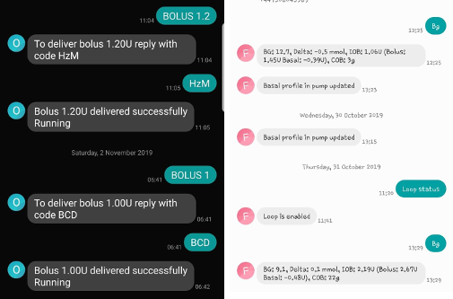

# SMS Komutları

```{admonition} Documentation
:class: note

This section may contain outdated content. Please also see the page [SMS Commands](../RemoteFeatures/RemoteControl.md#1-sms-commands)).

```

## Önce Güvenlik
.
- AAPS, çocuğunuzun telefonunu kısa mesaj yoluyla uzaktan kontrol etmenizi sağlar. Bu SMS kominikatörü etkinleştirirseniz, uzak komutlar verecek şekilde ayarlanmış telefonun çalınabileceğini unutmayın. Bu yüzden her zaman en azından bir PIN kodu ile telefonu koruyun. Güçlü bir parola veya biyometrik doğrulama önerilir.
- Additionally it is recommended to allow a [second phone number](../RemoteFeatures/SMSCommands.md#authorized-phone-numbers) for SMS commands. So you can use second number to [temporary disable](../RemoteFeatures/SMSCommands.md#other) SMS communicator in case your main remote phone gets lost or stolen.
- AAPS ayrıca bolus veya profil değişikliği gibi uzak komutlarınızın gerçekleşip gerçekleşmediğini kısa mesajla size bildirecektir. Alıcı telefonlardan birinin çalınması durumuna karşı en az iki farklı telefon numarasına onay metinleri gönderilecek şekilde ayarlamanız önerilir.
- **If you bolus through SMS Commands you must enter carbs through Nightscout (AAPSClient, Website...)!** If you fail to do so IOB would be correct with too low COB potentially leading to not performed correction bolus as AAPS assumes that you have too much active insulin.
- AAPS sürüm 2.7'den itibaren, SMS komutlarını kullanırken güvenliği artırmak için zamana dayalı tek seferlik parolaya sahip bir kimlik doğrulama uygulaması (google authenticator) kullanılmaktadır.

## SMS Komutları kurulumu


- Most of the adjustments of temp targets, following AAPS etc. can be done on [AAPSClient app](../RemoteFeatures/RemoteMonitoring.md) on an Android phone with an internet connection.
- Boluslar Nightscout üzerinden verilemez, ancak SMS komutlarını kullanabilirsiniz.
- If you use an iPhone as a follower and therefore cannot use AAPSClient app, there are additional SMS commands available.
- Android telefon ayarınızda Uygulamalar > AndroidAPS > İzinler'e gidin ve SMS'i etkinleştirin

### Yetkili telefon numaraları

- AAPS'de **Tercihler > SMS Kominikatör**'e gidin ve SMS komutlarının gelmesine izin vereceğiniz telefon numaralarını girin (noktalı virgülle ayrılmış - örn. +6412345678;+6412345679)

- Note that the "+" in front of the number may or may not be required based on your location. To determine this send a sample text which will show the received format in the SMS Communicator tab.

- 'SMS ile uzaktan komutlara izin ver' seçeneğini etkinleştirin.

- Birden fazla numara kullanmak istiyorsanız:

  - Bir telefon numarası girin.

  - Bir SMS komutu gönderip onaylayarak bu numaranın çalışmasını sağlayın.

  - Ek numaraları noktalı virgülle ayırarak, boşluk bırakmadan girin.

    

### Bolus komutları arasındaki süre

- SMS ile verilen iki bolus arasındaki minimum gecikmeyi tanımlayabilirsiniz.
- Güvenlik nedeniyle bu değeri düzenlemek için en az iki yetkili telefon numarası eklemelisiniz.

### Tek seferlik parola sonuna ilave zorunlu PIN

- Güvenlik nedeniyle, tek seferlik parolanın ardından bir PIN gelmelidir.

- PIN kuralları:

  - 3 to 6 rakam olmalı
  - aynı rakamlar olmamalı (ör. 1111)
  - art arda olmamalı (ör. 1234)

### Authenticator kurulumu

- Güvenliği artırmak için iki faktörlü kimlik doğrulama kullanılır.

- RFC 6238 TOTP belirteçlerini destekleyen herhangi bir Kimlik Doğrulayıcı uygulamasını kullanabilirsiniz. Popüler ücretsiz uygulamalar şunlardır:

  - [Authy](https://authy.com/download/)
  - Google Authenticator - [Android](https://play.google.com/store/apps/details?id=com.google.android.apps.authenticator2) / [iOS](https://apps.apple.com/de/app/google-authenticator/id388497605)
  - [LastPass Authenticator](https://lastpass.com/auth/)
  - [FreeOTP Authenticator](https://freeotp.github.io/)

- Seçtiğiniz kimlik doğrulama uygulamasını takipçi telefonunuza yükleyin ve AAPS'de gösterilen QR kodunu tarayın.

- Kimlik doğrulama uygulamanızda gösterilen kodu ve AAPS'de az önce kurduğunuz PIN'i girerek tek kullanımlık şifreyi test edin. Örnek kullanım:

  - Zorunlu PIN'iniz 2020
  - Kimlik doğrulama uygulamasındaki TOTP kodu 457051
  - Cevap olarak 4570512020 girilecektir

- Giriş doğruysa kırmızı "YANLIŞ PIN" metni **otomatik olarak** yeşil bir "TAMAM" olarak değişecektir. ** Basabileceğiniz bir buton yok! **

- Her iki telefondaki saat senkronize olmalıdır. En iyisi, ağdan otomatik olarak ayarlamaktır. Zaman farklılıkları kimlik doğrulama sorunlarına yol açabilir.

- Kimlik doğrulayıcıları kaldırmak istiyorsanız "KİMLİK DOĞRULAYICILARI (OTP) SIFIRLA" düğmesini kullanın.  (Kimlik doğrulayıcıyı sıfırlayarak, önceden tanımlanmış TÜM doğrulayıcıları kaldırırsınız. Onları tekrar tanımlamanız gerekir)

## SMS komutlarını kullanmak

- Send a SMS to the phone with AAPS running from your approved phone number(s) using any of the [commands](#commands) below.

- AAPS ana telefonu, istenen komutun veya durumun başarısını onaylamak için yanıt verecektir.

- Kodu göndererek komutu onaylayın. Örnek kullanım:

  - Zorunlu PIN'iniz 2020
  - Kimlik doğrulama uygulamasındaki TOTP kodu 457051
  - Cevap olarak 4570512020 girilecektir

**İpucu**: Çok fazla SMS gönderilecekse, telefon tarifenizde (kullanılan her telefon için) sınırsız SMS olması yararlı olabilir.

## Komutlar

Commands must be sent in English, the response will be in your local language if the response string is already [translated](../SupportingAaps/Translations#translate-strings-for-aaps-app).



### Döngü

- LOOP STOP/DISABLE \* Yanıt: Döngü devre dışı bırakıldı

- LOOP START/ENABLE \* Yanıt: Döngü etkinleştirildi

- LOOP STATUS

  - Yanıt, döngünün durumuna bağlıdır

    - Döngü devre dışı
    - Döngü etkin
    - Askıya alındı (10 dk)

- LOOP SUSPEND 20 \* Yanıt: Döngü 20 dakika askıya alındı

- LOOP RESUME \* Yanıt: Döngü devam ettirildi

- LOOP CLOSED \* Response: Current loop mode: Closed Loop

- LOOP LGS \* Response: Current loop mode: Low Glucose Suspend

### CGM (Sürekli glikoz ölçüm) verileri

- BG \* Yanıt: Son KŞ: 5,6 4 dakika önce, Delta: -0,2 mmol, IOB: 0,20U (Bolus: 0,10U Bazal: 0,10U)
- CAL 5.6 \* Yanıt: Kalibrasyon 5.6'yı göndermek için, Kullanıcı için Kimlik Doğrulayıcı uygulamasından gelen kod ve ardından PIN ile yanıt verin \* Doğru kod alındıktan sonra yanıt: Kalibrasyon gönderildi (**xDrip yüklüyse** **Kalibrasyonların kabul edilmesi xDrip+'ta etkinleştirilmelidir**)

### Bazal

- BASAL STOP/CANCEL \* Yanıt: Geçici bazal yanıtı durdurmak için Kullanıcı için Kimlik Doğrulayıcı uygulamasından gelen kod ve ardından PIN ile cevaplayın
- BASAL 0.3 \* Yanıt: 30 dakika boyunca 0,3U/h bazal başlatmak için Authenticator uygulamasından gelen kod ve ardından PIN ile yanıtlayın
- BASAL 0.3 20 \* Yanıt: Bazalı 20dk. 0.3Ü/sa başlatmak için Authenticator uygulamasından gelen kod ve ardından PIN ile cevaplayın
- BASAL 30% \* Yanıt: Bazalı 30dk. %30 başlatmak için Authenticator uygulamasından gelen kod ve ardından PIN ile cevaplayın
- BASAL 30% 50 \* Yanıt: Bazalı 50dk. %30 başlatmak için Authenticator uygulamasından gelen kod ve ardından PIN ile cevaplayın

### Bolus

Son gerçekleşen bolus komutundan sonra 15 dakika için uzaktan bolusa izin verilmez! (bu değer yalnızca 2 telefon numarası eklendiğinde düzenlenebilir) Bu nedenle yanıt, son bolusun verildiği zamana bağlıdır.

- BOLUS 1.2 \* Yanıt A: Bolus 1,2U iletmek için, Kullanıcı için Kimlik Doğrulayıcı uygulamasından gelen kodu ve ardından PIN'i girin \* Yanıt B: Uzak bolus mevcut değil. Daha sonra tekrar deneyin.
- BOLUS 0.60 MEAL \* İsteğe bağlı ÖĞÜN parametresi belirtirseniz, bu sms ÖĞÜN Geçici hedefini ayarlar (varsayılan değerler: 45 dakika için 90 mg/dL, 5.0 mmol/l). \* Yanıt A: 0,60U bolus iletmek için Authenticator uygulamasından gelen kodu ve ardından PIN ile cevaplayın \* Yanıt B: Uzak bolus mevcut değil.
- CARBS 5 \* Yanıt: 12:45 te 5g karbonhidrat girmek için Authenticator uygulamasından gelen kod ve ardından PIN ile cevaplayın
- CARBS 5 17:35/5:35PM \* Yanıt: 17:35 te 5g karbonhidrat girmek için Authenticator uygulamasından gelen kod ve ardından PIN ile cevaplayın
- EXTENDED STOP/CANCEL \* Yanıt: Yayma bolusu durdurmak için Authenticator uygulamasından gelen kod ve ardından PIN ile cevaplayın
- EXTENDED 2 120 \* Yanıt: 2Ü 120 dk. yayma bolusu başlatmak için Authenticator uygulamasından gelen kod ve ardından PIN ile cevaplayın

### Profile

- PROFILE STATUS \* Yanıt: Profil1
- PROFILE LIST \* Yanıt: 1.\`Profil1\` 2.\`Profil2\`
- PROFILE 1 \* Yanıt: %100 Profil1 değişimini için Authenticator uygulamasından gelen kod ve ardından PIN ile cevaplayın
- PROFILE 2 30 \* Yanıt: %30 Profil2 değişimini için Authenticator uygulamasından gelen kod ve ardından PIN ile cevaplayın


### Diğer

- TREATMENTS REFRESH \* Yanıt: Tedavileri NS'den yenile
- NSClient RESTART \* Response: NSCLIENT RESTART SENT
- PUMP \* Yanıt: Son Bağlantı: 1dk önce Geçici: 0.00Ü/sa @11:38 5/30dk. AİNS: 0.5U Rezerv: 34Ü Pil: 100
- PUMP CONNECT \* Yanıt: Pompa yeniden bağlandı
- PUMP DISCONNECT *30* \* Yanıt: *30* dakika boyunca pompanın bağlantısını kesmek için Kullanıcı için Authenticator uygulamasından gelen kodu ve ardından PIN kodunu girerek yanıt verin
- SMS DISABLE/STOP \* Yanıt: Herhangi ikisiyle SMS Uzak Hizmeti yanıtını devre dışı bırakın. Yalnızca AAPS ana akıllı telefondan üzerinden yeniden etkinleştirebileceğinizi unutmayın.
- TARGET MEAL/ACTIVITY/HYPO \* Yanıt: Geçici Hedefi ÖĞÜN/AKTİVİTE/HİPO ayarlamak için Authenticator uygulamasından gelen kod ve ardından PIN ile cevaplayın
- TARGET STOP/CANCEL \* Yanıt: Geçici Hedefi iptal etmek için Authenticator uygulamasından gelen kod ve ardından PIN ile cevaplayın
- HELP \* Yanıt: KŞ, DÖNGÜ, TEDAVİLER, .....
- HELP BOLUS \* Yanıt: BOLUS 1.2 BOLUS 1.2 YEMEK

## Troubleshooting

### Çoklu SMS

Aynı mesajı tekrar tekrar alırsanız (ör. profil değiştirme), muhtemelen diğer uygulamalarla bir döngü oluşturmuştur. Örneğin bu program xDrip+ olabilir. Öyleyse, lütfen xDrip+'ın (veya başka bir uygulamanın) tedavileri NS'ye yüklemediğinden emin olun.

Diğer uygulama birden fazla telefona yüklenmişse, hepsinde yüklemeyi devre dışı bıraktığınızdan emin olun.

### Samsung telefonlarda çalışmayan SMS komutları

Galaxy S10 telefonundaki bir güncellemeden sonra SMS komutlarının çalışmadığına dair bir rapor mevcuttur. Telefon ayarlarından 'send as chat message' devre dışı bırakılarak çözülebilir.


### Android Mesajları Uygulaması

Android Mesaj uygulamasıyla SMS komutları gönderip alırken sorun yaşıyorsanız, hem ebeveyn hem de çocuğun telefonlarında uçtan uca şifrelemeyi devre dışı bırakın.
 - Herhangi bir SMS mesajını açın
 - Sağ üst köşedeki üç noktayı seçin
 - "Detaylar"ı seçin
 - "Yalnızca SMS ve MMS mesajları gönder" seçeneğini etkinleştirin
