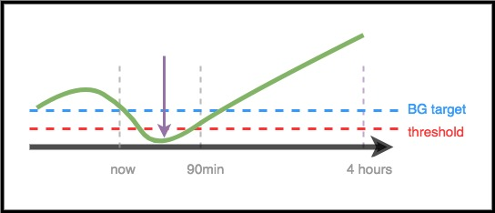

# Klinisyenler için – AndroidAPS Klavuzu ve Genel Bir Giriş

Bu sayfa, AndroidAPS gibi açık kaynak kodlu yapay pankreas teknolojisine ilgi duyduğunu ifade eden klinisyenler veya bu tür bilgileri klinisyenleriyle paylaşmak isteyen hastalar için hazırlanmıştır.

Bu kılavuz, DIY kapalı döngü ve özellikle AndroidAPS'in nasıl çalıştığı hakkında bazı üst düzey bilgiler içerir. For more details on all of these topics, please view the [comprehensive AndroidAPS documentation online](../index.md). Sorularınız varsa, lütfen daha fazla ayrıntı için hastanıza sorun veya sorularınızı iletmek için her zaman topluluğa ulaşmaktan çekinmeyin. (Sosyal medyada değilseniz (ör. [Twitter](https://twitter.com/kozakmilos) veya Facebook), developers@AndroidAPS.org adresine e-posta gönderebilirsiniz). [Ayrıca en son araştırmalardan bazılarını ve sonuçlarla ilgili verileri burada bulabilirsiniz.](https://openaps.org/outcomes/).

## The steps for building a DIY Closed Loop:

AndroidAPS'i kullanmaya başlamak için aşağıdaki adımlar izlenmelidir:

* Find a [compatible pump](../Hardware/pumps.md), a [compatible Android device](https://docs.google.com/spreadsheets/d/1gZAsN6f0gv6tkgy9EBsYl0BQNhna0RDqA9QGycAqCQc/edit?usp=sharing), and a [compatible CGM source](../Configuration/BG-Source.md).
* [AndroidAPS kaynak kodunu indirin ve yazılımı derleyin](../Installing-AndroidAPS/Building-APK.md).
* [Configure the software to talk to their diabetes devices and specify settings and safety preferences](index-configuration).

## How A DIY Closed Loop Works

Kapalı döngü sistemi olmadan, diyabetli bir kişi pompasından ve CGM'sinden veri toplar, ne yapacağına karar verir ve harekete geçer.

Otomatik insülin iletimi ile sistem aynı şeyi yapar: pompadan, CGM'den ve günlüğe kaydedilen diğer bilgilerden (örneğin Nightscout aracılığıyla) verileri toplar. Bu bilgiyi hesaplamaları için bir temel olarak kullanır ve ne kadar daha fazla veya daha az insülin gerektiğine karar verir (geçici bazal oranlarını üstünde veya altında). KŞ'yi sabit veya hedef aralıkta tutmak için gerekli ayarlamaları yapmak için geçici bazal oranlar kullanılır.

AndroidAPS çalıştıran cihaz pompanın bağlantısını koparırsa veya menzil dışına çıkarsa, en son geçici bazal oranı sona erdiğinde, pompa, önceden programlanmış bazal oranları çalıştıran varsayılan programa geri döner.

## How data is gathered:

AndroidAPS ile, bir Android cihaz matematik yapmak için özel bir uygulama çalıştırır, cihaz desteklenen bir pompa ile Bluetooth kullanarak iletişim kurar. AndroidAPS, ek bilgi toplamak ve hastaya, bakıcılara ve sevdiklerine ne ve neden yaptığı hakkında rapor vermek için diğer cihazlarla ve bulutla wifi veya mobil veriler aracılığıyla iletişim kurabilir.

Android cihazın şunları yapması gerekir:

* pompa ile iletişim kurma ve geçmişi okuma - ne kadar insülin verildi
* CGM ile iletişim kurmak (doğrudan veya bulut aracılığıyla) - KŞ'lerinin ne olduğunu/ne yaptığını görmek için

Cihaz bu verileri topladıktan sonra algoritma çalışır ve ayarlara (İDF, karbonhidrat oranı, İES, hedef vb.) göre karar verir. Gerekirse, insülin iletim oranını değiştirmek için pompaya komutlar verir.

Ayrıca, insülin iletim oranlarının hesaplanmasında kullanmak üzere pompadan veya Nightscout'tan boluslar, karbonhidrat tüketimi ve geçici hedef ayarlamaları hakkında her türlü bilgiyi toplayacaktır.

## How does it know what to do?

Açık kaynaklı yazılım, insülin iletiminin nasıl ayarlanması gerektiğini hesaplamak için insanların yaptığı işi (manuel modda) cihazın yapmasını kolaylaştırmak için tasarlanmıştır. Önce tüm destekleyici cihazlardan ve buluttan veri toplar, verileri hazırlar ve hesaplamaları çalıştırır, sonraki saatlerde beklenen KŞ seviyelerine ilişkin tahminler yapar ve KŞini hedef aralıkta tutmak veya geri getirmek için gerekli ayarlamaları hesaplar. Ardından gerekli ayarlamaları pompaya gönderir. Sonra verileri geri okur ve tekrar tekrar yapar.

En önemli girdi parametresi CGM'den gelen kan şekeri seviyesi olduğundan, yüksek kaliteli CGM verilerine sahip olmak önemlidir.

AndroidAPS, topladığı tüm girdi verilerini, ortaya çıkan tavsiyeyi ve gerçekleştirilen herhangi bir eylemi şeffaf bir şekilde izlemek için tasarlanmıştır. Bu nedenle, günlükleri gözden geçirerek. “Neden X yapıyor?” Sorusuna herhangi bir zamanda cevap vermek kolaydır.

## Examples of AndroidAPS algorithm decision making:

AndroidAPS, OpenAPS ile aynı çekirdek algoritmayı ve işlevselliği kullanır. Algoritma, gelecekte neler olabileceğine dair farklı senaryoları temsil eden (ayarlara ve duruma göre) birden fazla tahminde bulunur. Nightscout'ta bunlar “mor çizgiler” olarak görüntülenir. AndroidAPS uses different colors to separate these [prediction lines](Releasenotes-overview-tab). Günlüklerde, bu tahminlerden hangisinin ve hangi zaman diliminin gerekli eylemleri yönlendirdiğini izlenebilir.

### Here are examples of the purple prediction lines, and how they might differ:

### Here are examples of different time frames that influence the needed adjustments to insulin delivery:

### Scenario 1 - Zero Temp for safety

Bu örnekte, KŞ kısa vadede yükseliyor; ancak, daha uzun bir zaman diliminde düşük olacağı tahmin edilmektedir. Aslında, hedef *ve* güvenlik eşiğinin altına ineceği tahmin edilmektedir. Güvenlik amacıyla düşüğü önlemek için AndroidAPS, nihai KŞ (herhangi bir zaman aralığında) eşiğin üzerine çıkana kadar sıfır geçici (%0'da geçici bazal oran) verecektir.

### Scenario 2 - Zero temp for safety

Bu örnekte, KŞ'nin yakın vadede düşeceği, ancak sonunda hedefin üzerinde olacağı tahmin edilmektedir. Ancak, kısa vadeli beklenen değer güvenlik eşiğinin altında olduğundan, AndroidAPS, beklenen KŞ değeri artık herhangi bir zamanda eşiğin altında kalmayana kadar tekrar "sıfır geçici" kullanır.

### Scenario 3 - More insulin needed

Bu örnekteki tahmin, yakın gelecekte hedef değerin altına bir düşüş beklemektedir. Ancak güvenlik eşiğinin altında olması beklenmiyor. Nihai KŞ hedefin üzerindedir. Bu nedenle, eklenen insülin tahmini eşiğin altına getireceğinden, AndroidAPS kısa vadeli hipoya katkıda bulunacak insülin vermekten kaçınacaktır. Daha sonra, güvenli olduğunda, nihai olarak tahmin edilen KŞ'nin en düşük seviyesini hedefe indirmek için insülin eklenmesini değerlendirecektir. *(Gereken insülinin ayarına ve miktarına ve süresine bağlı olarak, bu insülin geçici bir bazal oran veya SMB (Süper Mikro Bolus) yoluyla iletilebilir).*

### Scenario 4 - Low temping for safety

Bu örnekte, AndroidAPS, KŞ'i hedefin oldukça üzerinde arttığını görüyor. Bununla birlikte, insülinin zamanlaması nedeniyle, vücutta zaten KŞ'i sonunda aralığa getirmek için yeterli insülin vardır. Aslında, KŞ sonunda hedefin altında olacağı tahmin edilmektedir. Bu nedenle, AndroidAPS orta vadede hipoglisemiye neden olmamak için herhangi bir ek insülin vermeyecektir. KŞ yüksek ve yükseliyor olsa da, AndroidAPS'nin böyle bir senaryoda bazal oranı düşürmesi daha olasıdır.

## Optimizing settings and making changes

AndroidAPS veya DIY kapalı döngülerle deneyimi olmayan bir klinisyen olarak, hastanızın ayarlarını optimize etmesine veya sonuçlarını iyileştirmek için değişiklikler yapmasına yardımcı olmakta zorlanabilirsiniz. Toplulukta hastaların ayarlarını iyileştirmek için küçük, test edilmiş ayarlamalar yapmasına yardımcı olabilecek birden fazla aracımız ve [kılavuzumuz](https://openaps.readthedocs.io/en/latest/docs/Customize-Iterate/optimize-your-settings.html) mevcuttur.

Hastaların yapması gereken en önemli şey, her seferinde bir değişiklik yapmak ve başka bir ayar değişikliğine gitmeden önce 2-3 gün boyunca etkisini gözlemlemektir (böylelikle yapılan değişikliklik işleri kötüleştirdi ise, bu durumda hemen önceki ayara dönülebilir). İnsan eğilimi, tüm düğmeleri çevirmek ve her şeyi bir anda değiştirmektir; ama eğer biri bunu yaparsa, o zaman gelecek için daha fazla optimal olmayan ayarlarla karşılaşabilir ve bilinen iyi bir duruma geri dönmeyi zorlaştırabilir.

Ayar değişiklikleri yapmak için en güçlü araçlardan biri, bazal oranlar, İDF ve karbonhidrat oranı için otomatik bir hesaplama aracıdır. Buna "[Otoayar](https://openaps.readthedocs.io/en/latest/docs/Customize-Iterate/autotune.html)" denir. Bağımsız/manuel olarak çalıştırılmak üzere tasarlanmıştır ve verilerin, ayarlarda artımlı değişiklikler yaparken size veya hastanıza rehberlik etmesine izin verir. Ayarlarda manuel ayarlamalar yapmaya çalışmadan önce, ilk olarak Otoayar raporlarını çalıştırmak (veya gözden geçirmek) topluluktaki en iyi uygulamadır. AndroidAPS ile, Otoayar "tek seferlik" olarak çalıştırılacak, ancak onu doğrudan AndroidAPS'ye dahil etmek için devam eden çabalar var. Bu parametreler hem standart pompalı insülin iletimi hem de kapalı döngü insülin iletimi için bir ön koşul olduğundan, otomatik ayar sonuçlarının tartışılması ve bu parametrelerin ayarlanması klinisyene doğal bağlantı olacaktır.

Ek olarak, manuel diyabet tedavisinde öğrenilen insan davranışı, bir DIY kapalı döngü ile bile sonuçları sıklıkla etkiler. Örneğin, KŞ'nin düşeceği tahmin ediliyorsa ve AndroidAPS düşerken insülini azaltıyorsa, KŞ'yi 70 mg/dl'den (3,9 mmol) yükseltmek için yalnızca az miktarda karbonhidrat (örn. 3-4 g karbonhidrat) gerekebilir. Bununla birlikte, birçok durumda, birileri daha fazla karbonhidratla (örneğin 15 kuralına bağlı kalmak) tedavi etmeyi seçebilir, bu da hem ekstra glikozdan daha hızlı bir artışa neden olur hem de insülin zaman çerçevesinde azaltıldığından, düşük seviyeye yol açabilir.

## OpenAPS

**Bu kılavuz [Klinisyenin OpenAPS kılavuzundan](https://openaps.readthedocs.io/en/latest/docs/Resources/clinician-guide-to-OpenAPS.html) uyarlanmıştır.** OpenAPS, küçük bir taşınabilir bilgisayarda (genellikle "teçhizat" olarak anılır) çalıştırılmak üzere geliştirilmiş bir sistemdir. AndroidAPS, OpenAPS'de uygulanan tekniklerin çoğunu kullanır ve mantık ve algoritmaların çoğunu paylaşır, bu yüzden bu kılavuz orijinal kılavuza çok benzer. OpenAPS ile ilgili bilgilerin çoğu, AndroidAPS'ye kolayca uyarlanabilir, ana fark, yazılımın üzerinde çalıştığı donanım platformudur.

## Summary

Bu AndroidAPS'nin nasıl çalıştığına genel bir bakış olarak tasarlanmıştır. Daha fazla ayrıntı için hastanıza sorun, topluluğa ulaşın veya çevrimiçi olarak sunulan AndroidAPS belgelerinin tamamını okuyun.

Ek önerilen dökümanlar:

* [Tam AndroidAPS belgeleri](../index)
* OpenAPS'in güvenlik için nasıl tasarlandığını açıklayan [OpenAPS Referans Tasarımı](https://OpenAPS.org/reference-design/): https://openaps.org/reference-design/
* [Tam OpenAPS belgeleri](https://openaps.readthedocs.io/en/latest/index.html) 
  * [OpenAPS hesaplamalarıyla ilgili daha fazla ayrıntı](https://openaps.readthedocs.io/en/latest/docs/While%20You%20Wait%20For%20Gear/Understand-determine-basal.html#understanding-the-determine-basal-logic)