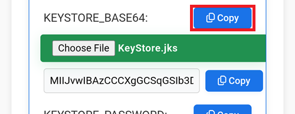

### Copy your Android Studio key in your Google Cloud drive.

On your computer, search for the keystore file you used to build AAPS. It is named with the extension `.jks`.

Drag it into [your Google Drive](https://drive.google.com/drive/my-drive), either inside the browser or your mapped Google Drive.

Open File Manager Plus and select Cloud.

Add a Cloud location.

Choose Google Drive.

Select your Google Drive account email. Tap OK.

Your Google Cloud drive should display its contents. Now return to the app home page.

### Open the CI preparation help file

Open the file `aaps-ci-preparation-html` you downloaded above.

Select Downloads.

And search for this file, tap it to open it, open it with Chrome, tap Just once.

It will open like this.

Scroll down to Option 2: Upload Existing JKS. Expand the interface.

Select Choose File.

Pick your KeyStore file from your Google Drive files.

The field below will populate.

Keep this tab open.

### Create a new secret in GitHub

Return to your GitHub browser tab: your own AndroidAPS copy.

1. Top right, tap the `...` button
2. Select Settings in the list

Scroll down to Security and select Secrets and variables.

Now select Actions

Scroll down to Repository secrets and tap New repository secret

You will see this dialog (scroll down if it's not visible).

Leave the tab opened like this.

Switch to the File Explorer Plus tab.

Tap the top Copy button.

Switch back to the GitHub tab.

In the Name field, paste the text you just copied. Use a long touch on the text box to show the paste menu.

Switch to the File Explorer Plus tab.

Tap the second Copy button.

Switch back to the GitHub tab.

1. In the Secret field, paste the text you just copied. Use a long touch on the text box to show the paste menu.

2. Tap Add secret.

Check the secret has been added, scroll down to verify.

Add a new secret: tap the New repository secret button.

Switch to the File Explorer Plus tab.

Tap the top Copy button to copy `KEYSTORE_PASSWORD`.

Note: if you're comfortable with typing the key names directly in GitHub you don't need to Copy/Paste. If you're not sure you will type exactly the same key name, continue like this. Note that you shouldn't leave `:` at the end of the key name.

Switch back to the GitHub tab.

1.  Paste the new key name.
2. In the Secret entry, put your KeyStore password (don't leave it empty).
3. Tap Add secret.

Check the secret has been added, scroll down to verify.

Tap the New repository secret button shown above.

Switch to the File Explorer Plus tab.

Tap the top Copy button to copy `KEYSTORE_ALIAS`.

Switch back to the GitHub tab.

1.  Paste the new key name.
2. In the Secret entry, put your KeyStore Alias (usually it's `key0`, lowercase with the number zero, not the letter O). Don't let Android autocorrect it.
3. Tap Add secret.

Check the secret has been added, scroll down to verify.

Tap the New repository secret button shown above.

Switch to the File Explorer Plus tab.

Tap the top Copy button to copy `KEY_PASSWORD`.

Switch back to the GitHub tab.

1.  Paste the new key name.
2. In the Secret entry, put your Key password (don't leave it empty). It is usually the same than your KeyStore password.
3. Tap Add secret.

Check the secret has been added, scroll down to verify.
