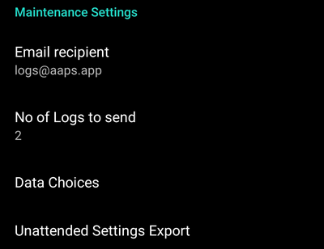

# Tercihler

- **Open preferences** by clicking the three-dot menu on the top right side of the home screen.

  

- Bu sekmeyi açıp Eklenti tercihleri'ne tıklayarak belirli bir sekmenin (ör. pompa sekmesi) tercihlerine doğrudan atlayabilirsiniz.

  

- **Alt menüler**, alt menü başlığının altındaki üçgene tıklanarak açılabilir.

  

- Tercihler ekranının üst kısmındaki **filtre** ile belirli tercihlere hızlı bir şekilde erişebilirsiniz. Sadece aradığınız metnin bir kısmını yazmaya başlayın.

  

```{contents}
:backlinks: entry
:depth: 2
```

(Preferences-general)=
## General


**Ünite**

- Kullanımınıza bağlı olarak birimleri mmol/l veya mg/dl olarak ayarlayın.

**Dil**

- Telefonun varsayılan dilini kullanmak için yeni seçenek (önerilir).

- AAPS'yi standart telefon dilinizden farklı bir dilde istiyorsanız, birçok dil arasından seçim yapabilirsiniz.

- Sistem dlinden farklı bir dil kullanıyorsanız bazen dilin karıştığını görebilirsiniz. Bunun nedeni, varsayılan Android dilini geçersiz kılmanın bazen çalışmadığı bir Android sorunudur.


**Hasta Adı**

- Birden fazla kurulum arasında ayrım yapmanız gerekiyorsa kullanılabilir (örn. ailenizdeki 2 T1D çocuk için).

(Preferences-protection)=
### Güvenlik

(Preferences-master-password)=


#### Ana parola

- Necessary to be able to [export settings](../Maintenance/ExportImportSettings.md) as they are encrypted from version 2.7. **Biyometrik koruma, OnePlus telefonlarda çalışmayabilir. Bu bazı OnePlus telefonlarında bilinen bir sorunudur.**

- Tercihleri Açın (ana ekranın sağ üst köşesindeki üç noktalı menü)

- "Genel" altındaki üçgeni tıklayın

- "Ana-Parola" ya tıklayın

- Parolayı girin, onaylayın ve Tamam'a tıklayın.

  

#### Ayarların Güvenliği "Settings protection"

- Protect your settings with a password or phone's biometric authentication (i.e. [child is using AAPS](../RemoteFeatures/RemoteMonitoring.md)).

- Custom password should be used if you want to use master password just for securing [exported settings](../Maintenance/ExportImportSettings.md).

- If you are using a custom password click on line "Settings password" to set password as described [above](#master-password).

  

#### Uygulama Güvenliği

- Uygulama korumalıysa, AAPS'i açmak için şifre girmeniz veya telefonun biyometrik kimlik doğrulamasını kullanmanız gerekir.
- Yanlış şifre girilirse uygulama hemen kapanır - ancak daha önce başarıyla açılmışsa arka planda çalışmaya devam eder.

#### Bolus koruması

- Bolus protection might be useful if AAPS is used by a small child and you [bolus via SMS](../RemoteFeatures/SMSCommands.md).

- Aşağıdaki örnekte biyometrik koruma istemini görüyorsunuz. Biyometrik kimlik doğrulama çalışmazsa, beyaz kısmın üzerindeki boşluğa tıklayın ve ana parolayı girin.

  

(Preferences-skin)=
#### Görünüm

- Dört çeşit görünüm arasından seçim yapabilirsiniz:

  

- 'Düşük çözünürlüklü görünüm', düşük çözünürlüklü ekranda daha fazla kullanılabilir alana sahip olmak için daha kısa etiket ve yaş/seviye satırı kaldırılmış olarak gelir.

- Diğer görünümlerin farkı, telefonun ekran yönüne bağlıdır.

##### Dikey oryantasyon

- **Orijinal Dış Görünüm** ve **Butonlar her zaman ekranın altında görüntülenir** aynıdır
- **Geniş Ekran** diğer dış görünümlere kıyasla tüm grafiklerin daha büyük boyutuna sahiptir

##### Yatay oryantasyon

- **Orijinal Dış Görünüm** ve **Büyük Ekranı** kullanarak ekranın alt kısmındaki butonları görmek için aşağı kaydırmanız gerekir

- **Geniş Ekran** diğer dış görünümlere kıyasla tüm grafiklerin daha büyük boyutuna sahiptir

  

(Preferences-overview)=
## Genel Bakış

- Genel bakış bölümünde ana ekran için tercihleri tanımlayabilirsiniz.

  

### Ekranı açık tut

- Sunum yaparken kullanışlıdır.
- Çok fazla enerji tüketeceğinden telefonunuzu şarj cihazına takmanız tavsiye edilir.

(Preferences-buttons)=
### Butonlar

- Ana ekranınızın altında hangi butonların görüneceğini tanımlayın.

  

- Karbonhidrat ve insülin diyalogundaki üç artış butonu ile kolay giriş için miktar tanımlayabilirsiniz.

  

  

(Preferences-quick-wizard)=
### Hızlı Asistan

- Sürekli yediğiniz yiyecekler için, karbonhidrat miktarını girdiğiniz ve neleri hesaplayacağınızı ayarladığınız hızlı asistan butonu oluşturarak, ana sayfaya ekleyip kullanabilirsiniz.

- Oluştururken, butonun ana ekranınızda günün hangi saatlerinde görüneceğini belirleyebilirsiniz. - her periyot için bir buton görünür.

  

- Hızlı sihirbaz düğmesini tıklarsanız AAPS, mevcut ayarlarınıza göre girdiğiniz karbonhidrat için bir bolus hesaplar ve önerir (ayarlanmışsa kan şekeri değerini veya aktif insülini de dikkate alarak).

- İnsülin verilmeden önce önerinin onaylanması gerekir.

  

(Preferences-default-temp-targets)=
### Varsayılan Geçici hedefler

- [Temp targets (TT)](../DailyLifeWithAaps/TempTargets.md) allow you to define change your blood glucose target for a certain time period.

- Varsayılan GH ayarı ile aktivite, yakında öğün vb. butonlar için hedefinizi kolayca değiştirebilirsiniz.

  

- Hedefinizi, ana ekranın sağ üst köşesindeki hedefinize uzun basarak veya alttaki turuncu “Karbonhidrat” düğmesindeki kısayolları kullanarak değiştirebilirsiniz.

  

###

### Standart insülin miktarlarını Hazırla/Doldur

- If you want to fill tube or prime cannula through AAPS you can do this through [actions tab](../DailyLifeWithAaps/AapsScreens.md#action-tab).
- Bu diyalogda önceden ayarlanmış (pompanıza göre) değerler tanımlanabilir.

(Preferences-range-for-visualization)=
### Görselleştirme Aralığı

- Ana ekrandaki grafiğin hangi bölümünün hedef aralığınız olacağını ve yeşil arka planla doldurulacağını tanımlayın.

  

### Kısa sekme başlıkları

- Ekranda daha fazla sekme başlığı görmenizi sağlar.

- Örneğin 'OpenAPS AMA' sekmesi 'OAPS' olur, 'GÖREVLER' 'GRV' olur vb.

  

### Tedavi diyaloglarında not alanını göster

- Tedavilerinize kısa metin notları ekleme seçeneği sunar (bolus sihirbazı, karbonhidrat, insülin...)

  

(Preferences-status-lights)=
### Durum ışıkları

- Durum ışıkları için görsel bir uyarı verir

  - Sensör yaşı
  - Sensor battery level for certain smart readers (see [screenshots page](../DailyLifeWithAaps/AapsScreens.md#sensor-level-battery) for details).
  - İnsülin yaşı (rezervuarın kullanıldığı gün sayısı)
  - Rezervuar seviyesi (Ünite)
  - Kanül yaşı
  - Pompa pil yaşı
  - Pompa pil seviyesi (%)

- Eşik uyarısı aşılırsa değerler sarı renkte gösterilecektir.

- Kritik eşik aşılırsa değerler kırmızı ile gösterilir.

- AAPS 2.7'den önceki sürümlerde durum ışıkları için ayarların Nightscout üzerinden yapılması gerekiyordu.

  

### Deliver this part of bolus wizard result

Set the [default percentage](../DailyLifeWithAaps/AapsScreens.md#section-j) of the bolus calculated when using the bolus wizard.

Default is 100%: no correction. Even when setting a different value here, you can still change each time you use the bolus wizard.

When using [SMB](../SettingUpAaps/CompletingTheObjectives.md#objective-9-enabling-additional-oref1-features-for-daytime-use-such-as-super-micro-bolus-smb), using a value lower than 100% here can be useful:
* for people with slow digestion: sending all the bolus upfront can cause hypo because the insulin action is faster than the digestion.
* to leave more room to *AAPS** to deal by itself with **BG rise**. In both cases, **AAPS** will compensate the missing part of the bolus with SMBs, if/when deemed adequate.

### Gelişmiş ayarlar


(Preferences-superbolus)=
#### Süperbolus

- Bolus sihirbazında süper bolusu etkinleştirme seçeneği.
- [Süperbolus](https://www.diabetesnet.com/diabetes-technology/blue-skying/super-bolus/) ani artışları önlemek için önümüzdeki iki saat içinde bazal orandan bir miktar insülin "ödünç alma" konseptidir.

## Tedavi güvenliği

### Hasta tipi

- Güvenlik limitleri bu ayarda seçtiğiniz yaşa göre belirlenir.
- Bu limitlere (maksimum bolus gibi) çok sık ulaşıyorsanız, bir adım yukarı çıkmanın zamanı gelmiştir.
- Gerçek yaştan daha yüksek olanı seçmek kötü bir fikirdir çünkü insülin iletişim kutusuna yanlış değer girilerek (örneğin ondalık nokta atlanarak) aşırı doz almaya neden olabilir.
- If you want to know the actual numbers for these hard-coded safety limits, scroll to the algorithm feature you are using on [this page](../DailyLifeWithAaps/KeyAapsFeatures.md).

### Maks izin verilen bolus \[Ü\]

- AAPS'in bolus olarak bir kerede iletmesine izin verilen maksimum insülin miktarını tanımlar.
- This setting exists as a safety limit to prevent the delivery of a massive bolus due to accidental input or user error.
- Bunu, bir öğün veya düzeltme dozu için ihtiyaç duyabileceğiniz maksimum bolus insülin dozuna karşılık gelen makul bir miktara ayarlamanız önerilir.
- Bu kısıtlama, bolus hesaplayıcısına da uygulanır.

### Maks izin verilen karbonhidrat \[g\]

- AAPS bolus hesaplayıcısının dozlamasına izin verilen maksimum karbonhidrat miktarını tanımlar.
- This setting exists as a safety limit to prevent the delivery of a massive bolus due to accidental input or user error.
- Bunu, bir yemek için ihtiyaç duyabileceğiniz maksimum karbonhidrat miktarına kabaca karşılık gelen makul bir miktara ayarlamanız önerilir.

## Döngü

(Preferences-aps-mode)=
### APS modu

- Açık ve kapalı döngü ile düşük glikoz süspansiyonu (DGS) arasında geçiş yapar
- **Açık döngü**, GBO önerilerinin verilerinize göre yapıldığı ve AAPS giriş ekranında bir bildirim olarak göründüğü anlamına gelir. Manuel onaydan sonra, insülin dozlama komutu pompaya aktarılacaktır. Yalnızca sanal pompa kullanıyorsanız, manuel olarak girmeniz gerekir.
- **Kapalı döngü**, GBO önerilerinin sizden onay veya girdi almadan otomatik olarak pompanıza gönderildiği anlamına gelir.
- **Düşük glikoz askıya alma**, kapalı döngüye benzer, ancak maxIOB ayarını sıfır olarak geçersiz kılar. Bu, kan şekeri düşüyorsa bazal hızı azaltabileceği, ancak kan şekeri yükseliyorsa bazal hızı yalnızca bazal AİNS negatifse (örneğin önceki bir Düşük Glikoz Askıya Alma işleminden) artacağı anlamına gelir.

(Preferences-minimal-request-change)=
### Minimum istek değişikliği \[%\]

- Açık döngü kullanırken, AAPS'in bazal hızı ayarlamanızı önerdiği her seferde bildirim alırsınız.
- Bildirim sayısını azaltmak için daha geniş bir KŞ hedef aralığı kullanabilir veya minimum istek oranının yüzdesini artırabilirsiniz.
- Bu, bir bildirimi tetiklemek için gereken göreli değişikliği tanımlar.

(Preferences-advanced-meal-assist-ama-or-super-micro-bolus-smb)=
## Gelişmiş Yemek Asistanı (AMA) veya Süper Mikro Bolus (SMB)

Depending on your settings in [config builder](../SettingUpAaps/ConfigBuilder.md) you can choose between two algorithms:

- [Advanced meal assist (OpenAPS AMA)](../DailyLifeWithAaps/KeyAapsFeatures.md#advanced-meal-assist-ama) - state of the algorithm in 2017
- [Super Micro Bolus (OpenAPS SMB)](../DailyLifeWithAaps/KeyAapsFeatures.md#super-micro-bolus-smb) - most recent algorithm recommended for beginners

### OpenAPS SMB ayarları

- Karbonhidratları doğru bir şekilde girerseniz, yemek bolusunuzdan sonra sistem yüksek kan şekerine daha hızlı müdahele eder.
- Ayarlar ve Otoduyarlılık hakkında daha fazla ayrıntıyı [OpenAPS dokümanlarında](https://openaps.readthedocs.io/en/latest/docs/Customize-Iterate/autosens.html) bulabilirsiniz.

(Preferences-max-u-h-a-temp-basal-can-be-set-to)=
#### Maks Ü/s geçici Bazal ayarlanabilir

- APPS'in tehlikeli derecede yüksek bazal oranı vermesini önlemek için bir güvenlik sınırıdır.
- Değer, ünite/saat (Ü/s) cinsinden ölçülür.
- It is advised to set this to something sensible. Profilinizdeki **en yüksek bazal oranı** alıp **4 ile çarpmanız** iyi bir öneridir.
- Örneğin, profilinizdeki en yüksek bazal oran 0,5 Ü/s ise, bunu 4 ile çarparak maks geçici bazal için 2 Ü/s değerini elde edersiniz.
- See also [detailed feature description](../DailyLifeWithAaps/KeyAapsFeatures.md#max-uh-a-temp-basal-can-be-set-to-openaps-max-basal).

#### OpenAPS'in \[U\] iletebileceği maksimum bazal AİNS

- Normal bazal profilinizin yanı sıra vücudunuzda birikmesine izin verilen ek bazal insülin miktarı (ünite olarak).
- Bu değere ulaşıldığında, AAPS, Aktif insülin (AİNS) tekrar bu aralığa düşene kadar ek bazal insülin vermeyi durduracaktır.
- Bu değer **bolus AİNS değerini dikkate almaz** yalnızca bazal değeridir.
- Bu değer, normal profildeki bazal oranınızdan bağımsız olarak hesaplanır ve izlenir. Normal bazal oranınızın üzerindeki ek bazal insülin dikkate alınır.

Döngüye başladığınızda, sisteme alışırken **Maks Bazal AİNS değerini bir süreliğine 0 olarak ayarlamanız önerilir**. Bu, AAPS'in herhangi bir ek bazal insülin vermesini engeller. Bu süre zarfında AAPS, hipoglisemiyi önlemeye yardımcı olmak için bazal insülininizi sınırlandırabilir veya kapatabilir. Bu adım, aşağıdaki maddeleri anlamak ve gözlemlemek için önemlidir:

- AAPS sistemine alışmak ve nasıl güvenli çalıştığını izlemek için kendinize süre ayırmak.
- Bazal profilinizi ve İnsülin Duyarlılık Faktörünüzü (ISF) mükemmelleştirme fırsatını yakalamak.
- AAPS'in hipoglisemiyi önlemek için bazal insülininizi nasıl sınırladığını görmek.

Kendinizi rahat hissettiğinizde, Maks Bazal AİNS değerini yükselterek sistemin size ek bazal insülin vermeye başlamasına izin verebilirsiniz. Bunun için önerilen ilke, profilinizdeki **en yüksek bazal oranı** alıp **3 ile çarpmanız** şeklindedir. Örneğin, profilinizdeki en yüksek bazal oran 0,5 Ü/s ise, bunu 3 ile çarparak 1,5 Ü/s değerini elde edebilirsiniz.

- Bu değerle ihtiyatlı başlayabilir ve zamanla yavaş yavaş artırabilirsiniz.
- Bunlar yalnızca yönergedir; herkesin vücudu farklıdır. Burada önerilenden daha fazlasına veya daha azına ihtiyacınız olduğunu fark edebilirsiniz, ancak her zaman ihtiyatlı başlayın ve yavaş yavaş ayarlayın.

**Not: Bir güvenlik özelliği olarak, Max Basal AİNS üst sınırı 7ü dir.**

#### Otoduyarlılık

- [Autosens](../DailyLifeWithAaps/KeyAapsFeatures.md#autosens) looks at blood glucose deviations (positive/negative/neutral).
- Bu sapmalara göre sizin ne kadar duyarlı/dirençli olduğunuzu anlamaya çalışacak ve bu sapmalara göre bazal hızı ve IDF'yi ayarlayacaktır.
- "Otoduyarlılıkta hedefi ayarla"yı seçerseniz, algoritma ayrıca glikoz hedefinizi de değiştirir.

#### Gelişmiş ayarlar (OpenAPS AMA)

- Normalde bu diyalogdaki ayarları değiştirmeniz gerekmez!
- Yine de bunları değiştirmek isterseniz ne yaptığınızı anlamak için, [OpenAPS dokümantasyonundaki](https://openaps.readthedocs.io/en/latest/docs/While%20You%20Wait%20For%20Gear/preferences-and-safety-settings.html#) ayrıntıları okuduğunuzdan emin olun.

(Preferences-openaps-smb-settings)=
### OpenAPS SMB ayarları

- In contrast to AMA, [SMB](../DailyLifeWithAaps/KeyAapsFeatures.md#super-micro-bolus-smb) does not use temporary basal rates to control glucose levels, but mainly small super micro boluses.

- You must have started [objective 9](../SettingUpAaps/CompletingTheObjectives.md#objective-9-enabling-additional-oref1-features-for-daytime-use-such-as-super-micro-bolus-smb) to use SMB.

- The first three settings are explained [above](#max-uh-a-temp-basal-can-be-set-to).

- Details on the different enable options are described in [OpenAPS feature section](../DailyLifeWithAaps/KeyAapsFeatures.md#enable-smb).

- *SMB'lerin dakika cinsinden ne sıklıkta verileceği*, SMB'nin varsayılan olarak yalnızca 4 dakikada bir teslim edilmesi için bir kısıtlamadır. Bu değer, sistemin SMB'yi çok sık verilmesini engeller (örneğin, bir geçici hedefin ayarlanması durumunda). Sonuçları tam olarak bilmiyorsanız bu ayarı değiştirmemelisiniz.

- If 'Sensitivity raises target' or 'Resistance lowers target' is enabled [Autosens](../DailyLifeWithAaps/KeyAapsFeatures.md#autosens) will modify your glucose target according to your blood glucose deviations.

- Hedef değiştirilirse, giriş ekranınızda hedef yeşil bir arka planla görüntülenecektir.

  

(Preferences-carb-required-notification)=
#### Karbonhidrat gerekli bildirimi

- Bu özellik yalnızca SMB algoritması seçildiğinde kullanılabilir.

- Referans tasarım karbonhidrat gerektirdiğini tespit ettiğinde ek karbonhidrat önerilecektir.

- Bu durumda 5, 15 veya 30 dakika ertelenebilecek bir bildirim alacaksınız.

- Ek olarak, gerekli karbonhidratlar ana ekranınızdaki AKRB bölümünde görüntülenecektir.

- Bir eşik tanımlanabilir - bir bildirimi tetiklemek için gereken minimum karbonhidrat miktarı.

- İstenirse karbonhidrat ihtiyacı bildirimleri Nightscout'a iletilebilir, bu durumda bir anons gösterilir ve yayınlanır.

  

#### Gelişmiş ayarlar (OpenAPS SMB)

- Normalde bu diyalogdaki ayarları değiştirmeniz gerekmez!
- Yine de bunları değiştirmek isterseniz ne yaptığınızı anlamak için, [OpenAPS dokümantasyonundaki](https://openaps.readthedocs.io/en/latest/docs/While%20You%20Wait%20For%20Gear/preferences-and-safety-settings.html#) ayrıntıları okuduğunuzdan emin olun.

## Emilim ayarları


### min_5m_carbimpact

- Algoritma, karbonhidratların ne zaman emildiğini belirlemek için BGI (kan şekeri etkisi) kullanır.

- Bu değer yalnızca CGM okumalarındaki boşluklar sırasında veya fiziksel aktivite kan şekeri artışını tükettiğinde kullanılır. Bunun dışında AAPS tarafından aktif karbonhidrat bozulur.

- Karbonhidrat emiliminin kanınızın reaksiyonlarına göre dinamik olarak çalışılamadığı zamanlarda, karbonhidratlarınıza varsayılan bir bozulma ekler. Temel olarak bir ön güvenliktir.

- Basitçe söylemek gerekirse: Algoritma, mevcut insülin vb. dozundan etkilendiğinde KŞ'lerinizin nasıl davranması *gerektiğini* "bilir".

- Beklenen davranıştan pozitif bir sapma olduğunda, bazı karbonhidratlar emilir/çürür. Büyük değişiklik=çok karbonhidrat vs.

- min_5m_carbimpact, 5 dakika başına varsayılan karbonhidrat emilim etkisini tanımlar. Daha fazla ayrıntı için [OpenAPS dokümanlarına](https://openaps.readthedocs.io/en/latest/docs/While%20You%20Wait%20For%20Gear/preferences-and-safety-settings.html?highlight=carbimpact#min-5m-carbimpact) bakın.

- AMA için standart değer 5, SMB için 8'dir.

- Ana ekrandaki AKRB grafiği, en üste turuncu bir daire koyarak min_5m_impact'in ne zaman kullanıldığını gösterir.

  

### Maksimum besin emilim süresi

- Sık sık yüksek yağlı veya proteinli yemekler yiyorsanız, yemek emilim sürenizi artırmanız gerekecektir.

### Gelişmiş ayarlar - otoduyarlılık oranı

- Define min. and max. [autosens](../DailyLifeWithAaps/KeyAapsFeatures.md#autosens) ratio.
- Normalde standart değerler (maks. 1.2 ve min. 0.7) değiştirilmemelidir.

## Pompa Ayarları

The options here will vary depending on which pump driver you have selected in [Config Builder](../SettingUpAaps/ConfigBuilder.md#pump).  Pompanızı pompayla ilgili talimatlara göre eşleştirin ve ayarlayın:

- [DanaR Insulin Pompası](../CompatiblePumps/DanaR-Insulin-Pump.md)
- [DanaRS Insulin Pompası](../CompatiblePumps/DanaRS-Insulin-Pump.md)
- [Accu Chek Combo Pompa](../CompatiblePumps/Accu-Chek-Combo-Pump.md)
- [Accu-Chek Insight pompası](../CompatiblePumps/Accu-Chek-Insight-Pump.md)
- [Medtronic Pompa](../CompatiblePumps/MedtronicPump.md)

If using AAPS to open loop then make sure you have selected Virtual Pump in config builder.

(Preferences-nsclient)=
## NSClient


Original communication protocol, can be used with older Nightscout versions.

- Set your *Nightscout URL* (i.e. <https://yoursitename.yourplaform.dom>).
  - **URL'nin sonunda /api/v1/ OLMADAN olduğundan emin olun.**
- The *[API secret](https://nightscout.github.io/nightscout/setup_variables/#api-secret-nightscout-password)* (a 12 character password recorded in your Nightscout variables).
- This enables data to be read and written between both the Nightscout website and AAPS.
- Hedef 1'de takılıp kalırsanız, burada yazım hatalarını iki kez kontrol edin.

## NSClientV3


[New protocol introduced with AAPS 3.2.](../Maintenance/ReleaseNotes.md#important-comments-on-using-v3-versus-v1-api-for-nightscout-with-aaps) Safer and more efficient.

```{admonition} V3 data uploaders
:class: warning

When using NSClientV3, all uploaders must be using the API V3. Since most are not compatible yet, this means **you must let AAPS upload all data** (BG, treatments, ...) to Nightscout and disable all other uploaders if they're not V3 compliant.
```

- Set your *Nightscout URL* (i.e. <https://yoursitename.yourplaform.dom>).
  - **URL'nin sonunda /api/v1/ OLMADAN olduğundan emin olun.**
- In Nightscout, create an *[Admin token](https://nightscout.github.io/nightscout/security/#create-a-token)* (requires [Nightscout 15](https://nightscout.github.io/update/update/) to use the V3 API) and enter it in **NS access token** (not your API Secret!).
- This enables data to be read and written between both the Nightscout website and AAPS.
- Hedef 1'de takılıp kalırsanız, burada yazım hatalarını iki kez kontrol edin.
- Leave Connect to websockets enabled (recommended).

### Synchronization

Synchronization choices will depend on the way you will want to use AAPS.

You can select which data you want to [upload and download to or from Nightscout](../SettingUpAaps/Nightscout.md#aaps-settings).

### Alarm türleri


- Alarm options allows you to select which Nightscout alarms to use through the app. AAPS will alarm when a Nightscout alarms trigger.
  - For the alarms to sound you need to set the Urgent High, High, Low and Urgent Low alarm values in your [Nightscout variables](https://nightscout.github.io/nightscout/setup_variables/#alarms).
  - They will only work whilst you have a connection to Nightscout and are intended for parent/caregivers.
  - If you have the CGM source on your phone (i.e. xDrip+ or BYODA) then use those alarms instead of Nightscout Alarms.
- Create notifications from Nightscout [announcements](https://nightscout.github.io/nightscout/discover/#announcement) will echo Nightscout announcements in the AAPS notifications bar.
- You can change stale data and urgent stale data alarms threshold when no data is received from Nightscout after a certain time.

### Bağlantı Ayarları


- Connection settings define when Nightscout connection will be enabled.
- Nightscout yüklemesini yalnızca Wi-Fi ile veya hatta belirli Wi-Fi SSID'leri ile sınırlayın.
- Yalnızca belirli bir WiFi ağını kullanmak istiyorsanız, WiFi SSID'sini girebilirsiniz.
- Birden çok SSID noktalı virgülle ayrılabilir.
- Tüm SSID'leri silmek için alana boşluk girin.

(Preferences-advanced-settings-nsclient)=
### Gelişmiş Ayarlar (NSClient)


Options in advanced settings are self-explanatory.

## SMS Kominikatör

- Options will only be displayed if SMS communicator is selected in [Config Builder](../SettingUpAaps/ConfigBuilder.md#sms-communicator).
- Bu ayar, döngüyü askıya alma veya bolus yapma gibi uygulamanın izleyeceği talimatları hastanın telefonuna mesaj göndererek uygulamanın uzaktan kontrol edilmesini sağlar.
- Further information is described in [SMS Commands](../RemoteFeatures/SMSCommands.md).
- Bir kimlik doğrulama uygulaması ve mesaj sonunda ek PIN kullanılarak ek güvenlik elde edilir.

## Otomasyon

Select which location service shall be used:

- Pasif konum kullan: AAPS, yalnızca diğer uygulamalar talep ederse konum alır
- Ağ konumunu kullan: Wi-Fi'nizin konumu
- GPS konumunu kullanın (Dikkat! Aşırı pil tüketimine neden olabilir!)

## Yerel uyarılar


- Ayarlar açıklayıcı olmalıdır.

## Veri seçenekleri


- Geliştiricilere kilitlenme raporları göndererek AAPS'nin daha da geliştirilmesine yardımcı olabilirsiniz.

## Bakım ayarları



- Standard recipient of logs is <logs@aaps.app>.

## Open Humans

- Verilerinizi araştırma projelerine bağışlayarak topluluğa yardımcı olabilirsiniz! Details are described on the [Open Humans page](../SupportingAaps/OpenHumans.md).

- Tercihler'de verilerin ne zaman yükleneceğini tanımlayabilirsiniz

  - yalnızca WiFi'ye bağlıysa
  - sadece şarj olurken
