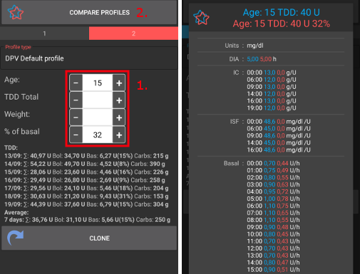
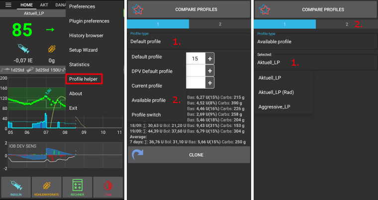

# Profil yardımcısı

Profil yardımcısı iki işlev sunar:

1. Çocuklar için bir profil bulmak
2. Yeni bir profili klonlamak için iki profili veya profil değişimlerini karşılaştırmak

## Çocuklar için profil (18 yaşına kadar)

**Önemli Not:**

**Profil Yardımcısı, çocuğunuz için ilk profili bulmanıza yardımcı olmak için tasarlanmıştır. İki farklı hastanenin veri setlerine dayalı olsa bile, yeni bir profil kullanmadan önce her zaman tıbbi ekibinizle görüşün!**

Profil yardımcısı, 18 yaşına kadar olan çocuğunuzun ilk profilini bulması için çocuklar için iki farklı hastaneden veri seti sunar.

1. Ekranın sağ üst tarafındaki üç noktalı menüden 'Profil yardımcısı'nı seçin.
2. Çocukların yaşını ve GTD (günlük toplam doz) **veya** ağırlığını girerek Varsayılan profili (hastane veri setine göre) ayarlayın.
3. Sağdaki 2 etiketli gri çubuğa tıklayarak ekranı değiştirin.
4. 'Geçerli profil'e uzun basın ve DPV Varsayılan profilini seçin.

5. Çocukların yaşını, bazal yüzdesini ve GTD Toplamı **veya** ağırlığını girerek DPV Varsayılan profilini (başka bir hastane veri kümesine göre) ayarlayın.
6. Ekranın üstündeki 'PROFİLLERİ KARŞILAŞTIR' düğmesine basın.
7. Ayarlanan iki profilin karşılaştırması görüntülenecektir.

Once you are fine with the profile adjustments you can [clone the profile](#clone-profile) as described below.

## İki profili karşılaştırın

You can use profile helper also to compare to different profiles or profile switches (percentage of one of your profiles used in a [profile switch](../DailyLifeWithAaps/ProfileSwitch-ProfilePercentage.md) before).

1. Ekranın sağ üst tarafındaki üç noktalı menüden 'Profil yardımcısı'nı seçin.
2. 'Varsayılan profil'e basın ve mevcut profillerinizin bir listesi için 'Kullanılabilir profil'i veya kullanılan en son profil değişimlerinin bir listesi için 'Profil Değiştir'i seçin.
3. Profil / profil anahtarının adına basın (yukarıdaki ekran görüntüsünde 'Aktuell_LP') ve listeden bir profil seçin.
4. Sağdaki 2 etiketli gri çubuğa tıklayarak ekranı değiştirin.

5. Standart olarak 'Mevcut profil' karşılaştırma adayı olarak sunulmaktadır.
6. Farklı bir profil / profil değiştirme istiyorsanız, 'Geçerli profil'e uzun basın ve 'Kullanılabilir profil' veya 'Profil değiştir'i seçin.
7. Profil adına uzun basın (yukarıdaki ekran görüntüsünde 'Aktuell_LP') ve listeden bir profil / profil değiştir seçin.
8. Ekranın üstündeki 'PROFİLLERİ KARŞILAŞTIR' düğmesine basın.
9. Ayarlanan iki profilin karşılaştırması görüntülenecektir.

(profilehelper-clone-profile)=
## Profili Klonla

You can clone a profile / profile switch directly from profile helper.

1. İstenen profili / profil değiştir'meyi yukarıda açıklandığı gibi seçin.
2. 'Varsayılan profil' veya 'Varsayılan DPV profili' kullanıyorsanız (hastanelerden çocuklar için alınan veri setlerine göre), yaş, bazal yüzdesi ve GTD / ağırlık için doğru ayarları girdiğinizden emin olun.
3. Ekranın altındaki 'KLON' düğmesine basın.
4. 'Tamam' ile onaylayın.
5. Yerel profil sekmesinde yeni profili etkinleştirin.
