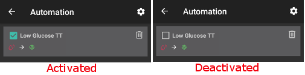

Otomasyon
**************************************************

Otomasyon Nedir?
==================================================
Aynı sıklıktaki olaylar için her zaman aynı ayarları değiştirmeniz gerekebilir. Bundan kaçınmak için, olayı yeterince iyi tanımlayıp otomatikleştirmeyi deneyerek, sizin için otomatik olarak yapmasına izin verebilirsiniz. 

Örneğin KŞ'niz çok düşük olduğunda, otomatik olarak yüksek bir geçici hedefe sahip olmaya karar verebilirsiniz. Veya fitness merkezinizdeyseniz, otomatik olarak geçici bir hedef alırsınız. 

Otomasyonu kullanmadan önce, manuel `geçici hedeflere <./temptarget.html>`_ veya profil anahtarlarından emin olmalısınız. 

İlk basit kuralınızı oluşturmadan önce otomasyonun nasıl çalıştığını gerçekten anladığınızdan emin olun. **Aksiyon yerine AAPS'nin önce yalnızca bir bildirim göstermesine izin verin.** Otomasyonun doğru zamanda tetiklendiğinden eminseniz, bildirimi gerçek eylemle değiştirin.

.. image:: ../images/Automation_ConditionAction_RC3.png
  :alt: Otomasyon koşulu + eylem

Bu nasıl kullanılır
==================================================
Bir otomasyon kurmak için ona bir başlık vermeniz, en az bir koşul ve bir eylem seçmeniz gerekir. 

Önemli Not
--------------------------------------------------
**Döngüyü devre dışı bıraktığınızda otomasyon hala etkindir!**

Bu nedenle, gerekirse bu durumlarda otomasyon kurallarını devre dışı bıraktığınızdan emin olun. Bunu otomasyon kuralınızın adının solundaki kutunun işaretini kaldırarak yapabilirsiniz.

Otomasyon nerede bulunur
--------------------------------------------------
Depending on your `settings in config builder <../Configuration/Config-Builder.html#tab-or-hamburger-menu>`_ you will either find `Automation <../Configuration/Config-Builder.html#automation>`__ in hamburger menu or as a tab.

Genel
--------------------------------------------------
There are some limits:

* Glikoz değeri 72 ile 270 mg/dl arasında veya 4 ile 15 mmol/l arasında olmalıdır.
* Profil yüzdesi %70 ile %130 arasında olmalıdır.
* 5 dk vardır. yürütmeler (ve ilk yürütme) arasındaki zaman sınırı.

**Lütfen dikkatli olun:**

* **less than -2 means: -3 and lower (-4,-10, etc)**
* **more than -2 means: -1 and higher (-1, 0, +10, etc)**

Şart
--------------------------------------------------
Birkaç koşul arasından seçim yapabilirsiniz. Burada yalnızca birkaçından bahsedilmiştir, ancak çoğu kendi kendini açıklayıcı niteliktedir ve bu nedenle burada açıklanmamıştır:

* bağlantı koşulları: birkaç koşula sahip olabilirsiniz ve bunları aşağıdakilerle bağlayabilirsiniz 

  * "Ve"
  * "Veya"
  * "Dışlamalı veya" (bu koşullardan yalnızca birinin geçerli olması durumunda, eylem(ler) in gerçekleşeceği anlamına gelir)
   
* Zaman vs. yinelenen zaman

  * zaman = tek seferlik olay
  * yinelenen zaman = düzenli olarak gerçekleşen bir şey (ör. haftada bir, her iş günü vb.)
   
* konum: konfiguration oluşturucuda (Otomasyon), kullanmak istediğiniz konum hizmetini seçebilirsiniz:

  * Pasif konum kullan: AAPS, yalnızca diğer uygulamalar talep ettiğinde konum alır
  * Ağ konumunu kullan: Wifi'nizin konumu
  * GPS konumunu kullanın (Dikkat! Aşırı pil tüketimine neden olabilir!)
  
Eylem
--------------------------------------------------
Bir veya daha fazla eylem seçebilirsiniz: 

* geçici hedefi başlat 

  * must be between 72 mg/dl and 270 mg/dl (4 mmol/l and 15 mmol/l)
  * works only if there is no previous temp target
   
* stop temp target
* notification
* profile percentage

  * must be between 70% and 130% 
  * works only if the previous percentage is 100%

After adding your action, **don't forget to change the default values** to what you need by clicking in the default values.
 
.. image:: ../images/Automation_Default_V2_5.png
  :alt: Automation default vs. set values

Sort automation rules
---------------------
To sort automation rules click and hold the four-lines-button on the right side of the screen and move up or down.

.. image:: ../images/Automation_Sort.png
  :alt: Sort automation rules
  
Delete automation rules
-----------------------
To delete an automation rule click on trash icon.

.. image:: ../images/Automation_Delete.png
  :alt: Delete automation rule

Good practice & caveats
==================================================
* When you start using automation or create a new rule, first add a notification only until you are sure the rule is working well.
* Watch the rule results.
* Don't try to make conditions too easy (i.e.: IF bg > 80 mg/dl AND bg < 180 mg/dl)

  **Doubly important if action is a profile switch!**
 
* Try to use Temp Targets instead of Profile Switches. Temp Targets do not reset `Autosens <../Usage/Open-APS-features.html#autosens>`__ back to 0.
* Make sure Profile switches are made sparingly and preferably at a last resort.

  * Profile switching renders `Autosens <../Usage/Open-APS-features.html#autosens>`__ useless for a min of 6 hours.

* Profile switching will not reset the profile back to your base profile

  * You have to make another rule to set this back or do it manually!
  * Increased risk of hypoglycemia if profile switch does not expire or reset back to base profile.

Examples
==================================================
These are just setup examples, no advises. Don't reproduce them without being aware what you are actually doing or why you need them.

* Switching profiles for your daily activities (like school, gym, weekend, workday...) using geolocation, wifi, time etc.
* Setting temp target for activities based on time, location, connection to a bluetooth device...
* Setting eating soon temp targets based on time, location...

Low Glucose Temp Target
--------------------------------------------------
.. image:: ../images/Automation2.png
  :alt: Automation2

This is made by someone who wants to get a hypo temp target automatically when having low glucose.

Lunch Time Temp Target
--------------------------------------------------
.. image:: ../images/Automation3.png
  :alt: Automation3
  
This example is made by someone who has lunch at work at the same time every day during the week. If he or she stays at a certain time in his or her lunch location, automation will set a low temp target (eating soon) while waiting for the lunch. Because of the "And" connection, it only happens during the chosen time and if he or she is at the chosen location. So it does not work on any other time at this location or on this time when the person stays at home. 

Incorrect use of automation
--------------------------------------------------
Please be aware to use automation incorrectly. This might lead to difficulties and even danger for your health. Examples for incorrect use are for instance:

* Trying to override algorithm at all instead of help only (i.e. by changing profile instead of tunning basal, IC etc.)
* Setting profile to compensate food
* Setting profile without duration
* Creating one way rules (i.e. do something but don't undo it by another rule)
* Creating long term rules

Alternatives
==================================================

For advanced users, there are other possibilities to automate tasks using IFTTT or a third party Android app called Automate. Some examples can be found `here <./automationwithapp.html>`_.
