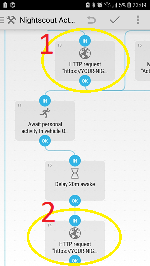
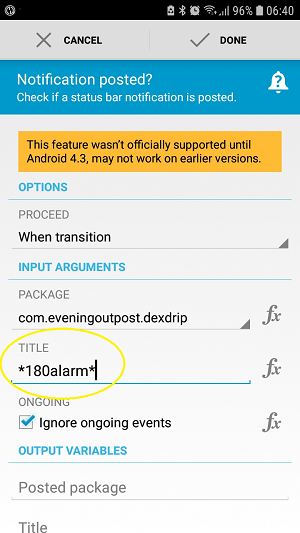

# Üçüncü taraf Android Automate Uygulaması ile otomasyon

**This article has been written before AndroidAPS version 2.5. There is an [automation plugin in AndroidAPS](./Automation.md) itself with AndroidAPS version 2.5. For some, this here might be still useful, but should only be used by advanced users.**

AndroidAPS hibrit bir kapalı döngü sistemi olduğundan, yine de bazı kullanıcı etkileşimi gereklidir (örneğin, döngüye yürüdüğünüzü, birazdan yemek yediğinizi, koltukta uzandığınızı söyleyin...). En son AndroidAPS işlevselliğini genişletmek için sık manuel kullanıcı girişleri, Otomatikleştirme veya IFTTT gibi harici araçlar aracılığıyla otomatikleştirilebilir.

## Android Otomatikleştirme Uygulaması

Ücretsiz Android™ uygulaması Automate, akıllı telefonunuzdaki çeşitli görevleri otomatikleştirmenize olanak sağlar. Akış şemaları ile otomasyonlarınızı oluşturun, cihazınızın Bluetooth, Wi-Fi, NFC gibi ayarları otomatik olarak değiştirmesini sağlayın veya bulunduğunuz yere, günün saatine veya diğer herhangi bir “olay tetikleyicisine” göre SMS, e-posta gönderme gibi işlemleri gerçekleştirin. Cihazınızdaki hemen hemen her şeyi otomatikleştirebilirsiniz, Tasker ve Locale için yapılmış eklentileri bile destekler.

Bu aracı kullanarak diyabetinizi çeşitli koşullara göre otomatik olarak tedavi etmek için iş akışlarını 'eğer bu (if this..) şeklinde kolayca oluşturabilirsiniz... ve bu... bunu değil... o zaman şunu yap... ve şu...'. Konfigüre edebileceğiniz binlerce olasılık vardır.

Şimdiye kadar **Nightscout Profili üzerinden döngü yapmak gerekliydi**, Automate, komutları HTTP isteği aracılığıyla doğrudan nightscout web sitenizde yürütür ve ardından onu AndroidAPS uygulamanızla eşitler.

**Çevrimdışı döngü (Automate ve AndroidAPS uygulaması arasında doğrudan iletişim) henüz desteklenmemektedir**, ancak teknolojik olarak mümkündür. Belki ileride bir çözüm bulunur. Bunu yapmanın bir yolunu bulduysanız, lütfen bunu bu belgelere ekleyin veya bir geliştiriciyle iletişime geçin.

### Temel gereksinimler

#### Automate Uygulaması

Android Automate'i Google Play Store'dan veya <https://llamalab.com/automate/> adresinden indirin ve AndroidAPS'nin çalıştığı akıllı telefonunuza yükleyin.

Otomatikleştir'de, ekranın sol üst kısmındaki hamburger menüsüne dokunun > Ayarlar > 'Sistem başlangıcında çalıştır' seçeneğini işaretleyin. Bu sistem başlangıcında iş akışlarınızı otomatik olarak çalıştıracaktır.

#### AndroidAPS

AndroidAPS'de, sağ üst ekrandaki 3 nokta menüsüne dokunun ve Tercihler > NSClient > Bağlantı ayarları > 'Yalnızca WiFi bağlantısını kullan' ve 'Yalnızca şarj oluyorsa' seçeneklerinin işaretini kaldırın, çünkü otomatik tedavi yalnızca AndroidAPS gerçek bir nightcout bağlantısı olduğunda çalışır.

AndroidAPS'de, sağ üst ekrandaki 3 nokta menüsüne dokunun ve Tercihler > NSClient > Gelişmiş Ayarlar > 'Yalnızca NS yükle (senkronizasyon devre dışı)' ve 'NS'ye yükleme yok' seçeneğinin işaretini kaldırın.

Be aware of the [security issues](../Installing-AndroidAPS/Nightscout.md#security-considerations) that might occure and be very careful if you are using an [Insight pump](../Configuration/Accu-Chek-Insight-Pump#settings-in-aaps).

### İş akışı örnekleri

#### Örnek 1: Aktivite (örneğin yürüme veya koşma) algılanırsa, yüksek bir GH ayarlayın. Ve aktivite biterse, 20 dakika bekleyin ve ardından GH'i iptal edin

Bu iş akışı, aktivite davranışını algılayan akıllı telefon sensörlerini (pedometre, yerçekimi sensörü...) dinleyecektir. Yürüme, koşma veya bisiklete binme gibi yakın zamanda bir etkinlik mevcutsa, Otomatikleştirme, kullanıcı tarafından belirlenen süre için kullanıcı tarafından belirlenen yüksek bir geçici hedef belirleyecektir. Aktivite sona ererse, akıllı telefonunuz bunu algılar, 20 dakika bekleyin ve ardından hedefi normal profil değerine geri ayarlayın.

Otomatikleştirme komut dosyasını <https://llamalab.com/automate/community/flows/27808> indirin.

Düzenleme kalemine dokunarak askıyı düzenleyin > Akış çizelgesi

İş akışını isteklerinize göre aşağıdaki gibi özelleştirin:

1. = Yüksek GH ayarla
2. = Aktivitenin bitiminden 20 dakika sonra normal hedefe geri dönün

1 

2 

İstek URL'si: /api/v1/treats.json ile biten NS-URL'niz (ör. https://my-cgm.herokuapp.com/api/v1/treats.json)

İçerik talebi:

* targetTop / targetBottom: Yüksek GH değeri (üst ve alt aynı değer olmalıdır)
* süre: Yüksek GH'inin süresi (bir süre sonra etkinlik devam etmedikçe normal profil hedefine geri döner). 
* secret: API SHA1 hash'ınız. Bu sizin API anahtarınız DEĞİLDİR! API anahtarınızı <http://www.sha1-online.com/> adresinde SHA1 biçimine dönüştürebilirsiniz

Kaydet: 'Bitti'ye ve kancaya dokunun

Askıyı başlat: Oynat düğmesine dokunun

#### Örnek 2: xDrip+ bir KŞ yüksek alarmı uyarırsa, o zaman ... için düşük bir GH ayarlayın. dakika.

Bu iş akışı, xDrip+ bildirim kanalını dinleyecektir. Kullanıcı tarafından belirlenen bir xDrip+ yüksek KŞ uyarısı tetiklenirse, Otomatikleştirme, kullanıcı tarafından belirlenen süre için kullanıcı tarafından belirlenen bir düşük geçici hedef ayarlar. Bir süre sonra, başka bir olası uyarı, düşük GH'in süresini uzatacaktır.

##### xDrip+

İlk olarak, xDrip+'a aşağıdaki gibi bir KŞ yüksek uyarısı eklemelisiniz:

Uyarı adı: (Dikkat edin!) Bu ad, tetikleyiciyi ateşlemek için gereklidir. Açık olmalı ve diğer uyarı adlarına benzememelidir. Örnek: '80alarm' yanında '180alarm' bulunmamalıdır.

Eşik: Yüksek alarmı tetiklemesi gereken KŞ değeri.

Varsayılan Erteleme: Düşük GH'iniz için ayarlamayı planladığınız süreyi buraya girin, çünkü uyarı tekrar gelir ve belki de düşük GH'in süresini uzatır.

##### Automate

İkinci olarak, Automate komut dosyasını <https://llamalab.com/automate/community/flows/27809> indirin.

Düzenleme kalemine dokunarak askıyı düzenleyin > Akış çizelgesi

İş akışını isteklerinize göre aşağıdaki gibi özelleştirin:

'Bildirim yayınlandı mı?' tetikleyiciyi başlatmak için 'TITLE' öğesini, tetikleyiciyi tetiklemesi gereken xDrip+ uyarınızın adına ayarlamanız ve bu addan önce ve sonra bir * değişkeni eklemeniz gerekir.

İstek URL'si: /api/v1/treats.json ile biten NS-URL'niz (ör. https://my-cgm.herokuapp.com/api/v1/treats.json)

İçerik talebi:

* targetTop / targetBottom: Düşük GH değeri (üst ve alt aynı değer olmalıdır)
* süre: Düşük GH'in süresi (bir süre sonra normal profil hedefine geri döner). xDrip+ uyarısı 'Standart erteleme' ile aynı süreyi kullanmanız önerilir
* secret: API SHA1 karmanız. Bu sizin API anahtarınız DEĞİLDİR! API anahtarınızı <http://www.sha1-online.com/> adresinde SHA1 biçimine dönüştürebilirsiniz

Kaydet: 'Bitti'ye ve kancaya dokunun

Askıyı başlat: Oynat düğmesine dokunun

#### Örnek 3: Sizin tarafınızdan eklenecek!!!

Lütfen .flo dosyasını Automate topluluğuna yükleyerek ('Nightscout' anahtar kelimesi altında) başka iş akışları ekleyin ve bunu [AndroidAPSdocs deposunda Çekme İsteği](../make-a-PR.md) yaparak burada açıklayın.

## Eğer buysa, o zaman (IFTTT)

PR ile bir Howto eklemekten çekinmeyin...