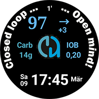
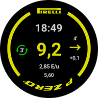
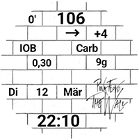

# 自訂錶盤交換站

在這裡，你可以下載用戶自行製作並與你分享的自訂錶面壓縮檔案（Zip 檔）。

Zip 檔案可以透過 Pull Request 一如往常地上傳到 GitHub 中的資料夾「**[_static/ExchangeSiteCustomWatchfaces](https://github.com/openaps/AndroidAPSdocs/tree/master/docs/_static/ExchangeSiteCustomWatchfaces)**」。

在合併 Pull Request 的過程中，文件團隊將提取 CustomWatchface.png 檔案，並在其前加上 Zip 檔案的檔名作為前綴。

|                                                                                                                                                                                                                                                                     |                                                                                                                                                                                                                                                                 |                                                                                                                                                                                                                                                                    |
| ------------------------------------------------------------------------------------------------------------------------------------------------------------------------------------------------------------------------------------------------------------------- | --------------------------------------------------------------------------------------------------------------------------------------------------------------------------------------------------------------------------------------------------------------- | ------------------------------------------------------------------------------------------------------------------------------------------------------------------------------------------------------------------------------------------------------------------ |
| [  **AAPS_V2**](https://github.com/openaps/AndroidAPSdocs/raw/refs/heads/master/docs/_static/ExchangeSiteCustomWatchfaces/AAPS_V2.zip)                                    | [  **AAPS**](https://github.com/openaps/AndroidAPSdocs/raw/refs/heads/master/docs/_static/ExchangeSiteCustomWatchfaces/AAPS.zip)                                               | [  **AIMICO**](https://github.com/openaps/AndroidAPSdocs/raw/refs/heads/master/docs/_static/ExchangeSiteCustomWatchfaces/AIMICO-V1_1.zip)                                |
| [  **Analog G-Watch**](https://github.com/openaps/AndroidAPSdocs/raw/refs/heads/master/docs/_static/ExchangeSiteCustomWatchfaces/Analog_G-Watch.zip)           | [  **Cockpit**](https://github.com/openaps/AndroidAPSdocs/raw/refs/heads/master/docs/_static/ExchangeSiteCustomWatchfaces/Cockpit.zip)                                   | [  **Digital G-Watch**](https://github.com/openaps/AndroidAPSdocs/raw/refs/heads/master/docs/_static/ExchangeSiteCustomWatchfaces/Digital_G-Watch.zip)      |
| [  **DigitalBigGraph**](https://github.com/openaps/AndroidAPSdocs/raw/refs/heads/master/docs/_static/ExchangeSiteCustomWatchfaces/DigitalBigGraph_v1.5.zip) | [  **Gears**](https://github.com/openaps/AndroidAPSdocs/raw/refs/heads/master/docs/_static/ExchangeSiteCustomWatchfaces/Gears.zip)                                           | [  **Gota**](https://github.com/openaps/AndroidAPSdocs/raw/refs/heads/master/docs/_static/ExchangeSiteCustomWatchfaces/Gota_v2.4.zip)                                             |
| [  **LuckyLoopKoeln**](https://github.com/openaps/AndroidAPSdocs/raw/refs/heads/master/docs/_static/ExchangeSiteCustomWatchfaces/LuckyLoopKoeln.zip)           | [  **P-Zero 錶盤**](https://github.com/openaps/AndroidAPSdocs/raw/refs/heads/master/docs/_static/ExchangeSiteCustomWatchfaces/pzero_v1.0.zip)                        | [  **PinkFloydTheWall**](https://github.com/openaps/AndroidAPSdocs/raw/refs/heads/master/docs/_static/ExchangeSiteCustomWatchfaces/PinkFloydTheWall.zip) |
| [  **Robby 錶盤**](https://github.com/openaps/AndroidAPSdocs/raw/refs/heads/master/docs/_static/ExchangeSiteCustomWatchfaces/Robby_watchface.zip)                     | [  **SimpleDigital**](https://github.com/openaps/AndroidAPSdocs/raw/refs/heads/master/docs/_static/ExchangeSiteCustomWatchfaces/SimpleDigital_v1.3.zip) | [  **SteamPunk**](https://github.com/openaps/AndroidAPSdocs/raw/refs/heads/master/docs/_static/ExchangeSiteCustomWatchfaces/SteamPunk.zip)                              |
|                                                                                                                                                                                                                                                                     |                                                                                                                                                                                                                                                                 |                                                                                                                                                                                                                                                                    |
