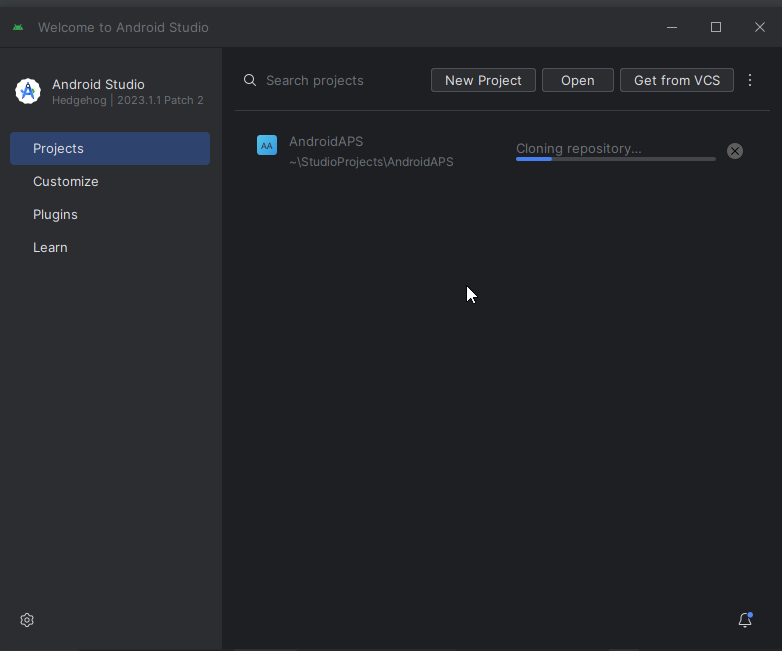

# 構建AAPS

## 自行建置，而不是下載

**由於醫療設備的相關規範，AAPS應用程式（apk檔案）無法下載。 您可以合法地構建應用程式供自己使用，但不得將副本提供給他人！**

詳情請參閱[FAQ頁面](../Getting-Started/FAQ.md)。

(構建APK推薦的電腦規格)=

## 構建AAPS所需的電腦和軟體規格

- 請使用至少名為Hedgehog (2023.1.1) 的 **[Android Studio版本，或更近期的版本如Iguana、Jellyfish和Koala](https://developer.android.com/studio/)** 來構建apk。 舊版本的Android Studio需要先更新！
- [Windows 32位系統](troubleshooting_androidstudio-unable-to-start-daemon-process) 不受Android Studio支援。 請記住，**64位CPU和64位作業系統是必備條件。** 如果您的系統不符合此條件，您需要更換受影響的硬體或軟體，或更換整個系統。

<table class="tg">
<thead>
  <tr>
    <th class="tg-baqh">作業系統（僅限64位）</th>
    <th class="tg-baqh">Windows 8或更高版本</th>
    <th class="tg-baqh">Mac OS 10.14或更高版本</th>
    <th class="tg-baqh">任何支援Gnome、KDE或Unity DE的Linux;&nbsp;&nbsp;GNU C Library 2.31或更新版本</th>
  </tr>
</thead>
<tbody>
  <tr>
    <td class="tg-baqh"><p align="center">CPU（僅限64位）</td>
    <td class="tg-baqh">x86_64 CPU架構；第二代Intel Core或更新版本，或支援<a href="https://developer.android.com/studio/run/emulator-acceleration#vm-windows" target="_blank" rel="noopener noreferrer"><span style="text-decoration:var(--devsite-link-text-decoration,none)">Windows Hypervisor</span></a>的AMD CPU</td>
    <td class="tg-baqh">ARM架構晶片，或支援<a href="https://developer.android.com/studio/run/emulator-acceleration#vm-mac" target="_blank" rel="noopener noreferrer"><span style="text-decoration:var(--devsite-link-text-decoration,none)">Hypervisor.Framework</span></a>的第二代Intel Core或更新版本</td>
    <td class="tg-baqh">x86_64 CPU架構；第二代Intel Core或更新版本，或支援AMD虛擬化（AMD-V）和SSSE3的AMD處理器</td>
  </tr>
  <tr>
    <td class="tg-baqh"><p align="center">記憶體</td>
    <td class="tg-baqh" colspan="3"><p align="center">8GB或更多</td>
  </tr>
  <tr>
    <td class="tg-baqh"><p align="center">硬碟</td>
    <td class="tg-baqh" colspan="3"><p align="center">至少30GB的可用空間。 建議使用SSD。</td>
  </tr>
  <tr>
    <td class="tg-baqh"><p align="center">解析度</td>
    <td class="tg-baqh" colspan="3"><p align="center">1280 x 800 最低要求<br></td>
  </tr>
  <tr>
    <td class="tg-baqh"><p align="center">網際網路</td>
    <td class="tg-baqh" colspan="3"><p align="center">寬頻</td>
  </tr>
</tbody>
</table>

**強烈建議（非必須）使用SSD（固態硬碟）而非HDD（硬碟），因為這將減少構建AAPS apk檔案時所需的時間。** 您仍然可以在構建 **AAPS** apk檔案時使用HDD。 如果這樣做，構建過程可能需要很長時間才能完成，但一旦開始，您可以讓它無需監控地執行。

## 構建過程中的幫助與支援

如果您在構建 **AAPS** 應用程式的過程中遇到困難，請先參閱專門的[**故障排除Android Studio**](../Installing-AndroidAPS/troubleshooting_androidstudio) 部分。

如果您認為構建指導中有任何錯誤、遺漏或困惑之處，或您仍然感到困難，請透過[Facebook](https://www.facebook.com/groups/AndroidAPSUsers)或[Discord](https://discord.gg/4fQUWHZ4Mw)聯繫其他 **AAPS** 用戶。 如果您想自行更改一些內容（例如更新螢幕截圖_等），請提交[拉取請求（PR）](../make-a-PR.md)。

## 構建AAPS應用程式的逐步指南

```{admonition} WARNING
:class: warning
如果您之前建置過 AAPS，則不需要再次執行以下所有步驟。
請直接跳至 [更新指南](../Installing-AndroidAPS/Update-to-new-version)!
```

構建 **AAPS** apk檔案的整體步驟如下：

4.1 [安裝Git](Install-Git)

4.2 [安裝Android Studio](Building-APK-install-android-studio)

4.3 [下載AAPS程式碼](Building-APK-download-AAPS-code)

4.4. [在Android Studio偏好設定中設置Git路徑](Building-APK-set-git-path-in-preferences)

4.5. [構建AAPS“簽章”apk](Building-APK-generate-signed-apk)

在本指南中，您將看到構建 **AAPS** apk檔案的_示例_螢幕截圖。 由於 **Android Studio**——我們用來構建 **AAPS** apk 的軟體——會定期更新，這些截圖可能與您的安裝不完全相同，但它們仍應該可以參照進行。

由於 **Android Studio** 可在Windows、Mac OS X和Linux平台上運作，這些平台之間的步驟可能也會有些許差異。

(安裝Git)=

### 安裝Git（如果您還沒有安裝）

```{admonition} Why Git? 
:class: dropdown

Git 被稱為「_版本控制系統_」（VCS）。
Git 是一個允許您追蹤代碼變更和與他人合作的程式。您將使用 Git 從 GitHub 網站將 **AAPS** 原始碼的副本複製到您本地計算機。然後，您將在您的計算機上使用 Git 來建置 **AAPS** 應用程式 (apk)。
```

#### 安裝Git的步驟

1. 檢查您是否已安裝 **Git**。 您可以透過在Windows的搜索欄中輸入“git”來檢查——如果看到 **“Git bash”** 或其他形式的Git，則已安裝，您可以直接進入[安裝Android Studio](Building-APK-install-android-studio)：


2. 如果尚未安裝Git，請從[**這裡**](https://git-scm.com/downloads)下載並安裝適用於您的系統的最新版本。 任何最新的Git版本都應該可以使用，請根據您的系統選擇正確的版本，無論是Mac、Windows還是Linux。

**給Mac用戶的提示：** Git網頁還將指導您安裝名為“homebrew”的附加程式，以輔助安裝。 如果您透過homebrew安裝Git，則無需更改任何偏好設定。

(Make_a_note_of_Git_path)=

- 在安裝過程中，當要求您“選擇安裝位置”時，請記下Git的安裝位置（即“**安裝路徑**”），您需要在下一步中檢查它。 安裝路徑可能類似於“C:\Program Files\Git\cmd\git.exe”

- 在進行Git安裝的幾個步驟時，只需接受所有的預設選項。

- 安裝完成後，如果您忘記記錄Git的安裝位置，可以透過以下方式找到它：在PC的搜索欄中輸入“git”，右鍵點擊“Git bash”，選擇“打開檔案位置”，將滑鼠懸停在“Git bash”圖示上，這將顯示安裝位置。

- 在進行下一步之前，重新啟動您的電腦。

(Building-APK-install-android-studio)=

### 安裝Android Studio

- **在以下步驟中，您必須始終保持線上狀態，因為Android Studio會下載多個更新。**

```{admonition} What is Android Studio?
:class: dropdown
Android Studio 是一個在您的計算機上運行的程式。它允許您從互聯網下載原始碼（使用 Git）並建立智慧型手機（和智慧手錶）應用程式。通過在您的 PC 上建置新的或更新的應用程式，您不會「破壞」可能在智慧型手機上運行的當前循環版本的 **AAPS**，這些是完全獨立的過程。
```

以下螢幕截圖取自 **Hedgehog** 版本的Android Studio，它們應與更新版本相同。

安裝Android Studio時最重要的一點是 **耐心！** 安裝和設置期間，Android Studio會下載大量內容，這需要時間。

從[**這裡**](https://developer.android.com/studio#downloads)下載Android Studio的最新版本，找到它在您的瀏覽器下載文件夾中的位置，並安裝在您的電腦上：


當您首次啟動Android Studio時，您將看到以下畫面：


選擇“下一步”：


保持選框勾選，然後選擇“下一步”：


允許安裝在建議的預設位置，然後選擇“下一步”：


當要求選擇Smart選單文件夾時，只需選擇“安裝”。 現在您需要等待幾分鐘，讓Android Studio完成安裝。 然後您應該看到安裝已完成，選擇“下一步”：


現在選擇“完成”：


Android Studio將立即啟動。

當被詢問是否要匯入設定時，選擇“不匯入設定”。 我們不需要匯入以前的安裝設定：


決定是否要與Google共享資料（如果不確定，請選擇“不發送”）。


您將看到有關缺少軟體開發工具包（SDK）的訊息（不用擔心，這很快會解決），選擇“下一步”：


軟體應自動選擇所需的SDK並選擇一個位置。

```{admonition} What is an Android SDK?
:class: dropdown

為了在手機上運行 **AAPS**，該應用程式需要與 Android 本身整合。Android 提供「_軟體開發工具包_」（SDK），使像 **AAPS** 這樣的應用程式能夠與 Android 操作系統接口。
```

SDK平台套件與您手機上運作的Android版本無關，而是與 **AAPS** 的構建有關。 **AAPS** 3.2及更新版本基於API等級34進行構建，這會在 **Hedgehog** 版本的 **Android Studio** 中自動選擇。 因此，只需點擊“下一步”：


當要求您驗證設定時，直接選擇“下一步”：


當被詢問有關許可協議時，選擇“接受”，然後點擊“完成”：


> **_注意：_** 根據您的設置，可能需要接受的許可協議與螢幕截圖中顯示的有所不同。

等待Android Studio下載其他組件，這可能需要幾分鐘：


一旦所有內容下載完成，“完成”按鈕將變為藍色，然後您可以點擊它：


現在您將看到“歡迎使用Android Studio”畫面。


(Building-APK-download-AAPS-code)=

### 下載AAPS程式碼

```{admonition} Why can it take a long time to download the AAPS code?
:class: dropdown

第一次下載 **AAPS** 時，Android Studio 將通過互聯網連接到 GitHub 網站以下載 **AAPS** 的原始碼。這應該需要約 1 分鐘。 

然後，Android Studio 將使用 **Gradle**（Android Studio 中的開發工具）來識別安裝這些項目所需的其他組件。 

```

在Android Studio歡迎頁面上，檢查左側是否突出顯示了“**專案**”（1）。 然後點擊右側的“**從VCS獲取**”（2）：


- 我們現在將告訴Android Studio從哪裡獲取程式碼：

- “倉庫URL”應該在左側（1）預設選擇。

- “Git”應作為版本控制預設選擇（2）。

現在複製這個URL：

```
https://github.com/nightscout/AndroidAPS.git
```

然後將其粘貼到URL文本框中（3）。

- 檢查（預設的）儲存複製程式碼的目錄是否合理（4）。

```{admonition} INFORMATION
:class: information
請注意目錄。它是存儲原始碼的位置！
```

- 現在點擊“複製”按鈕（5）。


您現在將看到一個螢幕，告訴您倉庫正在被複製：



某些時候，系統可能會詢問您是否信任該專案。 點擊“信任專案”：


僅限Windows用戶：如果您的防火牆要求許可，請授予存取權限：


倉庫成功複製後，Android Studio將打開複製的專案。

點擊右上角的齒輪圖示，選擇“**切換到經典UI...**”以返回到本文件中使用的視圖。

如果您看不到齒輪圖示，不用擔心。 您已經在使用經典UI！


重新啟動Android Studio以使更改生效。


您可能會看到以下警告之一或兩者關於運作中的進程。 可以安全地中止它們！

 

當Android Studio再次打開時，耐心等待（可能需要幾分鐘），特別是**不要**按照彈出提示更新專案。


```{admonition} NEVER UPDATE GRADLE!
:class: warning

Android Studio 可能會建議更新 gradle 系統。**絕對不要更新 gradle!** 這將導致困難。
```

_可選_ - 如果您想清除“建議更新專案”的彈出訊息，點擊藍色文本“更多”（1）。 在對話框中選擇“不要再次詢問此專案”（2）。


僅適用於Windows用戶：
如果您自安裝或更新Git後尚未重新啟動電腦，請立即關閉Android Studio。 然後重新啟動您的電腦，並重新打開Android Studio。

(Building-APK-set-git-path-in-preferences)=

### 在Android Studio偏好設定中設置git路徑

現在我們將告訴Android Studio在哪裡找到您之前[安裝的](Install-Git) Git。

- 僅限Windows用戶：請確保在[安裝Git](Install-Git)後重新啟動電腦。
- 打開 **Android Studio**（您可以在開始選單中找到它）。
- 在 **Android Studio** 的左上角，導航到 _File-Settings_（Windows）或 _Android Studio > Preferences_（Mac）。 這將打開以下視窗，點擊以展開名為“版本控制”的下拉選單（1）：


- 現在選擇“**Git**”（2）。
- 在頁面中間下方，確保選擇更新方式為“合併”（3）。
- 點擊“測試”按鈕（4），檢查 **Android Studio** 是否可以自動找到 **git.exe** 的正確路徑：


- 如果自動設置成功，您當前版本的 **Git** 將顯示在路徑旁邊。

  

- 如果未能自動找到 **git.exe**，或者點擊“測試”按鈕顯示錯誤（1），您可以手動輸入您之前[記錄的](Make_a_note_of_Git_path)路徑，或者點擊資料夾圖示（2），手動導航到儲存 **git.exe** 的目錄：

  

- 如果您不確定Git安裝在哪裡，可以使用Windows Explorer中的[搜索功能](https://www.tenforums.com/tutorials/94452-search-file-explorer-windows-10-a.html)查找“git.exe”。 如何執行此操作已在[上面](Make_a_note_of_Git_path)詳細說明。

- 如果您已手動選擇路徑，請按照上述說明使用“測試”按鈕檢查所選的Git路徑。

當Git版本顯示在路徑旁邊時（如上圖所示），您已成功完成此階段，並可以點擊“**OK**”按鈕（5）關閉Android Studio“設定”視窗：


(Building-APK-generate-signed-apk)=

### 構建AAPS“簽章”APK

```{admonition} Why does the AAPS app need to be "signed"?
:class: dropdown

Android 要求每個應用程式必須被 _簽署_，以確保日後只能從最信任的來源更新原始應用程式。關於這一主題的更多資訊，請跟隨 [這個連結](https://developer.android.com/studio/publish/app-signing.html#generate-key)。對我們來說，這意味著我們生成一個簽名或「密鑰庫」文件並在建立 **AAPS** 應用程式時使用它。
```

- 在選單欄中，點擊“構建”（1），選擇“生成簽章包/APK”（2）：


- 選擇“APK”而不是“Android App Bundle”，然後點擊“下一步”：


- 在下一個螢幕上，確保“模組”設置為“AAPS.app”（1）。

(Building-APK-wearapk)=

```{admonition} INFORMATION!
:class: information
如果您想為您的手錶建立apk，請選擇AAPS.wear！
```

- 點擊“建立新...” (2) 開始建立您的密鑰庫。

```{admonition} INFORMATION!
:class: information
您只需要創建密鑰庫一次。
如果您之前已經建置過 AAPS，請不要建立新的密鑰庫，而是選擇您現有的那一個！
```

**_注意：_** 密鑰庫是一個用於存儲應用程式簽章訊息的檔案。 它是加密的，並且訊息透過密碼進行保護。


- 點擊“資料夾”圖示（1）選擇密鑰庫在您電腦上的儲存路徑：


- 點擊下拉選單（1），選擇您希望儲存密鑰庫檔案的位置。 在此示例中，它儲存在“我的文件”中（2）。 不要將密鑰庫儲存在與Android Studio檔案相同的文件夾中（StudioProject）。 為您的密鑰庫輸入一個簡單的名稱（3），並點擊“確定”（4）進行確認：


這將帶您返回上一個螢幕。 您選擇的密鑰庫檔案的儲存位置將顯示出來。

```{admonition} WARNING!
:class: warning
確保記下您的密鑰庫存儲的位置。在您建置下一個 AndroidAPS 更新時，您將需要它！
```

現在選擇一個簡單的密碼（記下它），在密碼框中輸入（1），並確認它（2）。  密鑰庫和密鑰的密碼不必過於複雜。 如果將來遺失密碼，請參閱[密鑰庫遺失的故障排除](troubleshooting_androidstudio-lost-keystore)。

密鑰的預設別名（3）為“key0”，保持不變。

您現在需要為您的密鑰設置密碼。 為了簡單起見，您可以使用與上面密鑰庫相同的密碼。 輸入密碼（4）並確認（5）。

```{admonition} WARNING!
:class: warning
請記下這些密碼！在您建立下一個 AAPS 更新時，會需要它們！
```

有效期（6）預設為25年，保持不變。

輸入您的名字和姓氏（7）。 不需要添加其他訊息。

點擊“確定”（8）繼續：


在“生成簽章包或APK”頁面上，將顯示您的密鑰庫路徑。 現在重新輸入密鑰庫密碼（1）和密鑰密碼（2），並勾選記住密碼的框（3），這樣下次構建apk時（即更新到新的AAPS版本時）就不必再次輸入它們。 點擊“下一步”（4）：


在下一個螢幕中，選擇構建變體“fullRelease”（1），然後點擊“建立”（2）。


Android Studio現在將開始構建 **AAPS** 的apk。 它將在右下角顯示“Gradle Build running”。 該過程會根據您的電腦和網際網路連線速度花費一些時間，請**耐心等待！** 如果您想查看構建進度，請點擊Android Studio底部的小錘子圖示“構建”：


現在您可以查看構建進度：


Android Studio在構建完成後將顯示“BUILD SUCCESSFUL”的訊息。 您可能會看到一個彈出通知，您可以點擊選擇“查找”。 如果您錯過了此步驟，請點擊螢幕最底部的“定位或分析APK”（黃色突出顯示）的通知來打開通知欄：


_如果構建未成功，請參閱[故障排除部分](../Installing-AndroidAPS/troubleshooting_androidstudio)。_

在通知欄中，點擊藍色連結“定位”：


您的檔案管理器/檔案總管將會打開。 導航到目錄“full”（1）> “release”（2）。


打開“release”資料夾。 檔案“app-full-release.apk”（1）是您剛剛構建的 **AAPS** apk，在文檔的下一部分，您將把此檔案傳輸到您的智慧型手機：


恭喜！ 現在您已經構建了 **AAPS** apk 檔案，您可以進入下一階段[傳輸和安裝 **AAPS**](Transferring-and-installing-AAPS.md)。
