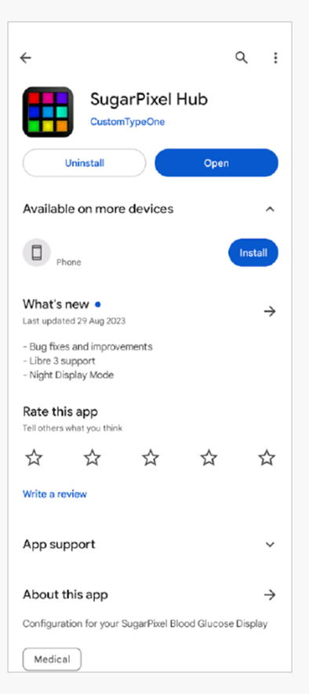

# Following AAPS (no interaction with the AAPS system)

In addition to the range of possibilities available for remotely controlling _and_ following **AAPS** which are described at [remote control](docs/EN/remote-control.md), there are several additional apps and devices which the community has developed, to simply follow numbers (glucose levels and other information), without interacting with AAPS.

A good overview of the extensive options available for following **AAPS** is at [Nightscout follower](https://nightscout.github.io/nightscout/downloaders/#) webpage; if you expand the menu on the left-hand side:

The most common strategies used in combination with **AAPS** are explained in more detail below.

## 1) Smartphone apps

These are some of the main “follower” apps used by **AAPS** users. All of these apps are “free”:

A)  Dexcom Follow (Android/iOs)

B)  Nightguard (iOs)

C)  Nightwatch (Android)

D)  xDrip+ (Android)

E)  xDrip4iOS (iOs)

F)  Sugarmate (iOs)

G)  Spike (iOs)

### A) Dexcom Follow (Android and iOS)

●   Dexcom Follow is compatible with a wide range of handsets (both Android and iPhone). Dexcom Follow can be used even if you are not using the official Dexcom app to receive sensor data.

●   Many caregivers are familiar with Dexcom Follow, preferring its clear interface over something more complicated.

●   Dexcom Follow is very good for teachers/grandparents and people who know very little about diabetes and sugar levels. It has customisable alerts (BG level, what sound to play etc). Alarms can be completely switched off if needed, which is very useful if you have a sensor which is still settling down and creating multiple fake lows.

#### Setting up Dexcom Follow: how-to-guide

If you use the unofficial Dexcom app BYODA for receiving sensor data, you may be able to send invites to followers from within the BYODA app. You should also be able to send invitations to Dexcom Follow from xDrip+ (settings - Cloud upload - Dexcom share server upload, see instructions here:

https://xdrip.readthedocs.io/en/latest/use/cloud/?h=#dexcom-share-server-upload

You cannot send invite emails to Dexcom followers anymore from these third-party apps. In xDrip+ the invite request will just result in the message “invite not sent”.

You must install the official Dexcom app, send the invite, and then uninstall the official app.

The steps to do this are as follows:

1)  Install the official “Dexcom” app on _any_ smartphone (Android/iPhone), this can be the Follower phone, if it is more convenient. 2)  Log in with your Dexcom username and password, this is the same login details you would use for Dexcom Clarity, if you are already a current Dexcom/Clarity customer. 跟蹤 AAPS（無需與 AAPS 系統互動）除了在 &lt;a href="docs/EN/remote-control.md"&gt;遠端控制&lt;/a&gt; 中描述的遠程控制 &lt;em x-id="4"&gt;和&lt;/em&gt; 跟蹤 &lt;strong x-id="1"&gt;AAPS&lt;/strong&gt; 的多種選項外，社群還開發了多個應用程式和設備，這些應用程式和設備僅用於跟蹤數據（如血糖水平和其他訊息），無需與 AAPS 進行互動。對於如何跟蹤 &lt;strong x-id="1"&gt;AAPS&lt;/strong&gt;，一個非常好的概述可以在 &lt;a href="https://nightscout.github.io/nightscout/downloaders/#"&gt;Nightscout follower&lt;/a&gt; 網頁中找到；如果你展開左側選單：以下將詳細說明與 &lt;strong x-id="1"&gt;AAPS&lt;/strong&gt; 組合使用的最常見策略。1) 智能手機應用程式以下是一些 &lt;strong x-id="1"&gt;AAPS&lt;/strong&gt; 用戶使用的主要 “跟蹤者” 應用程式。所有這些應用程式都是“免費”的：A)  Dexcom Follow（Android/iOS）B)  Nightguard（iOS）C)  Nightwatch（Android）D)  xDrip+（Android）E)  xDrip4iOS（iOS）F)  Sugarmate（iOS）G)  Spike（iOS）A) Dexcom Follow（Android 和 iOS）●  Dexcom Follow 適用於多種手持設備（包括 Android 和 iPhone）。即使你未使用官方的 Dexcom 應用程式接收傳感器數據，也可以使用 Dexcom Follow。●  許多照護者熟悉 Dexcom Follow，因為它簡單明瞭的界面相較於其他複雜的應用更受青睞。●  Dexcom Follow 非常適合教師/祖父母以及對糖尿病和血糖水平知識不多的人使用。它具有可自訂的警報（BG 水平，播放的聲音等）。如果傳感器仍在穩定中且產生多次虛假低血糖報告，則可以完全關閉警報，這非常實用。設置 Dexcom Follow：操作指南如果你使用的是非官方的 Dexcom 應用程式 BYODA 來接收傳感器數據，你可能可以從 BYODA 應用程式內向跟隨者發送邀請。你應該也可以從 xDrip+ 中發送 Dexcom Follow 的邀請（設置 - 雲上傳 - Dexcom 分享伺服器上傳，請參見這裡的指示：https://xdrip.readthedocs.io/en/latest/use/cloud/?h=#dexcom-share-server-upload你無法再通過這些第三方應用程式向 Dexcom 跟隨者發送邀請郵件。在 xDrip+ 中，邀請請求只會顯示訊息“未發送邀請”。你必須安裝官方的 Dexcom 應用程式，發送邀請，然後卸載官方應用程式。步驟如下：1)  在 *任何* 智能手機（Android/iPhone）上安裝官方的“Dexcom”應用程式，如果方便的話，也可以安裝在跟隨者的手機上。2)  使用你的 Dexcom 用戶名和密碼登錄，這與你用於 Dexcom Clarity 的登錄信息相同，如果你已經是 Dexcom/Clarity 的客戶。如果你沒有 Dexcom 登錄，這時可以選擇創建新帳號。&lt;br x-id="3" /&gt;3)  滑動瀏覽介紹選單。 4)  Add “no code” for the sensor code. 5)  Under Transmitter SN select “enter manually” and enter any valid transmitter code (use one of your expired transmitter codes, if you know one, so it doesn’t interfere with the running of your current transmitter, they follow a specific format of certain numbers and letters: “NLNNNL” and only use certain combinations, so it’s easiest to use one you already know is valid). 6)  Once the app is trying to find the transmitter and sensor, you will be able to invite followers: select the small three dots in the top left of the app, and add new follower. You can also use this if one of your followers has changed their handset and needs a fresh invite, here you can delete them from the follower list and resend a new invite email for them to use on their new handset. 7)  On the Follower phone, install Dexcom Follow by downloading it from the App Store (iPhone) or Play (Android). 4)  對於傳感器代碼，選擇“無代碼”。5)  在發射器序號下，選擇“手動輸入”，並輸入任何有效的發射器代碼（如果你知道一個過期的發射器代碼，請使用它，這樣就不會干擾當前發射器的運行，它們遵循特定的數字和字母組合格式：“NLNNNL”，並且只使用特定的組合，因此使用你已知有效的代碼會更容易）。6)  一旦應用程式嘗試查找發射器和傳感器，你將能夠邀請跟隨者：選擇應用程式左上角的小三個點，然後新增跟隨者。如果你的其中一個跟隨者更換了手機，需要重新發送邀請，也可以在此處刪除他們並重新發送新的邀請郵件，供他們在新設備上使用。7)  在跟隨者的手機上，通過 App Store（iPhone）或 Play 商店（Android）下載並安裝 Dexcom Follow。設置 Dexcom Follow 應用程式，系統會提示你打開電子郵件以找到成為跟隨者的邀請。&lt;br x-id="4" /&gt;8)  現在你可以刪除官方的 Dexcom G6 應用程式。

For Dexcom Follow, the sensor data is then exported from the AAPS phone either directly from BYODA, or from xDrip+, depending on which app you are using.

### B) Nightguard (iOS)

Pros (as reported by users):

●   Available in the [app store](https://apps.apple.com/us/app/nightguard/id1116430352), simple, user-friendly interface.

●   Swipe button or shake phone to snooze alarms at different intervals ranging from 5 mins to 24 hours

●   Customize alarms (high, low alerts, missed readings when no data for 15-45 minutes.

●   Fast rise/drop over 2-5 consecutive readings (you choose). Can also choose the delta between two individual readings

●   Smart snooze so doesn't alert if levels are moving in right direction

●   There is a Care tab which appears to enable you to set a new temp target for a certain duration, delete the temp target or enter carbs.

Cons (as reported by users)

●   Only available for iOS

●   The TT shows as 5 mmol regardless of which TT level is set

●   Never shows Temp Basal rate even though it shows TB

### C) Nightwatch (Android)

●   Nightwatch markets itself as a Nightscout client and monitors the user’s Nightscout glucose levels on either Android phone or tablet.

●   The app can be downloaded from [Google play](https://play.google.com/store/apps/details?id=se.cornixit.nightwatch) and displays BG data in real time.

●   The user can be alerted with customised noisy low and high alarms set.

●   BG data can be viewed in either mmol/L or mg/dL.

●   It requires Android 5.0 and up.

●   It has a dark Ul, large readings and buttons, designed for usage at night.

### D) xDrip+ (Android)

You can use xDrip+ as a follower.

#### With Nightscout

Set xDrip+ as a Nightscout Follower. You will receive BG and treatments, not basal.

#### Without Nightscout - xDrip+ BG data source

If your AAPS data source is xDrip+ (or if xDrip+ can also receive BG from another app like BYODA, Juggluco, ...) you can use it from the master phone to share data with xDrip+ followers, displaying BG, treatments and basal rates.

#### Without Nightscout - xDrip+ BG companion app

If your AAPS data source is not xDrip+ but you can display BG data from the Companion App data source, you can use it from the master phone to share data with xDrip+ followers, displaying BG, treatments and basal rates.

### E) xDrip4iOS/Shuggah (iOS)

xDripSwift was created from porting the original xDrip app to iOS and evolved to "xDrip for iOS" written **xDrip4iOS** .

A version of **xDrip4iOS** is available in the Apple Store under the name of **Shuggah**.

對於 Dexcom Follow，感應器數據會根據你使用的應用程式，從 AAPS 手機直接通過 BYODA 或 xDrip+ 匯出。B) Nightguard（iOS）優點（用戶報告）：●  可在 &lt;a href="https://apps.apple.com/us/app/nightguard/id1116430352"&gt;App Store&lt;/a&gt; 中獲得，簡單且使用者友好的界面。●  滑動按鈕或搖動手機以延後不同間隔的警報，範圍從5分鐘到24小時。●  自訂警報（高、低警報，當無數據15-45分鐘時的警報）。●  快速上升/下降超過2-5次連續讀數（你可以選擇）。還可以選擇兩個單獨讀數之間的差值。●  智能延後功能，不會在數據朝正確方向變動時發出警報。●  還有一個“照護”標籤，允許你設定一個臨時目標持續一段時間、刪除臨時目標或輸入碳水化合物數量。缺點（用戶報告）●   只適用於 iOS●   無論設置的 TT 水平如何，TT 始終顯示為 5 mmol●   從不顯示臨時基礎速率，儘管顯示了 TBC) Nightwatch（Android）●   Nightwatch 自稱為 Nightscout 客戶端，可在 Android 手機或平板電腦上監控用戶的 Nightscout 血糖水平。●   該應用程式可從 &lt;a href="https://play.google.com/store/apps/details?id=se.cornixit.nightwatch"&gt;Google Play&lt;/a&gt; 下載，並以實時方式顯示 BG 數據。●   用戶可以通過自訂的高低噪音警報進行提醒。●   BG 數據可以以 mmol/L 或 mg/dL 顯示。●   需要 Android 5.0 及更高版本。●   它有一個黑暗界面，大字體顯示和大按鈕，專為夜間使用設計。D) xDrip+（Android）你可以將 xDrip+ 作為跟隨者應用程式使用。與 Nightscout 一起使用將 xDrip+ 設置為 Nightscout 的跟隨者。你將接收 BG 和治療訊息，但不會接收基礎速率數據。無 Nightscout - xDrip+ 作為 BG 數據源如果你的 AAPS 數據源是 xDrip+（或如果 xDrip+ 也可以從其他應用程式接收 BG 數據，如 BYODA、Juggluco 等），你可以從主手機分享數據給 xDrip+ 跟隨者，顯示 BG、治療和基礎速率數據。無 Nightscout - xDrip+ 作為 BG 輔助應用程式如果你的 AAPS 數據源不是 xDrip+，但可以顯示來自輔助應用程式數據源的 BG 數據，你可以從主手機分享數據給 xDrip+ 跟隨者，顯示 BG、治療和基礎速率數據。E) xDrip4iOS/Shuggah（iOS）xDripSwift 是從最初的 xDrip 應用程式移植到 iOS 並發展成 "xDrip for iOS"，稱為 &lt;strong x-id="1"&gt;xDrip4iOS&lt;/strong&gt;。版本 &lt;strong x-id="1"&gt;xDrip4iOS&lt;/strong&gt; 可在 Apple Store 上以 &lt;strong x-id="1"&gt;Shuggah&lt;/strong&gt; 的名稱獲得。:::{admonition} 進一步詳細說明如何嘗試獲得原版 &lt;strong x-id="1"&gt;xDrip4iOS&lt;/strong&gt; 應用程式&lt;br x-id="2" /&gt;:class: dropdown

The [xDrip4iOS Facebook group](https://www.facebook.com/groups/853994615056838/announcements) is the main community support for xDrip4iOS and Shuggah. **xDrip4iOS** can connect to many different CGM systems and transmitters and display blood glucose values, charts and statistics as well as provide alarms. It can also upload to Nightscout or act as a [follower app for Nightscout](https://xdrip4ios.readthedocs.io/en/latest/connect/follower/). However, it is difficult to actually _get_ the **xDrip4iOS** app for your phone.

"How can I get **xDrip4iOS** on my iPhone?" There are two options:

1. If you have a Mac and an Apple Developer account (99 EUR/USD per year) you can build your own xDrip4iOS by following the instructions below:

https://xdrip4ios.readthedocs.io/en/latest/install/build/

xDrip4iOS Facebook 群組是 xDrip4iOS 和 Shuggah 的主要社群支援。&lt;strong x-id="1"&gt;xDrip4iOS&lt;/strong&gt; 可以連接到許多不同的 CGM 系統和發射器，並顯示血糖值、圖表和統計資料，還提供警報。它還可以上傳到 Nightscout 或充當 &lt;a href="https://xdrip4ios.readthedocs.io/en/latest/connect/follower/"&gt;Nightscout 的跟隨者應用程式&lt;/a&gt;。然而，實際上要 &lt;em x-id="4"&gt;獲得&lt;/em&gt; &lt;strong x-id="1"&gt;xDrip4iOS&lt;/strong&gt; 應用程式相當困難。“如何在我的 iPhone 上獲得 &lt;strong x-id="1"&gt;xDrip4iOS&lt;/strong&gt; 應用程式？”有兩個選項：如果你有 Mac 和 Apple 開發者帳戶（每年 99 歐元/美元），你可以按照以下說明自行建立 xDrip4iOS 應用程式：https://xdrip4ios.readthedocs.io/en/latest/install/build/如果你願意，你還可以成為“發佈者”，並通過 Personal Testflight 分享 xDrip4iOS 給最多 100 個其他人，幫助他們：https://xdrip4ios.readthedocs.io/.../personal_testflight/

2. You join the [xDrip4iOS Facebook group](https://www.facebook.com/groups/853994615056838/announcements) and monitor the posts… wait for somebody to offer an invitation to their Personal Testflight releases in the group. **You should not ask for an invitation to the app** (read the group rules).

An easier solution is therefore to download the **Shuggah** app.

:::

#### [Shuggah](https://apps.apple.com/sa/app/shuggah/id1586789452)

App:

"What is Shuggah?" A group of Ukrainian developers copied the project code for xDrip4iOS (which is shared publicly on GitHub) and released it on the App Store under a business account (the app is free, and their intentions are good). The app had to be slightly modified to add a privacy statement and disclaimer to get past the review, but the rest of the app should be the same as xDrip4iOS. The Shuggah release is not managed by the xDrip4iOS developers so it cannot be guaranteed that it will function in the same way as xDrip4iOS, that it will be updated at the same time, or that Apple won't remove it from the App Store at some point.

The [xDrip4iOS Facebook group](https://www.facebook.com/groups/853994615056838/announcements) supports xDrip4iOS, Shuggah, and the matching Apple Watch apps.

### F) Sugarmate (iOS)

[Sugarmate](https://sugarmate.io/) is available to download onto iPhones from the App store. 你可以加入 &lt;a href="https://www.facebook.com/groups/853994615056838/announcements"&gt;xDrip4iOS Facebook 群組&lt;/a&gt;，並關注帖子……等待有人在群組中提供邀請加入他們的 Personal Testflight 版本。&lt;strong x-id="1"&gt;你不應該主動要求獲得應用程式邀請&lt;/strong&gt;（請閱讀群組規則）。一個更簡單的解決方案是下載 &lt;strong x-id="1"&gt;Shuggah&lt;/strong&gt; 應用程式。Shuggah應用程式：“什麼是 Shuggah？”一群烏克蘭開發者複製了 GitHub 上公開分享的 xDrip4iOS 項目代碼，並在 Apple Store 上以商業帳戶發佈該應用程式（該應用程式是免費的，他們的初衷是好的）。該應用程式必須稍作修改以添加隱私聲明和免責聲明才能通過審核，但其餘部分應與 xDrip4iOS 相同。Shuggah 發佈版不是由 xDrip4iOS 開發者管理的，因此不能保證它的功能與 xDrip4iOS 相同，也不能保證它會與 xDrip4iOS 同時更新，或者 Apple 不會在某個時間點將其從 App Store 中移除。xDrip4iOS Facebook 群組支援 xDrip4iOS、Shuggah 以及相應的 Apple Watch 應用程式。F) Sugarmate（iOS）&lt;a href="https://sugarmate.io/"&gt;Sugarmate&lt;/a&gt; 可從 App Store 下載到 iPhone 上。Sugarmate 相容於：●   Apple iPhone（需要 13.0 或更高版本的軟體）●   Apple iPad（需要 13.0 或更高版本的軟體）●   Google Android（將網頁應用程式保存到主螢幕）

It has been reported by users of Sugarmate that it can be used with Apple CarPlay in the USA to display glucose readings when driving. It is not yet established if this is possible in countries outside the USA. If you know more about this, please add details in here to the documentation by completing a pull-request (link) which is quick and easy to do.

### G)  [Spike](https://spike-app.com/) (iOS)

Spike can be used as a primary receiver or as a follower app, providing BG, alarms and IOB and more. The website and app are no longer developed. Details [here](https://spike-app.com/#features2). Support can be found on [Facebook](https://www.facebook.com/groups/1973791946274873) and [Gitter](https://gitter.im/SpikeiOS/Lobby).

To install Spike, see [here](https://spike-app.com/#installation)

## 2) Smartwatches for **Monitoring of AAPS** (full profile data, or glucose-only) where **AAPS** is running on a phone.

Smartwatch options which also allow interaction with **AAPS** are described in the ["remote control"](remote-control.md) section of the documentation.

There are a wide range of affordable smartwatches which can provide display only. If you are using Nightscout, then a good overview of all the options is [here](https://nightscout.github.io/nightscout/wearable/#)

Here we summarize some of the follow-only watch options popular with **AAPS** users:

### a)  **Xiaomi and Amazfit watches**

[Artem](https://github.com/bigdigital) has created an xDrip+ integration app WatchDrip+ for various smartwatch models, mostly for Xiaomi (_e.g._ Mi band) and Amazfit brands:

You can read more about them, including how to set-up at his website [here](https://bigdigital.home.blog/). The advantage of these watches is that they are small and relatively affordable (the Xiaomi Mi Band 5 has a RRP of £39.99 GBP). They are a popular option especially for kids and those with smaller wrists to wear.

### b) Pebble watch

Pebble watches ([now discontinued](https://en.wikipedia.org/wiki/Pebble_(watch))) were on general sale from 2013 - 2016, and may still be available second-hand. Fitbit took over Pebble’s assets. Pebble users can use the Urchin watchface to view Nightscout data. Displayed data options include IOB, currently active temp basal rate and predictions. If open looping you can use IFTTT to create an applet that says if a Notification has been received from **AAPS**  then send either an SMS or pushover notification.

### c) [Bluejay GTS watch](https://bluejay.website/shop/product/bluejay-gts-26)

This is a unique piece of technology which can receive glucose data **directly** from the Dexcom G6 transmitter. It is not widely known that a Dexcom G6 transmitter actually broadcasts the current glucose data on _two_ separate channels, a phone channel and a pump channel. The Bluejay GTS watch runs a modified version of Xdrip+ software, and can be set to receive glucose data on either channel, so if **AAPS **  is using the phone channel, then the Bluejay GTS watch can use the pump channel.

The Bluejay GTS watch is small, waterproof and reasonably affordable (currently £115 GBP) and can be shipped internationally from the UK. The key advantage is that it is currently the only watch which is completely independent of both the phone and the looping system. So, for example, if you disconnect the pump and the **AAPS**  phone at the beach or flume park, and are out of range of the AAPS phone, you can still get readings from the Dexcom G6 directly to the Bluejay watch.

Reported disadvantages are that it doesn’t always pickup a reading every 5 min, and the battery is not replaceable. The Bluejay GTS watch runs a modified version of Xdrip+ software, and it currently doesn’t work with other Dexcom versions (G7) or Libre sensors.

### d) Apple watch

Check [Nightscout on your watch](https://nightscout.github.io/nightscout/wearable/#):

Options include Nightguard, sugarmate, Gluco-Tracker and Loop Follow.

## 3) Devices for following AAPS

據 Sugarmate 用戶報告，它可以在美國與 Apple CarPlay 一起使用，當駕駛時顯示血糖讀數。目前尚未確定這在美國以外的國家是否可行。如果你知道更多有關此功能的資訊，請透過提交 pull-request（鏈接）將詳細資料添加到文件中，這過程快速且簡單。G)  &lt;a href="https://spike-app.com/"&gt;Spike&lt;/a&gt; (iOS)Spike 可用作主要接收器或跟隨者應用程式，提供 BG、警報、IOB 等功能。該網站和應用程式已不再開發。詳細資訊請參見 &lt;a href="https://spike-app.com/#features2"&gt;這裡&lt;/a&gt;。支援可以在 &lt;a href="https://www.facebook.com/groups/1973791946274873"&gt;Facebook&lt;/a&gt; 和 &lt;a href="https://gitter.im/SpikeiOS/Lobby"&gt;Gitter&lt;/a&gt; 上找到。要安裝 Spike，請參見 &lt;a href="https://spike-app.com/#installation"&gt;這裡&lt;/a&gt;2) 用於 &lt;strong x-id="1"&gt;監控 AAPS&lt;/strong&gt; 的智慧手錶（完整的個人資料數據或僅顯示血糖）當 &lt;strong x-id="1"&gt;AAPS&lt;/strong&gt; 在手機上運行時。允許與 &lt;strong x-id="1"&gt;AAPS&lt;/strong&gt; 進行交互的智慧手錶選項已在文件的 &lt;a href="remote-control.md"&gt;"遠端控制"&lt;/a&gt; 部分中描述。還有各種經濟實惠的智慧手錶可供顯示數據使用。如果你使用 Nightscout，那麼這裡有關所有選項的一個不錯的概述 &lt;a href="https://nightscout.github.io/nightscout/wearable/#"&gt;這裡&lt;/a&gt;在這裡我們總結了一些 &lt;strong x-id="1"&gt;AAPS&lt;/strong&gt; 用戶流行的僅跟隨手錶選項：a)  &lt;strong x-id="1"&gt;小米和 Amazfit 手錶&lt;/strong&gt;&lt;a href="https://github.com/bigdigital"&gt;Artem&lt;/a&gt; 為各種智慧手錶型號創建了一個 xDrip+ 集成應用程式 WatchDrip+，主要針對小米（如 Mi band）和 Amazfit 品牌：你可以在他的網站上閱讀更多有關它們的資訊，包括如何設置 &lt;a href="https://bigdigital.home.blog/"&gt;這裡&lt;/a&gt;。這些手錶的優點是它們體積小且價格相對實惠（小米 Mi Band 5 的建議零售價為 39.99 英鎊）。它們是兒童和手腕較小的人群的熱門選擇。b) Pebble 手錶Pebble 手錶（&lt;a href="https://en.wikipedia.org/wiki/Pebble_(watch)"&gt;現已停產&lt;/a&gt;）於 2013 年至 2016 年間在市場上銷售，仍可二手購買。Fitbit 接管了 Pebble 的資產。Pebble 用戶可以使用 Urchin 表盤查看 Nightscout 數據。顯示的數據選項包括 IOB、當前的臨時基礎速率和預測值。如果使用開放循環，你可以使用 IFTTT 創建一個應用程式，如果收到來自 &lt;strong x-id="1"&gt;AAPS&lt;/strong&gt; 的通知，則發送 SMS 或 pushover 通知。c) &lt;a href="https://bluejay.website/shop/product/bluejay-gts-26"&gt;Bluejay GTS 手錶&lt;/a&gt;這是一款獨特的技術產品，可以 **直接** 從 Dexcom G6 發射器接收血糖數據。很多人不知道 Dexcom G6 發射器實際上會在兩個獨立的通道上廣播當前的血糖數據，一個是手機通道，另一個是幫浦通道。Bluejay GTS 手錶運行的是經過修改的 Xdrip+ 軟體，並且可以設置為在任一通道上接收血糖數據，因此如果 **AAPS** 使用手機通道，那麼 Bluejay GTS 手錶可以使用幫浦通道。Bluejay GTS 手錶體積小、防水且價格相對實惠（目前售價為 115 英鎊），可從英國國際運送。其主要優點是它目前是唯一完全獨立於手機和循環系統的手錶。例如，如果你在海灘或水上樂園時斷開幫浦和 **AAPS** 手機的連接，並且超出了 AAPS 手機的範圍，你仍然可以從 Dexcom G6 直接獲取 Bluejay 手錶的讀數。報告的缺點是它並不總是每 5 分鐘獲取一次讀數，並且電池不可更換。Bluejay GTS 手錶運行的是經過修改的 Xdrip+ 軟體，目前不支援其他 Dexcom 版本（如 G7）或 Libre 感應器。d) Apple 手錶查看 &lt;a href="https://nightscout.github.io/nightscout/wearable/#"&gt;你的手錶上的 Nightscout&lt;/a&gt;：選項包括 Nightguard、Sugarmate、Gluco-Tracker 和 Loop Follow。3) 跟隨 AAPS 的設備設備包括：A)  M5 stack/M5 stickC

B)  Sugarpixel

C)  PC (Teamviewer)

### A) M5 stack

The M5Stack is a small box which can be programmed for many applications, Martin's project [M5Stack NightscoutMon](https://github.com/mlukasek/M5_NightscoutMon/wiki) is displaying sensor glucose values and trends, IOB and COB. It is in a plastic box, equipped with a colour display, micro SD card slot, 3 buttons, speaker and internal battery. It is a great blood sugar monitor and is relatively easy to set-up if you have a Nightscout account. Users typically run it on their home wifi, but some users report using it as a display when motorbiking, by running it off a phone wifi hotspot.

### B) Sugarpixel

SugarPixel is a device for secondary glucose display alert system for continuous glucose monitoring that connects with Dexcom app or Nightscout app on the user’s smartphone. The device displays real time blood sugar readings. This CGM hardware monitor benefits from random tone generation audio alerts (which are incredibly loud), vibration alerts for hearing impaired, customisable display options and native multi-user following.

●   SugarPixel has multiple display options in mg/dL and mmol/L to suit the user’s needs with colour-coded glucose values. ●   The standard face displays BG, Trend Arrow, and Delta. Delta is the change + or - from the last reading. ●   SugarPixel can be customised for use in low brightness with the BG and Time face to see the user’s BG reading and current time on the user’s nightstand. ●   SugarPixel’s xolour face utilises the entire display to show a single colour representing the BG value. This enables the user to see BG readings at a distance through the window while outside playing in the backyard, patio, or pool. ●   The Big BG face is useful for nightstand users who wear glasses or contact lenses.

### C) PC (TeamViewer)
Some users find a full remote access tool like [TeamViewer](https://www.teamviewer.com/) to be helpful for advanced remote troubleshooting.

 

