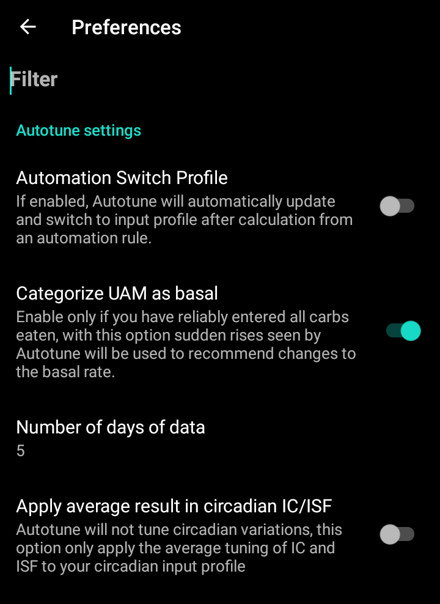

# Autotune插件使用说明（仅限开发者）

关于Autotune算法的文档可在[OpenAPS文档](https://openaps.readthedocs.io/en/latest/docs/Customize-Iterate/autotune.html)中查阅。

Autotune插件是OpenAPS自动调节算法在AAPS中的具体实现。

**目前，Autotune插件仅可在[开发分支（dev branch）](../AdvancedOptions/DevBranch.md)中通过工程模式（Engineering mode）使用。**

## Autotune用户界面

- 您可在配置文件下拉菜单中选择需要调整的输入配置文件（默认已选中当前生效的配置文件）。
  - 注意：每次选择新配置文件时，先前结果将被清除，且"调节天数"参数将重置为默认值。
- "调节天数"参数用于设定参与配置文件优化计算的历史数据天数。 该参数取值范围为1至30天（最小值1天，最大值30天）。 为确保获得准确、平滑的迭代计算结果，该数值不宜过小（建议每次计算至少使用7天以上数据）。
  - 注意：每次调整"调节天数"参数时，系统将自动清除历史优化结果。
- "最近执行"是一个可恢复您最后一次有效计算结果的链接功能。 若当日未启动Autotune功能，或因前述计算参数调整导致历史结果被清除，您可通过"最近执行"功能恢复最近一次成功运行的参数与结果。
- 警告信息将显示所选配置文件的相关参数（例如：当存在多个胰岛素敏感系数（ISF）或多个胰岛素碳水化合物比值（IC）时）。
  - 注意：Autotune算法计算时仅支持单一胰岛素碳水化合物比值（IC）与单一胰岛素敏感系数（ISF）参数。 当前尚无支持昼夜节律性胰岛素碳水化合物比值（circadian IC）或昼夜节律性胰岛素敏感系数（circadian ISF）调节的Autotune算法。 若您的输入配置文件包含多组参数值，系统将在警告区域显示用于配置文件调优的基准平均值。
- "检查输入配置文件"按钮将启动配置文件查看器，供您快速核验以下参数：胰岛素单位（Units）、胰岛素活性时长（DIA）、胰岛素碳水化合物比值（IC）、胰岛素敏感系数（ISF）、基础率（basal）及目标血糖范围（target）。
  - 注意：Autotune算法仅对以下参数进行优化调节：单一数值的胰岛素碳水化合物比值（IC），单一数值的胰岛素敏感系数（ISF），具有昼夜节律变化的基础率（basal）。 在输出配置文件中，胰岛素单位（Units）、胰岛素活性时长（DIA）及目标血糖范围（target）将保持原值不变。

- 点击"执行Autotune"将使用选定的配置文件及设定的调节天数（Tune days）参数启动Autotune算法计算。
  - 注意：Autotune算法计算过程可能耗时较长。 启动计算后，您可切换至其他界面（如主界面等），稍后返回Autotune插件查看计算结果。

- 运行过程中，系统将在下方实时显示中间计算结果。

  - 注意：运行期间所有设置将被锁定，您将无法再修改已选输入配置文件或调节天数参数。 若需使用其他参数启动新计算任务，您必须等待当前计算流程完成。

  

- 当Autotune算法计算完成后，界面将显示优化后的配置文件（Tuned profile）和底部四个功能按钮。

- 必须始终对比输入配置文件（"Profile"列）、优化输出配置文件（"Tuned"列）和各参数值的变化百分比（"%"列）。

- 对于基础率（basal rates）参数，系统还会显示"数据缺失天数"统计值。 当Autotune算法在特定时段（如餐后碳水化合物吸收期）缺乏足够被标记为"基础率（Basal）"的数据时，系统将记录为数据缺失天数（missing days），此类情况将影响该时段基础率的优化计算。 该数值应尽可能保持最低，特别是在基础率调节至关重要的时段（如夜间或傍晚后期）。

- 点击"对比配置文件"按钮将打开配置文件对比视图。 输入配置文件以蓝色标识，优化输出配置文件（标为"Tuned"）则以红色显示。

  - 注意：下例所示输入配置文件中的胰岛素碳水化合物比值（IC）与胰岛素敏感系数（ISF）均呈现昼夜节律变化，但经计算输出的优化配置文件将生成单一参数值。 If it's important for you to get a circadian output profile see [Circadian IC or ISF profile](#autotune-circadian-ic-or-isf-profile) below.

  

- 若优化结果可信（输入与输出配置文件间变化百分比偏低），您可依次点击"激活配置文件"按钮，再点击"确认"完成参数生效验证。

  - 激活优化配置文件（Activate Tuned profile）操作将自动在本地配置文件插件中创建名为"Tuned"的新配置文件。
  - 若本地配置文件插件中已存在名为"Tuned"的配置文件，系统将在激活前自动使用Autotune计算结果更新该配置文件。

  

- 若认为优化配置文件（Tuned profile）需进一步调整（例如某些参数变化幅度过大），您可点击"复制至本地配置文件"按钮进行手动修正。

  - 系统将在本地配置文件插件中创建一个带"Tuned"前缀且包含运行日期时间戳的新配置文件。

- 随后您可在本地配置文件中选定待编辑的优化配置文件（Tuned profile）——当您打开本地配置文件插件时，系统将默认选中该配置文件。

  - 本地配置文件中的数值将在用户界面中根据胰岛素泵功能进行舍入处理。

  

- 若需将Autotune优化结果替换当前输入配置文件，请点击"更新输入配置文件"按钮，在弹出窗口中点击"确认"完成验证

  - 注意：若您在点击"更新输入配置文件"后点击"激活配置文件"，系统将激活您更新后的配置文件（而非默认的"Tuned"配置文件）。

  

- 若您已更新输入配置文件，原"更新输入配置文件"按钮将替换为"恢复输入配置文件"按钮（参见下方截图说明）。 通过此方式，您可即时确认本地配置文件插件中的当前输入配置文件是否已包含最近一次运行的优化结果。 您还可通过此按钮恢复未包含Autotune优化结果的原始输入配置文件。

  

## Autotune设置

(autotune-plugin-settings)=

### Autotune插件设置

- Automation Switch Profile (default Off): see [Run Autotune with an automation rule](#autotune-run-autotune-with-an-automation-rule) below. 若将此设置切换为"开启"状态，系统将自动使用优化配置文件（Tuned profile）更新输入配置文件，并自动激活更新后的配置。
  - **警告：在随后数日内，您必须对未经修改即更新激活的优化配置文件（Tuned profile）进行持续验证，确保其确实能提升闭环系统运行效果。**

- 将未标记餐食（UAM）归类为基础率（默认开启）：本设置适用于使用AndroidAPS时未输入任何碳水化合物数据（完全UAM模式）的用户。 当设置为"关闭"时，系统将禁止将未标记餐食（UAM）归类为基础率。
  - 注意：若系统在一天内检测到至少1小时的碳水化合物吸收活动，则无论当前设置为"开启"或"关闭"，所有标记为"未标记餐食（UAM）"的数据都将被归类为基础率。
- 数据采集天数（默认5天）：您可通过此设置定义默认值范围。 每当在Autotune插件中选择新配置文件时，"优化天数"参数将自动重置为此默认值。
- Apply average result in circadian IC/ISF (default Off): see [Circadian IC or ISF profile](#autotune-circadian-ic-or-isf-profile) below.

### 其他设置

- Autotune算法还将通过最大自动灵敏度比率（Max autosens ratio）和最小自动灵敏度比率（Min autosens ratio）限制调整幅度。 您可通过 配置构建器 > 灵敏度检测插件 > 设置 > 高级设置 查看并调整这些参数值。

  

## 高级功能

(autotune-circadian-ic-or-isf-profile)=

### 昼夜节律IC或ISF配置文件

- 若您的配置文件中存在显著的胰岛素碳水化合物比值（IC）和/或胰岛素敏感系数（ISF）波动，且完全确信昼夜节律时间及变化参数的准确性，则可将"昼夜节律IC/ISF均值应用"功能设置为开启状态。

  - 请注意：Autotune计算将始终基于单一参数值执行，且该算法不会对昼夜节律波动进行优化调整。 本设置仅对您昼夜节律参数中的胰岛素碳水化合物比值（IC）和/或胰岛素敏感系数（ISF）应用计算得出的平均波动值。

- 请参见下方截图对比：左侧-禁用"平均波动应用"功能的优化配置文件（Tuned profile），右侧-启用"平均波动应用"功能的优化配置文件。

  

### 按周指定日期调校

- 若点击"运行天数"参数右侧带眼睛图标的复选框，即可显示日期选择界面。 您可指定每周参与Autotune计算的特定日期（如下图所示示例：已排除周六周日的"工作日"模式将不纳入计算范围）。
  - 若Autotune计算包含的天数少于"调校天数"设定值，您将在天数选择器右侧看到实际参与计算的天数（如下例所示：10天）。
  - 当前设置仅在剩余天数充足时方能获得理想效果（例如：若您仅为周末调校特定配置文件——仅选择周六周日时，建议将"调校天数"设为至少21或28天，以确保Autotune计算能包含6-8个有效数据日）。

- 在Autotune计算过程中，系统将实时显示计算进度（如下图所示示例："第3/10天部分调校结果"）。

  

(autotune-run-autotune-with-an-automation-rule)=

## 通过自动化规则运行Autotune

首要步骤是为Autotune自动化规则定义正确触发器：

注：有关如何设置自动化规则的更多信息，请参见[此处](../DailyLifeWithAaps/Automations.md)。

- 您应选择"循环时间触发器"：每日仅运行一次Autotune，该算法设计为每日执行（每次运行将自动顺延一天，且配置文件修改幅度应保持最小）。

  

- 建议初期在日间运行Autotune以便实时核查优化结果。 若需夜间运行Autotune，请将触发器时间设置为凌晨4点或更晚，以确保将当日数据纳入下次Autotune计算范围。

  

- 随后您可在操作列表中选择"运行Autotune"动作项。

  

- 随后您可选择"Autotune调参动作"来调整本次运行的参数配置。 默认参数配置包括"当前生效配置文件"（Active Profile），Autotune插件设置中定义的"调校天数"默认值，以及全选所有日期。

  

- 在使用数日后，若您完全信任Autotune计算结果且参数修改幅度较低，即可修改[Autotune设置](#autotune-plugin-settings)中的"自动化切换配置文件"功能为启用状态，系统将在计算后自动更新并激活优化后的配置文件。

注意：如需按周自动调校特定日期配置文件（例如分别为"周末"和"工作日"创建独立配置），请为每个配置文件创建独立规则，在触发器和Autotune动作中保持日期选择一致，将"调校天数"设为足够大的值（确保包含6-8个有效数据日），触发器时间必须设置在凌晨4点之后，等等……

- 请参见下方为"我的配置文件"设置的工作日调校规则示例：对"工作日"进行调校，选择14天作为"调校天数"（所以仅10天纳入Autotune计算范围）。

## 提示和技巧

Autotune算法依赖数据库中的历史数据进行计算，因此若您在新手机上刚安装AAPS系统，需等待数日积累足够天数的数据后，方可启动Autotune获取有效调校结果。

Autotune仅作为辅助工具，使用者需定期核验计算生成的配置文件是否符合临床预期。 若存在任何疑问，请修改Autotune设置（如调整计算天数等参数），或者将计算结果复制至本地配置文件，或者使用前手动调整配置文件参数。

务必手动运行Autotune多日以验证结果可靠性后，方可应用调校方案。​ 仅当您完全信任Autotune计算结果，且新旧配置文件间差异微小时，方可启用自动化功能（此前绝对不可启用）。​

- Autotune的适配性因人而异——**若对计算结果存疑，请停止使用**​

深入分析Autotune结果以理解（或尝试理解）其提出特定修改建议的原因，亦为关键所在。

- 您的配置文件可能出现整体强度调整（例如：基础率总量提升伴随胰岛素敏感系数(ISF)与碳水化合物系数(IC)数值下降的情况）。 该调整可能伴随连续数日的自动灵敏度校正值高于100%（需更积极干预）或低于100%（敏感性提升）的情况。
- Autotune算法可能建议调整基础率与胰岛素碳水化合物比值(IC)/胰岛素敏感系数(ISF)之间的平衡关系（例如：降低基础率并采用更积极的IC/ISF组合方案）。

我们建议在以下情况下禁用Autotune功能：

- 未完整记录碳水化合物摄入量
  - 若未输入低血糖后的碳水化合物校正量，Autotune将误判血糖异常升高，进而提前4小时增加基础率——这种调整可能与避免低血糖的需求完全相悖，夜间发生时风险尤甚。 因此，完整记录碳水化合物摄入量（特别是低血糖校正量）至关重要
- 当系统检测到日间频繁出现未标记餐食(UAM)时
  - 是否已完整记录所有碳水化合物摄入量并准确估算碳水值？​
  - 所有未标记餐食(UAM)时段（除非全天未摄入碳水且已禁用"UAM归为基础率"功能）都将被归类为基础率，这可能导致基础率被过度提升（远超实际需求）。​

- 碳水化合物吸收速率过缓：若大部分吸收过程依赖min_5m_carbimpact参数计算（可通过COB曲线顶端的橙色小圆点识别此类时段），可能导致COB计算错误并引发连锁性结果偏差。​
  - 运动期间生理敏感性增强：运动时胰岛素敏感性普遍提升且血糖波动趋缓，故运动中和运动后出现碳水化合物缓释时段属常见生理现象。​ 但若频繁出现非预期的碳水化合物缓释现象，则可能需要提高配置文件中的碳水化合物系数(IC)值，或者适当下调min_5m_carbimpact参数阈值。​
- 当出现"异常代谢日"时（例如：持续数小时的高血糖状态需大量胰岛素才能回落至目标范围，或传感器更换后出现长期血糖读数异常），需特别注意数据有效性。​ 若过去数周仅出现1-2个"异常日"，可手动在Autotune计算中禁用这些日期以排除影响，并务必**仔细核查结果可信度**​。
- 若参数修改幅度超出合理阈值
  - 建议增加计算天数以获得更平稳的调校结果