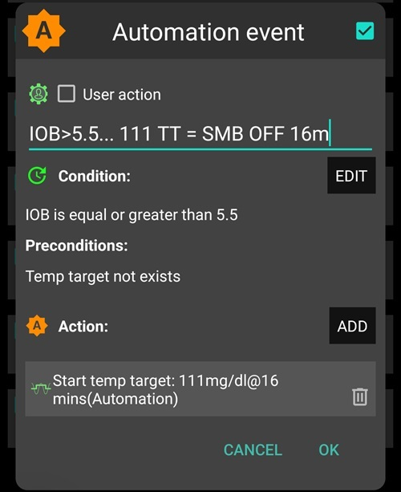

# 全闭环


全闭环系统（**FCL**）的主要优势在于其能够模拟人工胰腺功能，无需餐前注射大剂量胰岛素即可简化日常血糖管理。

虽然**混合闭环**（“HCL”）是基于算法的，但它仍然需要用户在餐前手动进行餐前大剂量注射。 因此，环路可能会进入临时关闭状态（临时零基础率）以防止胰岛素输送过多。

在**FCL**中，不再需要根据餐量推注胰岛素：将工作交给算法！  **AAPS** 可能允许用户不进行任何餐前大剂量注射，也不输入碳水化合物，这在一种称为“未声明膳食”（**‘UAM’**）的模式下进行。 **UAM** 通过更积极的方式，使 **AAPS** 能够更好地容忍不正确的碳水化合物输入。

## What to expect?

已有许多关于**FCL**积极效果的研究发表。 如需进一步阅读，请参阅以下内容：

1) 美国国家医学图书，PubMed[开源自动胰岛素输送系统AndroidAPS在全闭环场景中的首次应用：Pancreas4ALL随机试点研究](https://pubmed.ncbi.nlm.nih.gov/36826996/)；

2)美国国家医学图书馆，临床试验 [全闭环胰岛素输送系统Pancreas4ALL（ASAP）的可行性和安全性研究](https://www.clinicaltrials.gov/study/NCT04835350?term=Feasibility%20and%20Safety%20Study%20of%20the%20Automated%20Insulin%20Delivery%20Closed%20Loop%20System%20Pancreas4ALL%20(ASAP)&rank=1)

**FCL** 的成功需要用户：

- 检查他们是否满足 **FCL** 的先决条件；
- 设置适合日常管理需求的**自动化规则**；
- 微调**AAPS**设置（特别是**自动化规则**）。


## General considerations why (not to) move from HCL to FCL

**FCL**并不适合所有人：

- 部分**FCL**用户可实现TIR（70-180）约90%和HbA1c低于6%，但其他用户可能希望更严格控制。 值得注意的是，在食用快速碳水化合物的饮食中，将数值控制在 140 mg/dl 以下可能需要预先注射。
- **AAPS**调校具有挑战性。 它不适合那些对 AAPS 感到不知所措的用户。  您需要花费几周时间来调整和微调您的 **FCL**。 投入这些时间可以产生更好的结果和 **BG** 控制。
- 进餐管理可能更轻松，但**FCL**中的运动管理仍具挑战性。 多数人希望通过限制运动零食来控制体重。
- 为儿童建立 **FCL** 仍然存在困难（下文讨论）。


## Well-tuned hybrid closed loop

在考虑转向**FCL**前，建议先建立良好调校的**HCL**。  **FCL**成功需要高度个性化的设置调校，使**AAPS**能通过胰岛素输送精确模拟您成功的混合闭环模式。

**FCL**需要用户设置和调校**自动化规则**。 但用户必须充分理解自身胰岛素管理需求后才能开始**FCL**。 错误可能会被反向错误所掩盖， 导致**FCL**系统不稳定，后期难以纠正。 您应预期FCL的%TIR与当前**HCL**水平相当。

**FCL是通过分析用户成功的HCL数据和初始FCL体验，自行设置自动化规则的过程。**

## Fast insulin (Lyumjev, Fiasp)

**FCL**需要速效胰岛素。  这是为了在进餐相关**血糖**上升初期，**FCL**能通过常规定义（低于180 mg/dl（10 mmol/l））保持**血糖**在范围内。

一项建模研究（详情参见链接 FullLoop V2/March2023；其中第 2.2 节）可以定量地表明*更快的胰岛素*

来源：

 


IEEE Control Systems Magazine, ResearchGate [The Artificial Pancreas and Meal Control: An Overview of Postprandial Glucose Regulation in Type 1 Diabetes](https://www.researchgate.net/publication/322866519_The_Artificial_Pancreas_and_Meal_Control_An_Overview_of_Postprandial_Glucose_Regulation_in_Type_1_Diabetes);

- 与较慢的胰岛素相比，会导致 *BG** 峰值显著降低；
- 能容忍首次餐时推注延迟数分钟，同时不产生不可接受的高峰值；
- 最大限度地减少不同碳水化合物负荷（膳食大小）对 **BG** 峰值的影响。

除非用户采用非常温和至低碳水化合物饮食，否则使用Lyumjev或Fiasp以外的胰岛素，**FCL**可能难以有效。

然而，即使在优化了诸如针头长度之类的事情之后，Fiasp 或 Lyumjev 仍可能导致频繁的泵阻塞。 密切关注套管或储药器的时间非常重要。 许多用户发现 48 小时是胰岛素在导致套管/储药器故障之前的有效极限。

## Prerequisites

需要稳定的血糖值和蓝牙连接确保**AAPS**最佳性能，避免损失宝贵时间。 **FCL**需要24/7技术稳定系统：

- **CGM性能 您的CGM不应产生跳跃式**血糖**值，以免被**FCL**误判为进餐开始信号。 同样，**CGM** 校准可能会产生跳跃的结果。
- 任何 **CGM** 平滑的处理方式和位置，以及这对您的调整可能意味着什么。 特别是delta定义方式，以及AAPS是否识别为进餐开始信号。
- 泵和 CGM 泵的蓝牙稳定性；
- 避免（或至少及早识别）泵阻塞；
- 数据流和您手机上使用的应用程序以及传感器使用天数之间的差异；
- 保持所有**AAPS**组件充足电量并备有备用件；
- 始终及时更换管路（或敷贴）以降低堵塞风险；

以上内容会因您的 **AAPS** 组件系统和您的生活方式而异。

## Meal-related limitations

- 对饮食中不含快速影响**血糖**成分且每日餐型变化不大的用户，设置**FCL**可能更容易。 这并不一定意味着低碳水化合物。

- 高脂肪或高蛋白饮食，或慢消化/胃轻瘫，反而使**FCL**更容易实施，因为后期碳水化合物能很好覆盖推注胰岛素不可避免的"尾部"效应。

### 升糖指数与血糖影响

**UAM**模式的挑战随着"对血糖影响（EBG）"增加而增加：

- 从中/低EBG开始，调校**配置文件**设置。 然后"测试"高**EBG**餐食。
- 如果摄入极高**EBG**，考虑初始推注量<50%。

1) **无EBG**：如新鲜肉类、鱼类、鸡蛋、培根、油类、奶酪。 2) **低EBG**：如新鲜蔬菜和浆果、蘑菇、坚果、牛奶、酸奶、奶酪。 3) **中EBG**：如全麦面包/面条、土豆、野米、燕麦、干果。 4) **高EBG**：如小麦面包、法棍、吐司、华夫饼、饼干、土豆泥、面条、米饭。 5) **极高EBG**：如糖、甜饮、果汁、玉米片、糖果、薯片、咸脆棒。


对**FCL**最具挑战性的餐食是仅含极高和高**EBG**成分的食物（图中红色部分）：不仅**血糖**迅速飙升，且缺乏脂肪/蛋白质/纤维成分来平衡控制高血糖早期所需的胰岛素"尾部"效应。

随意摄入富含快速吸收碳水化合物的零食和甜饮会给**FCL**带来问题。


## Preparing for activity/sports

在使用泵或混合闭环进行锻炼或活动时，建议用户在锻炼前减少 **IOB**。

在**FCL**中，算法被调校为检测**UAM**并自动输送胰岛素对抗**血糖**上升。  应在任何活动开始前尽早设置较高的**临时目标**和较低的**配置文件百分比**（在用餐开始时左右已生效）。

异常或不定期的运动水平会给**FCL**带来困难。 锻炼需要提前计划（特别是如果您想减少运动期间低血糖时对急救碳水化合物/零食的需求）。 在活动一天后，建议在晚餐完全消化后为夜间设置较低的**百分比配置文件**：在**自动化**中设置一个升高（>100 mg/dl）的**BG** 目标，并在 ***AAPS*** 首选项中选择“在升高目标时不使用 **SMB**”。

## Hurdles for kids

**FCL** 可能给儿童带来额外的挑战，其中包括：

- Lyumjev 或 Fiasp 可能无法获得或耐受性不佳。
- 小时基础率可能极低，难以为大剂量**SMB**提供基础。
- 饮食可能富含甜食。 由于儿童身体通常血容量较低，因此很容易出现非常高的 **BG** 峰值。
- 生长激素和胰岛素敏感性显著变化使**FCL**难以准确调校。


## Enabling boosted SMBs: safety

在**HCL**中实施了关于闭环自动推注量的安全限制。

**FCL**用户不再需要在餐时给予大剂量推注。 这意味着必须放宽**SMB**量限制，使闭环能输送足够大的**SMB**。

如果使用**AAPS**主版本，建议**AAPS**偏好设置允许最大**SMB**量（maxUAMSMBBasalMinutes=120，即日间2小时基础量）。

如果基础率非常低，生成的**SMB**限制可能不足以控制餐后**血糖**上升。 一个解决方案是避免导致强烈**血糖**飙升的饮食，然后切换到提供新**SMB**输送参数的**AAPS**开发版：smb_max_range_extension。 这将使标准的最大 2 小时基础胰岛素量扩大 >1 倍。 （此外，默认的 50% **SMB** 输送率可能会在开发变体中提高） 。

**按照说明操作，使AAPS能够通过若干次超级微剂量（SMB）模拟您的餐前大剂量注射**。

定期检查 **SMB** 选项卡，查看您的 **SMB** 是否被允许足够大，以在用餐开始时提供循环所需的胰岛素。

否则，您的调校努力有时会白费！


```{admonition} Boosting **ISF** can become dangerous
:class: 危险

请密切观察/分析**超级微剂量(SMB)​**在餐后初期的给药量。 逐步调校，每次最多调整1-2个参数。

您的**AAPS**设置必须充分适应您的各种餐食。
```

## Meal detection/your Automations for boosting

**FCL**成功的关键调校参数是**ISF**。 当使用 **AAPS** Master + **自动化**时，**必须在识别到膳食时（通过葡萄糖增量）自动触发 > 100% 的配置文件更改**，并提供强化的 **ISF**。

**AAPS** Master 在 **HCL** p 模式下允许高达 130% 的临时**配置文件**。 提升 **ISF** 分 3 个步骤完成：

- 第1步 - 查看**配置文件**中当前餐时适用的**ISF**，例如Autosens是否建议考虑身体当前（过去几小时）胰岛素敏感性状态的调整。
- 第2步 - 应用系数（1/配置文件%，在**自动化规则**中设置）增强**ISF**。
- 步骤 3 - 检查建议的 **ISF** 是否在设定的安全限制范围内。

### FCL's Automation templates

顶部的复选框。 您可以选择：

- 在**自动化规则**列表中，可取消左侧复选框>停用该规则。 例如，您可以对所有与早餐相关的 **FCL** **自动化**执行此操作，以便在早餐时切换到 **HCL**。

- 对于每个**自动化**规则，您可以勾选用户操作框 =\> 那么当条件适用时，定义的操作将不会自动执行。 相反，当您的 **FCL** 会自动给出 **SMB** 时，**AAPS** 主屏幕会提醒您。 然后您有机会说“是”或“否”。 这在调校阶段非常有用。

该功能可用于某些场景，如早晨起床时"脚踏实地"综合征（血糖突然上升），但用户希望阻止全自动"早餐开始"响应。

下文指导如何组合**自动化规则**条件，以及如何处理**AAPS**需要增加/减少胰岛素输送的情况。 由于 **ISF** 不能直接调整，因此将**配置文件百分比**提高到 100% 以上将达到我们的目的。

### Automated big SMBs at bg rise

**FCL**成功的关键在于：**在餐后血糖开始上升时，闭环必须尽快给予非常大的自动SMB**"追赶"所需**IOB**（与您在**HCL**中对类似餐食的典型推注量比较！）

为实现这一目标，需分析来自您**混合闭环系统（HCL）**的数据，以区分可能与饮食无关或者相关的**血糖变化值（deltas）**。

- 由于您可以在预定义的时间窗口内定义**自动化**，因此您只需要在该时间窗口内进行分析。
- 如果餐型差异大（如高碳早餐、低碳午餐），可为不同时段设置不同**规则集**。
- 如果在夜间看到偶尔的跳变，请排除夜间
- 通常仅使用过去5分钟的delta足够。
- 也可使用平均delta。 通过比较规则条件中的delta，甚至可根据血糖上升加速度定义不同积极程度的操作。

> (delta - 短期平均delta)>n 可作为加速度检测项，在血糖上升最早迹象时触发首个**SMB**。 -                                                                             
> 注意：在CGM数据质量差或过度平滑时不适用！

数据不稳定的 **CGM** 会让用户处于不利地位，因为为了安全起见，您需要“保守”地定义哪个增量肯定是开始进餐的迹象。 这意味着：

- **FCL** 会损失额外的时间，导致更高的 **BG** 峰值和更低的 %**TIR**；
- 无法使用更早/更小的delta触发非进餐情况下的**SMB**（本应用于模拟**FCL**中的用户推注）。

此外，餐后首次血糖升高通常伴随着**低 IOB**。 基于此，晚餐的自动化规则（#1）可能如下：


自动化规则 #1

条件满足时，**AAPS**将在接下来12分钟内给予1-2次**SMB**，使用提升的**ISF**（示例中胰岛素需求提升30%）。 只要这些条件适用，**自动化**规则将再延长 12 分钟。 低碳餐可能有更慢的**血糖**上升特征， 它将受益于另一个在较低增量时启动并提供较弱胰岛素增强的自动化 (#2)。


一旦自动化#1中定义的急剧上升结束，同样的**自动化**可能也会在碳水化合物含量较高的膳食中启动。

您需要“分阶段”安排这两个（或许还有第三个）**自动化**，以适应您所见的膳食（种类）=> 设置适当的跳跃幅度、**iob** 标准和放大倍数将是一个需要反复调试的过程。  此外，如果您在条件中包含适当的时间段，您可以轻松地为不同的每日用餐时间（早餐、午餐、晚餐）设置不同的自动化。

注意，在上升阶段仍需阻止"溢出"的**IOB**，以免胰岛素后期效应（3-5小时后的"尾部"）超过闭环通过零基础率（减少低血糖风险）的制动能力。

对于大餐，**有时会出现第二次升高**。 此时IOB通常已下降，更积极的规则再次生效。 （检查自动化 #2 中的 iob 条件是否设置得太低而不会发生这种情况）。

在最初几次 **SMB** 给予后不久，就会出现一个**平衡阶段**，此时适度的胰岛素输送应该可以覆盖额外吸收的碳水化合物。 （低碳水化合物膳食除外，此时循环系统可能检测到**血糖**上升过弱，并立即进入零基础率）。

**AAPS**主屏幕（**UAM**全闭环下显示cob=0）在此阶段可能提示需要更多碳水。 在**UAM**模式下，这仅需简单合理性检查：这些碳水是否可能来自约1小时前进餐未吸收的部分？


### iob threshold

通常规则#1和/或#2使IOB升至足够高度。 个性化调校需查看**HCL**数据中管理良好餐食（通常是您的餐时推注）的最大IOB值，以及超过该值后出现低血糖（或需要额外碳水）的情况。

您应该降低循环系统激进程度的合理 **iob 阈值**，对于每顿饭可能不尽相同。 但尤其是在用餐开始后的第一个小时，这在 **UAM** 模式下至关重要。 它会因用户而异。 对于某些用户来说，每小时仅吸收约 30 克，并且可以定义一个与确切膳食无关的有意义的 **iob**。

对于特殊膳食，或者如果随后进行运动则降低该值，可以在您的**自动化**中快速设置不同的 **iob** 阈值。

规则(#3)"达到IOB阈值=>关闭SMB"用于终止（或暂停）积极**SMB**增强，直到新一波碳水相关上升出现。



自动化 #3

它告诉循环系统，当高于您设定的 **iob 阈值**时，最好不要再使用任何 **SMB**。

- 示例通过设置TT=111（任意选择>100的易识别值）实现
- 在**AAPS偏好设置/SMB**中，通常不允许在升高的目标下启用**SMB**）。                                                                                                                   
  所需胰岛素将不得不通过**TBR**的瓶颈更加谨慎地输注。

**注意：规则#3仅在无活动TT时有效**。 例如，如果您使用EatingSoonTT，必须在该时间结束（通常餐后30-40分钟）。

可通过设置**自动化规则**条件（如IOB>65%*IOB阈值）来终止可能运行的EatingSoonTT。
> 使用 EatingSoonTT 的方法 一些闭环使用者会在用餐开始前大约一小时或更长时间设置 EatingSoonTT（通过按下 TT 按钮，或者如果用餐时间段相当固定，则通过降低的**配置文件****BG** 目标自动设置），只是为了保证较低的起始 **BG** 和略微增加的 **iob**。 但是，假设 **FCL** 始终朝着目标前进，这可能不会产生太多效果，您可能更愿意定义一个**自动化**，在识别到用餐开始时（葡萄糖增量，或加速度 = 增量 > 平均增量）设置 EatingSoonTT。 在此阶段，较低的**临时目标（TT）**至关重要，因为闭环系统会通过（预测血糖值减去TT）/胰岛素敏感系数来计算每个**超级微剂量（SMB）**，因此较小的TT值会使最终所需的胰岛素剂量（insulinReq）增大。

在给予最初的增强型 **SMB** 后，您设置的 iobTH 和*自动化** #3 应该在限制葡萄糖峰值和餐后不导致低血糖之间取得良好平衡。

如果您的早餐碳水化合物含量与您的平均晚餐有很大差异，您可能会受益于定义适用于一天中相应时间的**自动化**，并具有不同的 **iobTH**（可能还有不同的增量和不同的**百分比配置文件**设置）。 您通过定义餐谱和设置（特别是IOB阈值）与闭环共同管理**血糖**曲线，必须接受某些峰值高度以减少DIA末期的低血糖风险。

### Stagnation at high bg values

若在享用丰盛餐食后，出现**高血糖（BG）**值长期停滞的情况，可启用**自动化**方案#6（左下方所示）——"餐后高血糖"模式，该方案专门应对脂肪酸抵抗现象：在食用多道菜正餐、大量油脂披萨或奶酪火锅晚餐后，血糖曲线可能呈现双峰形态，或更常见表现为长时间的高位平台期。


自动化 #4


自动化 #5

自动化#4“餐后高血糖”也适用于混合闭环。

此外，还需要一个终止自动化 #5，“停止 pmH”，以便在血糖值下降时降低胰岛素给药的激进程度。 （但闭环通常因预测血糖走低而限制更多胰岛素）。

## Hypo prevention

核心问题是**UAM** **FCL**（无碳水输入）无法知道还有多少克碳水待吸收，可能用完"尾部"胰岛素导致低血糖。

**FCL**通过使用增强**SMB**"追赶"餐时推注。 但是，**在胰岛素作用的“尾效”阶段，低血糖预防可能成为一个严重的问题**。

准备**FCL**时，用户需仔细查看典型餐食的**IOB时程**，判断何时过量，以及如何通过调校规则解决。 这是可能的，因为我们有好几个可调节项。 要正确设置可能是一个挑战。

通常为单一餐型优化设置没有意义。 当获得对某常见午餐的良好设置后，需测试其对其他餐型的适用性，进行"折衷"。

为了防止餐后 3-5 小时发生低血糖，在 iob 聚集过多之前降低激进程度。 具体方法：

- 在血糖升高期间即开始逐渐减缓**ISF**，如提供的自动化示例#1和#2所示。
- 定义使**AAPS**明显更谨慎的IOB阈值（规则#3）。 需注意：在生效前最后一次**SMB**可能使**IOB**超出此值；若闭环系统检测到胰岛素需求，临时基础率（TBRs）会进一步增加该值。碳水化合物吸收过程将产生降低胰岛素在体量的反向作用。
- IOB阈值可根据餐次进行差异化设置：通过克隆自动化规则，可轻松为早餐、午餐和晚餐时段分别设定不同阈值（甚至可根据地理位置差异，如公司食堂或岳母家等场景进行个性化配置）。
> 可在此时段内进一步细分：通过为低碳水化合物与快速碳水化合物等不同类型餐食设定不同临时目标（TTs），从而预置该时段可能出现的不同餐类配置，并通过专门调校的**自动化规则**进行调用。 除非饮食习惯差异大，否则可能无需此操作。

在进行特殊饮食挑战前，您可直接通过AAPS主界面（左上角汉堡菜单或**自动化规则**标签页，具体取决于您的**AAPS**配置），在5秒内提升**胰岛素在体量**阈值或修改任意自动化规则参数。

餐后低血糖风险本质是餐食成分是否使对抗主要碳水的胰岛素"尾部"能被"延伸碳水"（过量/延迟吸收的碳水/蛋白质/脂肪/纤维）消耗。

随时间推移，您将学习模式、调校规则——甚至调整饮食习惯，例如偶尔享用帮助维持胰岛素活性和碳水吸收平衡的后期小零食，使闭环（和您自己）更轻松。

### Order of programmed Automations

当**自动化规则**中存在定义重叠时，可能引发系统逻辑冲突。 示例：当Δ值>8mmol/L同时满足Δ值>5mmol/L时（即两条相互冲突的**自动化规则**同时被触发），闭环系统将如何执行？ 闭环系统始终依据**自动化规则**在汉堡菜单/AAPS主界面中的显示顺序执行决策。  示例：必须将Δ值>+8mmol/L的规则置于首位（当所有条件满足时触发最强调节），随后再检查Δ值>5mmol/L的情况（并执行较温和的响应）。 若顺序颠倒，Δ值>8mmol/L的规则将永远无法生效——因为系统会优先执行已适用的Δ值>5mmol/L规则并终止判断流程。
> 自动化提示：顺序更改非常容易。 在**AAPS/自动化**界面中，长按列表条目即可将指定的**自动化规则**重新排序至其他位置。

在AAPS智能手机上，您还能随时快速调整任何条件或操作，只需数秒即可完成——比如当您要参加特殊饮食活动时。 但需记得次日恢复设置。

## 故障排除

### How to get back into Hybrid Closed Loop

您可取消勾选**自动化规则**中与**FCL**相关的顶部复选框，即可恢复餐时大剂量注射功能并重新启用碳水化合物输入。 您可能需要进入**AAPS**的偏好设置/概览/按钮选项，为主屏幕重新启用"胰岛素"、"计算器"等按钮功能。 请注意：现在又需要您自行注射餐前大剂量胰岛素了。

建议仅在已完整定义并启用**自动化规则**的餐次（时段）采用**全闭环模式（FCL）**，而其他需要**混合闭环模式（HCL）**的餐次（或过渡期尚未定义规则的时段），则取消勾选相应配置。

例如：当晚餐时段的**自动化规则**配置完成后，您完全可以仅对晚餐启用**全闭环模式(FCL)**，而早餐和午餐仍保持您惯用的**混合闭环模式(HCL)**，无需任何额外操作步骤。


### Are the pre-conditions for FCL still given?

- 基本**配置文件**是否仍然正确？
- **CGM**质量是否下降
- 参考先决条件（上文）

### Glucose goes too high

- 餐食未被及时识别
    - 检查蓝牙稳定性
    - 检查您是否可以设置更小的增量来触发第一个 **SMB**
    - 建议进行以下餐前试验：在正式进餐前数分钟，可尝试饮用开胃酒或汤品（作为血糖波动测试）。
- SMB强度不足
    - 检查规则顺序（如大delta先于小delta）
    - 请在**SMB**标签页实时核查配置文件中的每小时基础率和设定分钟数（最长120分钟）是否限制了允许的SMB剂量上限
    - 请在**SMB**标签页实时核查当前基础率百分比参数，必要时需调高该数值。
- 若所有参数设置已达上限，您可能需要暂时接受血糖偏高的情况，或相应调整饮食方案。
> 如果你已准备好使用AAPS开发版本，也可以选用支持进一步扩大SMB剂量的变体。 部分用户还会在其"FCL"中使用少量预注射剂量。 然而，这种做法会影响血糖曲线的形态，进而干扰对血糖上升的检测以及触发的**SMB**效果，因此难以实施且难以带来显著的整体效益。
- 试点用户的一个重要观察是：血糖曲线与活性胰岛素(iob)曲线在进食初期的走向，对碳水摄入后的峰值高度影响极大： 若呈下降趋势（例如接近预设的"即将进食临时目标"EatingSoonTT），同时积累适量活性胰岛素，且曲线已呈现强劲的正向加速态势，将显著有助于压低血糖峰值。

### Glucose goes too low

- 误识别餐食
    - 检查您是否可以设置更大的增量来触发第一个 **SMB**
    - 点击相关自动化设置中的"用户操作"选项，这样未来您可临时决定阻止与用餐无关的自动化操作执行。
    - 为避免零食触发与正餐同等的**SMB**，加餐时请设置临时目标(TT)＞100（此操作同样适用于运动期间及预防性抗低血糖加餐场景）。
- SMB总体过量
    - 请在**超级微剂量(SMB)**标签页中实时检查是否需要缩小**SMB**剂量范围扩展设置。
    - 请实时在**超级微剂量(SMB)**标签页中检查是否需要调低**配置文件百分比(Percentage Profile)**的设置值。
    - SMB 输送率可能可以设置得更小。 请注意：在此情况下，该设置将全局生效，适用于所有时间段的**超级微剂量(SMB)**。
- 餐后胰岛素“拖尾”问题
    - 您可能需要吃点零食（看到低血糖预测）或葡萄糖片（如果已经处于低血糖区）。 但需注意：闭环系统在某个时间点提示您所需的碳水化合物量很可能被高估，因为系统完全无法获取您的实际碳水摄入数据（尽管您可能自行估算包括脂肪和蛋白质在内的待吸收营养总量）。
    - 关键信息在于：问题是否主要源于血糖上升阶段初期。 那么，将胰岛素活性阈值（iobTH）设低可能是个简单的解决方案。
    - 若频繁需要额外补充碳水化合物，请记录所需克数（不包括因过量摄入而需再次追加胰岛素的部分）。  随后，根据您的胰岛素敏感系数（IC值）估算**超级微剂量（SMB）**应减少的胰岛素量，并将该数据用于参数调整（涉及**自动化**中的**百分比配置文件**，或可能包括您设定的胰岛素活性阈值iobTH）。 这可能与高血糖期间给予的**SMB**有关，或需进一步考量**血糖**上升阶段的**SMB**设置。
    - 这可能意味着您需要接受更高的**血糖**峰值以避免低血糖。 或者调整饮食结构——减少碳水化合物摄入，同时增加蛋白质和脂肪的比例。


### More info

建议保持与其他**FCL**用户交流。

讨论利用自动化技术实现全闭环：

- 英语：[Discord 频道](https://discord.gg/ChXj8BaKwA)

- 德语：[德国 Looper 社区](https://de.loopercommunity.org/t/ueber-die-kategorie-full-loop/10107)
