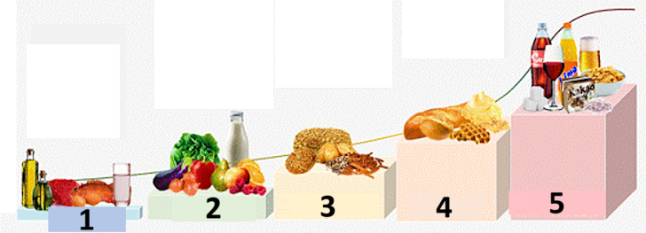

# 全闭环


全闭环（**FCL**）的主要吸引力在于它有潜力模拟人工胰腺，使日常管理更轻松，无需为进餐推注胰岛素。

虽然**混合闭环**（“HCL”）是基于算法的，但它仍然需要用户在餐前手动进行餐前大剂量注射。 因此，环路可能会进入临时关闭状态（临时零基础率）以防止胰岛素输送过多。

在**FCL**中，不再需要根据餐量推注胰岛素：将工作交给算法！  **AAPS** 可能允许用户不进行任何餐前大剂量注射，也不输入碳水化合物，这在一种称为“未声明膳食”（**‘UAM’**）的模式下进行。 **UAM** 通过更积极的方式，使 **AAPS** 能够更好地容忍不正确的碳水化合物输入。

### 期望什么？

已有许多关于**FCL**积极效果的研究发表。 如需进一步阅读，请参阅以下内容：

1) 美国国家医学图书，PubMed[开源自动胰岛素输送系统AndroidAPS在全闭环场景中的首次应用：Pancreas4ALL随机试点研究](https://pubmed.ncbi.nlm.nih.gov/36826996/)；

2)美国国家医学图书馆，临床试验 [全闭环胰岛素输送系统Pancreas4ALL（ASAP）的可行性和安全性研究](https://www.clinicaltrials.gov/study/NCT04835350?term=Feasibility%20and%20Safety%20Study%20of%20the%20Automated%20Insulin%20Delivery%20Closed%20Loop%20System%20Pancreas4ALL%20(ASAP)&rank=1)

**FCL** 的成功需要用户：

- 检查他们是否满足 **FCL** 的先决条件；
- 设置适合日常管理需求的**自动化规则**；
- 微调**AAPS**设置（特别是**自动化规则**）。


### 从HCL转向FCL的总体考量

**FCL**并不适合所有人：

- 部分**FCL**用户可实现TIR（70-180）约90%和HbA1c低于6%，但其他用户可能希望更严格控制。 值得注意的是，在食用快速碳水化合物的饮食中，将数值控制在 140 mg/dl 以下可能需要预先注射。
- **AAPS**调校具有挑战性。 它不适合那些对 AAPS 感到不知所措的用户。  您需要花费几周时间来调整和微调您的 **FCL**。 投入这些时间可以产生更好的结果和 **BG** 控制。
- 进餐管理可能更轻松，但**FCL**中的运动管理仍具挑战性。 多数人希望通过限制运动零食来控制体重。
- 为儿童建立 **FCL** 仍然存在困难（下文讨论）。


### 良好调校的混合闭环

在考虑转向**FCL**前，建议先建立良好调校的**HCL**。  **FCL**成功需要高度个性化的设置调校，使**AAPS**能通过胰岛素输送精确模拟您成功的混合闭环模式。

**FCL**需要用户设置和调校**自动化规则**。 但用户必须充分理解自身胰岛素管理需求后才能开始**FCL**。 错误可能会被反向错误所掩盖， 导致**FCL**系统不稳定，后期难以纠正。 您应预期FCL的%TIR与当前**HCL**水平相当。

**FCL是通过分析用户成功的HCL数据和初始FCL体验，自行设置自动化规则的过程。**

### 速效胰岛素 (Lyumjev, Fiasp)

**FCL**需要速效胰岛素。  这是为了在进餐相关**血糖**上升初期，**FCL**能通过常规定义（低于180 mg/dl（10 mmol/l））保持**血糖**在范围内。

一项建模研究（详情参见链接 FullLoop V2/March2023；其中第 2.2 节）可以定量地表明*更快的胰岛素*

来源：

 


IEEE Control Systems Magazine, ResearchGate [The Artificial Pancreas and Meal Control: An Overview of Postprandial Glucose Regulation in Type 1 Diabetes](https://www.researchgate.net/publication/322866519_The_Artificial_Pancreas_and_Meal_Control_An_Overview_of_Postprandial_Glucose_Regulation_in_Type_1_Diabetes);

- 与较慢的胰岛素相比，会导致 *BG** 峰值显著降低；
- 能容忍首次餐时推注延迟数分钟，同时不产生不可接受的高峰值；
- 最大限度地减少不同碳水化合物负荷（膳食大小）对 **BG** 峰值的影响。

除非用户采用非常温和至低碳水化合物饮食，否则使用Lyumjev或Fiasp以外的胰岛素，**FCL**可能难以有效。

然而，即使在优化了诸如针头长度之类的事情之后，Fiasp 或 Lyumjev 仍可能导致频繁的泵阻塞。 密切关注套管或储药器的时间非常重要。 许多用户发现 48 小时是胰岛素在导致套管/储药器故障之前的有效极限。

### 先决条件

需要稳定的血糖值和蓝牙连接确保**AAPS**最佳性能，避免损失宝贵时间。 **FCL**需要24/7技术稳定系统：

- **CGM性能 您的CGM不应产生跳跃式**血糖**值，以免被**FCL**误判为进餐开始信号。 同样，**CGM** 校准可能会产生跳跃的结果。
- 任何 **CGM** 平滑的处理方式和位置，以及这对您的调整可能意味着什么。 特别是delta定义方式，以及AAPS是否识别为进餐开始信号。
- 泵和 CGM 泵的蓝牙稳定性；
- 避免（或至少及早识别）泵阻塞；
- 数据流和您手机上使用的应用程序以及传感器使用天数之间的差异；
- 保持所有**AAPS**组件充足电量并备有备用件；
- 始终及时更换管路（或敷贴）以降低堵塞风险；

以上内容会因您的 **AAPS** 组件系统和您的生活方式而异。

### 与膳食相关的限制

- 对饮食中不含快速影响**血糖**成分且每日餐型变化不大的用户，设置**FCL**可能更容易。 这并不一定意味着低碳水化合物。

- 高脂肪或高蛋白饮食，或慢消化/胃轻瘫，反而使**FCL**更容易实施，因为后期碳水化合物能很好覆盖推注胰岛素不可避免的"尾部"效应。

#### Glycemic index and effect on blood glucose

**UAM**模式的挑战随着"对血糖影响（EBG）"增加而增加：

- 从中/低EBG开始，调校**配置文件**设置。 然后"测试"高**EBG**餐食。
- 如果摄入极高**EBG**，考虑初始推注量<50%。

1) **无EBG**：如新鲜肉类、鱼类、鸡蛋、培根、油类、奶酪。 2) **低EBG**：如新鲜蔬菜和浆果、蘑菇、坚果、牛奶、酸奶、奶酪。 3) **中EBG**：如全麦面包/面条、土豆、野米、燕麦、干果。 4) **高EBG**：如小麦面包、法棍、吐司、华夫饼、饼干、土豆泥、面条、米饭。 5) **极高EBG**：如糖、甜饮、果汁、玉米片、糖果、薯片、咸脆棒。



对**FCL**最具挑战性的餐食是仅含极高和高**EBG**成分的食物（图中红色部分）：不仅**血糖**迅速飙升，且缺乏脂肪/蛋白质/纤维成分来平衡控制高血糖早期所需的胰岛素"尾部"效应。

随意摄入富含快速吸收碳水化合物的零食和甜饮会给**FCL**带来问题。


#### 为活动/运动做准备

在使用泵或混合闭环进行锻炼或活动时，建议用户在锻炼前减少 **IOB**。

在**FCL**中，算法被调校为检测**UAM**并自动输送胰岛素对抗**血糖**上升。  应在任何活动开始前尽早设置较高的**临时目标**和较低的**配置文件百分比**（在用餐开始时左右已生效）。

异常或不定期的运动水平会给**FCL**带来困难。 锻炼需要提前计划（特别是如果您想减少运动期间低血糖时对急救碳水化合物/零食的需求）。 在活动一天后，建议在晚餐完全消化后为夜间设置较低的**百分比配置文件**：在**自动化**中设置一个升高（>100 mg/dl）的**BG** 目标，并在 ***AAPS*** 首选项中选择“在升高目标时不使用 **SMB**”。

#### 孩子们的障碍

**FCL** 可能给儿童带来额外的挑战，其中包括：

- Lyumjev 或 Fiasp 可能无法获得或耐受性不佳。
- 小时基础率可能极低，难以为大剂量**SMB**提供基础。
- 饮食可能富含甜食。 由于儿童身体通常血容量较低，因此很容易出现非常高的 **BG** 峰值。
- 生长激素和胰岛素敏感性显著变化使**FCL**难以准确调校。


## 启用增强型 SMB：安全性

在**HCL**中实施了关于闭环自动推注量的安全限制。

**FCL**用户不再需要在餐时给予大剂量推注。 这意味着必须放宽**SMB**量限制，使闭环能输送足够大的**SMB**。

如果使用**AAPS**主版本，建议**AAPS**偏好设置允许最大**SMB**量（maxUAMSMBBasalMinutes=120，即日间2小时基础量）。

如果基础率非常低，生成的**SMB**限制可能不足以控制餐后**血糖**上升。 一个解决方案是避免导致强烈**血糖**飙升的饮食，然后切换到提供新**SMB**输送参数的**AAPS**开发版：smb_max_range_extension。 这将使标准的最大 2 小时基础胰岛素量扩大 >1 倍。 （此外，默认的 50% **SMB** 输送率可能会在开发变体中提高） 。

**按照说明使AAPS通过若干SMB模拟您的推注**。

定期检查 **SMB** 选项卡，查看您的 **SMB** 是否被允许足够大，以在用餐开始时提供循环所需的胰岛素。

否则，您的调校努力有时会白费！


```{admonition} Boosting **ISF** can become dangerous
:class: danger

密切观察/分析餐后**SMB**量。 逐步调校，每次最多调整1-2个参数。

您的**AAPS**设置必须充分适应您的各种餐食。
```

## 进餐检测/您的增强自动化规则

**FCL**成功的关键调校参数是**ISF**。 当使用 **AAPS** Master + **自动化**时，**必须在识别到膳食时（通过葡萄糖增量）自动触发 > 100% 的配置文件更改**，并提供强化的 **ISF**。

**AAPS** Master 在 **HCL** p 模式下允许高达 130% 的临时**配置文件**。 提升 **ISF** 分 3 个步骤完成：

- 第1步 - 查看**配置文件**中当前餐时适用的**ISF**，例如Autosens是否建议考虑身体当前（过去几小时）胰岛素敏感性状态的调整。
- 第2步 - 应用系数（1/配置文件%，在**自动化规则**中设置）增强**ISF**。
- 步骤 3 - 检查建议的 **ISF** 是否在设定的安全限制范围内。

### FCL 的自动化模板

顶部的复选框。 您可以选择：

- 在**自动化规则**列表中，可取消左侧复选框>停用该规则。 例如，您可以对所有与早餐相关的 **FCL** **自动化**执行此操作，以便在早餐时切换到 **HCL**。

- 对于每个**自动化**规则，您可以勾选用户操作框 =\> 那么当条件适用时，定义的操作将不会自动执行。 相反，当您的 **FCL** 会自动给出 **SMB** 时，**AAPS** 主屏幕会提醒您。 然后您有机会说“是”或“否”。 这在调校阶段非常有用。

该功能可用于某些场景，如早晨起床时"脚踏实地"综合征（血糖突然上升），但用户希望阻止全自动"早餐开始"响应。

下文指导如何组合**自动化规则**条件，以及如何处理**AAPS**需要增加/减少胰岛素输送的情况。 由于 **ISF** 不能直接调整，因此将**配置文件百分比**提高到 100% 以上将达到我们的目的。

### 在血糖上升时自动进行大剂量SMB。

**FCL**成功的关键在于：**在餐后血糖开始上升时，闭环必须尽快给予非常大的自动SMB**"追赶"所需**IOB**（与您在**HCL**中对类似餐食的典型推注量比较！）

为此，需分析**HCL**数据以确定哪些变化率（delta）可能与进餐无关，哪些相关。

- 由于您可以在预定义的时间窗口内定义**自动化**，因此您只需要在该时间窗口内进行分析。
- 如果餐型差异大（如高碳早餐、低碳午餐），可为不同时段设置不同**规则集**。
- 如果在夜间看到偶尔的跳变，请排除夜间
- 通常仅使用过去5分钟的delta足够。
- 也可使用平均delta。 通过比较规则条件中的delta，甚至可根据血糖上升加速度定义不同积极程度的操作。

> (delta - 短期平均delta)>n 可作为加速度检测项，在血糖上升最早迹象时触发首个**SMB**。 -                                                                             
> 注意：在CGM数据质量差或过度平滑时不适用！

数据不稳定的 **CGM** 会让用户处于不利地位，因为为了安全起见，您需要“保守”地定义哪个增量肯定是开始进餐的迹象。 这意味着：

- **FCL** 会损失额外的时间，导致更高的 **BG** 峰值和更低的 %**TIR**；
- 无法使用更早/更小的delta触发非进餐情况下的**SMB**（本应用于模拟**FCL**中的用户推注）。

此外，餐后首次血糖升高通常伴随着**低 IOB**。 基于此，晚餐的自动化规则（#1）可能如下：


自动化规则 #1

条件满足时，**AAPS**将在接下来12分钟内给予1-2次**SMB**，使用提升的**ISF**（示例中胰岛素需求提升30%）。 只要这些条件适用，**自动化**规则将再延长 12 分钟。 低碳餐可能有更慢的**血糖**上升特征， 它将受益于另一个在较低增量时启动并提供较弱胰岛素增强的自动化 (#2)。


一旦自动化#1中定义的急剧上升结束，同样的**自动化**可能也会在碳水化合物含量较高的膳食中启动。

您需要“分阶段”安排这两个（或许还有第三个）**自动化**，以适应您所见的膳食（种类）=> 设置适当的跳跃幅度、**iob** 标准和放大倍数将是一个需要反复调试的过程。  此外，如果您在条件中包含适当的时间段，您可以轻松地为不同的每日用餐时间（早餐、午餐、晚餐）设置不同的自动化。

注意，在上升阶段仍需阻止"溢出"的**IOB**，以免胰岛素后期效应（3-5小时后的"尾部"）超过闭环通过零基础率（减少低血糖风险）的制动能力。

对于大餐，**有时会出现第二次升高**。 此时IOB通常已下降，更积极的规则再次生效。 （检查自动化 #2 中的 iob 条件是否设置得太低而不会发生这种情况）。

在最初几次 **SMB** 给予后不久，就会出现一个**平衡阶段**，此时适度的胰岛素输送应该可以覆盖额外吸收的碳水化合物。 （低碳水化合物膳食除外，此时循环系统可能检测到**血糖**上升过弱，并立即进入零基础率）。

**AAPS**主屏幕（**UAM**全闭环下显示cob=0）在此阶段可能提示需要更多碳水。 在**UAM**模式下，这仅需简单合理性检查：这些碳水是否可能来自约1小时前进餐未吸收的部分？


### iob 阈值

通常规则#1和/或#2使IOB升至足够高度。 个性化调校需查看**HCL**数据中管理良好餐食（通常是您的餐时推注）的最大IOB值，以及超过该值后出现低血糖（或需要额外碳水）的情况。

您应该降低循环系统激进程度的合理 **iob 阈值**，对于每顿饭可能不尽相同。 但尤其是在用餐开始后的第一个小时，这在 **UAM** 模式下至关重要。 它会因用户而异。 对于某些用户来说，每小时仅吸收约 30 克，并且可以定义一个与确切膳食无关的有意义的 **iob**。

对于特殊膳食，或者如果随后进行运动则降低该值，可以在您的**自动化**中快速设置不同的 **iob** 阈值。

规则(#3)"达到IOB阈值=>关闭SMB"用于终止（或暂停）积极**SMB**增强，直到新一波碳水相关上升出现。


自动化 #3

它告诉循环系统，当高于您设定的 **iob 阈值**时，最好不要再使用任何 **SMB**。

- 示例通过设置TT=111（任意选择>100的易识别值）实现
- 在**AAPS偏好设置/SMB**中，通常不允许在升高的目标下启用**SMB**）。                                                                                                                   
  所需胰岛素将不得不通过**TBR**的瓶颈更加谨慎地输注。

**注意：规则#3仅在无活动TT时有效**。 例如，如果您使用EatingSoonTT，必须在该时间结束（通常餐后30-40分钟）。

可通过设置**自动化规则**条件（如IOB>65%*IOB阈值）来终止可能运行的EatingSoonTT。
> 使用 EatingSoonTT 的方法 一些闭环使用者会在用餐开始前大约一小时或更长时间设置 EatingSoonTT（通过按下 TT 按钮，或者如果用餐时间段相当固定，则通过降低的**配置文件****BG** 目标自动设置），只是为了保证较低的起始 **BG** 和略微增加的 **iob**。 但是，假设 **FCL** 始终朝着目标前进，这可能不会产生太多效果，您可能更愿意定义一个**自动化**，在识别到用餐开始时（葡萄糖增量，或加速度 = 增量 > 平均增量）设置 EatingSoonTT。 低**TT**在此阶段很重要，因为任何**SMB**计算基于（预测血糖 - TT）/敏感系数，小TT会使胰岛素需求更大。

在给予最初的增强型 **SMB** 后，您设置的 iobTH 和*自动化** #3 应该在限制葡萄糖峰值和餐后不导致低血糖之间取得良好平衡。

如果您的早餐碳水化合物含量与您的平均晚餐有很大差异，您可能会受益于定义适用于一天中相应时间的**自动化**，并具有不同的 **iobTH**（可能还有不同的增量和不同的**百分比配置文件**设置）。 您通过定义餐谱和设置（特别是IOB阈值）与闭环共同管理**血糖**曲线，必须接受某些峰值高度以减少DIA末期的低血糖风险。

### 高血糖值的停滞状态

在"丰盛"餐后出现长期高血糖平台时，规则#6（下图左）"餐后高血糖"有助于应对脂肪酸抵抗：多道餐、油腻披萨、奶酪火锅后，血糖曲线可能形成双峰或长平台。


自动化 #4


自动化 #5

自动化#4“餐后高血糖”也适用于混合闭环。

In addition, a termination-Automation #5, “Stop pmH”, is needed, so that the aggressiveness of the insulin administration is reduced, as soon as the glucose value is falling. (However, often the loop will limit more insulin anyways for hypo prevention because predicted glucose runs low already).

### Hypo prevention

The core problem is that the **UAM** **FCL** (without carb inputs) can have **no idea how many g of carbs are still available** for absorption, and might use up that “tail” insulin, without you going into a hypo from it.

Using boosted **SMBs**, the **FCL** “caught up” with what we formerly did with a meal bolus. But, **at the “tail” end of insulin activity, hypo prevention can become a serious topic**.

In preparation for **FCL**, the user must take a closer look at the **time course of iob** for typical meals, and judge **when it becomes too much, and how you can catch that by tuning your Automations**. That is possible because we have several adjusting screws. It can be a challenge to get this right

Generally, it makes no sense to keep optimising settings for one kind of meal. Once you have a good-enough setting e.g. for one kind of lunch you frequently have, test how this works with other kinds, and how you would “compromise”.

In order to prevent hypo in post-meal hours 3 – 5, reduce the aggressiveness before too much iob comes together. Specific approaches:

- Become milder and milder with the **ISF** already during the glucose rise, as in Automation examples #1 and #2 given.
- Define the iob threshold, from which **AAPS** is made significantly more cautious (Automation #3, above). Note this **iob** can be exceeded, by the last **SMB** before it went into effect; and then further by TBRs if the loop sees insulinReq Carbs getting absorbed will provide a counter-movement towards lower iob.
- The iob threshold could be differentiated according to meals: By cloning the automations, you could easily differentiate for breakfast, lunch, and dinner time slots (or even for geo-locations, like company cafeteria, or at mother-in-law etc)
> You could differentiate within these time slots even further by setting different TTs for low carb vs. fast carb, etc., and thus be able to “code for” different meal classes that may occur at this time of day, and call them up with **Automations** specially tuned for them. This is probably not necessary, unless your diet habits do vary a lot.

Before a special meal challenge, you can raise your **iob** threshold, or make another change in any of your Automations within under 5 seconds, right from your AAPS main screen (burger top left; or **Automations** tab, depending how you configured your **AAPS**).

The hypo danger some hours after the meal is essentially a question of whether your meal composition was such, that the **insulin tails from fighting the bulk of carbs** will be **consumed by “extended carbs”** (excessive/delayed carb absorption/protein/fat/fibre).

Over time you will learn patterns, tune your Automations – maybe even adjust your eating habits a bit, e.g. just enjoy the occasional late little(!) snack that may help maintain a good **balance of insulin activity and carb absorption** for the **entire** meal (digestion, absorption) time, and thus make life for your loop (and for yourself) easier.

### Order of programmed Automations

Problems can arise with overlapping definitions in **Automations**. Example: The problem is that delta >8 is also delta >5, i.e. there may be two competing **Automations** What does the loop do then? It always decides according to the sequence in which your **Automations** appear when looking into the burger menu / AdAPS main screen.  Example: The delta > +8 rule must come first (and launch the strongest boost if all conditions apply); then comes the check for delta >5 (and a milder response). If done the other way round, the delta>8 rule would never come into effect because the delta>5 already applies, case closed.
> Tip for Automations: Order changes are very easy to make. Press on a list entry in **AAPS/Automations** and the user rearrange the **Automations** in question to another position.

Also it is very easy and quick to adjust any conditions or actions at any time, within seconds, just on your AAPS smartphone; for instance if you head into a very special eating event. (But don’t forget to set it back to normal on/for the next day).

## 故障排除

### How to get back into Hybrid Closed Loop

You can un-click the top boxes in the **Automations** related to your **FCL**, and go back to bolusing for meals and make carb inputs again. You may have to go to **AAPS** Preferences/Overview/Buttons and get your Buttons “Insulin, Calculator…” back for your **AAPS** main screen. Be aware that now it is again up to you to bolus for meals.

It may be wise to do **FCL** only for meals (time slots) where **Automations** are fully defined and clicked on, and un-click only those for the other meal times when you like to do **HCL** (or have none defined yet, in your transition period).

For instance, it is perfectly possible, without any extra steps after **Automations** for dinner time slots are defined, to do **FCL** only for dinners, while breakfast and lunch are done in a **HCL** as you are used to.


### Are the pre-conditions for FCL still given?

- Is the basic **Profile** still correct?
- Has the **CGM** quality deteriorated
- Refer to pre-requisites (above).

### Glucose goes too high

- Meals are not recognized asap
    - Check regarding Bluetooth (in)stability
    - Check whether you could set smaller deltas to trigger first **SMB**
    - Experiment with an aperetif, soup acouple of minutes before meal start
- SMBs are too weak
    - Check order of **Automations** (e.g.: big delta before small delta)
    - Check (real-time) in **SMB** tab whether hourly profile basal and set minutes (max 120) limit allowed SMB size
    - Check (real-time) in**SMB** tab whether %profile must  be set bigger
- If all your settings are at the limit, you may have to live with the temporary high, or adjust your diet.
> If you are ready to use AAPS dev variants, you could also employ one that allows further expanded SMB sizes. Some users also resort to using a small pre-bolus in their “FCL”. However, this interferes with how glucose curve and hence detection of rises and triggered **SMBs** behave, and is therefore not easy to implement with convincing overall benefit.
- An important observation by pilot users was, that how your glucose and iob curves approach meal start matters a lot regarding how you peak from carbs: Going down (e.g. towards a set EatingSoonTT), building some iob, and curving already towards strong positive acceleration seems very helpful to keep peaks low.

### Glucose goes too low

- Meals are falsely recognized
    - Check whether you could set bigger deltas to trigger first **SMB**
    - Click “User action” in the related Automation, so in the futurte you can ad hoc decide to block execution of the Automatiojn if not meal-related
    - To prevent snacks from triggering **SMBs** as for a meal, set a TT>100 when snacking (as you would do in sports and for anti-hypo snacks, anyways)
- SMBs deliver overall too much insulin
    - Check (real-time) in **SMB** tab whether **SMB** range extension must be set smaller
    - Check (real-time) in **SMB**tab whether **Percentage Profile** must  be set smaller
    - SMB delivery ratio probably can be set smaller. Note in this case, it works across the board for all **SMBs** (all time slots),
- Problems with insulin “tail” after meals
    - You may need to take a snack (seeing hypo prediction) or glucose tablets (if already in hypo zone). But note that the carbs required the loop might tell you at some point are very likely exaggerated as the loop has absolutely zero info on your carb intake (while you may be able to guess how much more, incl. from fats and proteins) is still waiting to be absorbed.
    - A valuable information would be whether the problem originates mostly in the bg rise phase already. Then setting a lower iobTH might be an easy remedy.
    - If the need for additional carbs happens frequently, note down how many grams were needed (not counting what you eventually took too much and required extra insulin again).  Then use your profile IC value to estimate how much insulin less the **SMB** should have delivered, and go with this info into your tuning (regarding the **Percentage Profile** in **Automations**, or maybe also your set iobTH). This may relate to the**SMBs** given when glucose was high, or also extending regarding also the **SMBs** during the **BG** rise.
    - It could well be that you simply have to accept higher **BG** peaks for not going low. Or change diet to something with lower amounts of carbs, and higher amount of proteien and fats.


### More info

Make sure you stay in touch with other **FCL** users.

Discussion Full Closed Loop using Automations:

- English:   [Discord Channel](https://discord.gg/ChXj8BaKwA)

- German:  [German Looper Community](https://de.loopercommunity.org/t/ueber-die-kategorie-full-loop/10107)
