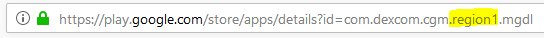

# Dexcom G5

## 如果使用Dexcom G5搭配xDrip+

-   您可以安全下载[最新APK（稳定版）](https://xdrip-plus-updates.appspot.com/stable/xdrip-plus-latest.apk)，除非您需要特定的新开发功能。
-   按照[这些说明](https://navid200.github.io/xDrip/docs/G5-Recommended-Settings.html)配置xDrip+与G5设备。
-   请按照[xDrip+设置页面](../CompatibleCgms/xDrip.md)配置xDrip+。
-   在[ConfigBuilder, BG Source](#Config-Builder-bg-source)中选择xDrip+。

## 如果使用经过修改的Dexcom应用程序搭配G5设备

```{admonition} Legacy apps
:class: warning
这些应用程序与最新的Android版本不兼容。  
```

-   从<https://github.com/dexcomapp/dexcomapp>下载APK文件，并选择适合您需求的版本（mg/dl或mmol/l版本，G5）。

    -   文件夹 2.4 适用于 AAPS 2.5 及更高版本的用户。
    -   在电脑上打开<https://play.google.com/store/search?q=dexcom%20g5>。 地区信息将在URL中显示。

    

-   如未完成，请强制停止并卸载原版Dexcom应用。

-   安装下载的 apk

-   启动传感器

- 在[ConfigBuilder, BG Source](#Config-Builder-bg-source)中选择Dexcom应用（修改版）。

-   若要通过本地广播使用xDrip+警报功能，请在xDrip+中操作：侧边栏菜单 > 设置 > 硬件数据源 > 选择640G/EverSense。
