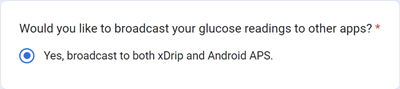

# Dexcom G6 和 ONE

## 先掌握基础

-   遵循[此处](../CompatibleCgms/GeneralCGMRecommendation.md)的一般CGM卫生和传感器设置建议。

## 使用G6和ONE闭环系统的一般提示

- 最近的发射器被称为"萤火虫"。 传感器必须在移除发射器后才能重启（发射器本身不可重置），且这些传感器不会生成原始数据。

- 如需重启传感器，请确保已准备好校准并密切监测数值波动。

- 对出厂校准的G6/ONE传感器进行预热可能导致检测结果出现波动。 若进行预热操作，为获得最佳效果，您很可能需要对传感器进行校准。

更多详情请阅读Tim Street发表在[http://www.diabettech.com](https://www.diabettech.com)上的[文章](https://www.diabettech.com/artificial-pancreas/diy-looping-and-cgm/)。

## 如使用G6或ONE搭配xDrip+

- 若您使用的是新款（萤火虫）发射器，预防性重启将被**忽略**。
- 若您使用的是改装发射器，则**无需**进行预防性重启。
-   若您使用的是旧款更换电池的发射器，最安全的做法是**禁用**[预防性重启](https://navid200.github.io/xDrip/docs/Preemptive-Restart.html)。 不过，这种情况下您必须让G6在非[原生模式](https://navid200.github.io/xDrip/docs/Native-Algorithm.html)下运行（不建议这样做，因为这会禁用出厂校准且不过滤噪声读数），否则传感器将在10天后停止工作。
-   Dexcom G6和ONE发射器可同时连接至Dexcom接收器（或替代使用的t:slim泵）及手机上的一个应用程序。
-   当使用xDrip+作为接收器时，请先卸载Dexcom应用程序。 **无法同时将xDrip+和Dexcom应用程序连接到发射器！**
-   如需使用Clarity并希望利用xDrip+的警报功能，请选用[BYODA](#DexcomG6-if-using-g6-with-build-your-own-dexcom-app)方案（仅限G6），并通过本地广播传输至xDrip+。
-   您也可以将xDrip+作为官方Dexcom应用的辅助程序使用，但可能会遇到血糖读数延迟的情况。
-   如尚未设置，请下载[xDrip+](https://github.com/NightscoutFoundation/xDrip)并按照[xDrip+设置页面](../CompatibleCgms/xDrip.md)的说明操作。
-   在[ConfigBuilder的BG数据源](#Config-Builder-bg-source)中选择xDrip+。

- 请根据[xDrip+设置页面](../CompatibleCgms/xDrip.md)调整xDrip+中的设置

(DexcomG6-if-using-g6-with-build-your-own-dexcom-app)=
## 如使用G6搭配自建Dexcom应用（BYODA）

-   [自建Dexcom应用](https://docs.google.com/forms/d/e/1FAIpQLScD76G0Y-BlL4tZljaFkjlwuqhT83QlFM5v6ZEfO7gCU98iJQ/viewform?fbzx=2196386787609383750)(BYODA)支持向AAPS和/或xDrip+进行本地广播传输（不适用于G5/ONE/G7传感器！）

-   此应用可让您在任意安卓智能手机上使用Dexcom G6。
-   若您先前使用过原版Dexcom应用或修改版Dexcom应用，请将其卸载（**切勿终止**当前正在运行的传感器）。
-   安装下载的 apk
-   在修改版应用中输入传感器代码和发射器序列号。
-   在手机设置中依次进入：应用 > Dexcom G6 > 权限 > 其他权限，然后点击"访问Dexcom应用"。
-   短时间内BYODA应能接收到发射器信号。

### AAPS 设置

-   在[ConfigBuilder的BG数据源](#Config-Builder-bg-source)中选择「Dexcom应用(修改版)」。

-   如未接收到任何数值，请先选择其他数据源，然后重新选择「Dexcom应用(修改版)」以触发权限请求，从而建立AAPS与BYODA广播之间的连接。

### xDrip+ 设置

-   选择“640G/Eversense”作为数据源。
-   必须在xDrip+中执行「启动传感器」指令才能接收数值。 此操作不会影响您当前由自建Dexcom应用控制的传感器。

(DexcomG6-troubleshooting-g6)=
## G6 和 ONE 故障排除

### Dexcom G6/ONE 特定故障排除

-   向下滚动到[此处](https://navid200.github.io/xDrip/docs/Dexcom_page.html)的 **故障排除**。

### 一般故障排除

CGM通用故障排除指南可[在此](#general-cgm-troubleshooting)查阅。

### 运行中的传感器搭配新发射器

如果在传感器运行期间更换发射器，可尝试在不损坏传感器底座的情况下移除发射器。 可以在[此处](https://navid200.github.io/xDrip/docs/Remove-transmitter.html)找到视频。 若选择采用[此替代方案](https://youtu.be/tx-kTsrkNUM)，则须谨慎操作，避免用撬片[损坏传感器触点](https://navid200.github.io/xDrip/docs/Petroleum-jelly-in-Dexcom-G6-Sensor.html)。
