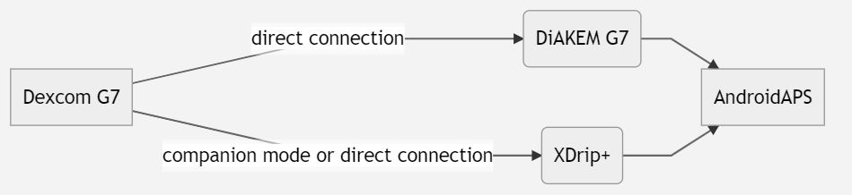

# Dexcom G7 和 ONE+


## 提前做好准备至关重要

值得注意的是，与G6相比，G7和ONE+系统无论在应用程序还是读取器中都不会对数值进行平滑处理。 更多详情请参见[此处](https://www.dexcom.com/en-us/faqs/why-does-past-cgm-data-look-different-from-past-data-on-receiver-and-follow-app)。



```{admonition} Smoothing method 
请参阅[Dexcom G7/ONE+/Stelo适用的平滑方法建议](../CompatibleCgms/SmoothingBloodGlucoseData.md)
```

## 1. xDrip+（直接连接到 G7 或 ONE+）

- 请按照此处的说明操作：[xDrip+ G7](https://navid200.github.io/xDrip/docs/Dexcom/G7.html)
- 在 [ConfigBuilder, BG Source](#Config-Builder-bg-source) 中选择 xDrip+。

- 请根据[xDrip+设置页面](../CompatibleCgms/xDrip.md)上的说明调整xDrip+设置

## 2.  修补版 Dexcom G7 应用程序 (DiaKEM)

**注意：需要 AAPS 3.2.0.0 或更高版本！ 不适用于 ONE+。**

### 安装新的修补版 (\!) G7 应用程序并启动传感器

修补版 Dexcom G7 应用程序 (DiaKEM) 可访问 Dexcom G7 数据。 这不是 BYODA 应用程序，因为此应用程序目前无法接收 G7 数据。

- 若您先前使用过原版Dexcom应用，请将其卸载（正在进行的传感器会话可继续使用——注意：卸载应用前请记录传感器代码！）

- 在[此处](https://github.com/authorgambel/g7/releases)下载并安装 patched.apk。

- 在修补的应用程序中输入传感器代码。

- 请遵循[此处](../CompatibleCgms/GeneralCGMRecommendation.md)所列的CGM卫生与传感器放置通用建议。

- 预热阶段结束后，数值将照常在G7应用程序中显示。

### AAPS 中的配置

- 在[ConfigBuilder的BG数据源](#Config-Builder-bg-source)中选择「BYODA」——即使您使用的并非BYODA应用！

- 若AAPS未接收到任何数值，请先切换至其他血糖数据源，然后重新选择「BYODA」以触发AAPS与BYODA之间的数据交换授权请求。

## 3. xDrip+（伴侣模式）

-   下载并安装 xDrip+：[xDrip](https://github.com/NightscoutFoundation/xDrip)
- 在xDrip+中必须选择"伴侣应用"作为数据源，并在高级设置 > 蓝牙设置中启用"伴侣蓝牙"功能。
-   在[ConfigBuilder的BG数据源](#Config-Builder-bg-source)中选择xDrip+。

-   请根据[xDrip+设置页面](../CompatibleCgms/xDrip.md)上的说明调整xDrip+设置

## 4. Juggluco

需要 9.0+ 版本

- 请禁用先前连接传感器的应用：卸载该应用或使用"强制停止"功能。 在应用设置中禁用"附近设备"权限。 限制应用程序的电池使用量。

- 在蓝牙设置中移除传感器：进入安卓设置，在已配对设备中找到该传感器并选择"忘记"。 Dexcom G7 传感器名称以 DXCM 开头。

- 避免其他传感器干扰：请将旧款Dexcom传感器移出蓝牙覆盖范围。

- 将G7传感器连接至Juggluco：打开Juggluco → 左侧菜单 → 照片选项。 扫描G7传感器注射器上的二维码。 请等待最多5分钟，让Juggluco查找传感器。

- 配对要求：需同意将传感器与Juggluco进行配对。 请确保配对过程中屏幕保持解锁状态。 若配对失败，请等待5分钟后再重试。

- 例外情况：Wear OS智能手表无需点击同意按钮即可完成绑定。
