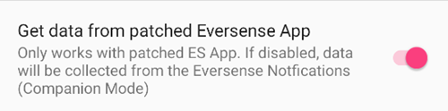

# Eversense 用户须知

获取Eversense读数有以下三种方法：

- ESEL 伴侣模式
- ESEL 修补模式
- xDrip+ 伴侣应用程序

## ESEL

请按照[说明](https://github.com/BernhardRo/Esel?tab=readme-ov-file#esel)获取并安装[ESEL应用](https://github.com/BernhardRo/Esel/tree/master/apk)。

- 启用“发送到 AAPS 和 xDrip”
- **禁用**“发送到 Nightscout”
- 由于来自 Eversense 的血糖数据可能存在噪点，建议在 ESEL 中启用“平滑数据”。


### 伴侣模式

从 Eversense 应用程序通知中读取数据（适用于自 ESEL 3.0.1 版本起提供的标准 Eversense 应用程序）。

1. 使用来自 Google Play 商店的官方 Eversense 应用程序
   - 可选，但回填需要：登录您的 Eversense 帐户
   - 在“同步”中，启用“自动同步”
2. ESEL 的配置：
   - 禁用设置“从修补的 Eversense 应用程序获取数据”
   - 如需数据回填：请启用"从eversensedms.com填充缺失数据"功能
   - 请输入您的Eversense登录邮箱地址和密码
3. 在[ConfigBuilder的BG数据源](#Config-Builder-bg-source)中将"MM640g"设为血糖数据源。

### 已破解的Eversense应用

 需要使用已破解版的Eversense应用（可完全离线运行，包括数据回填功能）。

1. 卸载Eversense应用（警告：您本地的历史数据（超过1周）将会丢失！）

2. 安装[破解版Eversense应用](https://cr4ck3d3v3r53n53.club)并按照供应商说明使用

   - 启动Eversense应用，登录后连接您的发射器，其使用方式与原版应用完全相同。

3. ESEL 的配置：

   - 启用"从破解版Eversense应用获取数据"设置




若您首次在全新安装的Eversense环境下运行ESEL，可能需要等待长达15分钟才能在xDrip中看到首批数据！

4. 在[ConfigBuilder的BG数据源](#Config-Builder-bg-source)中将"MM640g"设为血糖数据源。

## xDrip+

xDrip+ 可以像 ESEL 一样读取厂商应用的通知。 没有回填功能。

- 下载并安装 xDrip+：[xDrip](https://github.com/NightscoutFoundation/xDrip)
- 在xDrip+中必须选择"伴侣应用"作为数据源。
- 在[ConfigBuilder的BG数据源](#Config-Builder-bg-source)中选择xDrip+。
- 请按照[xDrip+设置页面](../CompatibleCgms/xDrip.md)的说明调整xDrip+参数。
- 在AAPS中启用[指数平滑功能](../CompatibleCgms/SmoothingBloodGlucoseData.md)。

```{warning}
血糖值读取频率并非始终为5分钟，且可能出现重复数据。
```