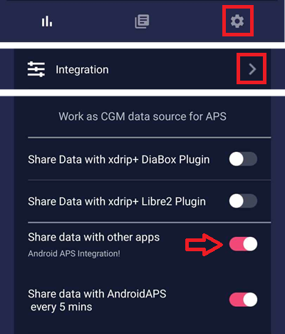

# Freestyle Libre 1

若要将Libre用作CGM设备实现每5分钟自动获取血糖值（无需手动扫描传感器），需购买NFC转蓝牙桥接器（市售设备，基于已停用的[LimiTTer](https://github.com/JoernL/LimiTTer)项目）。

```{admonition} Libre 2, Libre 1 US and Libre Pro
:class: warning
请确认您选用的桥接器及应用程序与传感器兼容。  
```

Some bridges are still available on the market:

-   [喵喵 Reader](https://www.miaomiao.cool/)（第1、2或3代）亦可通过全球速卖通购买。
-   [Bubble / Mini / Nano](https://www.bubblesmartreader.com/) from European vendors ([BubbleShop](https://bubbleshop.eu/)) or for Russian users [here](https://vk.com/saharmonitor/). 也可在 AliExpress 上找到。
-   俄罗斯用户的 Atom。

## 1. 使用 xDrip+

-   xDrip+ 支持 Miaomiao、Bubble、Blucon、Atom 和 LibreAlarm。
-   您可安全下载[最新稳定版APK](https://xdrip-plus-updates.appspot.com/stable/xdrip-plus-latest.apk)；若需最新功能，则应使用[每日快照版](https://github.com/NightscoutFoundation/xDrip/releases)。
-   请按照[xDrip+设置页面](../CompatibleCgms/xDrip.md)上的安装说明进行操作。
-    You also need OOP2 for Libre 1 US (and Libre 2 EU).
-   在[ConfigBuilder, BG Source](#Config-Builder-bg-source)中选择xDrip+。

## 2. 使用 Diabox

- Diabox 是 Bubble 的官方配套应用。
- 安装 [Diabox](https://t.me/s/DiaboxApp)。 在“设置”、“集成”中，启用“与其他应用程序共享数据”。



- 在[ConfigBuilder, BG Source](#Config-Builder-bg-source)中选择xDrip+。
