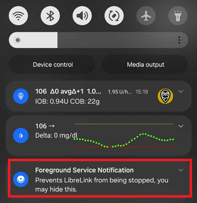
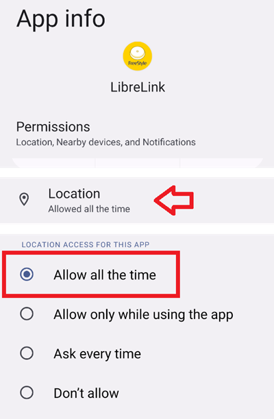
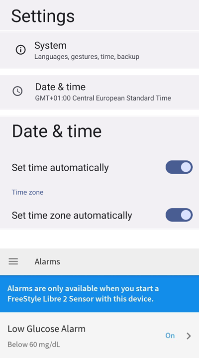
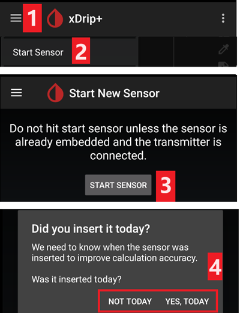
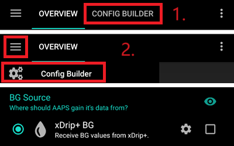
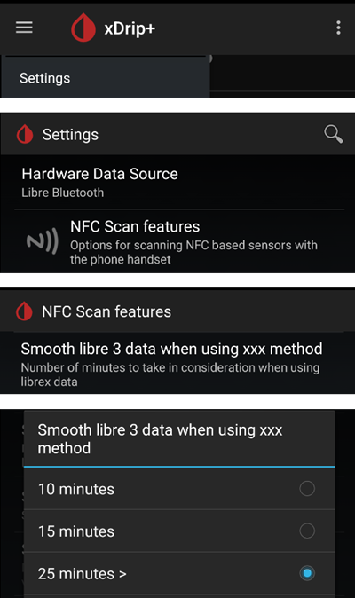
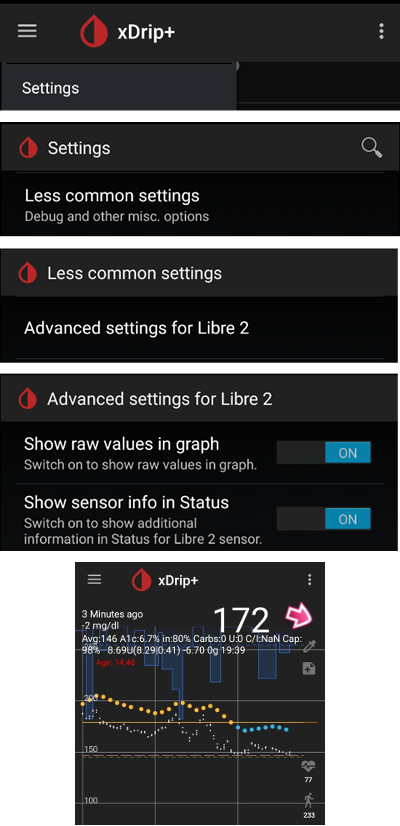
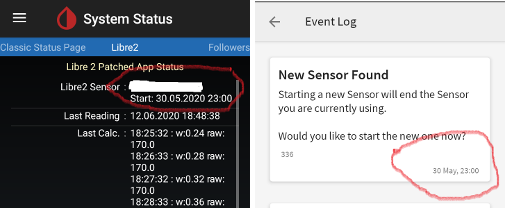
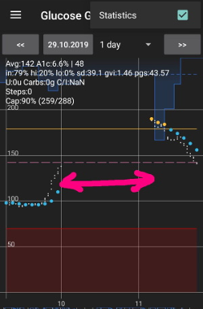

# Freestyle Libre 2 和 2+

FreeStyle Libre 2传感器现已成为真正的CGM设备，即使使用官方应用亦可实现。 然而，LibreLink仍无法向AAPS传输数据。 现有多种方案可实现其与AAPS的协同使用。

## 1. 使用蓝牙桥接器和 OOP

Bluetooth transmitters can be used with the Libre 2 (EU) or 2+ (EU) and an out of process algorithm app. 您可以像使用[Libre 1](./Libre1.md)一样，每5分钟接收一次血糖读数。

请确认您选用的桥接器及应用程序与传感器和xDrip+兼容（旧版Blucon及近期版本不可用，喵喵1需固件39版，喵喵2需固件7版）。

Libre2 OOP算法生成的血糖读数与原始读取器或LibreLink应用通过NFC扫描获取的结果完全一致。 AAPS系统配合Libre 2使用时，会进行10至25分钟的数据平滑处理，以避免跳点。 请参阅下方[数值平滑处理与原始数据](#libre2-value-smoothing-raw-values)部分。 OOP算法每5分钟生成一次读数，该数值为过去5分钟的平均值。 因此，血糖读数虽不够平滑，但与原始读取设备数据吻合，且能更快追踪"真实"血糖值变化。 若使用OOP算法进行闭环控制，请务必在xDrip+中启用所有平滑处理设置。

使用蓝牙发射器存在若干重要优势：

-   您可选择多种OOP2校准策略（1）：采用"无校准"模式直接使用读取器数值，或像Libre 1那样通过"基于原始值校准"模式处理传感器数据，亦可最终采用"基于血糖值校准"模式对读取器数值进行校准。  
  请确保禁用OOP1功能（2）。

    → 汉堡菜单 → 设置 → 较少使用的设置 → 其他杂项 选项


-   Libre 2 传感器可以像 Libre 1 一样使用 14.5 天
-   完全支持 8 小时回填

备注：该发射器可与LibreLink应用并行使用，且不会对其造成干扰。

## 2. 使用 xDrip+ 直接连接

```{admonition} Libre 2 EU only
:class: warning
xDrip+ 不支持直接连接到 Libre 2 US 和 AUS。
仅限 Libre 2 和 2+ **EU** 型号。
```

- Follow [these instructions](./Libre2MinimalL00per.md) to setup xDrip+ as the original documentation links to an obsolete OOP2  version.
- 请按照[xDrip+设置页面](../CompatibleCgms/xDrip.md)上的安装说明进行操作。

-   在[ConfigBuilder的BG数据源](#Config-Builder-bg-source)中选择xDrip+。

## 3. 使用 Diabox

- 安装[Diabox](https://www.bubblesmartreader.com/_files/ugd/6afd37_f183eabd4fbd44fcac4b1926a79b094f.pdf)。 在“设置”、“集成”中，启用“与其他应用程序共享数据”。


- 在[ConfigBuilder的BG数据源](#Config-Builder-bg-source)中选择xDrip+。

## 4. 使用 Juggluco

See [here](./Juggluco.md).

(libre2-patched-librelink-app-with-xdrip)=

## 5. 请使用经过修改的LibreLink应用配合xDrip+。

```{admonition} Libre 2 EU only
:class: warning
该修改版应用为旧版本（2019年4月22日），可能与新版Android系统不兼容。  
```

### 步骤 1：构建修补的应用程序

出于法律原因，"修改补丁"需由您自行完成。 请通过搜索引擎查找相应链接。 存在两种版本：推荐使用的原始修改版应用会拦截所有网络流量以避免追踪。 另一种变体支持 LibreView。

必须安装修改版应用以替代原版应用。 随后启动的传感器将通过蓝牙，将当前血糖值传输至您智能手机上运行的xDrip+应用。

重要提示：为避免潜在问题，建议先在支持NFC的智能手机上安装并卸载原版应用。 必须启用 NFC。 这不会消耗额外的电量。 然后安装修补的应用程序。

修改版应用可通过前台授权通知进行识别。 该前台授权服务相较于未采用此服务的原版应用，显著提升了连接稳定性。



其他识别特征可能包括：三点菜单中的Linux企鹅标志（路径：-> 信息），或修改版应用(2)与原版应用(1)不同的字体样式。 这些识别标准为可选项目，具体取决于您选择的应用程序来源。


请确保开启NFC功能，为修改版应用启用存储和定位权限，启用自动时区和时间设置，并在该应用中至少设置一个闹钟。

### 步骤 2：使用修补的应用程序启动传感器

现在只需扫描传感器，即可通过修改版应用启动Libre2传感器。 请确保已完成所有设置。

成功启动传感器的必备设置：

-   NFC 已启用 / 蓝牙已启用
-   内存和位置权限已启用
-   位置服务已启用
-   自动时间和时区设置
-   在修补的应用程序中设置至少一个闹钟

请注意：定位服务是一项核心设置。 这并非应用程序的定位权限设置——该权限也需另行配置！





一旦使用修改版应用启动传感器，将无法再将其连接至其他应用/手机。 若卸载修改版应用，将导致警报功能及持续血糖读数中断。

首次连接传感器的设置至关重要。 LibreLink应用会每隔30秒尝试与传感器建立无线连接。 如果缺少一个或多个强制性设置，则必须对其进行调整。 您可随时进行此操作，无时间限制。 传感器会持续尝试建立连接。 即使此过程持续数小时。 请保持耐心，在考虑更换传感器之前，先尝试不同的设置。

当LibreLink启动画面左上角出现红色感叹号（"!"）时， 表明连接未建立或其他设置阻碍了LibreLink的警报功能。 请检查是否已启用声音提示，并确保禁用所有可能拦截应用通知的功能。 当感叹号消失时，即表示连接已建立，血糖数据将传输至智能手机。 此过程最多应在5分钟内完成。


若感叹号持续存在或出现错误提示，可能由以下原因导致：

-   未授予 Android 位置服务 - 请在系统设置中启用它
-   未设置自动时间和时区 - 请相应地更改设置
-   激活闹钟 - 必须在 LibreLink 中激活三个闹钟中的至少一个
-   蓝牙已关闭 - 请打开
-   声音被阻止
-   应用程序通知被阻止
-   空闲屏幕通知被阻止

重新启动手机可能会有所帮助，您可能需要执行多次。 一旦连接建立，红色感叹号即会消失，此时已完成最关键步骤。 根据系统设置的不同，可能出现感叹号持续显示但仍能获取读数的情况。 这两种情况下均属正常现象。 传感器与手机现已连接，每分钟传输一次血糖数值。


在极少数情况下，清空蓝牙缓存和/或通过系统菜单重置所有网络连接可能有效。 此操作将移除所有已连接的蓝牙设备，可能有助于建立正常的蓝牙连接。 该操作安全可靠，因为已启动的传感器会被修改版LibreLink应用记录。 此处无需执行任何其他操作。 请静待修改版应用与传感器建立连接。

连接成功后，可根据需要调整智能手机设置。 虽然此操作不被推荐，但您可能出于省电考虑需要执行。 可关闭定位服务、将音量调至静音或再次禁用警报功能。 血糖数据仍会持续传输。

但请注意：启用新传感器时，所有设置需重新配置！

备注：修改版应用在预热完成后的首小时内，必须完成各项关键设置才能建立连接。 在14天运行周期内无需重复此类设置。 多数情况下，若传感器启动出现问题，往往是定位服务未开启所致。 安卓系统必须开启定位服务才能确保蓝牙正常连接(!)。 请参阅 Google 的 Android 文档。

在14天使用周期内，您可同时使用一部或多部支持NFC的智能手机（非扫描仪设备！）运行原版LibreLink应用进行NFC扫描。 启动此操作无时间限制。 例如，您可以在第5天左右使用另一部手机进行并行操作。 并行连接的手机可将血糖数据上传至雅培云端（LibreView）。 LibreView可为您的糖尿病管理团队生成报告。

请注意：原始修改版应用**完全不联网**，以避免追踪。

但存在修改版应用的一个变体版本，该版本支持LibreView并启用互联网访问功能。 请注意：启用此功能后，您的数据将传输至云端。 但此时内分泌团队的报告功能将获得完整支持。 使用该变体版本时，还可将运行中传感器的警报功能转移至其他未启动该传感器的设备。 请通过德国糖尿病相关论坛搜索具体操作方法。

### 步骤 3：安装和配置 xDrip+ 应用程序

血糖值由xDrip+应用程序在智能手机上接收。

-   您可安全下载[最新稳定版APK](https://xdrip-plus-updates.appspot.com/stable/xdrip-plus-latest.apk)；若需最新功能，则应使用[每日快照版](https://github.com/NightscoutFoundation/xDrip/releases)。
-   将xDrip+数据源设置为[修改版应用程序](#xdrip-libre2-patched-app)。
-   请按照[xDrip+设置页面](../CompatibleCgms/xDrip.md)上的安装说明进行操作。

### 步骤 4：启动传感器

- → 汉堡菜单 (1) → 启动传感器 (2) → 启动传感器 (3) → 回答“不是今天”(4)。



此操作不会实际启动任何Libre2传感器，也不会与其产生任何交互。 此设置仅用于向xDrip+表明有新传感器正在传输血糖数据。 若有条件，请输入两次指尖血测量值进行初始校准。 此时血糖值应每5分钟在xDrip+上显示一次。 若因距离手机过远导致数据遗漏，系统将不会补传这些缺失值。

更换传感器后，xDrip+将自动识别新传感器并删除所有校准数据。 激活后，您可检测血糖并进行新的初始校准。

### 步骤 5：配置 AAPS（仅用于闭环）

-   在AAPS中进入配置生成器 > 血糖数据源，勾选'xDrip+'选项。



-   若手机处于飞行模式时AAPS未接收到血糖数值，请按照[xDrip+设置页面](#xdrip-identify-receiver)所述使用"识别接收器"功能。

(Libre2-experiences-and-troubleshooting)=
### 经验和故障排除

#### 连接性

大多数手机连接性能良好，但华为手机除外。 若手机与传感器分置口袋两侧或在户外环境，连接可能中断。 请将手机佩戴在身体靠近传感器的一侧。 在室内环境中，蓝牙信号可通过反射传播，应无连接问题。 如遇连接问题，请尝试使用其他手机进行测试。 将传感器内置蓝牙天线朝下放置也可能改善连接。 安装传感器时，施敷器的凹槽必须朝下。

(libre2-value-smoothing-raw-values)=
#### 数值平滑和原始值

从技术上讲，当前血糖值每分钟都会传输至xDrip+。 默认情况下，加权平均滤波器会基于过去25分钟的数据计算平滑值。 您可通过NFC扫描功能菜单调整该时段参数。

→ 汉堡菜单 → 设置 → NFC 扫描功能 → 使用 xxx 方法时平滑 libre 3 数据



这对于闭环是强制性的。 曲线看起来平滑，闭环结果非常好。 触发警报的原始数值波动稍大，但与读取器显示数值完全一致。 此外，原始数值可显示于xDrip+图表中，以便及时应对快速变化。 请启用"较少使用设置 > Libre2高级设置"中的"显示原始数值"与"显示传感器信息"选项。 此时原始数值将额外显示为白色小点，且系统菜单中可查看更多传感器信息。

当血糖快速波动时，原始数值极具参考价值。 即便数据点波动较大，但相较于平滑曲线，原始数据点能更准确地反映变化趋势，从而帮助制定更精准的治疗方案。

→ 汉堡菜单 → 设置 → 较不常见的设置 → Libre 2 的高级设置



#### 传感器运行时间

传感器运行时间固定为 14 天。 Libre1原有的12小时额外使用时间现已取消。 启用Libre2高级设置→系统菜单中的"显示传感器信息"后，xDrip+将额外显示传感器启动时间等数据。 剩余传感器时长也可在修改版LibreLink应用中查看。 该信息既可能以剩余天数形式显示在主界面，也可能通过三点菜单→帮助→事件日志中的"发现新传感器"项查看传感器启动时间。



#### 新传感器

传感器更换可即时完成：只需在激活前短暂放置新传感器即可。 当xDrip+停止接收旧传感器数据时，请立即使用修改版应用启动新传感器。 一小时后，新数据将自动显示在xDrip+中。

若未显示，请检查手机设置并按照首次启动流程操作。 您没有时间限制。 尝试找到正确的设置。 在尝试不同组合前，无需立即更换传感器。 传感器性能稳定，会持续尝试建立连接。 请耐心等待。 多数情况下，您可能误改了某项设置才导致当前问题。

操作成功后，请在xDrip中选择"传感器停止"和"仅删除校准"。 这向xDrip+表明：新传感器已开始监测血糖水平，旧校准数据不再有效，因此必须删除。 此处并未与Libre2传感器进行实际交互！ 您无需在xDrip+中启动传感器。



#### 校准

您可将Libre2校准至偏移范围-40 mg/dl至+20 mg/dL（即-2.2 mmol/l至+1.1 mmol/l）的截距值。 斜率参数不可调整。 设置新传感器后，请通过指尖采血验证读数，需注意植入后最初12小时数据可能不准确。 由于可能存在与血液测量值的显著差异，请每24小时进行验证，必要时重新校准。 若传感器在数日后仍存在显著偏差，则应予以更换。

### 合理性校验

Libre2传感器内置合理性校验机制，可识别异常数据。 一旦传感器在手臂上移位或轻微翘起，监测数值即可能出现波动。 出于安全考虑，Libre2传感器将自动关闭。 遗憾的是，使用App扫描时还会进行额外检测。 即使传感器工作正常，该应用程序仍可能将其停用。 当前内部检测标准过于严格。 请勿使用其他手机扫描传感器，以降低传感器意外关闭的风险。

(Libre2-best-practices-for-calibrating-a-libre-2-sensor)=
# Libre 2传感器校准最佳实践

为获得Libre 2传感器校准的最佳效果，请遵循以下操作准则： 这些准则适用于任何处理Libre 2数据的软件组合（如修改版Libre应用、OOP2等），不受具体技术方案影响。

1.  最重要的准则是：仅当血糖水平稳定至少15分钟后，方可校准传感器。 最近三次读数的波动差值不应超过10 mg/dl（基于15分钟内的整体波动，非单次读数间差值）。 由于Libre 2并非直接测量血糖水平，而是测量组织液葡萄糖值，因此在血糖水平上升或下降时会出现一定的时间延迟。 这种时间延迟可能导致校准偏移量过大，即便血糖水平升降幅度不大，在不利情况下仍会出现此现象。 因此请尽可能避免在血糖上升或下降阶段进行校准。 → 若必须在血糖未稳定时进行校准（如启用新传感器），建议尽快移除该次校准数据，待血糖稳定后重新校准。
2.  实际上，遵循第一条准则时已自动包含此项要求，但为确保准确：进行比对测量时，您的血糖水平也应保持约15分钟的稳定状态。 请勿在血糖上升或下降期间进行数据比对。 重要提示：您仍可随时进行血糖检测，但请勿在血糖波动期间将检测结果用于校准！
3.  在血糖水平稳定时校准传感器是最佳起点，同时强烈建议仅在您期望的目标范围内（如70 mg/dl至160 mg/dl）进行校准。 Libre 2并未针对大范围（如50 mg/dl至350 mg/dl）进行优化（至少无法保持线性关系），因此请尽量仅在您所需范围内进行校准。 → 请直接接受：校准范围外的监测值无法与血糖水平完全吻合。
4.  请勿频繁校准。 频繁校准传感器通常会导致监测结果恶化。 当传感器在血糖稳定状态下表现良好时，请勿新增校准，此举不会产生任何实际效益。 建议每3-5天（当然也需在血糖稳定状态下）复查校准状态即可。
5.  非必要请勿校准。 虽然听起来有些多余，但当血糖与组织液葡萄糖值差异仅为±10 mg/dl时（例如：血糖值95，Libre传感器显示100 → 无需输入95；血糖值95，Libre传感器显示115 → 需输入95参与校准），不建议新增校准。

通用说明：根据第4条准则，在启用新传感器及传感器临近使用寿命时，需将比对测量频率提高至3-5天以内。 对于新旧传感器而言，原始数值更易发生变化，往往需要重新校准。 偶尔会出现传感器无法提供有效数值的情况。 很可能传感器数值与实际血糖水平相比过低（例如传感器：50 mg/dl，实际血糖：130 mg/dl），即便在校准后也是如此。 如果是这种情况，传感器将无法通过校准来提供有用的读数。 例如 ，在使用破解版Libre应用时，用户最多可以添加+20 mg/dl的偏移值。 若您遇到传感器持续显示数值严重偏低的情况，请立即更换，因为该问题无法自行改善。 即使可能是传感器故障，若频繁遇到数值严重偏低的情况，请尝试更换传感器佩戴部位。 即使在官方建议的佩戴区域（上臂），某些位置也可能无法提供有效读数。 这需要通过反复试验来找到适合您的佩戴位置。
