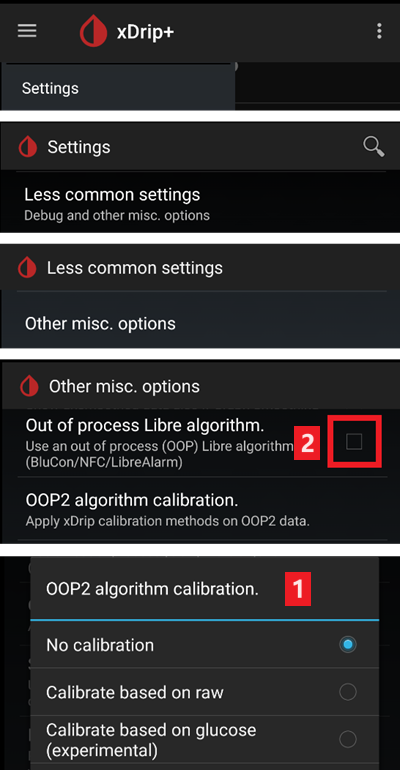

# Freestyle Libre 2 和 2+

FreeStyle Libre 2传感器现已成为真正的CGM设备，即使使用官方应用亦可实现。 然而，LibreLink仍无法向AAPS传输数据。 现有多种方案可实现其与AAPS的协同使用。

## 1. 使用蓝牙桥接器和 OOP

Bluetooth transmitters can be used with the Libre 2 (EU) or 2+ (EU) and an out of process algorithm app. 您可以像使用[Libre 1](./Libre1.md)一样，每5分钟接收一次血糖读数。

Check the bridge and app you want to use are compatible with your sensor and xDrip+.

The Libre2 OOP (find it [here](#Libre2_OOP2)) is creating the same BG readings as with the original reader. AAPS系统配合Libre 2使用时，会进行10至25分钟的数据平滑处理，以避免跳点。 请参阅下方[数值平滑处理与原始数据](#libre2-value-smoothing-raw-values)部分。 OOP算法每5分钟生成一次读数，该数值为过去5分钟的平均值。 因此，血糖读数虽不够平滑，但与原始读取设备数据吻合，且能更快追踪"真实"血糖值变化。 若使用OOP算法进行闭环控制，请务必在xDrip+中启用所有平滑处理设置。

使用蓝牙发射器存在若干重要优势：

-   您可选择多种OOP2校准策略（1）：采用"无校准"模式直接使用读取器数值，或像Libre 1那样通过"基于原始值校准"模式处理传感器数据，亦可最终采用"基于血糖值校准"模式对读取器数值进行校准。  
  请确保禁用OOP1功能（2）。

    → 汉堡菜单 → 设置 → 较少使用的设置 → 其他杂项 选项



-   Libre 2 传感器可以像 Libre 1 一样使用 14.5 天
-   完全支持 8 小时回填

备注：该发射器可与LibreLink应用并行使用，且不会对其造成干扰。

### 启动传感器

- → 汉堡菜单 (1) → 启动传感器 (2) → 启动传感器 (3) → 回答“不是今天”(4)。


此操作不会实际启动任何Libre2传感器，也不会与其产生任何交互。 此设置仅用于向xDrip+表明有新传感器正在传输血糖数据。 若有条件，请输入两次指尖血测量值进行初始校准。 此时血糖值应每5分钟在xDrip+上显示一次。 若因距离手机过远导致数据遗漏，系统将不会补传这些缺失值。

更换传感器后，xDrip+将自动识别新传感器并删除所有校准数据。 激活后，您可检测血糖并进行新的初始校准。

### Configure AAPS (for looping only)

-   在AAPS中进入配置生成器 > 血糖数据源，勾选'xDrip+'选项。


-   若手机处于飞行模式时AAPS未接收到血糖数值，请按照[xDrip+设置页面](#xdrip-identify-receiver)所述使用"识别接收器"功能。

## 2. 使用 xDrip+ 直接连接

```{admonition} Libre 2 EU only
:class: warning
xDrip+ 不支持直接连接到 Libre 2 US 和 AUS。
仅限 Libre 2 和 2+ **EU** 型号。
```

- Follow [these instructions](./Libre2MinimalL00per.md) to setup xDrip+ as the original documentation links to an obsolete OOP2  version.
- 请按照[xDrip+设置页面](../CompatibleCgms/xDrip.md)上的安装说明进行操作。

-   在[ConfigBuilder的BG数据源](#Config-Builder-bg-source)中选择xDrip+。

(libre2-value-smoothing-raw-values)=

### 数值平滑和原始值

从技术上讲，当前血糖值每分钟都会传输至xDrip+。 默认情况下，加权平均滤波器会基于过去25分钟的数据计算平滑值。 您可通过NFC扫描功能菜单调整该时段参数。

→ 汉堡菜单 → 设置 → NFC 扫描功能 → 使用 xxx 方法时平滑 libre 3 数据


这对于闭环是强制性的。 曲线看起来平滑，闭环结果非常好。 触发警报的原始数值波动稍大，但与读取器显示数值完全一致。 此外，原始数值可显示于xDrip+图表中，以便及时应对快速变化。 请启用"较少使用设置 > Libre2高级设置"中的"显示原始数值"与"显示传感器信息"选项。 此时原始数值将额外显示为白色小点，且系统菜单中可查看更多传感器信息。

当血糖快速波动时，原始数值极具参考价值。 即便数据点波动较大，但相较于平滑曲线，原始数据点能更准确地反映变化趋势，从而帮助制定更精准的治疗方案。

→ 汉堡菜单 → 设置 → 较不常见的设置 → Libre 2 的高级设置


#### 校准

您可将Libre2校准至偏移范围-40 mg/dl至+20 mg/dL（即-2.2 mmol/l至+1.1 mmol/l）的截距值。 斜率参数不可调整。 设置新传感器后，请通过指尖采血验证读数，需注意植入后最初12小时数据可能不准确。 由于可能存在与血液测量值的显著差异，请每24小时进行验证，必要时重新校准。 若传感器在数日后仍存在显著偏差，则应予以更换。

## 3. 使用 Diabox

- 安装[Diabox](https://www.bubblesmartreader.com/_files/ugd/6afd37_f183eabd4fbd44fcac4b1926a79b094f.pdf)。 在“设置”、“集成”中，启用“与其他应用程序共享数据”。


- 在[ConfigBuilder的BG数据源](#Config-Builder-bg-source)中选择xDrip+。

## 4. 使用 Juggluco

See [here](./Juggluco.md).
