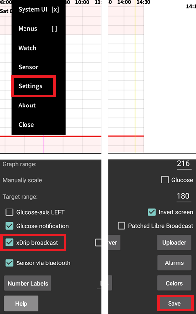
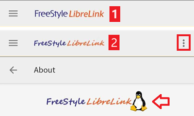
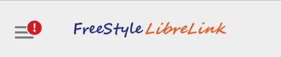
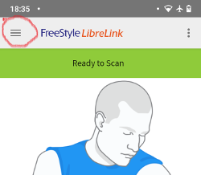

- - -
orphan: true
- - -

# Freestyle Libre 2 和 2+

FreeStyle Libre 2传感器现已成为真正的CGM设备，即使使用官方应用亦可实现。 然而，LibreLink仍无法向AAPS传输数据。 现有多种方案可实现其与AAPS的协同使用。

## 1. 使用蓝牙桥接器和 OOP

蓝牙发射器可与Libre 2（欧版）或2+（欧版）配合使用，但需搭配[外部处理算法](https://drive.google.com/file/d/1f1VHW2I8w7Xe3kSQqdaY3kihPLs47ILS/view)应用程序。 您可以像使用[Libre 1](./Libre1.md)一样，每5分钟接收一次血糖读数。

请确认您选用的桥接器及应用程序与传感器和xDrip+兼容（旧版Blucon及近期版本不可用，喵喵1需固件39版，喵喵2需固件7版）。

Libre2 OOP算法生成的血糖读数与原始读取器或LibreLink应用通过NFC扫描获取的结果完全一致。 AAPS系统配合Libre 2使用时，会进行10至25分钟的数据平滑处理，以避免跳点。 请参阅下方[数值平滑处理与原始数据](#libre2-value-smoothing-raw-values)部分。 OOP算法每5分钟生成一次读数，该数值为过去5分钟的平均值。 因此，血糖读数虽不够平滑，但与原始读取设备数据吻合，且能更快追踪"真实"血糖值变化。 若使用OOP算法进行闭环控制，请务必在xDrip+中启用所有平滑处理设置。

使用蓝牙发射器存在若干重要优势：

-   您可选择多种OOP2校准策略（1）：采用"无校准"模式直接使用读取器数值，或像Libre 1那样通过"基于原始值校准"模式处理传感器数据，亦可最终采用"基于血糖值校准"模式对读取器数值进行校准。  
  请确保禁用OOP1功能（2）。

    → 汉堡菜单 → 设置 → 较少使用的设置 → 其他杂项 选项


-   Libre 2 传感器可以像 Libre 1 一样使用 14.5 天
-   完全支持 8 小时回填

备注：该发射器可与LibreLink应用并行使用，且不会对其造成干扰。

## 2. 使用 xDrip+ 直接连接

```{admonition} Libre 2 EU only
:class: warning
xDrip+ 不支持直接连接到 Libre 2 US 和 AUS。
仅限 Libre 2 和 2+ **EU** 型号。
```

- 请按照[此说明](https://www.minimallooper.com/post/how-to-setup-freestyle-libre-2-and-oop2-to-use-a-native-bluetooth-connection-in-xdrip)配置xDrip+，但务必下载[最新版OOP2](https://drive.google.com/file/d/1f1VHW2I8w7Xe3kSQqdaY3kihPLs47ILS/view)，因文档中的版本已过时。
- 请按照[xDrip+设置页面](../CompatibleCgms/xDrip.md)上的安装说明进行操作。

-   在[ConfigBuilder的BG数据源](#Config-Builder-bg-source)中选择xDrip+。

## 3. 使用 Diabox

- 安装[Diabox](https://www.bubblesmartreader.com/_files/ugd/6afd37_f183eabd4fbd44fcac4b1926a79b094f.pdf)。 在“设置”、“集成”中，启用“与其他应用程序共享数据”。


- 在[ConfigBuilder的BG数据源](#Config-Builder-bg-source)中选择xDrip+。

## 4. 使用 Juggluco

- Download and install the Juggluco app from [here](https://www.juggluco.nl/Juggluco/download.html).
- 按照[此处](https://www.juggluco.nl/Juggluco/index.html)的说明进行操作
- 在“设置”中，启用 xDrip+ 广播（不会将数据发送到 xDrip+，而是发送到 AAPS）。



- 在[ConfigBuilder的BG数据源](#Config-Builder-bg-source)中选择xDrip+。

```{admonition} Use with xDrip+
:class: note
您可将Juggluco设置为通过"Patched Libre Broadcast"向xDrip+传输数据（此时应禁用xDrip+的广播功能），以便进行校准（参见此处说明）并避免将1分钟间隔的读数发送至AAPS。  
  
随后需将xDrip+数据源设为"Libre 2 Patched App"以接收来自Juggluco的数据。  
```

(libre2-patched-librelink-app-with-xdrip)=
## 5. 请使用经过修改的LibreLink应用配合xDrip+。

```{admonition} Libre 2 EU only
:class: warning
该修改版应用为旧版本（2019年4月22日），可能与新版Android系统不兼容。  
```

### 步骤 1：构建修补的应用程序

出于法律原因，"修改补丁"需由您自行完成。 请通过搜索引擎查找相应链接。 存在两种版本：推荐使用的原始修改版应用会拦截所有网络流量以避免追踪。 另一种变体支持 LibreView。

必须安装修改版应用以替代原版应用。 随后启动的传感器将通过蓝牙，将当前血糖值传输至您智能手机上运行的xDrip+应用。

重要提示：为避免潜在问题，建议先在支持NFC的智能手机上安装并卸载原版应用。 必须启用 NFC。 这不会消耗额外的电量。 然后安装修补的应用程序。

修改版应用可通过前台授权通知进行识别。 该前台授权服务相较于未采用此服务的原版应用，显著提升了连接稳定性。


其他识别特征可能包括：三点菜单中的Linux企鹅标志（路径：-> 信息），或修改版应用(2)与原版应用(1)不同的字体样式。 这些识别标准为可选项目，具体取决于您选择的应用程序来源。



请确保开启NFC功能，为修改版应用启用存储和定位权限，启用自动时区和时间设置，并在该应用中至少设置一个闹钟。

### 步骤 2：使用修补的应用程序启动传感器

现在只需扫描传感器，即可通过修改版应用启动Libre2传感器。 请确保已完成所有设置。

成功启动传感器的必备设置：

-   NFC 已启用 / 蓝牙已启用
-   内存和位置权限已启用
-   位置服务已启用
-   自动时间和时区设置
-   在修补的应用程序中设置至少一个闹钟

请注意：定位服务是一项核心设置。 这并非应用程序的定位权限设置——该权限也需另行配置！


一旦使用修改版应用启动传感器，将无法再将其连接至其他应用/手机。 若卸载修改版应用，将导致警报功能及持续血糖读数中断。

首次连接传感器的设置至关重要。 LibreLink应用会每隔30秒尝试与传感器建立无线连接。 如果缺少一个或多个强制性设置，则必须对其进行调整。 您可随时进行此操作，无时间限制。 传感器会持续尝试建立连接。 即使此过程持续数小时。 请保持耐心，在考虑更换传感器之前，先尝试不同的设置。

当LibreLink启动画面左上角出现红色感叹号（"!"）时， 表明连接未建立或其他设置阻碍了LibreLink的警报功能。 请检查是否已启用声音提示，并确保禁用所有可能拦截应用通知的功能。 当感叹号消失时，即表示连接已建立，血糖数据将传输至智能手机。 此过程最多应在5分钟内完成。



若感叹号持续存在或出现错误提示，可能由以下原因导致：

-   未授予 Android 位置服务 - 请在系统设置中启用它
-   未设置自动时间和时区 - 请相应地更改设置
-   激活闹钟 - 必须在 LibreLink 中激活三个闹钟中的至少一个
-   蓝牙已关闭 - 请打开
-   声音被阻止
-   应用程序通知被阻止
-   idle screen notifications are blocked

Restarting the phone can help, you may have to do it several times. As soon as the connection is established, the red exclamation mark disappears and the most important step is taken. It may happen that depending on system settings the exclamation mark remains but you still get readings. In both cases you are fine. Sensor and phone are now connected, every minute a blood sugar value is transmitted.



In rare case it could help to empty the bluetooth cache and/or reset all network connections via the system menu. This removes all connected bluetooth devices which may help to setup a proper bluetooth connection. That procedure is safe as the started sensor is remembered by the patched LibreLink app. Nothing additional has to be done here. Simply wait for the patched app to connect to the sensor.

After a successful connection the smartphone settings can be changed if necessary. This is not recommended but you may want to save power. Location service can be switched off, volume can be set to zero or alarms can be switched off again. The blood sugar levels are transferred anyway.

When starting the next sensor, however, all settings must be set again!

Remark: The patched app needs the mandatory settings set in that hour after warmup to enable a connection. For the 14 days operation time they are not needed. In most cases when you have problems with starting a sensor the location service was switched off. For Android it is needed for proper bluetooth operation(!) to connect. Please refer to Google's Android documentation.

During the 14 days you can use in parallel one or more NFC capable smartphones (not the reader device!) running the original LibreLink app for scanning via NFC. There is no time limitation to start that. You could use a parallel phone for example on day 5 or so. The parallel phones(s) could upload the blood sugar values into the Abbott Cloud (LibreView). LibreView can generate reports for your diabetes team.

Please note that the original patched app **does not have any connection to the internet** to avoid tracking.

However there is a variant of the patched app supporting LibreView with enabled internet access. Please be aware that your data is transferred to the cloud then. But your endo team reporting is fully supported then. With that variant it is also possible to move the alarms of a running sensor to a different device which not has started the sensor. Please google in diabetes related German forums how this could be done.

### Step 3: Install and configure xDrip+ app

The blood sugar values are received on the smartphone by the xDrip+ App.

-   您可安全下载[最新稳定版APK](https://xdrip-plus-updates.appspot.com/stable/xdrip-plus-latest.apk)；若需最新功能，则应使用[每日快照版](https://github.com/NightscoutFoundation/xDrip/releases)。
-   Set xDrip+ with the [patched app data source](#xdrip-libre2-patched-app).
-   请按照[xDrip+设置页面](../CompatibleCgms/xDrip.md)上的安装说明进行操作。

### Step 4: Start sensor

- → Hamburger Menu (1) → Start sensor (2) → Start sensor (3) → Answer "Not Today" (4).


This will not physically start any Libre2 sensor or interact with them in any case. This is simply to indicate xDrip+ that a new sensor is delivering blood sugar levels. If available, enter two bloody measured values for the initial calibration. Now the blood glucose values should be displayed in xDrip+ every 5 minutes. Skipped values, e.g. because you were too far away from your phone, will not be backfilled.

After a sensor change xDrip+ will automatically detect the new sensor and will delete all calibration data. You may check you blood glucose after activation and make a new initial calibration.

### Step 5: Configure AAPS (for looping only)

-   In AAPS go to Config Builder > BG Source and check 'xDrip+'


-   If AAPS does not receive BG values when phone is in airplane mode, use 'Identify receiver' as describe on [xDrip+ settings page](#xdrip-identify-receiver).

(Libre2-experiences-and-troubleshooting)=
### Experiences and Troubleshooting

#### Connectivity

The connectivity is good with most phones, with the exception of Huawei mobile phones. The connection can break off if the mobile phone is in the pocket opposite the sensor or if you are outdoors. Wear your phone on the sensor side of your body. In rooms, where Bluetooth spreads over reflections, no problems should occur. If you have connectivity problems please test another phone. It may also help to set the sensor with the internal BT antenna pointing down. The slit on the applicator must be pointing down when setting the sensor.

(libre2-value-smoothing-raw-values)=
#### Value smoothing & raw values

Technically, the current blood sugar value is transmitted to xDrip+ every minute. A weighted average filter calculates a smoothed value over the last 25 minutes by default. You can change the period in the NFC Scan features menu.

→ Hamburger menu → Settings → NFC Scan features → Smooth libre 3 data when using xxx method


This is mandatory for looping. The curves look smooth and the loop results are great. The raw values on which the alarms are based jitter a little more, but correspond to the values that the reader also displays. In addition, the raw values can be displayed in the xDrip+ graph in order to be able to react in time to rapid changes. Please switch on Less Common Settings \> Advanced Settings for Libre2 \> "show Raw values" and "show Sensors Infos". Then the raw values are additionally displayed as small white dots and additional sensor info is available in the system menu.

The raw values are very helpful when the blood sugar is moving fast. Even if the dots are jumpier you would detect the tendency much better as using the smoothed line to make proper therapy decisions.

→ Hamburger menu → Settings → Less common settings → Advanced settings for Libre 2


#### Sensor runtime

The sensor runtime is fixed to 14 days. The 12 extra hours of Libre1 no longer exist. xDrip+ shows additional sensor information after enabling Advanced Settings for Libre2 → "show Sensors Infos" in the system menu like the starting time. The remaining sensor time can also be seen in the patched LibreLink app. Either in the main screen as remaining days display or as the sensor start time in the three-point menu → Help → Event log under "New sensor found".


#### New sensor

A sensor exchange takes place on-the-fly: Set new sensor shortly before activation. As soon as xDrip+ receives no more data from the old sensor, start the new sensor with the patched app. After one hour new values should appear automatically in xDrip+.

If not, please check the phone settings and proceed as with the first start. You have no time limit. Try to find the correct settings. No need to immediately replace the sensor before you tried different combinations. The sensors are robust and try permanently to establish a connection. Please take your time. In most cases you accidentally changed one setting which causes now problems.

Once successful please select "Sensor Stop" and "Delete calibration only" in xDrip. This indicates for xDrip+ that a new sensor is releasing blood sugar levels and the old calibrations are no longer valid and therefore have to be deleted. No real interaction is done with the Libre2 sensor here! You do not need to start the sensor in xDrip+.


#### 校准

You can calibrate the Libre2 **with an offset of -40 mg/dl to +20 mg/dL \[-2,2 mmol/l to +1,1 mmol/l\]** (intercept). The slope isn't changeable. Please check by fingerpricking after setting a new sensor, keeping in mind it might not be accurate in the first 12 hours after insertion. Since there can be large differences to the blood measurements, verify every 24 hours and calibrate if necessary. If the sensor is completely off after a few days, it should then be replaced.

### Plausibility checks

The Libre2 sensors contain plausibility checks to detect bad sensor values. As soon as the sensor moves on the arm or is lifted slightly, the values may start to fluctuate. The Libre2 sensor will then shut down for safety reasons. Unfortunately, when scanning with the App, additional checks are made. The app can deactivate the sensor even though the sensor is OK. Currently the internal test is too strict. Avoid scanning the sensor with another phone to reduce the risk of unexpected sensor shutdown.

(Libre2-best-practices-for-calibrating-a-libre-2-sensor)=
# Best practices for calibrating a Libre 2 sensor

To get the best results when calibrating a libre 2 sensor there are some “rules” you should follow. They apply independently of the software combination (e.g. patched libre-app, oop2, …) that is used to handle the libre 2 values.

1.  The most important rule is to only calibrate the sensor when you have a flat bg level for at least 15 minutes. The delta between the last three readings should not exceed 10 mg/dl (over 15min not between each reading). As the libre 2 does not measure your blood glucose level but your flesh glucose level there is some time lag especially when bg level is rising or falling. This time lag can lead to way too large calibration offsets in unfavourable situations even if the bg level rise / fall is not that much. So whenever possible avoid to calibrate on rising or falling edges. -> If you have to add a calibration when you do not have a flat bg level (e.g. when starting a new sensor) it is recommended to remove that calibration(s) as soon as possible and add a new one when in flat bg levels.
2.  Actually this one is automatically taken into account when following rule 1 but to be sure: When doing comparison measurements your bg level should also be flat for about 15min. Do not compare when rising or falling. Important: You still shall do blood glucose measurements whenever you desire, just don’t use the results for calibration when rising or falling!
3.  As calibrating the sensor in flat levels is a very good starting point it is also strongly recommended to calibrate the sensor only within your desired target range like 70 mg/dl to 160 mg/dl. The libre 2 is not optimized to work over a huge range like 50 mg/dl to 350 mg/dl (at least not in a linear manner), so try to only calibrate when within your desired range. -> Simply accept that values outside your calibration range will not perfectly match blood glucose levels.
4.  Do not calibrate too often. Calibrating the sensor very often mostly leads to worse results. When the sensor delivers good results in flat conditions just don’t add any new calibration as it does not have any -useful- effect. It should be sufficient to recheck the status every 3-5 days (of course also in flat conditions).
5.  Avoid calibration when not required. This might sound silly but it is not recommended to add a new calibration if the blood glucose to flesh glucose level difference is only ±10 mg/dl (e.g. blood glucose level: 95, Libre sensor 100 -> do NOT add the 95, blood glucose level: 95, Libre sensor 115 -> add the 95 to be taken into account for the calibration)

Some general notes: After activating a new sensor and at the sensor’s end of life it does make sense to do comparison measurements more often than 3-5 days as stated in rule nr. 4. For new and old sensors it is more likely that the raw values change and a re-calibration is required. From time to time it happens that a sensor does not provide valid values. Most likely the sensor value is way to low compared to the actual blood glucose level (e.g. sensor: 50 mg/dl, bg: 130 mg/dl) even after calibrating. If this is the case the sensor cannot be calibrated to report useful results. E.g. when using the patched libre app one can add an offset of maximal +20 mg/dl. When it happens to you that the sensor does provides way too low values, don’t hesitate to replace it as it will not get better. Even if it might be a defective sensor, when seeing sensors that do provide way too low values very often, try to use different areas to place your sensor. Even in the official area (upper arm) there might be some locations where the sensors just do not provide valid values. This is some kind of trial end error to find areas that work for you.
