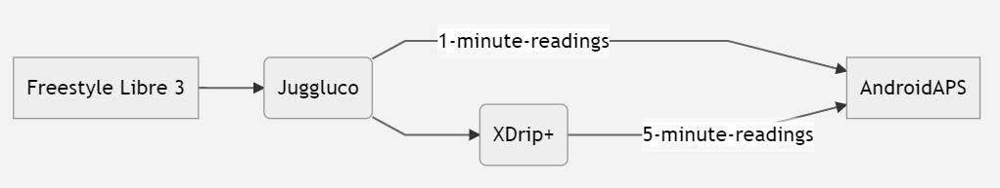

# **Freestyle Libre 3** 和 3+

Freestyle Libre 3 (FSL3) 需要特殊设置才能将血糖值传输至AAPS系统。 获取Freestyle Libre 3 (FSL3)数值至AAPS系统存在两种可行方案。

以下实现方法需配合使用独立应用程序Juggluco。 该方法通过Juggluco接收传感器原始每分钟间隔数据，随后传输至xDrip+或AAPS系统。 新传感器既可通过Libre 3应用程序启动，也可直接在Juggluco中激活。 以下指南说明了使用Juggluco应用程序启动传感器的流程。 若传感器启动时已登录Libreview账户，接收端可在Juggluco和Libre 3应用之间切换使用。

当传感器通过Libre 3应用启动时，Juggluco也可将数据传输至LibreView平台，以便与医疗保健提供者共享。

在xDrip+中，传感器可校准范围为-40 mg/dl至+20 mg/dl（-2.2 mmol/l至+1.1 mmol/l），用于补偿手动血糖仪读数与传感器读数之间的差异。

## Method 1: use 1-minute readings directly
AndroidAPS is taylored for 5-minute readings. Therefore processing 1-minute values has occasional limitations.

See [here](#juggluco-to-aaps).

## Method 2: convert 1-minute readings into 5-minute values via xDrip
该方法通过Juggluco接收传感器原始每分钟数据，经xDrip+平滑处理后转换为5分钟间隔数据，最终传输至AAPS系统。

### 步骤 1：设置 Juggluco
从[此处](https://www.juggluco.nl/Juggluco/download.html)下载并安装 Juggluco 应用程序。 按照[此处](https://www.juggluco.nl/Juggluco/libre3/)的说明进行操作

请确保将血糖值发送至xDrip+：在Juggluco的设置中，您可将其配置为向其他应用程序发送血糖值。 Juggluco可发送三种广播类型：**修改版Libre广播**最初由修改版Librelink应用使用，可用于向xDrip+发送血糖值。

### 步骤 2：设置 xDrip

智能手机上的xDrip+应用程序会接收到这些血糖数值。

- 若尚未设置，请下载[xDrip+](https://github.com/NightscoutFoundation/xDrip)并按照[xDrip+设置页面](../CompatibleCgms/xDrip.md)的说明进行操作。
- 在xDrip+中选择"Libre2（破解版应用）"作为数据源。
- 如有需要，请在"较少使用的设置→额外日志设置→日志记录额外标签"下输入"BgReading:d,xdrip libre_receiver:v"。 这将记录额外的错误信息以便故障排除。

- 从技术上讲，当前血糖值每分钟都会传输至xDrip+。 默认情况下，加权平均滤波器会基于过去25分钟的数据计算平滑值。 您可通过NFC扫描功能菜单调整该时段参数。

  → 汉堡菜单 → 设置 → NFC 扫描功能 → 使用 xxx 方法时平滑 libre 3 数据

  

### 步骤3：在xDrip中启动传感器

在xDrip+中使用"启动传感器"并选择"非今日"选项来启动传感器。 无需将手机紧贴传感器。 实际上，"启动传感器"功能并不会真正启动任何Libre 3传感器，也不会与其产生任何物理交互。 这只是向xDrip+表明有新传感器正在传输血糖数据。 若有条件，请输入两个指尖血测量值进行初始校准。 现在，xDrip+应每隔5分钟显示一次血糖值。 若因手机距离过远导致数值遗漏，系统将不会进行数据回填。

如果仍然没有数据，请至少等待15-20分钟。

更换传感器后，xDrip+将自动检测新传感器并删除所有校准数据。 您可以在激活后检查指尖血糖值，并进行新的初始校准。

### 步骤 4：配置 AndroidAPS

- See [here](#juggluco-to-xdrip) and come back.

- 当手机处于飞行模式时若AndroidAPS未接收到血糖值，请使用"识别接收器"功能。
- Turn off Smoothing (done in xDrip+ already)

## 后续传感器更换

1. 打开Juggluco并记录现有传感器的序列号。

2. 现在只需用手机的NFC功能扫描新传感器即可。 Juggluco会显示启动是否成功的提示。
3. 当您准备停用旧传感器时，请点击屏幕左上角空白区域的任意位置以打开Juggluco菜单。
4. 选择已过期的传感器并点击"终止"

注意：当两个传感器同时处于激活状态时，Juggluco会将任一传感器的最新数值发送至xDrip+。 若传感器未经校准且血糖读数不一致，可能导致传输至xDrip+的血糖值出现跳跃性波动。 如果不慎终止了错误的传感器，只需重新扫描该传感器即可重新激活。

## 在Libre 3和Juggluco应用之间切换传感器

若传感器启动时已登录Libreview账户，接收端可在Juggluco和Libre 3应用之间切换使用。 这需要以下步骤：

1. 请从Google Play商店安装Libre 3应用程序。
2. 请使用激活传感器时所用的Libreview账户设置Libre 3应用程序。
3. 在安卓设置中强制停止Juggluco应用。
4. 在Libre 3菜单中点击"启动传感器"，依次选择"是"、"下一步"，然后扫描您的传感器。
5. 几分钟后，血糖值应会在Libre 3应用程序中显示。

要从Libre 3应用切换回Juggluco，需通过安卓设置强制停止Libre 3应用，然后执行步骤1和步骤2。

(libre3-experiences-and-troubleshooting)=
## 经验和故障排除

### 排查Libre3与Juggluco连接问题

- 请确保您使用的是最新版Juggluco应用
- 请按照本指南检查您的设置
- 有时您可能需要强制停止Libre3应用和Juggluco并重新启动它们。
- 请关闭蓝牙后重新开启
- 请稍等片刻或尝试关闭Juggluco
- 旧版Juggluco(2.9.6以下版本)不会将Libre3传感器的后续数据发送至已连接设备(如WearOS上的Juggluco)。 您可能需要在修改版Libre3应用（Juggluco菜单）中点击"重新发送数据"。

### 更多帮助

原始说明：[jkaltes 网站](https://www.juggluco.nl/Juggluco/libre3/)

其他 Github 仓库：[Github 链接](https://github.com/maheini/FreeStyle-Libre-3-patch)
