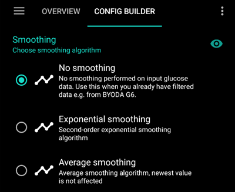

- - -
orphan: true
- - -

# 平滑血糖数据

若**血糖**数据波动较大/存在噪点，**AAPS**可能错误计算胰岛素剂量导致高血糖或低血糖。 若发现连续血糖监测(CGM)数据异常，务必在问题解决前暂停闭环系统运行。 根据您使用的连续血糖监测仪(CGM)，此类问题可能源于**AAPS**中的CGM配置（如下文所述）；或是CGM传感器部位问题（可能需要更换传感器）。

## 在AAPS内部进行数据平滑处理

自**AAPS** 3.2版本起，**AAPS**提供了在**AAPS**内部而非CGM应用中平滑数据的选项。 [配置构建器 > 平滑处理](../SettingUpAaps/ConfigBuilder.md)中提供三种选项。

### 指数平滑法​

通常建议首选此选项，因其降噪效果最强，并能重写最新数值。 但具体推荐方案请参见下表。

### 均值平滑法

该选项的运作方式类似于先前在某些CGM平台上实现的回溯平滑功能。 该选项对血糖数值的近期变化更为敏感，因此更容易因CGM数据噪点而做出错误响应。

### 无平滑处理

仅当您的CGM数据在被传输至**AAPS**前已通过采集应用妥善平滑处理时，方可使用此选项。

(smoothing-xdrip-dexcom-g6)=

## 平滑处理使用建议

|               | 指数平滑  | 均值平滑 | 无  |
| ------------- |:-----:|:----:|:--:|
| G5/G6/ONE     | 若存在噪点 |      | 推荐 |
| G7/ONE+/Stelo | 若存在噪点 | 如果稳定 |    |

Libre传感器数据存在噪点，可能需要进行平滑处理。 When using xDrip+ direct connection, or the patched app data source (receiving from another app, Juggluco included), [smoothing is already done inside the app](#libre2-value-smoothing-raw-values).

| 传感器/数据源          | Juggluco | xDrip+ 直接连接 | xDrip+ 桥接 | xDrip+ 修补的应用程序 |
| ---------------- |:--------:|:-----------:|:---------:|:--------------:|
| Libre 1/14 天/Pro |   不适用    |     不适用     |   均值平滑    |      不适用       |
| Libre 2/2+ (EU)  |   均值平滑   |      无      |   均值平滑    |       无        |
| Libre 2/2+/3/3+  |   均值平滑   |     不适用     |    不适用    |       无        |
