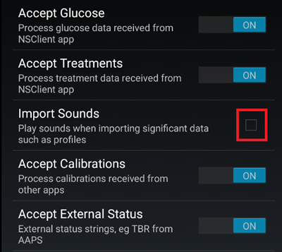
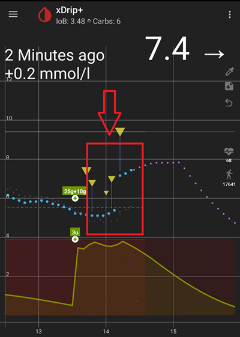
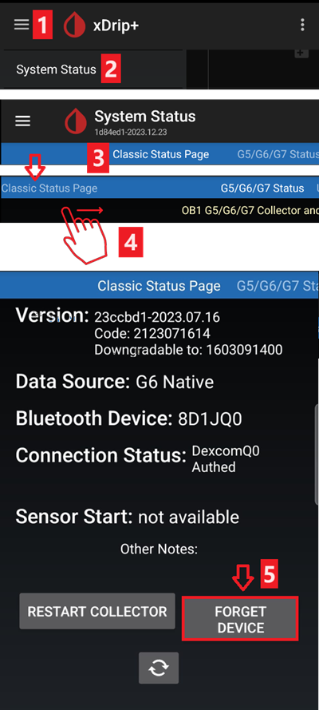
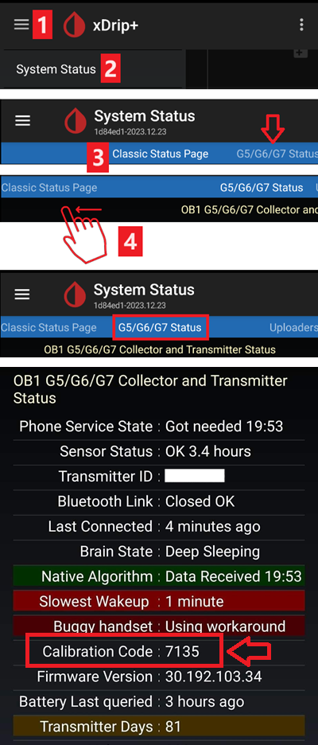
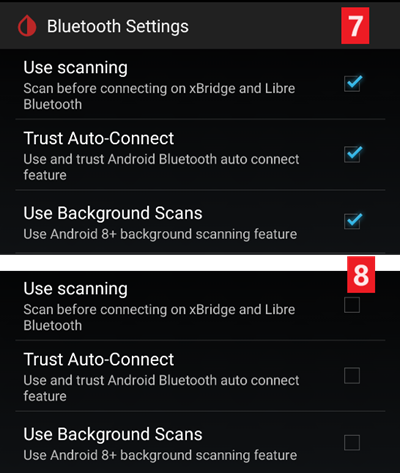
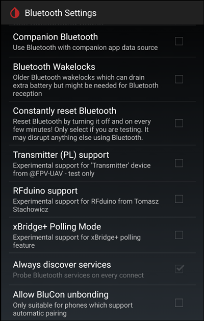

# xDrip+ 设置

若尚未设置，请下载[xDrip+](https://jamorham.github.io/#xdrip-plus)。

禁用xDrip+应用的电池优化功能并允许后台运行。

您可以安全下载[最新APK（稳定版）](https://xdrip-plus-updates.appspot.com/stable/xdrip-plus-latest.apk)，除非您需要使用最新功能或正在使用正在积极集成的传感器（如G7），这种情况下应使用最新的[夜间快照版](https://github.com/NightscoutFoundation/xDrip/releases)。

## 所有CGM和FGM系统的基础设置

### 禁用Nightscout上传功能

从AAPS 3.2版本开始，您不应允许其他任何应用向Nightscout上传数据（血糖和治疗记录）。

→ 汉堡菜单 (1) → 设置 (2) → 云端上传 (3) → Nightscout同步(REST-API)(4) → 将**OFF** `启用`开关关闭 (5)

#### 禁用自动校准和治疗功能

若您使用旧版AAPS(3.2之前版本)，请确保停用`自动校准`功能(7) 若`自动校准`复选框被勾选，请先启用`下载治疗记录`(6)一次，然后取消勾选`自动校准`，并再次停用`下载治疗记录`。

点击`额外选项`(8)

    {admonition} 安全警告
    :class: warning
    必须关闭xDrip+中的"上传治疗方案"功能，否则会导致AAPS中治疗方案重复计算，造成错误的碳水化合物(COB)和胰岛素(IOB)数据。

停用`上传治疗方案`功能(9)，并确保**不要**使用`数据回填`功能(11)。

还应停用`故障警报`选项(10)。 否则当Wi-Fi/移动网络出现故障或服务器不可用时，您将每5分钟收到一次警报。

### **应用间设置**（广播）

若您计划使用AAPS且需将数据转发至AAPS等应用，则必须在xDrip+的"应用间设置"中启用广播功能。

→ 汉堡菜单 (1) → 设置 (2) → 应用间设置 (3) → 本地广播 **开启** (4)

为确保AAPS中的数值与xDrip+完全一致，您应启用`发送显示的血糖值`功能(5)。

启用兼容广播模式(6)。

若您同时在xDrip+中启用了`接受治疗方案`功能，并在AAPS的xDrip+插件中启用了`向xDrip+广播`功能，则xDrip+将能接收来自AAPS的胰岛素、碳水化合物和基础率信息。

若启用`接受校准`功能，xDrip+将采用来自AAPS的校准数据。 使用Dexcom传感器时启用此功能需谨慎：请先阅读[此说明](https://navid200.github.io/xDrip/docs/Calibrate-G6.html)。

请务必禁用"导入提示音"功能，以避免AAPS每次发送基础率/配置文件变更时xDrip+发出铃声提示。

(xdrip-identify-receiver)=

#### 识别接收器

- 若发现本地广播存在问题（AAPS无法接收来自xDrip+的血糖值），请前往→ 汉堡菜单 (1) → 设置 (2) → 应用间设置 (3) → 识别接收器 (7)，为AAPS版本输入`info.nightscout.androidaps`（若使用PumpControl版本，请改为输入`info.nightscout.aapspumpcontrol`！！）。
- 注意：自动校正功能有时会将字母i改为大写。 输入`info.nightscout.androidaps`（或PumpControl版输入`info.nightscout.aapspumpcontrol`）时，**必须全部使用小写字母**。 大写字母"I"会导致应用无法接收来自xDrip+的血糖值。
    
    

## 使用AAPS在xDrip+中进行校准

- 若需使用AAPS进行校准，请在xDrip+中前往设置→应用间兼容性→接受校准，并选择开启。 
- 您可能还需要查看设置→较少使用设置→高级校准设置中的选项。

## Dexcom G6

- Dexcom G6发射器可同时连接至Dexcom接收器（或t:slim泵）和您手机上的一个应用程序。
- 使用xDrip+作为接收器时，请先卸载Dexcom应用程序。 **您无法同时将xDrip+和Dexcom应用程序连接到发射器！**
- 若您需要使用Clarity功能，同时希望保留xDrip+的特性，可选择使用[自制Dexcom应用](#DexcomG6-if-using-g6-with-build-your-own-dexcom-app)并通过本地广播将数据传输至xDrip+，或者将xDrip+作为配套应用，接收来自官方Dexcom应用的通知。

### xDrip+版本需根据G6发射器序列号选择

- 所有2018年秋季/年底之后生产的G6发射器均称为"萤火虫"(Firefly)型号。 这些发射器[不拆除发射器](https://navid200.github.io/xDrip/docs/Remove-transmitter.html)就无法重启传感器，且不会发送原始数据。 建议使用最新的[夜间快照版](https://github.com/NightscoutFoundation/xDrip/releases)。
- 经过电池更换的旧发射器和改装版发射器支持传感器寿命延长及重启功能，同时仍可发送原始数据。 您可以使用[最新APK（稳定版）](https://xdrip-plus-updates.appspot.com/stable/xdrip-plus-latest.apk)。

### Dexcom专用设置

- 请按照[这些说明](https://navid200.github.io/xDrip/docs/G6-Recommended-Settings.html)来设置xDrip+。

### 不建议进行预防性重启

**仅适用于更换过电池或改装过的Dexcom发射器。 [预防性重启](https://navid200.github.io/xDrip/docs/Preemptive-Restart.html)不适用于标准发射器，会导致传感器完全停止工作：您需要[移除发射器](https://navid200.github.io/xDrip/docs/Remove-transmitter.html)才能重启传感器。**

不建议对Dexcom传感器进行自动延长（`预防性重启`），因为这可能导致重启后第9天出现血糖值"跳跃"。

要安全使用该功能，需注意以下几点：

- 若您在xDrip+或Spike中使用原生数据及校准码，最安全的做法是不允许对传感器进行预防性重启。
- 如必须进行预防性重启，请选择在白天时段操作，以便能够观察数值变化并在必要时进行校准。 
- 若需重启传感器，建议采用以下两种方式之一：要么不使用出厂校准（这样在第11-12天能获得最安全的结果），要么确保做好校准准备并密切监测数值波动。
- 使用出厂校准的G6传感器进行预热可能导致检测结果出现波动。 若进行预热操作，为获得最佳效果，您很可能需要对传感器进行校准。
- 如果您未能密切留意可能发生的变化，恢复至非出厂校准模式并将系统当作G5使用可能是更稳妥的选择。

要了解这些建议的具体细节和原因，请阅读Tim Street发表在[http://www.diabettech.com](https://www.diabettech.com)上的[完整文章](https://www.diabettech.com/artificial-pancreas/diy-looping-and-cgm/)。

(xdrip-connect-g6-transmitter-for-the-first-time)=

### 首次连接G6发射器

**对于第二个及后续发射器，请参阅下方的[延长发射器寿命](#xdrip-extend-transmitter-life)。**

请按照[这些说明](https://navid200.github.io/xDrip/docs/Starting-G6.html)操作。

(xdrip-transmitter-battery-status)=

### 发射器电池状态

- 电池状态可通过系统状态查看  
    → 点击汉堡菜单(1) → 选择系统状态(2) → 若在经典状态页面(3)需滑动屏幕(4) → 进入G5/G6/G7状态界面。

- 有关更多信息，请参阅[此处](https://navid200.github.io/xDrip/docs/Battery-condition.html)。

(xdrip-extend-transmitter-life)=

### 延长发射器寿命

- [使用寿命](https://navid200.github.io/xDrip/docs/Transmitter-lifetime.html)无法延长萤火虫(Firefly)发射器：仅适用于更换过电池或改装过的发射器。
- 对于非萤火虫(Firefly)发射器，请按照[这些说明](https://navid200.github.io/xDrip/docs/Hard-Reset.html)操作。

(xdrip-replace-transmitter)=

### 更换发射器

- 关闭原始 Dexcom 接收器（如果使用）。
- [停止传感器](https://navid200.github.io/xDrip/docs/Dexcom/StartG6Sensor.html)（仅在更换传感器时操作）。

- 在xDrip+系统状态和手机蓝牙设置中忘记该设备（将显示为Dexcom??） 而?? （其中??是发射器序列号的最后两位数字）  
    → 点击汉堡菜单(1) → 选择系统状态(2) → 若不在经典状态页面(3)需滑动屏幕(4) → 然后点击"忘记设备"(5)。

- 移除发射器（若更换传感器则需一并移除传感器）。 若需移除发射器但保留传感器，请参阅[此方法](https://navid200.github.io/xDrip/docs/Remove-transmitter.html)或观看视频<https://youtu.be/AAhBVsc6NZo>。
- 请将旧发射器放置远处，防止其重新连接。 微波炉是绝佳的电磁屏蔽装置 - 但为确保万无一失，请拔掉电源线以防有人误开微波炉。
- 请按照[这些说明](https://navid200.github.io/xDrip/docs/Starting-G6.html)操作。
- 在xDrip+显示首次读数前，请勿重新开启原装Dexcom接收器（若使用）。

### 新传感器

- 关闭原始 Dexcom 接收器（如果使用）。
- 按照[这些说明](https://navid200.github.io/xDrip/docs/Dexcom/StartG6Sensor.html)停止传感器。

- 按照[这些说明](https://navid200.github.io/xDrip/docs/Starting-G6.html)插入并启动新传感器。

(xdrip-retrieve-sensor-code)=

### 获取传感器代码

→ 点击汉堡菜单(1) → 选择系统状态(2) → 若当前在经典状态页面(3)需滑动屏幕(4) → 进入G5/G6/G7状态界面 → 选择校准代码。

(xdrip-troubleshooting-dexcom-g5-g6-and-xdrip)=

### Dexcom G5/G6与xDrip+故障排除

#### 发射器连接问题

请按照[这些说明](https://navid200.github.io/xDrip/docs/Connectivity-troubleshoot.html)进行操作。

#### 启动新传感器时出现问题

请按照[这些说明](https://navid200.github.io/xDrip/docs/Dexcom/SensorFailedStart.html)进行操作。

## Libre 1

- 在 xDrip+ 中设置您的 NFC 到蓝牙桥接器
    
    → 汉堡菜单 (1) → 设置 (2) → 较不常见的设置 (3) → 蓝牙设置 (4)

- 在蓝牙设置中，完全按照以下屏幕截图中的方式设置复选框 (5)
    
    - 禁用看门狗功能，因为它们会重置手机蓝牙并中断您的泵连接。
    
    

- 您可以尝试启用以下设置（7）
    
    - 使用扫描
    - 信任自动连接
    - 使用后台扫描

- 若您频繁断开网桥连接或难以恢复连接，**请禁用这些设置**（8）。
    
    

- 除非您明确知道启用原因，否则请保持其他所有选项处于禁用状态。
    
    

### Libre智能读卡器电池电量

- MiaoMiao和Bubble等网桥设备的电池电量可在AAPS中显示（Blucon除外）。
- 详情请参阅[截图页面](#screens-sensor-level-battery)。

### 连接Libre发射器并启动传感器

- If your sensor requires it (Libre 2 EU and Libre 1 US) install the latest out of process algorithm.

- 您的传感器必须已通过厂商应用程序或读卡器启动（xDrip+无法启动或停止Libre传感器）。

- 将数据源设置为Libre蓝牙。
    
    → 汉堡菜单 (1) → 设置 (2) → 在硬件数据源中选择 Libre 蓝牙 (3)
    
    

- 扫描蓝牙并连接桥接器。
    
    → 汉堡菜单 (1) → 扫描蓝牙 (2) → 扫描 (3)
    
    - 如果xDrip+无法找到网桥设备，请确保其未连接至厂商应用程序。将其充电并重置。
    
    

- 在xDrip+中启动传感器。
    
        {admonition} 安全警告
        :class: warning
        传感器预热一小时结束前请勿使用其数据：此时数值可能极高，会导致AAPS做出错误决策。
    
    → 点击汉堡菜单(1) → 选择"启动传感器"(2) → 点击"启动传感器"(3) → 设置您使用读卡器或厂商应用启动传感器的准确时间。若非今日启动，请选择"不是今天"(4)。

(xdrip-libre2-patched-app)=

## Libre 2 修补版应用程序

- 将数据源设置为 Libre 修补版应用程序。
    
    → 汉堡菜单 (1) → 设置 (2) → 在硬件数据源中选择 Libre（修补版应用程序）(3)
    
    

- 您可以在"较少使用的设置"→"额外日志设置"→"日志记录附加标签"下添加`BgReading:d,xdrip libre_receiver:v`。 这将记录额外的错误信息以便故障排除。

