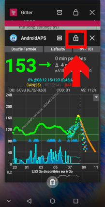
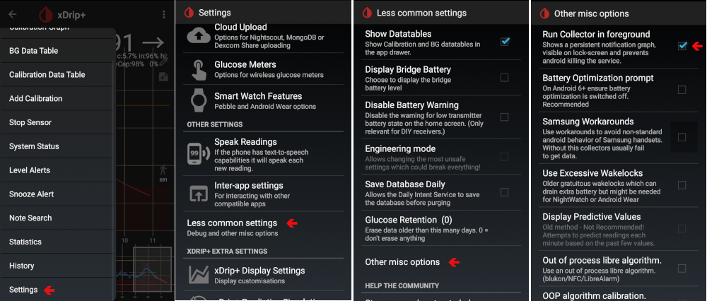

# 如何配置华为手机

这里有一些不同的选项，一些是安卓特定的，一些是华为特定的：

* 将 AAPS 和 xdrip+ 添加到忽略电池优化的应用列表中：
  
  * 设置 / 应用 / 设置 / 特殊访问权限 / 忽略电池优化 / 选择“所有应用” / 将应用设置为允许
    
    

* 设置电池选项设置：
  
  * 设置 / 应用 / 选择 AndroidAPS/xdrip+ / 在电池下 / 应用启动
    
    * 确保移除“自动管理”
    * 允许：
      
      * 自动启动
      * 辅助启动（可以从其他应用启动）
      * 后台运行
        
        

* 锁定应用
  
  * 进入应用最近列表并选择锁定图标
    
    

对于 xDrip+，你必须启用持久通知（在 xDrip+ 应用内）：

* 设置 / 不常用设置 / 其他杂项选项 / 在前台运行采集器
  
  

根据Android版本不同，这些设置的位置会有所变化。 这些说明适用于Android 8.1系统。