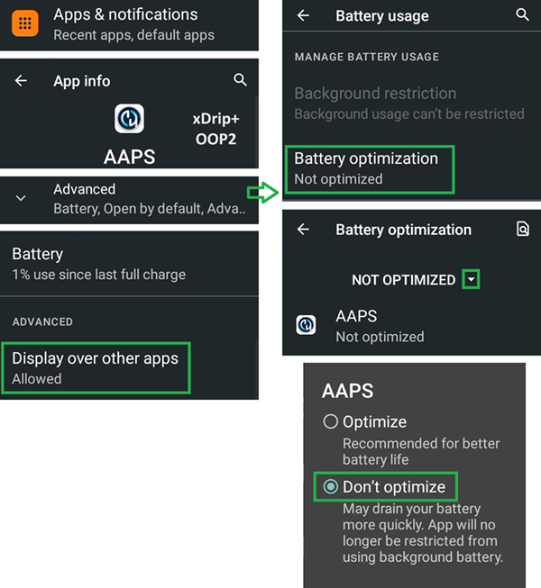
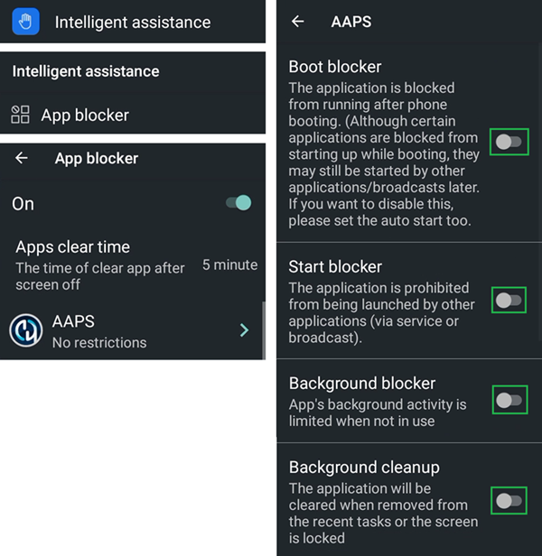

# Jelly

## Jelly 2

Do not confuse with Jelly Star (below).

**优点**

* 真的很小。
* Android 11。
* 即使你告诉人们，他们也可能不会把它当作普通的智能手机，当通常不允许使用手机时，更容易把它当作例外接受。

**缺点**

* 仅推荐有经验的闭环使用者使用（部分设置不可识别，需通过大屏Android AAPS手机的操作经验来了解各项功能的位置及使用方法。 某些AAPS按钮需要细腻的触控操作，粗短手指可能难以准确点击）。
* 只能用作 LooperPhone。 最好口袋里还有一部普通的智能手机。 

### 电池寿命优化

Jelly 2 配备了强大的优化功能，**必须**为 AAPS（以及其他 DIY 应用程序，如 BYODA、xDrip+、OOP2、Juggluco 等）禁用这些功能。

你可以启用智能辅助，但**必须为 DIY 应用程序禁用它**。

你可以为 Libre 传感器启用 NFC。

## Jelly Star Mini

**功能**

* Android 13
* 8 GB RAM

### 电池寿命优化

To avoid interference with **AAPS**, the Jelly Star 'battery usuage' should be disabled by selecting 'unrestricted' (and other **DIY apps** like BYODA, xDrip+, OOP2, Juggluco, etc...).

### Intelligent Assistance and App Blocker

Like with the Jelly 2 (above), the Jelly Star should have 'Intelligent Assistance' disabled for **DIY apps**. Similarly, 'App Blocker' under 'Settings' must also be switched off to avoid disruption with **AAPS**:

### Gooogle Play Protect

Google Play Protect should also be disabled.