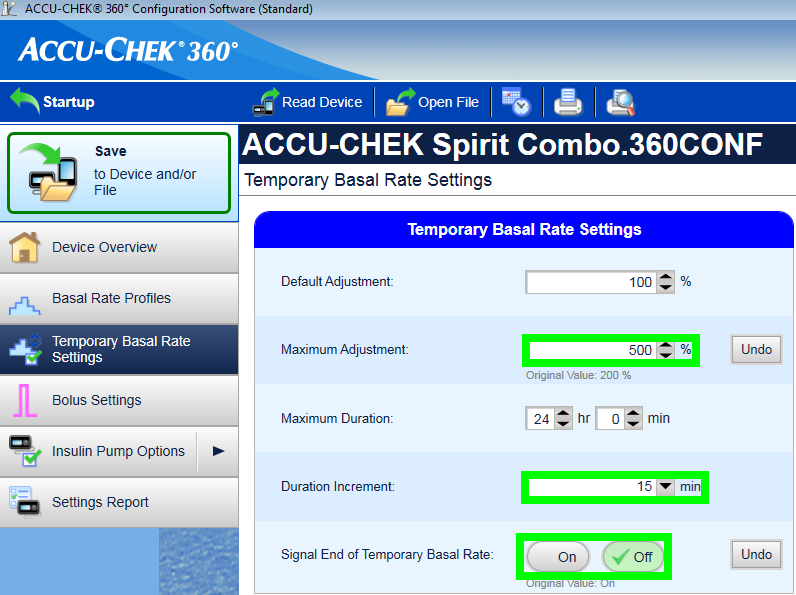
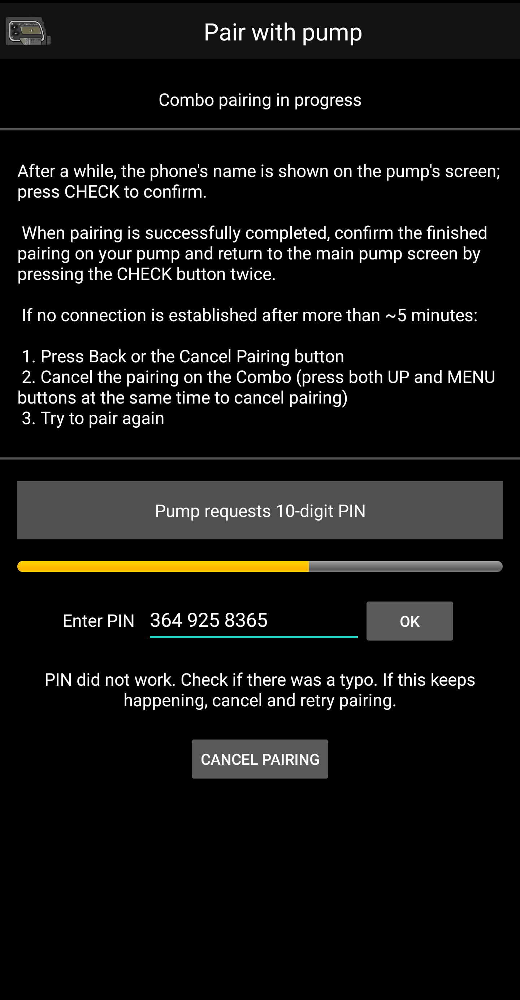

- - -
orphan: true
- - -

# 罗氏Accu-Chek Combo胰岛素泵

**该软件是DIY解决方案的一部分，并非成品，但需要您阅读、学习并理解系统，包括其使用方法。 该工具并非全自动糖尿病管理系统，但如果您愿意投入必要时间，它能帮助您改善糖尿病状况并提高生活质量。 切勿操之过急，给自己留出学习的时间。 使用后果由您自行承担。**

## 硬件和软件要求

* Roche Accu-Chek Combo 泵（任何固件版本均可）。
* 需使用Smartpix或Realtyme设备配合360配置软件来设置胰岛素泵。 （罗氏公司应客户要求可免费提供Smartpix设备及配置软件。）
* 一部兼容的手机。 必须是 Android 9 (Pie) 或更新版本。 如使用LineageOS，最低支持版本为16.1。 详情请参阅[版本说明](#maintenance-android-version-aaps-version)。
* 您手机上安装的AndroidAPS应用程序。

某些手机可能比其他手机表现更好，这取决于其蓝牙支持的质量以及是否具有额外且非常激进的省电逻辑。 手机列表详见[AAPS Phones](#Phones-list-of-tested-phones)文档。 请注意，这并非完整列表，仅反映用户个人使用体验。 我们鼓励您分享使用体验，以此帮助他人（这些项目的核心理念正是薪火相传）。

(combov2-before-you-begin)=
## 在您开始前

**安全第一**——请勿在无法从错误中恢复的环境中进行此操作。 请将您的Smartpix/Realtyme设备及360配置软件置于手边备用。 预计需花费约1小时完成全部设置并确保各项功能正常运行。

请注意以下限制条件：

* 当前不支持扩展大剂量和多波大剂量功能（可使用[扩展碳水化合物](../DailyLifeWithAaps/ExtendedCarbs.md)功能替代）。
* 仅支持一个基础率配置文件（第一个配置文件）。
* 若当前泵上激活的配置文件不是1号配置文件，循环功能将被禁用。 此状态将持续至1号配置文件被激活；激活后，待AAPS下次连接时（系统自动重连或用户点击combov2界面的刷新按钮），将检测到1号配置文件为当前使用配置，随即重新启用循环功能。
* 若循环系统请求取消正在运行的临时基础率，Combo泵将改为设置15分钟90%或110%的临时基础率替代。 这是因为直接取消临时基础率会触发泵体警报并伴随强烈震动，且该震动功能无法关闭。
* 蓝牙连接稳定性因手机型号而异，可能导致"无法连接泵体"警报，此时将完全无法建立与泵的连接。 若出现此错误，请确保蓝牙已启用，点击Combo标签页的刷新按钮以排查是否为间歇性问题；若仍无法连接，重启手机通常可解决。
* 还存在另一种情况：重启无效时，必须按压泵体按钮（重置泵的蓝牙协议栈）才能恢复手机与泵的连接功能。
* 应避免在泵体上直接设置临时基础率，因循环系统已接管临时基础率控制权。 检测泵上新设置的临时基础率最长可能需要20分钟，且其效果仅从被检测到的那一刻起计算，因此在最坏情况下，可能有20分钟的临时基础率未被计入活性胰岛素量。

若您曾使用依赖独立Ruffy应用的旧版Combo驱动，现需切换至新版驱动时，请注意必须重新进行配对操作——Ruffy与新版Combo驱动无法共享配对信息。 同时，请确保Ruffy应用_未处于_运行状态。 如有疑问，请长按Ruffy应用图标调出上下文菜单。 在该菜单中，点击"应用信息"。 在打开的界面中，点击"强制停止"。 如此可确保正在运行的Ruffy实例不会干扰新版驱动。

此外，若您正从旧版驱动迁移，请注意新版驱动以完全不同的方式向Combo泵传输大剂量指令，速度显著提升，因此无论剂量大小，大剂量都将立即开始执行，无需惊讶。 此外，关于Ruffy配对及连接问题的通用建议与技巧均不适用于此，因新版驱动采用全新架构，与旧版驱动无任何代码关联。

新版驱动目前支持以下Combo泵语言版本。 （此设置与AAPS应用语言无关——特指Combo泵液晶屏显示的语言。）

* 英语
* 西班牙语
* 法语
* 意大利语
* 俄语
* 土耳其语
* 波兰语
* 捷克语
* 匈牙利语
* 斯洛伐克语
* 罗马尼亚语
* 克罗地亚语
* 荷兰语
* 希腊语
* 芬兰语
* 挪威语
* 葡萄牙语
* 瑞典语
* 丹麦语
* 德语
* 斯洛文尼亚语
* 立陶宛语

**重要提示**：若您的泵体语言设置不在本列表范围内，请联系开发人员，并将泵体语言切换至列表内选项。 否则该驱动将无法正常运行。

## 手机设置

务必确保已关闭电池优化功能。 AAPS已自动检测是否受电池优化影响，并在界面中提示要求关闭该功能。 但在现代安卓手机上，蓝牙_本身_就是一个应用（系统应用）。 通常，该"蓝牙应用"_默认启用电池优化功能_。 这将导致手机为省电终止蓝牙应用时，蓝牙功能可能停止响应。 这意味着必须在蓝牙系统应用的设置中同时关闭电池优化功能。 遗憾的是，不同手机查找该蓝牙系统应用的方式各不相同。 在原生安卓系统中，请前往设置 -> 应用 -> 查看全部N个应用（N代表您手机上的应用总数）。 然后点击右上角菜单，选择"显示系统应用"或"全部应用"。 现在，在展开的应用列表中查找"蓝牙"应用。 选择该应用后，在其"应用信息"界面点击"电池"选项。 在此界面关闭电池优化功能（有时称为"电池用量"）。

## Combo 设置

* 请使用Accu-Chek 360配置软件设置泵体参数。 若未获取该软件，请联系Accu-Chek服务热线。 客服通常会给注册用户寄送含"360°泵体配置软件"的光盘及SmartPix USB红外连接设备（若持有Realtyme设备亦可使用）。

  - **必要设置**（截图中绿色标记部分）：

     * 将/保持菜单配置设为"标准模式"，该设置将仅显示泵体支持的菜单/操作，并隐藏不受支持的功能（扩展/多波大剂量、多段基础率）。使用非支持功能会导致闭环功能受限，因其无法以安全方式运行闭环系统。
     * 确认_快速信息文本_设置为"QUICK INFO"（不带引号，位于_胰岛素泵选项_下）。
     * 将临时基础率_最大调节幅度_设为500%
     * 禁用_临时基础率结束提示_
     * 将临时基础率_持续时间增量_设为15分钟
     * 启用蓝牙

  - **推荐设置**（截图中蓝色标记部分）

     * 请按需设置药筒低量警报
     * 请根据治疗方案设置最大单次大剂量值，以防软件漏洞风险
     * 同理，请设置临时基础率最长持续时间作为安全防护。 请至少允许3小时，因为"断开泵体3小时"的选项会设置3小时0%输注率。
     * 启用泵体按键锁功能以防止通过泵体直接输注大剂量，特别是当泵体之前使用过且用户已养成快速输注习惯时。
     * 将屏幕超时和菜单超时分别设为最小值5.5和5。 这能让AAPS更快从错误状态恢复，并减少此类错误发生时可能产生的振动次数。

  

  

  

  

## 激活驱动程序并与Combo配对

* 在[配置生成器 > 泵体](../SettingUpAaps/ConfigBuilder.md)中选择"Accu-Chek Combo"驱动程序。 **重要提示**：该列表中同时存在旧版驱动程序"Accu-Chek Combo (Ruffy)"。 请_勿_选择该选项。

  

* 点击齿轮图标打开驱动程序设置。

* 在设置界面中，点击屏幕顶部的"与泵体配对"按钮。 这将打开Combo配对界面。 请按照屏幕提示开始配对操作。 当Android系统请求允许手机对其他蓝牙设备可见时，请点击"允许"。 最终，Combo将在屏幕上显示10位自定义配对PIN码，驱动程序将要求输入该码。 在对应字段中输入该PIN码。

  

  

  

  

  

* 当驱动程序要求输入Combo显示的10位PIN码且输入错误时，将显示如下提示：

* 配对完成后，在显示"配对成功"的界面点击OK按钮即可关闭配对界面。 关闭后将返回驱动程序设置界面。 此时"与泵体配对"按钮应显示为灰色不可用状态。

  成功配对后，Accu-Chek Combo标签页显示如下：

  

  若未与Combo配对成功，标签页将显示如下：

  

* 为验证设置（为确保安全，请将泵体**断开**与任何输注管路连接），使用AAPS设置500%的临时基础率持续15分钟并执行一次大剂量输注。 此时泵体应显示临时基础率正在运行，且历史记录中可见大剂量输注信息。 AAPS也应显示当前运行的临时基础率及已输注的大剂量。

* 建议在Combo上启用按键锁功能以防止通过泵体直接输注大剂量，特别是当泵体之前使用过且用户已养成使用"快速大剂量"功能的习惯时。

## 关于配对的注意事项

Accu-Chek Combo的开发时间早于蓝牙4.0发布，距离首个Android版本问世仅一年。 因此其设备配对方式与现行Android系统的标准配对流程并非完全兼容。 要彻底解决此问题，AAPS需获取系统级权限，而该权限仅对系统应用开放。 这些系统应用由手机制造商预装——用户无法自行安装系统级应用。

其结果是配对过程永远无法完全避免问题，尽管新版驱动程序已大幅改善此状况。 特别说明：配对过程中，Android系统的蓝牙PIN码对话框可能会短暂闪现后自动消失。 但有时该对话框会持续显示，并要求输入4位PIN码。 （请注意：这与Combo要求的10位配对PIN码不同） 无需输入任何内容，直接点击取消即可。 若配对未继续进行，请按屏幕提示重试配对操作。

(combov2-tab-contents)=
## Accu-Chek Combo 选项卡内容

当泵体完成配对后，该标签页将显示以下信息（条目按从上至下顺序排列）：

1. _驱动程序状态_：驱动程序可能处于以下任一状态：
   - "已断开连接"：蓝牙未建立连接；驱动程序大部分时间处于此状态，仅在需要时连接泵体——这有助于节省电量
   - "正在连接"
   - "正在检查泵体"：已连接泵体，但驱动程序正在执行安全检查以确保一切正常且数据最新
   - "准备就绪"：驱动程序已准备好接收来自AAPS的指令
   - "已暂停"：泵体处于暂停状态（在Combo上显示为"已停止"）
   - "正在执行指令"：AAPS指令正在处理中
   - "错误"：发生异常；连接已中断，所有进行中的指令均被终止
2. _最后连接时间_：显示驱动程序上次成功连接Combo的分钟数；若超过30分钟未连接，此项将显示为红色
3. _当前活动_：详细显示泵体当前执行的操作；此处细进度条可显示指令执行进度（如设置基础率配置文件）
4. _电池状态_：显示电池电量；Combo仅提供"满电"、"低电量"、"无电"三种粗略指示（无百分比等精确数据），故此处仅显示这三档状态
5. _储药器_：显示Combo储药器中当前剩余的药量（单位：IU）
6. _最后大剂量_：显示最近一次大剂量输注的分钟数；若AAPS启动后未执行过大剂量输注，此项为空
7. _临时基础率_：显示当前运行的临时基础率详情；若无临时基础率运行，此项为空
8. _基础基础率_：当前生效的基础基础率（"基础"指不受临时基础率影响的基准基础率数值）
9. _序列号_：泵体显示的Combo序列号（与Combo背面标注的序列号一致）
10. _蓝牙地址_：Combo的6字节蓝牙地址，以`XX:XX:XX:XX:XX:XX`格式显示

Combo可通过蓝牙在_远程终端_模式或_指令_模式下运行。 远程终端模式对应Combo血糖仪上的"遥控模式"，可模拟泵体LCD屏及四个按键的操作。 由于部分操作在指令模式下无法实现，驱动程序必须在此模式下执行这些特定指令。 指令模式虽速度更快，但如前所述，其功能范围存在局限。 当远程终端模式激活时，当前远程终端界面会显示在底部Combo图示上方的区域中。 但当驱动程序切换至指令模式时，该区域将保持空白。

（用户无法干预该行为；驱动程序完全自主决定使用何种模式。 此处说明仅为让用户了解为何有时能在该区域看到Combo界面。）

最底部设有"刷新"按钮。 点击该按钮可立即触发泵体状态更新。 It also is used to let AAPS know that a previously discovered error is now fixed and that AAPS can check again that everything is OK (more on that below in [the section about alerts](#combov2-alerts)).

## 偏好设置

以下是移宇驱动程序的可配置选项（按从上至下顺序排列）：

1. _与泵体配对_：点击此按钮可与Combo建立配对。 若已配对泵体，该按钮将自动禁用。
2. _解除泵体配对_：断开已配对的Combo连接；与第1项功能完全相反。 若未配对泵体，该按钮将自动禁用。
3. _设备发现时长（秒）_：配对时，驱动程序使手机能被泵体检测到。 此项控制设备可被发现的持续时间。 默认选择最大值（300秒=5分钟）。 Android系统不允许无限期保持可发现状态，因此必须设定具体时长。
4. _自动检测并执行储药器更换操作_：若启用，通常由用户通过"操作"标签页中"填充/灌注"按钮完成的"储药器更换"动作将自动执行。 This is explained [in further detail below](#combov2-autodetections).
5. _自动检测并执行电池更换操作_：若启用，通常由用户通过"操作"标签页中"泵体电池更换"按钮完成的"电池更换"动作将自动执行。 This is explained [in further detail below](#combov2-autodetections).
6. _启用Combo详细日志记录_：该选项将大幅增加驱动程序生成的日志数据量。 **注意**：除非开发者要求，否则请勿启用此选项。 否则可能大幅增加AndroidAPS日志冗余信息，降低日志可用性。

大多数用户仅使用顶部两项功能：_与泵体配对_和_解除泵体配对_按钮。

(combov2-autodetections)=
## 自动检测并执行电池及储药器更换操作

驱动程序通过持续监测电池电量及储药器余量，可自动识别电池更换与储药器更换操作。 若Combo在上次状态更新时报告电池电量低，而本次更新显示电量恢复正常，驱动程序将判定用户已完成电池更换。 储药器余量采用相同逻辑判定：若当前余量高于先前数值，则视为已完成储药器更换。

此功能仅在电池/储药器余量报告为低值时进行更换_且_新电池/储药器已充分填充的情况下生效。

用户可在偏好设置界面关闭上述自动检测功能。

(combov2-alerts)=
## 警报（警告与错误）及其处理机制

Combo通过远程终端界面显示警报信息。 警告信息以"Wx"代码（x为数字）及简短描述形式呈现。 例如"W7"表示"临时基础率超限"。 错误信息采用相同格式，但代码前缀为"Ex"。

特定警告可由驱动程序自动消除。 自动消除的警告包括：

- W1 "储药器余量低"：驱动程序将其转换为AAPS主界面显示的"低药量"警告
- W2 "电池电量低"：驱动程序将其转换为AAPS主界面显示的"低电量"警告
- W3、W6、W7、W8：此类警告仅向用户提供参考信息，驱动程序可安全执行自动消除

其余警告_不会_被自动消除。 此外，错误信息_绝不_会自动消除。 这两类警报采用相同处理机制：触发后驱动程序将在AAPS界面弹出警示对话框，并立即终止所有正在执行的指令。 The driver then switches to the "error" state (see [the Accu-Chek Combo tab contents description above](#combov2-tab-contents)). 该状态下禁止执行任何指令。 用户须在胰岛素泵上处理错误，例如发生输注阻塞错误时可能需要更换输注管路。 用户处理完错误后，点击Accu-Chek Combo标签页的"刷新"按钮即可恢复正常操作。 驱动程序将重新连接Combo并更新状态，检查屏幕是否仍显示错误信息等。 此外，驱动程序会定期自动刷新胰岛素泵状态，因此并非必须手动点击该按钮。

大剂量注射属于特殊情况。 该操作在Combo的命令模式下执行，此模式不会在注射过程中报告出现的警报。 因此，驱动程序_无法_在大剂量注射期间自动消除警告。 这意味着胰岛素泵将持续发出蜂鸣声直至大剂量注射完成。 大剂量注射期间最常见的警报通常是W1"储药器余量低"。 **切勿**在大剂量注射过程中手动消除胰岛素泵上的Combo警告。 此操作可能导致大剂量注射中断。 驱动程序将在大剂量注射完成后处理该警告。

驱动程序未连接Combo时发生的警报将无法被检测到。 Combo无法自动推送警报至手机，必须由手机主动发起连接。 因此，警报将持续显示直至驱动程序连接胰岛素泵。 用户可点击"刷新"按钮立即建立连接，使驱动程序当场处理警报（无需等待AAPS自行发起连接）。

**重要提示**：若发生错误或出现非自动消除类警告，驱动程序将进入错误状态。 在此状态下，闭环系统**将被阻断**，直至刷新胰岛素泵状态！ 当胰岛素泵状态更新后（通过手动点击"刷新"按钮或驱动程序最终自动更新）且不再显示错误时，阻断状态即解除。

## 使用Combo时的注意事项

* 请注意这并非商业化产品，尤其在初始阶段，用户需持续监控并充分理解系统功能、使用限制及潜在故障模式。 强烈建议不具备完全理解该系统能力的人员不要使用。
* 由于Combo远程控制功能的工作原理，多项操作（特别是设置基础率配置文件）相比其他胰岛素泵更为缓慢。 这是Combo无法克服的固有缺陷。
* 切勿在胰岛素泵上设置或取消临时基础率。 闭环系统需完全掌控临时基础率，否则无法可靠运行，因无法确定用户在胰岛素泵上设置的临时基础率起始时间。
* 当AAPS与胰岛素泵通信时（泵体显示蓝牙标识期间），请勿操作泵体任何按键。 此操作将中断蓝牙连接。 Only do that if there are problems with establishing a connection (see [the "Before you begin" section above](#combov2-before-you-begin)).
* 大剂量注射期间请勿操作任何按键。 特别提醒：切勿通过按键操作来消除警报。 See [the section about alerts](#combov2-alerts) for a more detailed explanation why.

## Combo无法建立连接时的排查清单

驱动程序会竭尽全力连接Combo，并采用多种技巧来最大限度地提高可靠性。 尽管如此，有时仍无法建立连接。 以下是尝试解决此问题的步骤。

1. 按下Combo上的任意按键。 有时Combo的蓝牙协议栈会停止响应，不再接受任何连接。 通过按下Combo按键使LCD屏幕显示内容，可重置蓝牙协议栈。 大多数情况下，仅需此步骤即可解决连接问题。
2. 重启手机。 当手机蓝牙协议栈自身出现问题时可能需要此操作。
3. 若Combo电池盖老旧，建议更换新部件。 老化的电池盖可能导致Combo供电异常，进而影响蓝牙功能。
4. 若连接尝试持续失败，建议解除配对后重新配对胰岛素泵。
