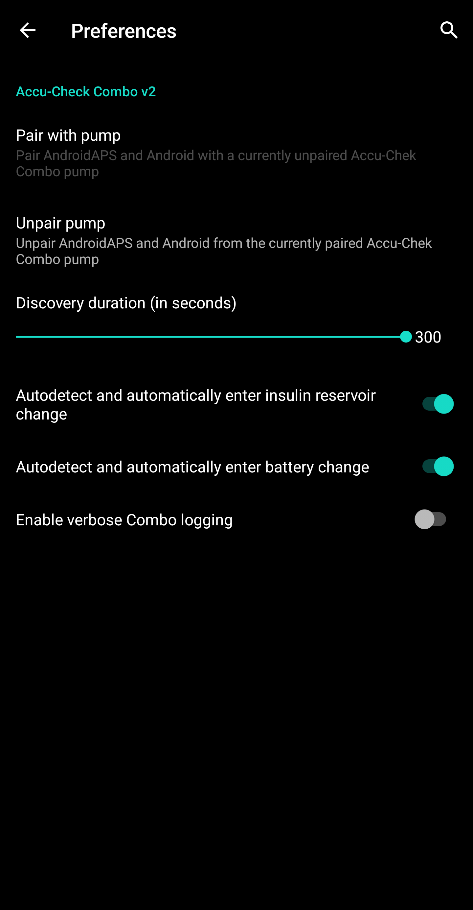

- - -
orphan: true
- - -

# 罗氏Accu-Chek Combo胰岛素泵

**该软件是DIY解决方案的一部分，并非成品，但需要您阅读、学习并理解系统，包括其使用方法。 该工具并非全自动糖尿病管理系统，但如果您愿意投入必要时间，它能帮助您改善糖尿病状况并提高生活质量。 切勿操之过急，给自己留出学习的时间。 使用后果由您自行承担。**

## Hardware and software requirements

* Roche Accu-Chek Combo 泵（任何固件版本均可）。
* 需使用Smartpix或Realtyme设备配合360配置软件来设置胰岛素泵。 （罗氏公司应客户要求可免费提供Smartpix设备及配置软件。）
* 一部兼容的手机。 必须是 Android 9 (Pie) 或更新版本。 如使用LineageOS，最低支持版本为16.1。 详情请参阅[版本说明](#maintenance-android-version-aaps-version)。
* 您手机上安装的AndroidAPS应用程序。

某些手机可能比其他手机表现更好，这取决于其蓝牙支持的质量以及是否具有额外且非常激进的省电逻辑。 手机列表详见[AAPS Phones](#Phones-list-of-tested-phones)文档。 请注意，这并非完整列表，仅反映用户个人使用体验。 我们鼓励您分享使用体验，以此帮助他人（这些项目的核心理念正是薪火相传）。

(combov2-before-you-begin)=
## 在您开始前

**安全第一**——请勿在无法从错误中恢复的环境中进行此操作。 请将您的Smartpix/Realtyme设备及360配置软件置于手边备用。 预计需花费约1小时完成全部设置并确保各项功能正常运行。

请注意以下限制条件：

* 当前不支持扩展大剂量和多波大剂量功能（可使用[扩展碳水化合物](../DailyLifeWithAaps/ExtendedCarbs.md)功能替代）。
* 仅支持一个基础率配置文件（第一个配置文件）。
* 若当前泵上激活的配置文件不是1号配置文件，循环功能将被禁用。 此状态将持续至1号配置文件被激活；激活后，待AAPS下次连接时（系统自动重连或用户点击combov2界面的刷新按钮），将检测到1号配置文件为当前使用配置，随即重新启用循环功能。
* 若循环系统请求取消正在运行的临时基础率，Combo泵将改为设置15分钟90%或110%的临时基础率替代。 这是因为直接取消临时基础率会触发泵体警报并伴随强烈震动，且该震动功能无法关闭。
* 蓝牙连接稳定性因手机型号而异，可能导致"无法连接泵体"警报，此时将完全无法建立与泵的连接。 若出现此错误，请确保蓝牙已启用，点击Combo标签页的刷新按钮以排查是否为间歇性问题；若仍无法连接，重启手机通常可解决。
* 还存在另一种情况：重启无效时，必须按压泵体按钮（重置泵的蓝牙协议栈）才能恢复手机与泵的连接功能。
* 应避免在泵体上直接设置临时基础率，因循环系统已接管临时基础率控制权。 检测泵上新设置的临时基础率最长可能需要20分钟，且其效果仅从被检测到的那一刻起计算，因此在最坏情况下，可能有20分钟的临时基础率未被计入活性胰岛素量。

若您曾使用依赖独立Ruffy应用的旧版Combo驱动，现需切换至新版驱动时，请注意必须重新进行配对操作——Ruffy与新版Combo驱动无法共享配对信息。 同时，请确保Ruffy应用_未处于_运行状态。 如有疑问，请长按Ruffy应用图标调出上下文菜单。 在该菜单中，点击"应用信息"。 在打开的界面中，点击"强制停止"。 如此可确保正在运行的Ruffy实例不会干扰新版驱动。

此外，若您正从旧版驱动迁移，请注意新版驱动以完全不同的方式向Combo泵传输大剂量指令，速度显著提升，因此无论剂量大小，大剂量都将立即开始执行，无需惊讶。 此外，关于Ruffy配对及连接问题的通用建议与技巧均不适用于此，因新版驱动采用全新架构，与旧版驱动无任何代码关联。

新版驱动目前支持以下Combo泵语言版本。 （此设置与AAPS应用语言无关——特指Combo泵液晶屏显示的语言。）

* 英语
* 西班牙语
* 法语
* 意大利语
* 俄语
* 土耳其语
* 波兰语
* 捷克语
* 匈牙利语
* 斯洛伐克语
* 罗马尼亚语
* 克罗地亚语
* 荷兰语
* 希腊语
* 芬兰语
* 挪威语
* 葡萄牙语
* 瑞典语
* 丹麦语
* 德语
* 斯洛文尼亚语
* 立陶宛语

**重要提示**：若您的泵体语言设置不在本列表范围内，请联系开发人员，并将泵体语言切换至列表内选项。 否则该驱动将无法正常运行。

## 手机设置

务必确保已关闭电池优化功能。 AAPS已自动检测是否受电池优化影响，并在界面中提示要求关闭该功能。 但在现代安卓手机上，蓝牙_本身_就是一个应用（系统应用）。 通常，该"蓝牙应用"_默认启用电池优化功能_。 这将导致手机为省电终止蓝牙应用时，蓝牙功能可能停止响应。 这意味着必须在蓝牙系统应用的设置中同时关闭电池优化功能。 遗憾的是，不同手机查找该蓝牙系统应用的方式各不相同。 在原生安卓系统中，请前往设置 -> 应用 -> 查看全部N个应用（N代表您手机上的应用总数）。 然后点击右上角菜单，选择"显示系统应用"或"全部应用"。 现在，在展开的应用列表中查找"蓝牙"应用。 选择该应用后，在其"应用信息"界面点击"电池"选项。 在此界面关闭电池优化功能（有时称为"电池用量"）。

## Combo 设置

* 请使用Accu-Chek 360配置软件设置泵体参数。 若未获取该软件，请联系Accu-Chek服务热线。 客服通常会给注册用户寄送含"360°泵体配置软件"的光盘及SmartPix USB红外连接设备（若持有Realtyme设备亦可使用）。

  - **必要设置**（截图中绿色标记部分）：

     * 将/保持菜单配置设为"标准模式"，该设置将仅显示泵体支持的菜单/操作，并隐藏不受支持的功能（扩展/多波大剂量、多段基础率）。使用非支持功能会导致闭环功能受限，因其无法以安全方式运行闭环系统。
     * 确认_快速信息文本_设置为"QUICK INFO"（不带引号，位于_胰岛素泵选项_下）。
     * 将临时基础率_最大调节幅度_设为500%
     * 禁用_临时基础率结束提示_
     * 将临时基础率_持续时间增量_设为15分钟
     * 启用蓝牙

  - **推荐设置**（截图中蓝色标记部分）

     * 请按需设置药筒低量警报
     * 请根据治疗方案设置最大单次大剂量值，以防软件漏洞风险
     * 同理，请设置临时基础率最长持续时间作为安全防护。 请至少允许3小时，因为"断开泵体3小时"的选项会设置3小时0%输注率。
     * 启用泵体按键锁功能以防止通过泵体直接输注大剂量，特别是当泵体之前使用过且用户已养成快速输注习惯时。
     * 将屏幕超时和菜单超时分别设为最小值5.5和5。 这能让AAPS更快从错误状态恢复，并减少此类错误发生时可能产生的振动次数。

  

  

  

  

## 激活驱动程序并与Combo配对

* 在[配置生成器 > 泵体](../SettingUpAaps/ConfigBuilder.md)中选择"Accu-Chek Combo"驱动程序。 **重要提示**：该列表中同时存在旧版驱动程序"Accu-Chek Combo (Ruffy)"。 请_勿_选择该选项。

  

* 点击齿轮图标打开驱动程序设置。

* 在设置界面中，点击屏幕顶部的"与泵体配对"按钮。 这将打开Combo配对界面。 请按照屏幕提示开始配对操作。 当Android系统请求允许手机对其他蓝牙设备可见时，请点击"允许"。 最终，Combo将在屏幕上显示10位自定义配对PIN码，驱动程序将要求输入该码。 在对应字段中输入该PIN码。

  

  

  

  

  

* 当驱动程序要求输入Combo显示的10位PIN码且输入错误时，将显示如下提示：

* 配对完成后，在显示"配对成功"的界面点击OK按钮即可关闭配对界面。 关闭后将返回驱动程序设置界面。 此时"与泵体配对"按钮应显示为灰色不可用状态。

  成功配对后，Accu-Chek Combo标签页显示如下：

  

  若未与Combo配对成功，标签页将显示如下：

  

* 为验证设置（为确保安全，请将泵体**断开**与任何输注管路连接），使用AAPS设置500%的临时基础率持续15分钟并执行一次大剂量输注。 此时泵体应显示临时基础率正在运行，且历史记录中可见大剂量输注信息。 AAPS也应显示当前运行的临时基础率及已输注的大剂量。

* On the Combo, it is recommended to enable the key lock to prevent bolusing from the pump, esp. when the pump was used before and using the "quick bolus" feature was a habit.

## Notes about pairing

The Accu-Chek Combo was developed before Bluetooth 4.0 was released, and just one year after the very first Android version was released. This is why its way of pairing with other devices is not 100% compatible with how it is done in Android today. To fully overcome this, AAPS would need system level permissions, which are only available for system apps. These are installed by the phone makers into the phone - users cannot install system apps.

The consequence of this is that pairing will never be 100% without problems, though it is greatly improved in this new driver. In particular, during pairing, Android's Bluetooth PIN dialog can briefly show up and automatically go away. But sometimes, it stays on screen, and asks for a 4-digit PIN. (This is not to be confused with the 10-digit Combo pairing PIN.) Do not enter anything, just press cancel. If pairing does not continue, follow the instructions on screen to retry the pairing attempt.

(combov2-tab-contents)=
## Accu-Chek Combo tab contents

The tab shows the following information when a pump was paired (items are listed from top to bottom):

1. _Driver state_: The driver can be in one of the following states:
   - "Disconnected" : There is no Bluetooth connection; the driver is in this state most of the time, and only connects to the pump when needed - this saves power
   - "Connecting"
   - "Checking pump" : the pump is connected, but the driver is currently performing safety checks to ensure that everything is OK and up to date
   - "Ready" : the driver is ready to accept commands from AAPS
   - "Suspended" : the pump is suspended (shown as "stopped" in the Combo)
   - "Executing command" : an AAPS command is being executed
   - "Error" : an error occurred; the connection was terminated, any ongoing command was aborted
2. _Last connection_: How many minutes ago did the driver successfully connect to the Combo; if this goes beyond 30 minutes, this item is shown with a red color
3. _Current activity_: Additional detail about what the pump is currently doing; this is also where a thin progress bar can show a command's execution progress, like setting a basal profile
4. _Battery_: Battery level; the Combo only indicates "full", "low", "empty" battery, and does not offer anything more accurate (like a percentage), so only these three levels are shown here
5. _Reservoir_: How many IU are currently in the Combo's reservoir
6. _Last bolus_: How many minutes ago the last bolus was delivered; if none was delivered yet after AAPS was started, this is empty
7. _Temp basal_: Details about the currently active temporary basal; if none is currently active, this is empty
8. _Base basal rate_: Currently active base basal rate ("base" means the basal rate without any active TBR influencing the basal rate factor)
9. _Serial number_: Combo serial number as indicated by the pump (this corresponds to the serial number shown on the back of the Combo)
10. _Bluetooth address_: The Combo's 6-byte Bluetooth address, shown in the `XX:XX:XX:XX:XX:XX` format

The Combo can be operated through Bluetooth in the _remote-terminal_ mode or in the _command_ mode. The remote-terminal mode corresponds to the "remote control mode" on the Combo's meter, which mimics the pump's LCD and four buttons. Some commands have to be performed in this mode by the driver, since they have no counterpart in the command mode. That latter mode is much faster, but, as said, limited in scope. When the remote-terminal mode is active, the current remote-terminal screen is shown in the field that is located just above the Combo drawing at the bottom. When the driver switches to the command mode however, that field is left blank.

(The user does not influence this; the driver fully decides on its own what mode to use. This is merely a note for users to know why sometimes they can see Combo frames in that field.)

At the very bottom, there is the "Refresh" button. This triggers an immediate pump status update. It also is used to let AAPS know that a previously discovered error is now fixed and that AAPS can check again that everything is OK (more on that below in [the section about alerts](#alerts-warnings-and-errors-and-how-they-are-handled)).

## 偏好设置

These preferences are available for the combo driver (items are listed from top to bottom):

1. _Pair with pump_: This is a button that can be pressed to pair with a Combo. It is disabled if a pump is already paired.
2. _Unpair pump_: Unpairs a paired Combo; the polar opposite of item no. 1. It is disabled if no pump is paired.
3. _Discovery duration (in seconds)_: When pairing, the drivers makes the phone discoverable by the pump. This controls how long that discoverability lasts. By default, the maximum (300 seconds = 5 minutes) is selected. Android does not allow for discoverability to last indefinitely, so a duration has to be chosen.
4. _Autodetect and automatically enter insulin reservoir change_: If enabled, the "reservoir change" action that is normally done by the user through the "prime/fill" button in the Action tab. This is explained [in further detail below](#autodetecting-and-automatically-entering-battery-and-reservoir-changes).
5. _Autodetect and automatically enter battery change_: If enabled, the "battery change" action that is normally done by the user through the "pump battery change" button in the Action tab. This is explained [in further detail below](#autodetecting-and-automatically-entering-battery-and-reservoir-changes).
6. _Enable verbose Combo logging_: This greatly expands the amount of logging done by the driver. **CAUTION**: Do not enable this unless asked to by a developer. Otherwise, this can add a lot of noise to AndroidAPS logs and lessen their usefulness.

Most users only ever use the top two items, the _Pair with pump_ and _Unpair pump_ buttons.

(combov2-autodetections)=
## Autodetecting and automatically entering battery and reservoir changes

The driver is capable of detecting battery and reservoir changes by keeping track of the battery and reservoir levels. If the battery level was reported by the Combo as low the last time the pump status was updated, and now, during the new pump status update, the battery level shows up as normal, then the driver concludes that the user must have replaced the battery. The same logic is used for the reservoir level: If it now is higher than before, this is interpreted as a reservoir change.

This only works if the battery and reservoir are replaced when these levels are reported as low _and_ the battery and reservoir are sufficiently filled.

These autodetections can be turned off in the Preferences UI.

(combov2-alerts)=
## Alerts (warnings and errors) and how they are handled

The Combo shows alerts as remote-terminal screens. Warnings are shown with a "Wx" code (x is a digit), along with by a short description. One example is "W7", "TBR OVER". Errors are similar, but show up with an "Ex" code instead.

Certain warnings are automatically dismissed by the driver. These are:

- W1 "reservoir low" : the driver turns this into a "low reservoir" warning that is shown on the AAPS main tab
- W2 "battery low" : the driver turns this into a "low battery" warning that is shown on the AAPS main tab
- W3, W6, W7, W8 : these are all purely informational for the user, so it is safe for the driver to auto-dismiss them

Other warnings are _not_ automatically dismissed. Also, errors are _never_ automatically dismissed. Both of these are handled the same way: They cause the driver to produce an alert dialog on top of the AAPS UI, and also cause it to abort any ongoing command execution. The driver then switches to the "error" state (see [the Accu-Chek Combo tab contents description above](#accu-chek-combo-tab-contents)). This state does not allow for any command execution. The user has to handle the error on the pump; for example, an occlusion error may require replacing the cannula. Once the user took care of the error, normal operation can be resumed by pressing the "Refresh" button on the Accu-Chek Combo tab. The driver then connects to the Combo and updates its status, checking for whether an error is still shown on screen etc. Also, the driver auto-refreshes the pump status after a while, so manually pressing that button is not mandatory.

Bolusing is a special case. It is done in the Combo's command mode, which does not report mid-bolus that an alert appeared. As a consequence, the driver cannot automatically dismiss warnings _during_ a bolus. This means that unfortunately, the pump will be beeping until the bolus is finished. The most common mid-bolus alert typically is W1 "reservoir low". **Don't** dismiss Comnbo warnings on the pump itself manually during a bolus. You risk interrupting the bolus. The driver will take care of the warning once the bolus is over.

Alerts that happen while the driver is not connected to the Combo will not be noticed by the driver. The Combo has no way of automatically pushing that alert to the phone; it is always the phone that has to initiate the connection. As a consequence, the alert will persist until the driver connects to the pump. Users can press the "Refresh" button to trigger a connection and let the driver handle the alert right then and there (instead of waiting until AAPS itself decides to initiate a connection).

**IMPORTANT**: If an error occurs, or a warning shows up that isn't one of those that are automatically dismissed, the driver enters the error state. In that state, the loop **WILL BE BLOCKED** until the pump status is refreshed! It is unblocked after the pump status is updated (either by manual "Refresh" button press or by the driver's eventual auto-update) and no error is shown anymore.

## Things to be careful about when using the Combo

* Keep in mind that this is not a product, esp. in the beginning the user needs to monitor and understand the system, its limitations and how it can fail. It is strongly advised NOT to use this system when the person using it is not able to fully understand the system.
* Due to the way the Combo's remote control functionality works, several operations (especially setting a basal profile) are slow compared to other pumps. This is an unfortunate limitation of the Combo that cannot be overcome.
* Don't set or cancel a TBR on the pump. The loop assumes control of TBRs and cannot work reliably otherwise, since it's not possible to determine the start time of a TBR that was set by the user on the pump.
* Don't press any buttons on the pump while AAPS communicates with the pump (the Bluetooth logo is shown on the pump while it is connected to AAPS). Doing that will interrupt the Bluetooth connection. Only do that if there are problems with establishing a connection (see [the "Before you begin" section above](#before-you-begin)).
* Don't press any buttons while the pump is bolusing. In particular, don't try to dismiss alerts by pressing buttons. See [the section about alerts](#alerts-warnings-and-errors-and-how-they-are-handled) for a more detailed explanation why.

## Checklist for when no connection can be established with the Combo

The driver does its best to connect to the Combo, and uses a couple of tricks to maximize reliability. Still, sometimes, connections aren't established. Here are some steps to take for trying to remedy this situation.

1. Press a button on the Combo. Sometimes, the Combo's Bluetooth stack becomes non-responsive, and does not accept connections anymore. By pressing a button on the Combo and making the LCD show something, the Bluetooth stack is reset. Most of the time, this is the only step that's needed to fix the connection issues.
2. Restart the phone. This may be needed if there is an issue with the phone's Bluetooth stack itself.
3. If the Combo's battery cap is old, consider replacing it. Old battery caps can cause issues with the Combo's power supply, which affect Bluetooth.
4. If connection attempts still keep failing, consider unpairing and then re-pairing the pump.
