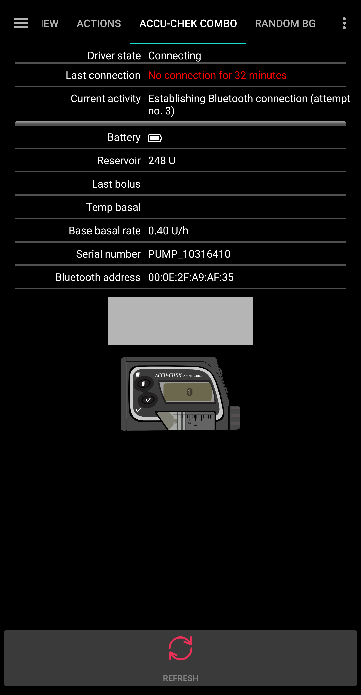

# Accu-Chek Combo基础使用技巧

## 如何确保操作顺畅

* 请始终**随身携带智能手机**，夜间将其置于床边。 由于睡眠时胰岛素泵可能被身体遮挡，置于较高位置（如架子或床头板）效果最佳。
* 务必确保胰岛素泵电池始终保持充足电量。 电池使用技巧请参阅电池章节。
* 尽可能仅通过AAPS应用程序操作胰岛素泵。为便于操作，请在泵上启用按键锁定功能：**泵设置/按键锁定/开启**。 仅当更换电池或储药器时，才需使用胰岛素泵的按键。 

## 胰岛素泵不可连接。 怎么办？

### 启用胰岛素泵失联警报

* 在AAPS中，进入**设置/本地警报**，启用**胰岛素泵失联警报**，并将**胰岛素泵失联时限[分钟]**设为**31**分钟。
* 该设置可确保您离开房间时将手机留在桌上时不会触发警报，同时当胰岛素泵失联时间超过临时基础率持续时间时会及时提醒您。

### 恢复胰岛素泵的可连接状态

* 当AAPS报告**胰岛素泵失联**警报时，请先解除按键锁定并**按下胰岛素泵任意按键**（如下行键）。 当胰岛素泵屏幕熄灭后，立即点击AAPS中**Combo标签页**的**刷新**按钮。 通常此时通信功能即可恢复。
* 若上述方法无效，请重启智能手机。 重启后AAPS将自动重新激活，并与胰岛素泵建立新连接。 若使用旧版驱动程序，ruffy也将同步重新激活。

* 多款智能手机测试表明，某些机型更易触发"胰岛素泵失联"错误。 经测试验证的智能手机型号请参阅[AAPS适用手机](#Phones-list-of-tested-phones)列表。

### 频繁通信错误的根本原因和后果

* 在**内存不足**或启用**激进省电**设置的手机上，AAPS常被强制关闭。 若打开AAPS时主屏幕未显示大剂量和计算器按钮（系统正在初始化），即可判定此情况。 这可能会在启动时触发“泵无法连接警报”。 在Combo标签页的**最后连接**字段中，可查看AAPS最近一次与胰岛素泵通信的时间。

* 此错误会加速消耗胰岛素泵电量，因为应用重启时需要从泵中读取基础率配置文件。
* 同时会增大泵机故障概率，导致必须手动按键才能恢复外部连接。 

## 临时基础率取消失败

* 偶尔AAPS无法自动消除**临时基础率已取消**警报。 此时需点击AAPS**Combo标签页**的**更新**按钮，或在胰岛素泵上手动确认警报。

## 胰岛素泵电池注意事项

### 更换电池

* 出现**低电量**警报后应立即更换电池，确保维持足够的电量进行可靠的蓝牙通信（即使手机与泵距离较远时）。
* 即便出现**低电量**警报后，电池仍可持续使用较长时间。 但建议触发"低电量"警报后随身携带新电池备用。
* 更换电池前，请点击主屏幕**循环**图标并选择**暂停循环1小时**。 
* 等待胰岛素泵完成通信且泵体蓝牙标识熄灭。

* 解除泵体按键锁，切换至停止模式，确认可能已取消的临时基础率，并快速更换电池。
* 使用旧版驱动时，若更换电池导致泵体时钟失效，请将泵体日期时间精确设置为运行AAPS的手机当前时间。 （新版驱动程序会自动更新胰岛素泵的日期时间。）
* 将泵体切换回运行模式后，点击主屏幕**暂停循环**图标选择**恢复**。
* AAPS将在获取下一个血糖值时重新设置所需的临时基础率。

(Accu-Chek-Combo-Tips-for-Basic-usage-battery-type-and-causes-of-short-battery-life)=

### 电池类型与寿命缩短原因

* 由于高强度蓝牙通信耗电量大，请仅使用**高品质电池**，如劲量终极锂电池、Accu-Chek大容量服务包中的"power one"电池，若选择充电电池则推荐使用爱乐普。 

 

各类电池典型使用寿命范围如下：

* **Energizer Ultimate Lithium**：4 到 7 周
* 服务包中的 **Power One Alkaline** (Varta)：2 到 4 周
* **Eneloop 可充电电池** (BK-3MCCE)：1 到 3 周

若电池寿命显著短于上述范围，请排查以下可能原因：

* 部分Combo泵的旋入式电池盖存在设计缺陷，可能导致电池短路并加速耗电。 无此缺陷的电池盖可通过金色金属触点识别。
* 若短暂更换电池导致泵体时钟失效，可能是维持时钟运行的电容元件损坏。 此时可联系罗氏更换泵体（保修期内可免费处理）。 
* 智能手机硬件及软件（安卓操作系统与蓝牙协议栈）同样影响泵体电池寿命，具体作用机制尚未完全明确。 如有条件，可尝试更换其他智能手机对比电池续航表现。

## 扩展大剂量，多波大剂量

OpenAPS算法不支持并行执行扩展大剂量或多波大剂量。 但可通过以下替代方案实现类似治疗效果：

* 输入碳水化合物时使用**电子碳水**功能，或在计算器中输入完整餐食的碳水化合物总量及预估的血糖吸收时长。 系统将自动计算该时段内均匀分布的小剂量碳水化合物，使算法在持续监测血糖升降趋势的同时提供等效的胰岛素剂量。 实现多波大剂量效果时，可将小剂量即时大剂量与电子碳水功能结合使用。 
* 进食前，在AAPS**操作标签页**设置临时**即将进食**目标，将目标血糖值设为80并持续数小时。 持续时间应根据您通常选择的扩展大剂量间隔设定。 该设置将使目标血糖值低于常规水平，从而增加胰岛素输注量。
* 随后使用**计算器**输入完整餐食碳水化合物量，但不要直接采用大剂量计算器建议的数值。 若需执行类多波大剂量，应向下调整胰岛素剂量。 根据餐食情况，算法将通过追加超微大剂量或提高临时基础率来抵消血糖上升。 此时需谨慎测试基础率安全限制（最大单位/小时、基础胰岛素最大存量），必要时可临时调整。

* 若直接通过泵体执行扩展/多波大剂量，AAPS将禁用闭环6小时作为惩罚机制，以避免过量胰岛素计算。

## 大剂量输注警报

* 若AAPS检测到相同剂量的大剂量已在同一分钟成功输注，系统将阻止重复输注相同单位的胰岛素。 如需在短时间内重复输注相同剂量胰岛素，请等待两分钟后再次执行大剂量操作。 自AAPS 2.0版本起，若首次大剂量输注中断或未完成，可立即重新提交输注请求。
* 该警报是安全机制，会在提交新大剂量前读取泵体输注记录，确保胰岛素存量（IOB）计算准确（即使大剂量直接从泵体输注）。 必须防止出现无法区分的记录条目。

* 该机制也是导致报错的另一原因：若使用大剂量计算器期间，另一大剂量通过泵体输注导致记录变更，计算基准失效将中止当前大剂量。 

