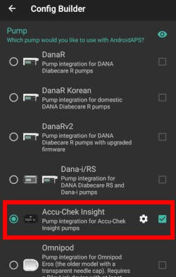
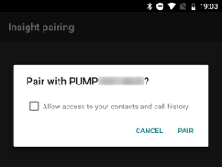

# Accu-Chek Insight 泵

**本软件属于人工胰腺DIY解决方案组件，并非商业产品，需用户自行研习系统原理及操作方法。 本工具无法替代糖尿病自主管理，但若愿投入必要时间研习，可助您改善病情并提升生活质量。 请勿操之过急，预留充足时间循序渐进学习。 使用后果需自行承担全部责任。**

* * *

## ***警告：**若曾搭配**SightRemote**使用Insight，请**升级至最新版AAPS**并**卸载SightRemote**。*

## 硬件和软件要求

* 罗氏Accu-Chek Insight泵（任意固件版本均兼容）

注：AAPS始终将数据写入**泵中首个基础率配置文件**。

* 安卓手机（原则上所有安卓版本均可兼容Insight，但需查阅[模块](../Getting-Started/ComponentOverview)页面确认运行AAPS所需的安卓版本）
* 手机端安装的AAPS应用程序

## 设置

* Insight泵每次仅限连接一台设备。 若曾使用Insight遥控器（血糖仪），需从泵体配对设备列表中删除该设备：菜单 > 设置 > 通信 > 移除设备
    
    

* 在[配置构建器 > 泵](../SettingUpAaps/ConfigBuilder.md)中选择Accu-Chek Insight。
    
    

* 点击齿轮图标进入Insight设置界面。

* 在设置界面，点击屏幕顶部的"Insight配对"按钮。 系统将显示附近所有蓝牙设备列表（左下图）。
* 在Insight泵上操作：菜单 > 设置 > 通信 > 添加设备。 泵体将显示含序列号的界面（右下图）。
    
    

* 返回手机端，在蓝牙设备列表中点击泵体序列号。 点击"配对"进行确认。
    
    

* 泵体与手机将同步显示配对验证码。 核验两端验证码一致性后，在泵体与手机端同步确认。
    
    

* 成功! 恭喜您已完成泵体与AAPS的配对操作。
    
    

* 返回AAPS配置构建器，点击Insight泵旁的齿轮图标进入设置界面，选择"Insight配对"即可查看泵体信息：
    
    

注：泵体与手机之间不会保持常时连接。 仅在必要时建立连接（如设置临时基础率、执行大剂量输注、读取泵体记录等操作）。 否则将导致手机与泵体电量过快耗尽。

(Accu-Chek-Insight-Pump-settings-in-aaps)=

## AAPS 中的设置

**注：现可通过AAPS v2.7.0及以上版本使用"始终采用基础率绝对值"功能（即使Nightscout同步已启用），以配合Insight泵实现Autotune。**（路径：AAPS [偏好设置 > NS客户端 > 高级设置](#Preferences-advanced-settings-nsclient)）

在AAPS的Insight设置中可启用以下选项：

* "记录储药器更换"：执行泵体"填充套管"程序时将自动记录胰岛素盒更换操作。

* "记录导管更换"：执行泵体"导管填充"程序时将在AAPS数据库添加备注。

* "记录输注部位更换"：执行泵体"套管填充"程序时将在AAPS数据库添加备注。 **注：输注部位更换将重置自动灵敏度检测。**

* "记录电池更换"：泵体装入新电池时将生成更换记录。

* "记录运行模式变更"：启动/停止/暂停泵体操作时均在AAPS数据库插入备注。

* "记录警报"：泵体触发警报时在AAPS数据库生成记录（提醒、大剂量及临时基础率取消除外）。

* "启用临时基础率模拟"：Insight泵仅支持最高250%的临时基础率设定。 突破该限制时，若临时基础率超过250%，模拟功能将通过延长大剂量输注补充超额胰岛素。
    
    **注：请勿同时执行多个延长大剂量输注，以免引发系统错误。**

* "禁用手动大剂量震动提示"：执行手动大剂量（或延长大剂量）输注时关闭泵体震动反馈。 该功能仅支持最新版Insight固件（3.x及以上版本）。

* "禁用自动大剂量震动提示"：执行自动大剂量（超微大剂量或临时基础率模拟）输注时关闭泵体震动反馈。 该功能仅支持最新版Insight固件（3.x及以上版本）。

* "恢复间隔"：定义连接失败后AAPS的重试等待时长。 可设置0至20秒的间隔时间。 若存在连接故障，建议延长该间隔时间。   
      
    最短恢复间隔示例： 恢复间隔最小值=5 最大恢复间隔=20   
      
    连接失败 -> 等待**5**秒   
    重试 -> 连接失败 -> 等待**6**秒   
    重试 -> 连接失败 -> 等待**7**秒   
    重试 -> 连接失败 -> 等待**8**秒   
    ...   
    retry -> no connection -> wait **20** sec.   
    retry -> no connection -> wait **20** sec.   
    ...

* "断开延迟"：定义操作完成后AAPS与泵体保持连接的时长（秒）。 默认值为5秒。

泵体停用期间，AAPS将记录临时基础率为0%。 基础率为0%。

在AAPS中，Accu-Chek Insight标签页显示泵体当前状态，并提供两个按钮：

* "刷新"：更新泵体状态
* "启用/禁用临时基础率结束通知"：标准Insight泵在临时基础率结束时触发警报。 该按钮可直接启用/禁用警报功能，无需配置软件。
    
    

## 泵体参数设置

按以下方式配置泵体警报：

* 菜单 > 设置 > 设备设置 > 模式设置 > 静音 > 信号 > 声音
* 菜单 > 设置 > 设备设置 > 模式设置 > 静音 > 音量 > 0（删除所有条）
* 菜单 > 模式 > 信号模式 > 静音

该设置将静默所有泵体警报，由AAPS判定警报相关性。 若AAPS未确认警报，泵体将逐级提升提示强度（先鸣响后震动）。

(Accu-Chek-Insight-Pump-vibration)=

### 振动

根据泵体固件版本差异，Insight可能在每次大剂量输注时短暂震动（如AAPS执行超微大剂量或临时基础率模拟触发延长大剂量时）。

* 固件 1.x：设计上没有振动。
* 固件 2.x：无法禁用振动。
* 固件3.x版本：AAPS执行静默大剂量输注。 （最低[版本2.6.1.4](#Releasenotes-version-2-6-1-4)）

固件版本信息可通过菜单查询。

## 更换电池

闭环模式下Insight电池续航为10至14天，最长为 20 天。 该数据由使用劲量锂电池的用户提供。

Insight泵体内置微型电池，可在更换可拆卸电池时维持时钟等核心功能运行。 若更换电池耗时过长导致内置电池耗尽，时钟将重置，插入新电池后需重新输入时间日期。 若发生此情况，因时间戳无法正确识别，电池更换前所有AAPS记录将不再参与计算。

(Accu-Chek-Insight-Pump-insight-specific-errors)=

## Insight专属错误代码

### 扩展大剂量(方波)

请勿同时设置多个延长大剂量，单次仅允许一个延长大剂量运行，否则可能引发错误。

### 超时

偶发情况下，Insight泵可能在建立连接时无响应。 此时AAPS将显示："握手超时 - 重置蓝牙"。

遇到此情况，请同时关闭泵体与智能手机的蓝牙功能约10秒后重新启用。

## 携带Insight泵跨时区注意事项

跨时区操作指南请参阅[泵体时区切换](#timezone-traveling-insight)章节。