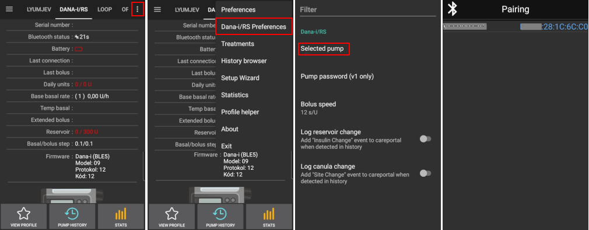
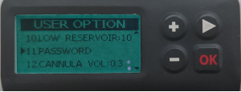

* * *

orphan: true

* * *

# DanaRS 和 Dana-i 泵

*本指南适用于2017年起发布的DanaRS及新款Dana-i泵体的应用程序配置。 若使用初代DanaR泵体，请参阅[DanaR胰岛素泵](./DanaR-Insulin-Pump.md)章节。*

**AAPS 2.7及以上版本支持新版Dana RS固件v3。**

**AAPS 3.0及以上版本支持Dana-i泵体。**

* DanaRS/i泵体中"基础率A"通道已被应用程序占用，原有数据将被覆盖。

(DanaRS-Insulin-Pump-pairing-pump)=

## 配对泵

* 在AAPS主界面点击左上角三横菜单，进入配置生成器。
* 在泵体选项中选择'Dana-i/RS'。
* 点击齿轮图标可直接进入泵体设置，或返回主界面。
    
    

* 进入'DANA-i/RS'标签页。

* 点击右上角三点图标选择偏好菜单。 
* 选择'Dana-i/RS偏好设置'。
* 单击“选择的泵”。
* 在配对窗口点击您的泵体条目。
    
    

* **需在泵体端确认配对！** 此操作与常规蓝牙配对流程一致（如手机与车载音响配对）。
    
    

* 根据泵体型号及固件版本执行配对流程：
    
    * DanaRS v1用户需在偏好设置中选择泵体密码并设置密码。
    * DanaRS v3用户需将泵体显示的两组数字字母组合输入AAPS配对对话框。
    * Dana-i用户需在标准Android配对对话框中输入泵体显示的6位数字。

* 选择大剂量输注速度可修改默认值（12秒/单位、30秒/单位或60秒/单位）。

* 通过医生菜单将泵体基础率步进值设为0.01单位/小时（详见泵体使用手册）。
* 通过医生菜单将泵体大剂量步进值设为0.05单位/小时（详见泵体使用手册）。
* 在泵上启用扩展大剂量

(DanaRS-Insulin-Pump-default-password)=

### 默认密码

* DanaRS固件v1/v2的默认密码为1234。
* DanaRS固件v3及Dana-i的默认密码采用生产日期MMDD格式（例如'0124'表示1月24日生产）。
    
    * 从主菜单选择查看功能，然后打开子菜单中的运输信息
    * 第三项为生产日期。 
    * v3/i版本中该密码仅用于锁定泵体菜单。 该密码不用于通信交互，也无需在AAPS中输入。

(DanaRS-Insulin-Pump-change-password-on-pump)=

## 修改泵体密码

* 按下泵上的确定按钮
* 在主菜单中选择"选项"（多次按右箭头键切换）
    
    

* 在选项菜单中选择"用户设置"
    
    

* 使用箭头按钮向下滚动到“11. 密码”
    
    

* 按确定输入旧密码。

* Enter **old password** (Default password see [above](#DanaRS-Insulin-Pump-default-password)) and press OK
    
    

* 此处输入错误密码时系统不会提示失败信息！

* 设置**新密码**（用加减键修改数字/按右箭头键切换）。
    
    

* 按 "确定 "按钮确认。

* 按 OK 保存设置。
    
    

* 向下移动到 "14. EXIT"（退出），然后按确定退出。
    
    

(DanaRS-Insulin-Pump-dana-rs-specific-errors)=

## Dana RS 特定错误

### 胰岛素输送过程中的错误

若AAPS与Dana RS在大剂量胰岛素输注期间断开连接（例如泵体输注时远离手机），将显示以下提示信息并触发警报音。

* 多数情况下仅为通信故障，实际胰岛素输注剂量仍准确。
* 请通过泵体历史记录（直接在泵体操作或通过Dana标签页>泵体历史>大剂量记录）核查实际输注剂量是否正确。
* 如需可删除[治疗记录](#screens-bolus-carbs)中的错误条目。
* 实际剂量将在下次连接时读取并记录。 强制读取可点击Dana标签页的蓝牙图标，或等待下次自动连接。

## 手机更换特别注意事项

更换新手机时必须执行以下步骤：

* 在旧手机[导出设置](../Maintenance/ExportImportSettings.md)
* 将设置从旧手机转移到新手机

### DanaRS v1

* **手动配对**Dana RS与新手机
* 由于泵体连接设置已导入，新手机上的AAPS将自动"识别"泵体，故不会启动蓝牙扫描。 因此必须手动完成新手机与泵体的配对。
* 在新手机上安装AAPS。
* 在新手机上[导入设置](../Maintenance/ExportImportSettings.md)

### DanaRS v3, Dana-i

* Start pairing procedure as described [above](#DanaRS-Insulin-Pump-pairing-pump).
* 有时需长按Dana-i/RS标签页的蓝牙图标清除AAPS中的配对信息。

## 使用Dana RS泵进行跨时区旅行

跨时区操作说明请参阅[泵体时区切换](#timezone-traveling-danarv2-danars)章节。