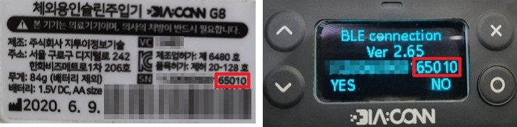

- - -
orphan: true
- - -

# Diaconn G8 胰岛素泵

## 胰岛素泵蓝牙配对

- 点击左上角的汉堡菜单。

- 点击 Config Builder。

- 选择 Diaconn G8 泵后，点击设置图标（齿轮）。

- 选择 Selected pump（选择的泵）。

- 在列表中出现您的胰岛素泵型号后，选择它。

- 有两种方法可以检查您的型号：

1. 泵背面 SN 码的最后 5 位数字。
2. 点击 O 按钮 \> Information（信息）> BLE > 最后 5 位数字。

- 选择您的泵后，会出现一个窗口，要求输入密码。 输入泵上显示的密码以完成连接。

 

## 泵状态检查和日志同步

- 泵连接后，点击蓝牙符号以检查状态并同步日志。

## 蓝牙故障排除

**当与泵的蓝牙连接不稳定时，该怎么办。**

### 方法 1) 在 AAPS 应用程序完成后再次检查泵。

- 点击右上角的 3 个点按钮。

- 点击 Exit（退出）。

### 方法 2) 如果第一种方法不起作用，断开蓝牙连接，然后重新连接。

- 按住顶部的蓝牙按钮约 3 秒钟。

- 点击已配对的 Diaconn G8 胰岛素泵上的 Setting（设置）按钮。

- 取消配对。

- 重复泵的蓝牙配对过程（见上文）。

## 更多信息

### Diaconn G8 胰岛素泵选项设置

- 配置管理器 > 泵体 > Diaconn G8 > 设置
- DIACONN G8顶部 > 右上角三点按钮 > Diaconn G8偏好设置

- 若启用**记录储药器更换**选项，发生"胰岛素更换"事件时将自动上传相关数据至careportal。
- 若启用**记录针头更换**选项，发生"输注部位更换"事件时将自动上传相关数据至careportal。
- 若启用**记录管路更换**选项，发生"管路更换"事件时将自动上传相关数据至careportal。
- 若启用**记录电池更换**选项，发生"电池更换"事件时将自动上传相关数据至careportal，同时操作标签页中的泵电池更换按钮将失效。 （注意：更换电池前请先停止所有正在执行的输注功能。）

### 扩展大剂量功能

- 使用扩展大剂量功能将关闭闭环系统。
- See [this page](#extended-bolus-and-why-they-wont-work-in-closed-loop-environment) for details why extended bolus does not work in a closed loop environment.
