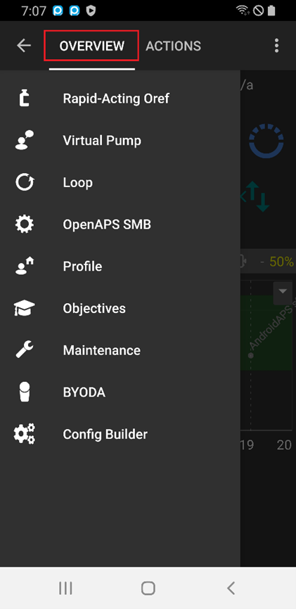
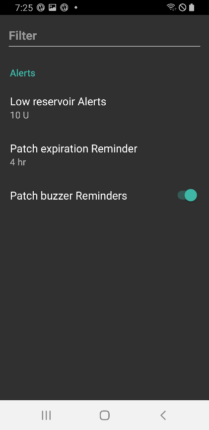
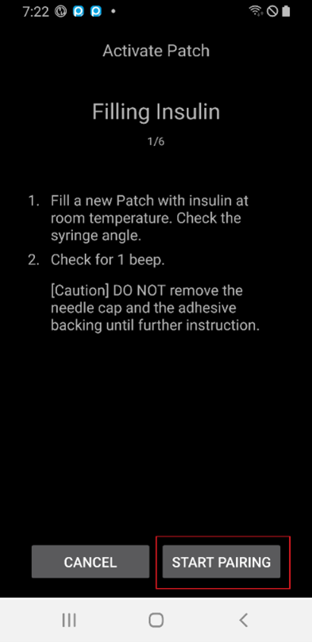
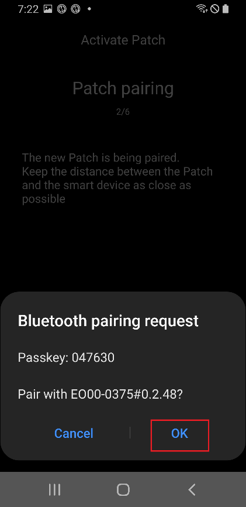
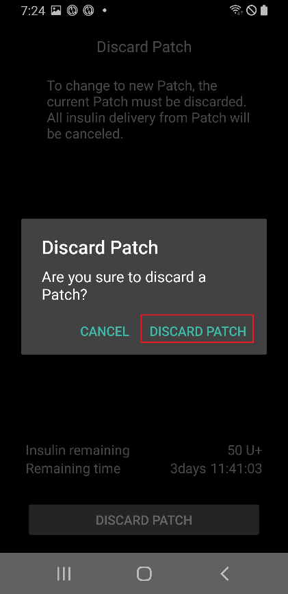
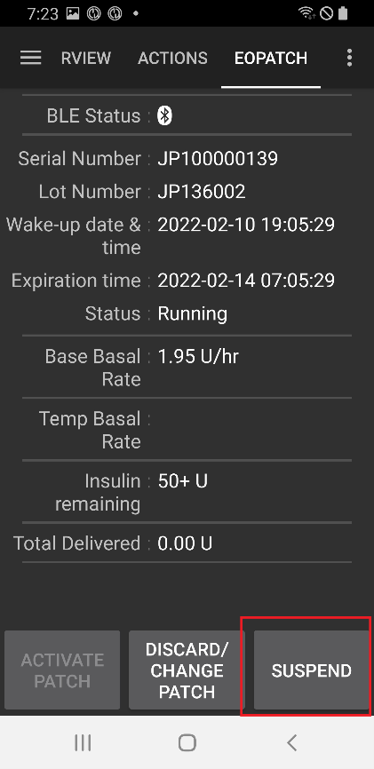
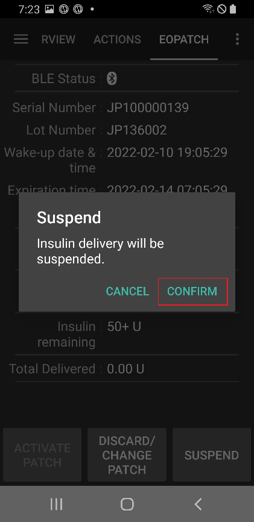
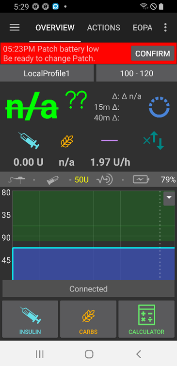

# EOPatch2 使用说明书

贴片泵需使用速效U-100型胰岛素（如诺和锐或优泌乐）。 根据医生处方使用适合您的速效胰岛素，并注射规定剂量。

使用贴片泵时最小可注射剂量为0.05单位，故配置文件基础率应设为≥0.05单位/小时且间隔为0.05单位/小时，否则可能导致配置文件预估总量与贴片实际输注量间出现误差。 同样地，大剂量也需设置最小输注量为0.05单位进行输注。

## 泵设置
1. 在AAPS主界面点击左上角汉堡菜单，进入配置生成器。
1. 在泵体选项中选择'EOPatch2'。
1. 按“返回”键返回主屏幕。

 

## 设置
在主界面顶部选择EOPATCH2进入EOPATCH2标签页。

点击右上角三点图标选择EOPatch2偏好设置菜单。

EOPatch2偏好设置菜单提供3种通知类型设定选项。

### 储药器药量低警告
当储药器内剩余胰岛素量达到或低于设定值时，贴片泵将显示警告。 可设置范围为10至50单位，以5单位为增量。

### 敷贴更换提醒
此为当前贴片到期前的剩余时间提醒功能。 可设置范围为1至24小时，以1小时为增量。 初始设定值为4小时。

### 贴片蜂鸣提醒
此为除基础输注外的注射提醒功能。 若使用(扩展)大剂量注射或临时基础率注射，贴片将在注射开始时及完成时发出蜂鸣声。 初始设定值为关闭。

## 连接贴片泵

### 转至贴片泵连接界面

在主界面顶部选择EOPATCH2，并点击左下角的激活贴片按钮。

### 连接贴片泵
将注射器针头插入贴片泵的胰岛素注入口，然后缓慢推动活塞注射胰岛素。 当注入胰岛素量超过80单位时，贴片泵会发出启动提示音（1声蜂鸣）并开始启动。 确认蜂鸣声后，点击屏幕上的开始配对按钮。

[警告]

- 在收到指示前请勿转动针头操作杆。 否则可能导致注射过程或安全检查中出现严重问题。
- 贴片泵可注射胰岛素量为80~200单位。 若初始注入量少于80单位，贴片泵将无法工作。
- 将准备注入贴片泵的胰岛素从冰箱取出，提前在室温下放置15至30分钟。 待注射胰岛素温度必须≥10°C。

### 贴片泵配对
贴片泵配对界面将显示，系统会自动尝试配对。 若通信成功，将显示蓝牙配对请求通知。 当出现带验证码的蓝牙配对请求通知时点击确定，第二次出现时再次选择确定。

[警告]

- 配对时，贴片泵与智能手机间距须保持在30厘米以内。
- 贴片泵启动完成后，将每3分钟发出一次蜂鸣直至配对完成。
- 贴片泵启动后，须在60分钟内通过应用程序完成敷贴操作。 若60分钟内无法完成敷贴，应弃用该贴片泵。

  

### 贴片泵准备
揭除贴片泵胶带后，请检查针头是否外露。 若贴片泵无异常，请点击下一步。

### 贴片泵敷贴
胰岛素应注射至皮下脂肪丰富而神经血管较少的部位，故推荐选择腹部、手臂或大腿作为贴片泵敷贴部位。 选择敷贴部位并消毒后，即可敷贴贴片泵。

[警告]

- 请确保将贴片泵胶带接触身体的一侧展平，使其完全贴合皮肤。
- 若贴片泵未完全粘合，空气可能渗入贴片与皮肤之间，导致粘附力及防水效果下降。

### 安全检查
敷贴完成后，请轻触开始安全检查。 安全检查完成后，贴片泵将发出一次蜂鸣声。

[警告]

- 为确保安全使用，在安全检查完成前请勿转动针头操作杆。

 

### 插入针头
手持贴片泵周围，将针头操作杆向上方转动超过100度即可完成插针。 正确插入针头时会发出蜂鸣提示音。 沿顺时针方向继续转动针头操作杆以释放该装置。 点击“下一步”。

[注意]

- 若未听到蜂鸣声就进入下一步，将出现针头插入错误警告。

## 废弃贴片泵
当胰岛素余量不足、使用到期或设备出现缺陷时，必须更换贴片泵。 每台贴片泵建议使用期限为启动后84小时。

### 废弃贴片泵
在主页顶部选择EOPATCH2，并点击底部废弃/更换贴片泵按钮。 在下一界面点击废弃贴片泵按钮。 将再次弹出确认对话框，选择废弃贴片泵按钮即可完成处置。

   

## 暂停和恢复胰岛素输注
暂停胰岛素输注将同时取消大剂量延注和临时基础率功能。 恢复胰岛素输注时，被取消的大剂量延注和临时基础率不会自动恢复。 胰岛素输注暂停期间，贴片泵将每15分钟发出提示音。

### 暂停胰岛素输注
在主页顶部选择EOPATCH2，并点击右下角暂停按钮。 选择确认框中的确定后，将出现时间选择框。 选定时间后点击确认按钮，胰岛素输注将按设定时长暂停。

  

### 恢复胰岛素输注
在主页顶部选择EOPATCH2，并点击右下角恢复按钮。 在确认对话框中选择确定即可恢复胰岛素输注。

 

## 警报/警告

### 报警

警报针对最高优先级的紧急情况发出，需立即采取应对措施。 该警报信号在被确认前不会自动消失或超时终止。 当使用中的贴片泵出现问题时将触发警报，此时可能需要废弃当前设备并更换新贴片泵。 警告信息将以对话框形式显示，在处理完成前无法切换至其他界面。

 

各类警报说明如下。

| 报警      | 说明                                                         |
| ------- | ---------------------------------------------------------- |
| 储药器空了   | 当贴片泵储药器内胰岛素耗尽时触发。                                          |
| 贴片泵过期   | 当贴片泵使用期限届满且无法继续输注胰岛素时触发。                                   |
| 堵管      | 当检测到贴片泵胰岛素入口堵塞时触发。                                         |
| 上电自检失败  | 当贴片泵在启动后自检过程中发现意外错误时触发。                                    |
| 温度异常    | 当贴片泵在佩戴使用期间超出正常工作温度范围时触发。 处理此警报需将贴片泵移至适宜工作温度环境（4.4至37摄氏度）。 |
| 针头插入错误  | 当贴片泵佩戴过程中针头插入异常时触发。 请检查贴片泵针头插入端与针头启动按钮是否保持直线对齐。            |
| 贴片泵电池故障 | 当贴片泵内置电池即将耗尽并关机前触发。                                        |
| 贴片泵启动故障 | 当贴片泵启动后60分钟内应用程序未能完成佩戴流程时触发。                               |
| 贴片泵故障   | 当贴片泵在佩戴使用过程中遭遇意外错误时触发。                                     |

### 警告

在中等或低优先级情况下会发出警告。 警告触发时，将以通知形式显示在总览界面。

各类警告说明如下。

| 警告        | 说明                             |
| --------- | ------------------------------ |
| 胰岛素暂停结束   | 当用户设定的胰岛素输注暂停时间届满时触发。          |
| 储药量低      | 当贴片泵内剩余胰岛素低于设定量时触发。            |
| 贴片泵使用期限届满 | 当贴片泵使用期限届满时触发。                 |
| 贴片泵即将到期   | 当贴片泵达到必须废弃时间前1小时触发。            |
| 贴片泵启动未完成  | 当贴片泵完成配对后的佩戴阶段因中断导致耗时超过3分钟时触发。 |
| 贴片泵电量不足   | 当贴片泵电池电量不足时触发。                 |

