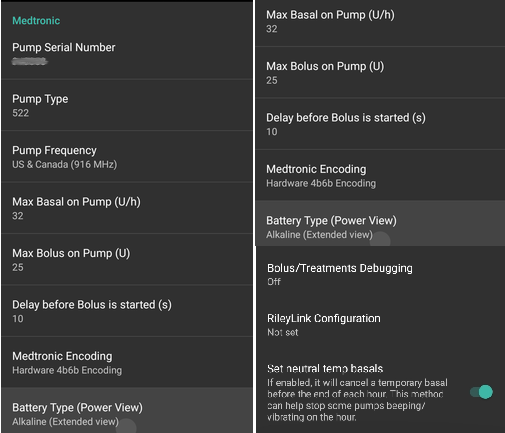
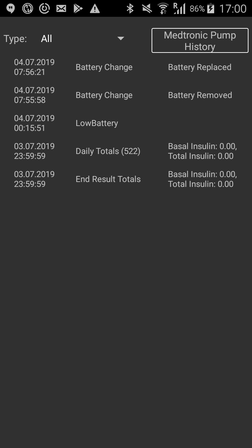
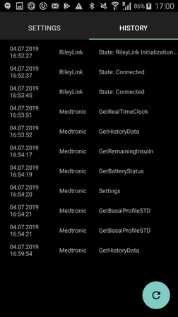

* * *

orphan: true

* * *

# 美敦力胰岛素泵

该驱动不适用于任何新型号，包括所有以G结尾的型号（530G、600系列[630G、640G、670G]、700系列[770G、780G]等）。

以下型号与固件组合兼容：

- 512/712（任何固件版本）
- 515/715（任何固件版本）
- 522/722（任何固件版本）
- 523/723（固件 2.4A 或更低版本）
- 554/754 欧盟版（固件 2.6A 或更低版本）
- 554/754 加拿大版（固件 2.7A 或更低版本）

您可在[OpenAPS文档](https://openaps.readthedocs.io/en/latest/docs/Gear%20Up/pump.html#how-to-check-pump-firmware-check-for-absence-of-pc-connect)或[LoopDocs](https://loopkit.github.io/loopdocs/build/step3/#medtronic-pump-firmware)中查看如何检查泵的固件版本。

## 硬件和软件要求

- **电话：** 美敦力驱动程序应适用于任何支持蓝牙连接的安卓手机。 **重要提示：</0> 手机制造商的蓝牙实现方式可能有所不同，因此每种手机型号的表现也可能不同。 例如，某些手机处理启用/禁用蓝牙的方式会有所不同。 这可能会影响当AAPS需要重新连接到您的Rileylink类型设备时的用户体验。**
- **RileyLink兼容设备：** 安卓手机无法直接与美敦力泵通信，需要额外的设备来处理通信。 该设备将通过蓝牙与您的手机连接，并通过兼容的无线连接与您的泵通信。 首个此类设备被称为Rileylink，但现在已有多种其他选择可提供额外功能。
    
    - Rileylink可在[getrileylink.org](https://getrileylink.org/product/rileylink916)获取
    - Orangelink可在[getrileylink.org](https://getrileylink.org/product/orangelink)获取
    - Emalink(多种型号可选)可在[github.com](https://github.com/sks01/EmaLink)获取
    - Gnarl(需要额外DIY)详情请见[github.com](https://github.com/ecc1/gnarl)

各款Rileylink兼容设备的对比图表可在[getrileylink.org](https://getrileylink.org/rileylink-compatible-hardware-comparison-chart)查看

(MedtronicPump-configuration-of-the-pump)=

## 配置您的泵：

为便于AAPS远程发送指令，需在泵上配置以下设置。 美敦力715泵上更改每个设置所需的操作步骤已在各项设置后用括号标出。 具体步骤可能因泵型号和/或固件版本而异。

- **启用泵的远程模式**（在泵上按Act键，进入Utilities -> Remote Options，选择On，在下一屏幕选择Add ID并添加任意随机ID如111111）。 远程ID列表中必须至少有一个ID，泵才会接收远程通信。
- **设置最大基础率**（在泵上按Act键，进入Basal然后选择Max Basal Rate）例如，将此值设置为标准最大基础率的四倍将允许400%的临时基础率。 泵允许的最大值为每小时34.9单位。
- **设置最大单次剂量**（在泵上按Act键，进入Bolus然后选择Max Bolus）这是泵将接受的最大单次剂量。 泵允许的最大值为25单位。
- **将配置文件设为标准**。 （在泵上按Act键，进入Basal然后选择Patterns）泵只需一个配置文件，因为AAPS将在您的手机上管理不同的配置文件。 无需其他模式。
- **设置临时基础率类型**（在泵上按Act键，进入Basal然后选择Temp Basal Type）。 选择绝对量（非百分比）。

## 手机/AAPS的美敦力配置

- **不要通过手机蓝牙菜单配对RileyLink兼容设备。** 若通过手机蓝牙菜单配对，按照以下说明操作时将导致AAPS无法识别您的RileyLink兼容设备。
- 禁用您手机上的自动屏幕旋转功能。 在某些设备上，自动屏幕旋转会导致蓝牙会话重新启动，这会给您的美敦力泵带来问题。 
- 在AAPS中有两种配置美敦力泵的方式：

1. 使用新安装时的设置向导
2. 通过在Config Builder的泵选择选项中点击美敦力选项旁的齿轮图标

使用设置向导配置美敦力泵时，可能会因蓝牙问题（例如无法成功连接泵）而无法完成设置。 若发生此情况，您应选择虚拟泵选项以完成配置，并通过使用选项2进行进一步故障排除。

在设置AAPS与您的美敦力泵配合使用时，需要配置以下项目：(参见上图)

- **泵序列号**：显示在泵背面，以SN开头。 只需输入显示的6位数字，无需输入任何字母字符（例如123456）。
- **泵型号**：您正在使用的泵型号（例如522）。 
- **泵频率**：根据泵的原始销售地区有两种选项。 Please check the [FAQ](#MedtronicPump-faq) if you are unsure which option to select): 
    - 美国及加拿大地区使用的频率为916 MHz
    - 全球其他地区使用的频率为868 MHz
- **泵上最大基础率（单位/小时）**：必须与泵上的设置保持一致（参见上文泵配置部分）。 此设置必须谨慎选择，因为它将决定AAPS能通过基础率输送多少胰岛素。 这将实际设定临时基础率的最大值。 例如，将此值设为标准最大基础率的四倍，将允许400%的临时基础率。 泵允许的最大值为每小时34.9单位。
- **泵上最大单次剂量（单位）**（每小时）：必须与泵上的设置保持一致（参见上文泵配置部分）。 此设置需慎重考虑，因为它决定了AAPS能设置的单次剂量上限。
- **单次剂量开始前延迟（秒）**：发出单次剂量指令后，实际发送至泵前的等待秒数。 这段延迟时间允许用户在错误发送单次剂量指令时取消操作。 已通过AAPS启动的单次剂量无法取消。 取消已启动单次剂量的唯一方法是手动暂停泵，然后恢复运行。
- **美敦力编码**：决定是否执行美敦力编码。 首选选择硬件编码（即由Rileylink兼容设备执行），这样可减少数据传输量。 若出现频繁断开连接的情况，选择软件编码（即由AAPS执行）可能有所帮助。 如果您在Rileylink设备上使用0.x版本固件，此设置将被忽略。
- **电池类型（电量显示）**：为准确判断剩余电量，请选择当前使用的AAA电池类型。 当选择非简易视图时，AAPS将显示计算得出的剩余电量百分比及电压值。 可选选项如下：
    
    - 未选择 (简单视图)
    - 碱性电池 (扩展视图)
    - 锂电池(扩展视图)
    - 镍锌电池(扩展视图)
    - 镍氢电池 (扩展视图)
- **单次剂量/治疗调试**：根据需求选择开启或关闭。

- **RileyLink配置**：此选项可用于查找并配对您的Rileylink兼容设备。 选择此项将显示附近所有Rileylink兼容设备及其信号强度。
- **启用扫描** 在与Rileylink兼容设备连接前启动蓝牙扫描功能。 这将提高设备连接的可靠性。
- **显示OrangeLink/EmaLink/DiaLink报告的电池电量** 此功能仅适用于新型连接设备（如EmaLink或OrangeLink）。 数值将在AndroidAPS的美敦力标签页中显示。 
- **设置中性温度基础率** 默认情况下，美敦力泵在临时基础率激活时会每小时发出提示音。 启用此选项可通过在整点切换时中断临时基础率来减少提示音次数。

## 美敦力(MDT)标签页

 当AAPS配置为使用美敦力泵时，屏幕顶部的标签列表中将显示一个MDT标签。 该标签显示当前泵状态信息以及一些美敦力特定操作。

- **RileyLink状态**：显示手机与Rileylink兼容设备之间的当前连接状态。 这应始终显示为"已连接"。 任何其他状态都可能需要用户干预。 
- **RileyLink电量**：显示EmaLink或OrangeLink设备的当前电量。 取决于是否在美敦力泵配置菜单中选择"显示OrangeLink/EmaLink/DiaLink设备报告的电量"。
- **泵状态**：显示泵连接的当前状态。 由于泵不会持续连接，这里主要会显示睡眠图标。 其他可能状态包括：AAPS尝试发送命令时的"正在唤醒"状态，以及其他可能的泵命令状态如"获取时间"、"设置临时基础率"等。
- **电池**：根据美敦力泵配置菜单中"电池类型(电量显示)"选项的选择值显示电池状态。 
- **上次连接**：显示最近一次成功泵连接发生的时间间隔。
- **上次大剂量**：显示最近一次成功输送大剂量的时间间隔。
- **基础率**：这是您当前配置文件中泵在此小时运行的基础率。
- **临时基础率**：当前正在输送的临时基础率，可能为0单位/小时。
- **储药器**：储药器中的胰岛素量(至少每小时更新一次)。
- **错误**：出现问题时显示的错误字符串(主要显示配置中的错误)。

屏幕底部有三个按钮：

- **刷新**用于刷新泵的当前状态。 仅当连接长时间中断时才应使用此功能，因为这将需要完整的数据刷新(检索历史记录、获取/设置时间、获取配置文件、获取电池状态等)。
- **Pump History**: Shows pump history (see [below](#MedtronicPump-pump-history))
- **RL Stats**: Show RL Stats (see [below](#MedtronicPump-rl-status-rileylink-status))

(MedtronicPump-MedtronicPump-pump-history)=

## 泵历史记录

泵历史记录每5分钟检索一次并存储在本地。 仅存储最近24小时的历史记录。 这为查看泵行为（如有需要）提供了便捷方式。 仅存储与AAPS相关的项目，不包括无关的配置功能。

(MedtronicPump-MedtronicPump-rl-status-rileylink-status)=

## RL状态(RileyLink状态)

 

RL状态对话框包含两个标签页：

- **设置**：显示RileyLink兼容设备的设置信息：配置地址、连接设备、连接状态、连接错误和RileyLink固件版本。 设备类型始终为美敦力泵，型号即您的泵型号，序列号为配置的序列号，泵频率显示您使用的频率，最后频率为上次使用的频率。
- **历史记录**：显示通信历史记录，其中带有RileyLink的项目显示RileyLink状态变更，美敦力项目显示发送给泵的指令。

## 手动操作

使用美敦力驱动时，操作选项卡会新增两个操作项：

- **唤醒并调谐** - 若AAPS长时间未连接您的泵(本应每5分钟连接一次)，可强制进行调谐。 此操作将通过搜索您泵可能使用的所有无线电频率来尝试建立连接。 若成功建立连接，该成功频率将被设为默认值。
- **重置RileyLink配置** - 若您重置了RileyLink兼容设备，可能需要使用此操作重新配置设备(设置频率、频率类型及编码配置)。

## 重要说明

### 需要特别注意NS配置

AAPS使用序列号进行同步，且该序列号会暴露给NS。 由于掌握旧款美敦力泵的序列号可能被用于远程控制泵，请特别注意强化NS站点防护，防止泵序列号泄露。 参见 https://nightscout.github.io/nightscout/security/

### OpenAPS用户

OpenAPS用户须知：AAPS与美敦力泵配合使用的方案与OpenAPS完全不同。 使用AAPS时，与泵交互的主要方式是通过手机。 在常规使用场景下，通常仅需在更换储药器时使用泵菜单。 这与OpenAPS的使用方式截然不同——OpenAPS通常需要通过快速大剂量按钮来输送至少部分药量。 若通过泵手动输送大剂量时，AAPS若同时尝试输送药量可能导致冲突。 系统设有检查机制来预防此类问题，但仍应尽可能避免这种情况。

### 日志记录

如需排查美敦力泵功能问题，请点击屏幕左上角菜单图标，选择"维护"和"日志设置"。 排查美敦力问题时，需勾选Pump(泵)、PumpComm(泵通信)、PumpBTComm(泵蓝牙通信)日志项。

### 美敦力CGM

美敦力CGM当前不受支持。

### 手动操作泵

应避免在泵上手动输注大剂量或设置临时基础率。 所有此类指令均应通过AAPS发送。 若必须手动操作，每次操作间隔需至少3分钟以降低风险。

### 时区变更、夏令时(DST)及携带美敦力泵与AAPS出行注意事项

AAPS会自动检测时区变更，并在手机切换至新时间时更新泵的时间。

向东旅行意味着您将在当前时间上增加小时数（例如 从GMT+0到GMT+2）不会产生任何问题，因为时间不会重叠（例如同一小时不会重复出现）。 但向西旅行可能导致问题，因为时间实际上会倒流，从而造成IOB数据错误。

开发人员已知晓向西旅行时出现的问题，目前正在研究可能的解决方案。 详情参见 https://github.com/andyrozman/RileyLinkAAPS/issues/145。 目前请注意该问题可能发生，变更时区时需谨慎监测。

### GNARL是否完全兼容Rileylink设备？

GNARL代码完全支持AAPS中美敦力驱动器的所有功能，这意味着它是完全兼容的。 需注意：这需要额外操作，您必须获取兼容硬件并将GNARL代码加载至设备。

**作者说明：** 请注意GNARL软件仍处于实验阶段且测试有限，其安全性暂无法与RileyLink相提并论。

(MedtronicPump-faq)=

## 常见问题解答

(MedtronicPump-what-to-do-if-i-loose-connection-to-rileylink-and-or-pump)=

### 若与RileyLink和/或泵的连接中断该如何处理？

可尝试以下多种方法解决连接问题。

- 按照前文说明，使用ACT标签页中的"唤醒并调谐"按钮。
- 禁用手机蓝牙10秒后重新启用。 这将强制Rileylink设备重新连接手机。
- 重置Rileylink设备。 随后必须点击ACT标签页中的"重置Rileylink配置"按钮。
- 其他用户发现，当常规方法无效时，以下步骤可有效恢复连接： 
    1. 重新启动手机
    2. *在*手机重启期间同时重启Rileylink设备
    3. 打开AAPS并等待连接恢复

### 如何确定我的泵使用什么频率

泵背面标有型号及特殊三字母代码。 前两个字母决定频率类型，最后一个字母决定颜色。 以下是频率的可能取值：

- NA - 北美地区（频率选择中需选"美国及加拿大(916 MHz)"）
- CA - 加拿大（频率选择中需选"美国及加拿大(916 MHz)"）
- WW - 全球范围（频率选择中需选"全球(868 MHz)"）