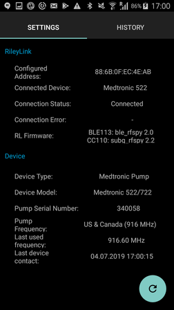
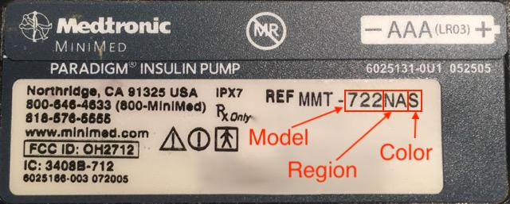

* * *

orphan: true

* * *

# 美敦力胰岛素泵

该驱动不适用于任何新型号，包括所有以G结尾的型号（530G、600系列[630G、640G、670G]、700系列[770G、780G]等）。

以下型号与固件组合兼容：

- 512/712（任何固件版本）
- 515/715（任何固件版本）
- 522/722（任何固件版本）
- 523/723（固件 2.4A 或更低版本）
- 554/754 欧盟版（固件 2.6A 或更低版本）
- 554/754 加拿大版（固件 2.7A 或更低版本）

您可在[OpenAPS文档](https://openaps.readthedocs.io/en/latest/docs/Gear%20Up/pump.html#how-to-check-pump-firmware-check-for-absence-of-pc-connect)或[LoopDocs](https://loopkit.github.io/loopdocs/build/step3/#medtronic-pump-firmware)中查看如何检查泵的固件版本。

## 硬件和软件要求

- **电话：** 美敦力驱动程序应适用于任何支持蓝牙连接的安卓手机。 **重要提示：</0> 手机制造商的蓝牙实现方式可能有所不同，因此每种手机型号的表现也可能不同。 例如，某些手机处理启用/禁用蓝牙的方式会有所不同。 这可能会影响当AAPS需要重新连接到您的Rileylink类型设备时的用户体验。**
- **RileyLink兼容设备：** 安卓手机无法直接与美敦力泵通信，需要额外的设备来处理通信。 该设备将通过蓝牙与您的手机连接，并通过兼容的无线连接与您的泵通信。 首个此类设备被称为Rileylink，但现在已有多种其他选择可提供额外功能。
    
    - Rileylink可在[getrileylink.org](https://getrileylink.org/product/rileylink916)获取
    - Orangelink可在[getrileylink.org](https://getrileylink.org/product/orangelink)获取
    - Emalink(多种型号可选)可在[github.com](https://github.com/sks01/EmaLink)获取
    - Gnarl(需要额外DIY)详情请见[github.com](https://github.com/ecc1/gnarl)

各款Rileylink兼容设备的对比图表可在[getrileylink.org](https://getrileylink.org/rileylink-compatible-hardware-comparison-chart)查看

(MedtronicPump-configuration-of-the-pump)=

## 配置您的泵：

为便于AAPS远程发送指令，需在泵上配置以下设置。 美敦力715泵上更改每个设置所需的操作步骤已在各项设置后用括号标出。 具体步骤可能因泵型号和/或固件版本而异。

- **启用泵的远程模式**（在泵上按Act键，进入Utilities -> Remote Options，选择On，在下一屏幕选择Add ID并添加任意随机ID如111111）。 远程ID列表中必须至少有一个ID，泵才会接收远程通信。
- **设置最大基础率**（在泵上按Act键，进入Basal然后选择Max Basal Rate）例如，将此值设置为标准最大基础率的四倍将允许400%的临时基础率。 泵允许的最大值为每小时34.9单位。
- **设置最大单次剂量**（在泵上按Act键，进入Bolus然后选择Max Bolus）这是泵将接受的最大单次剂量。 泵允许的最大值为25单位。
- **将配置文件设为标准**。 （在泵上按Act键，进入Basal然后选择Patterns）泵只需一个配置文件，因为AAPS将在您的手机上管理不同的配置文件。 无需其他模式。
- **设置临时基础率类型**（在泵上按Act键，进入Basal然后选择Temp Basal Type）。 选择绝对量（非百分比）。

## 手机/AAPS的美敦力配置

- **不要通过手机蓝牙菜单配对RileyLink兼容设备。** 若通过手机蓝牙菜单配对，按照以下说明操作时将导致AAPS无法识别您的RileyLink兼容设备。
- 禁用您手机上的自动屏幕旋转功能。 在某些设备上，自动屏幕旋转会导致蓝牙会话重新启动，这会给您的美敦力泵带来问题。 
- 在AAPS中有两种配置美敦力泵的方式：

1. 使用新安装时的设置向导
2. 通过在Config Builder的泵选择选项中点击美敦力选项旁的齿轮图标

使用设置向导配置美敦力泵时，可能会因蓝牙问题（例如无法成功连接泵）而无法完成设置。 若发生此情况，您应选择虚拟泵选项以完成配置，并通过使用选项2进行进一步故障排除。

在设置AAPS与您的美敦力泵配合使用时，需要配置以下项目：(参见上图)

- **泵序列号**：显示在泵背面，以SN开头。 只需输入显示的6位数字，无需输入任何字母字符（例如123456）。
- **泵型号**：您正在使用的泵型号（例如522）。 
- **泵频率**：根据泵的原始销售地区有两种选项。 如不确定选择哪个选项，请查阅[常见问题](#faq)）： 
    - 美国及加拿大地区使用的频率为916 MHz
    - 全球其他地区使用的频率为868 MHz
- **泵上最大基础率（单位/小时）**：必须与泵上的设置保持一致（参见上文泵配置部分）。 此设置必须谨慎选择，因为它将决定AAPS能通过基础率输送多少胰岛素。 这将实际设定临时基础率的最大值。 例如，将此值设为标准最大基础率的四倍，将允许400%的临时基础率。 泵允许的最大值为每小时34.9单位。
- **泵上最大单次剂量（单位）**（每小时）：必须与泵上的设置保持一致（参见上文泵配置部分）。 此设置需慎重考虑，因为它决定了AAPS能设置的单次剂量上限。
- **单次剂量开始前延迟（秒）**：发出单次剂量指令后，实际发送至泵前的等待秒数。 这段延迟时间允许用户在错误发送单次剂量指令时取消操作。 已通过AAPS启动的单次剂量无法取消。 取消已启动单次剂量的唯一方法是手动暂停泵，然后恢复运行。
- **美敦力编码**：决定是否执行美敦力编码。 首选选择硬件编码（即由Rileylink兼容设备执行），这样可减少数据传输量。 若出现频繁断开连接的情况，选择软件编码（即由AAPS执行）可能有所帮助。 如果您在Rileylink设备上使用0.x版本固件，此设置将被忽略。
- **电池类型（电量显示）**：为准确判断剩余电量，请选择当前使用的AAA电池类型。 当选择非简易视图时，AAPS将显示计算得出的剩余电量百分比及电压值。 可选选项如下：
    
    - 未选择 (简单视图)
    - 碱性电池 (扩展视图)
    - 锂电池(扩展视图)
    - 镍锌电池(扩展视图)
    - 镍氢电池 (扩展视图)
- **单次剂量/治疗调试**：根据需求选择开启或关闭。

- **RileyLink配置**：此选项可用于查找并配对您的Rileylink兼容设备。 选择此项将显示附近所有Rileylink兼容设备及其信号强度。
- **启用扫描** 在与Rileylink兼容设备连接前启动蓝牙扫描功能。 这将提高设备连接的可靠性。
- **显示OrangeLink/EmaLink/DiaLink报告的电池电量** 此功能仅适用于新型连接设备（如EmaLink或OrangeLink）。 数值将在AndroidAPS的美敦力标签页中显示。 
- **设置中性温度基础率** 默认情况下，美敦力泵在临时基础率激活时会每小时发出提示音。 启用此选项可通过在整点切换时中断临时基础率来减少提示音次数。

## 美敦力(MDT)标签页

 When AAPS is configured to use a Medtronic pump a MDT tab will be shown in the list of tabs at the top of the screen. This tab displays the current pump status information along with some Medtronic specific actions.

- **RileyLink Status**: The current status of the connection between your phone and Rileylink compatible device. This should show as Connected at all times. Any other status may require user intervention. 
- **RileyLink Battery**: The current battery level of your EmaLink or OrangeLink device. Dependent on selecting "Show battery level reported by OrangeLink/EmaLink/DiaLink device" in the Medtronic Pump Configuration menu.
- **Pump Status**: The current status of the pump connection. As the pump will not be constantly connected this will primarily show the sleep icon. There are a number of possible other status including "Waking Up" when AAPS is trying to issue a command or other possible pump commands such as "Get Time", "Set TBR", etc.
- **Battery**: Shows battery status based on the value chosen for Battery Type (Power View) in the Medtronic Pump Configuration menu. 
- **Last connection**: How long ago the last successful pump connection happened.
- **Last Bolus**: How long ago the last successful bolus was delivered.
- **Base Basal Rate**: This is the base basal rate that runs on pump at this hour in your active Profile.
- **Temp basal**: Temp basal currently being delivered which can be 0 units per hour.
- **Reservoir**: How much insulin is in reservoir (updated at least every hour).
- **Errors**: Error string if there is problem (mostly shows if there is error in configuration).

At the bottom of the screen there are three buttons:

- **Refresh** is for refreshing the current status of the pump. This should only be used if the connection was lost for a sustained period as this will require a full data refresh (retrieve history, get/set time, get profile, get battery status, etc).
- **Pump History**: Shows pump history (see [below](#pump-history))
- **RL Stats**: Show RL Stats (see [below](#rl-status-rileylink-status))

(MedtronicPump-pump-history)=

## Pump History

Pump history is retrieved every 5 minutes and stored locally. Only the previous 24 hours worth of history is stored. The allows for a convenient way to see pump behaviour should that be required. The only items stored are those relevenant to AAPS and will not include a configuration function that has no relevance.

(MedtronicPump-rl-status-rileylink-status)=

## RL Status (RileyLink Status)

 

The RL Status dialog has two tabs:

- **Settings**: Shows settings about the RileyLink compatible device: Configured Address, Connected Device, Connection Status, Connection Error and RileyLink Firmware versions. Device Type is always Medtronic Pump, Model would be your model, Serial number is configured serial number, Pump Frequency shows which frequency you use, Last Frequency is last frequency used.
- **History**: Shows communication history, items with RileyLink shows state changes for RileyLink and Medtronic shows which commands were sent to pump.

## 手动操作

When the Medtronic driver is used, two additional actions are added to Actions Tab:

- **Wake and Tune Up** - In the event that AAPS hasn't connected to your pump for a sustained period (it should connect every 5 minutes), you can force a Tune Up. This will try to contact your pump, by searching all of the possible radio frequencies used by your pump. In the event a successful connection is made the successful frequency will be set as the default.
- **Reset RileyLink Config** - If you reset your RileyLink compatible device you may need to use this action so that device can be reconfigured (frequency set, frequency type set, encoding configured).

## Important notes

### Special attention in NS configuration needed

AAPS is using serial number for synchronization and serial number is exposed to NS. Because knowledge of serial number of old Medtronic pump can be used to control the pump remotely take special care to hardening NS site preventing leakage of SN of your pump. See https://nightscout.github.io/nightscout/security/

### OpenAPS users

OpenAPS users should note that AAPS with Medtronic uses a completely different approach than OpenAPS. Using AAPS the primary method of interacting with th pump is via your phone. In normal use cases it is likely that the only time it is required to use the pump menu is when changing resevoirs. This is very different when using OpenAPS where at least some of a bolus is usually delivered via the quick bolus buttons. In the event the pump is used to manually deliver a bolus there can be issues if AAPS attempts to deliver one at the same time. There are checks to try and prevent issues in such cases but this should still be avoided where possible.

### Logging

In the event you need to troubleshoot your Medtronic pump function select the menu icon in the upper left corner of the screen, select Maintenance and Log Settings. For troubleshooting any Medtronic issues Pump, PumpComm, PumpBTComm should be checked.

### Medtronic CGM

Medtronic CGM is currently NOT supported.

### Manual use of pump

You should avoid manually bolusing or setting TBRs on your pump. All such commands should be sent via AAPS. In the event manual commands are used there must be a delay of at least 3 minutes between them in order to reduce the risk of any issues.

### Timezone changes and DST (Daylight Saving Time) or Traveling with Medtronic Pump and AAPS

AAPS will automatically detect Timezone changes and will update the Pump's time when your phone switches to the new time.

Travelling east means you are going to be adding hours to the current time (ex. from GMT+0 to GMT+2) will not result in any issues as there will be no overlap (e.g. it won't be possible to have the same hour twice). Travelling west however can result in issues as you are effectively going back in time which can result in incorrect IOB data.

The issues seen when travelling west are known to the developers and work on a possible solution is ongoing. See https://github.com/andyrozman/RileyLinkAAPS/issues/145 for more detail. For now, please be aware that this issue may occur and carefully monitor when changing time zones.

### Is a GNARL a fully compatible Rileylink compatible device?

The GNARL code fully supports all of the functions used by the Medtronic driver in AAPS which means it is fully compatible. It is important to note that this will require additional work as you will have to source compatible hardware and then load the GNARL code on to the device.

**Note from author:** Please note that the GNARL software is still experimental and lightly tested, and should not be considered as safe to use as a RileyLink.

(MedtronicPump-faq)=

## FAQ

(MedtronicPump-what-to-do-if-i-loose-connection-to-rileylink-and-or-pump)=

### What to do if I loose connection to RileyLink and/or pump?

There are a number of options to try and resolve connectivity issues.

- Use the "Wake Up and Tune" button in the ACT tab as detailed above.
- Disable Bluetooth on your phone, wait 10 seconds and then enable it again. This will force the Rileylink device to reconnect to the phone.
- Reset the Rileylink device. You must then use the "Reset Rileylink Config" button in the ACT tab.
- Other users have found the following steps to be effective in restoring connectivity when other methods have not: 
    1. Restart the phone
    2. *While* the phone is restarting restart the Rileylink device
    3. Open AAPS and allow the connection to restore

### How to determine what Frequency my pump uses

On the back of the pump you will find a line detailing your model number along with a special 3 letter code. The first two letters determine the frequency type and the last one determines color. Here are possible values for Frequency:

- NA - North America (in frequency selection you need to select "US & Canada (916 MHz)")
- CA - Canada (in frequency selection you need to select "US & Canada (916 MHz)")
- WW - Worldwide (in frequency selection you need to select "Worldwide (868 Mhz)")