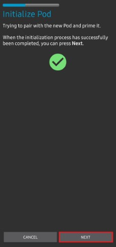
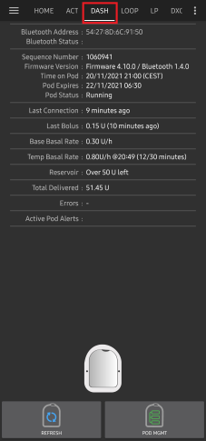
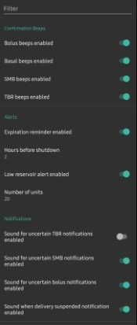

- - -
orphan: true
- - -

# Omnipod DASH

本说明适用于配置**Omnipod DASH**代泵**(非Omnipod Eros)**，该功能作为**AAPS** 3.0版本的一部分提供。

## Omnipod DASH 规格说明

以下是**Omnipod DASH**（简称"DASH"）的规格说明及其与**Omnipod EROS**（简称"EROS"）的主要区别：

* DASH 储药器采用蓝色针头帽标识（EROS 使用透明针头帽）。 除标识外，两种储药器的物理尺寸完全一致。
*  DASH 无需蓝牙连接/桥接设备（不需要 RileyLink、OrangeLink 或 EmaLink）。
* DASH 的蓝牙连接仅在需要时启用，完成指令传输后立即断开！
* DASH 彻底消除了"无法连接桥接设备/储药器"的报错。
* **AAPS** 将等待储药器可连接状态时发送指令。
* 在储药器激活时，**AAPS** 将自动搜寻并连接新的 DASH 储药器。
* 预期连接范围：5-10米（实际效果可能因环境而异）。

```{admonition} Android 15
:class: warning

There are currently reported Bluetooth connection issues with the following combination of **AAPS**: DASH + Android 15.
Please refrain from upgrading your phone to Android 15 unless you have checked the following [**list**](https://docs.google.com/spreadsheets/u/1/d/e/2PACX-1vScCNaIguEZVTVFAgpv1kXHdsHl3fs6xT6RB2Z1CeVJ561AvvqGwxMhlmSHk4J056gMCAQE02sAWJvT/pubhtml?gid=683363241&amp;single=true) and verified that your phone is not a known reported issue.
If you experience frequent disconnection; try to enable Bond BT as described in: [**Bluetooth Issues**](../GettingHelp/GeneralTroubleshooting.md). 
```

## 硬件/软件要求

* DASH 以蓝色针头帽为标识。


* **兼容的安卓手机**需具备BLE蓝牙连接功能  
  请注意，**AAPS**的Omnipod Dash驱动每次发送指令时都会通过蓝牙与DASH连接，并在完成后立即断开。 蓝牙连接可能会受到与运行**AAPS**的手机相连的其他蓝牙设备（如耳机等）的干扰（在极少数情况下，某些手机型号可能会出现连接问题或储药器激活时/激活后的错误/丢失），也可能干扰其他设备。
   -  **使用[**构建APK**](../SettingUpAaps/BuildingAaps.md)说明构建并安装AAPS 3.0或更高版本**。
* [**持续血糖监测仪（CGM）**](../Getting-Started/CompatiblesCgms.md)

The instructions below explain how to activate a new pod session. Wait to close to expiry of a current pod session before trying to connect **AAPS** with a new pod. Once a pod is is cancelled it cannot reused and the disconnection will be final.

## 开始前的准备工作

**SAFETY FIRST** - you should not try to connect **AAPS** to a pod for the first time without having access to extra pods, insulin, and phone devices are a must have.

**Your Omnipod Dash PDM will become redundant after the AAPS Dash driver activates your pod.** Previously a user may have operated a PDM to send commands to your DASH. A DASH will only faciiliate a single device to send commands to communicate with it. The device that successfully activates the pod is the only device allowed to communicate with it from that point forward. This means that once you activate a DASH with your Android phone through the **AAPS**, **you will no longer be able to use your PDM with that pod**. The **AAPS** Dash driver in your Android phone is now your acting PDM.

*This does NOT mean you should throw away your PDM, it is recommended to keep it around as a backup and for emergencies, for instance when your phone gets lost or AAPS is not working correctly.*

**Your pod will not stop delivering insulin when it is not connected to AAPS**. Default basal rates are programmed on the pod on activation as defined in the current active **Profile**. As long as **AAPS** is operational it will send basal rate commands that run for a maximum of 120 minutes. When for some reason the pod does not receive any new commands (for instance because communication was lost due to Pod - phone distance) the pod will automatically fall back to default basal rates.

**AAPS Profile does not support a 30 minute basal rate time frame** If you are new to **AAPS** and are setting up your basal rate **Profile** for the first time, please be aware that basal rates starting on a half-hour basis are not supported, and programmes on an hourly basis. For example, if you have a basal rate of 1.1 units which starts at 09:30 and has a duration of 2 hours ending at 11:30, it is not possible replicate this im **AAPS**. You will need to change this 1.1 unit basal rate to a time range of either 9:00-11:00 or 10:00-12:00. Even though the DASH hardware itself supports the 30 minute basal rate **Profile** increments, **AAPS** does support this feature.

**0U/h profile basal rates are NOT supported in AAPS** While the DASH does support a zero basal rate, since **AAPS** uses multiples of the user's **Profile** basal rate to determine automated treatment; it cannot function with a zero basal rate. A temporary zero basal rate can be achieved through the "Disconnect pump" function or through a combination of Disable Loop/Temp Basal Rate or Suspend Loop/Temp Basal Rate. The lowest basal rate allowed in **AAPS** is 0.05U/h.

## 在AAPS中选择Dash

There are **two ways**:

### 方式一：全新安装

When installing **AAPS** for the first time, the **Setup Wizard** will guide new users through key features and installation requirements for **AAPS**. Select “DASH” when you reach Pump selection.


When in doubt you can also select “Virtual Pump” and select “DASH” later, after setting up **AAPS** (see option 2).

### 选项2：配置构建器

On an existing installation you can select the **DASH** pump from the Config builder:

On the top-left hand corner **hamburger menu** select **Config Builder (1)**\ ➜\ **Pump**\ ➜\ **Dash**\ ➜\ **Settings Gear (3)** by selecting the **radio button (2)** titled **Dash**.

Selecting the **checkbox (4)** next to the **Settings Gear (3)** will allow the DASH menu to be displayed as a tab in the **AAPS** interface titled **DASH**. Checking this box will facilitate your access to the DASH commands when using **AAPS**.

**NOTE:** A faster way to access the [**Dash settings**](#dash-settings) can be found below in the DASH settings section of this document.


### Omnipod驱动选择验证

To verify that you have selected the DASH in **AAPS**, if you have checked the box (4), **swipe to the left** from the **Overview** tab, where you will now see a **DASH** tab on **AAPS**. If this box is left unchecked, you’ll find the DASH tab in the hamburger menu upper left.


## Dash配置

Please **swipe left** to the **DASH** tab where you will be able to manage all pod functions (some of these functions are not enabled or visible without an active pod session):

 'Refresh' pod connectivity and status, be able to silence pod alarms when the pod beeps

 'Pod Management' (Activate, Deactivate, Play test beep, and Pod history)


### 激活Pod

1. 请进入**DASH**标签页，点击**储药器管理(1)**按钮，然后选择**激活储药器(2)**。


​    

2. 此时将显示**填充储药器**界面。 请在新储药器中装入至少80单位胰岛素，听到两声提示音后表明储药器已准备好进行初始化。 在计算3天所需胰岛素总量时，请注意储药器初始化过程将消耗约3-10单位胰岛素。

    

Ensure that the new pod and the phone running **AAPS** are within close proximity of each other and click the **Next** button.

**NOTE**: if the  error message below pops up _'Could not find an available pod for activation'_ (this can happen), do not panic. Click on the **Retry** button. In most situations activation will continue successfully.


3. 在**初始化储药器**界面，储药器将开始自检（您会听到"咔嗒"一声，随后是一连串滴答声，表明储药器正在进行自检程序）。  自检成功后会出现绿色勾选标记，此时**下一步**按钮将变为可点击状态。 点击**下一步**按钮完成储药器初始化，随后将显示**佩戴储药器**界面。

    

4. 接下来，请准备好输注部位以佩戴新储药器。 洗手消毒以避免感染风险。 使用肥皂水或酒精棉片清洁输注部位进行消毒，待皮肤完全晾干后再继续操作。 移除储药器的蓝色塑料针头保护帽。 如发现储药器有异常突出物或异样，请中止流程并更换新储药器。 确认无误后，撕下白色背胶纸，将储药器贴敷至选定的身体部位。 操作完成后，点击**下一步**按钮。


5. 此时将弹出**佩戴储药器**对话框。 **仅在您准备好部署导管时点击确定按钮**。


6. 点击**确定**后，DASH可能需要一些时间才能响应并插入导管（最长等待1-2分钟）。 请耐心等待。

 *注意：在插入导管前，建议捏起导管插入点附近的皮肤。 这能确保针头顺利插入，并降低导管堵塞的发生概率。*

    

7. 导管成功插入后会出现绿色勾选标记，**下一步**按钮将变为可点击状态。 点击**下一步**按钮。


9. 此时将显示**储药器已激活**界面。 点击绿色**完成**按钮。 恭喜！ 您已成功开启新储药器使用周期。


10. 此时**储药器管理**菜单界面应显示：**激活储药器(1)**按钮*不可用*，而**停用储药器(2)**按钮*可用*。 这是因为当前已有储药器处于激活状态，必须首先停用当前储药器才能激活新储药器。

    点击手机返回键回到**DASH**标签页，该界面现在将显示当前使用中储药器的信息，包括基础率设定值、储药器剩余量、已输注胰岛素量、储药器报错及警报等内容。

    有关显示信息的更多详情，请参阅本文档[**DASH标签页**](#dash-tab)部分。


​    

It is good practice to export settings AFTER activating the pod. Export settings should be done at each pod change and once a month, copy the exported file to your internet drive. see [**Export settings Doc**](../Maintenance/ExportImportSettings.md).


(OmnipodDASH-deactivate-pod)=

### 停用Pod

Under normal circumstances, the expected lifetime of a pod is three days (72 hours) and an additional 8 hours after the pod expiration warning for a total of 80 hours of pod usage.

To deactivate a pod (either from expiration or from a pod failure):

1. 进入**DASH**标签页，点击**储药器管理(1)**按钮，在**储药器管理**界面点击**停用储药器(2)**按钮。


​    

2. 在**停用储药器**界面，点击**下一步**按钮开始停用流程。 储药器将发出确认提示音，表示停用成功。


 


3. 成功停用后将显示绿色勾选标记。 点击**下一步**按钮显示储药器已停用界面。 当前使用周期已终止，您现在可以移除储药器。


4. 点击绿色按钮返回**储药器管理**界面。


5. 您现在处于**储药器管理**菜单界面，按手机返回键可回到**DASH**标签页。 请确认**储药器状态：**字段显示**无使用中储药器**的提示信息。


 

### 恢复胰岛素输注

**Note**: During **Profile Switches**, DASH must suspend delivery before setting the new basal **Profile** as delivery can be suspended. Read [**Delivery suspended**](#delivery-suspended) in the troubleshooting section for more details.

Use this command to instruct the active, currently suspended pod to resume insulin delivery. After the command is successfully processed, insulin will resume normal delivery using the current basal rate based on the current time from the active basal **Profile**. The pod will again accept commands for bolus, **TBR**, and **SMB**.

1. 请进入**DASH**标签页，确认**储药器状态(1)**字段显示为**已暂停**，然后点击**恢复输注(2)**按钮启动流程，指示当前储药器恢复正常胰岛素输注。 **恢复输注**信息将显示在**储药器状态(3)**字段中。

   

2. 当恢复输注指令执行成功时，确认对话框将显示**胰岛素输注已恢复**的信息。 点击**确定**进行确认并继续操作。


3. **DASH**标签页将更新**储药器状态(1)**字段，显示为**运行中**，且**恢复输注**按钮不再显示。


### 静音储药器警报

*NOTE - The SILENCE ALERTS button is only available on the **DASH** tab when the pod expiration or low reservoir alert has been triggered. If the SILENCE ALERTS button is not visible and you hear beep sounds from the pod, try to 'Refresh pod status'.*

The process below will show you how to acknowledge and dismiss pod beeps when the active pod time reaches the warning time limit before the pod expiration of 72 hours (3 days). This warning time limit is defined in the **Hours before shutdown** Dash alerts setting. The maximum life of a pod is 80 hours (3 days 8 hours), however Insulet recommends not exceeding the 72 hours (3 days) limit.

1. 当达到设定的**关机前小时数**警告时限时，储药器将发出提示音，提醒您其即将到期，需要尽快更换储药器。 您可在**DASH**标签页进行确认：**储药器到期时间：(1)**字段会显示储药器失效的具体时间（激活后72小时），超过此时限后该文本将变为**红色**。 在**使用中储药器警报(2)**字段下会显示状态信息**储药器即将到期**。 同时会触发显示**静音警报(3)**按钮。


2. 请进入**DASH**标签页并点击**静音警报(2)**按钮。 **AAPS**向储药器发送指令以停用到期警告提示音，并将**储药器状态(1)**字段更新为**已确认警报**。


3. 当警报**成功停用**后，使用中的储药器会发出**2声提示音**，同时确认对话框将显示**警报已静音**的信息。 点击**确定**按钮确认并关闭对话框。


4. 请进入**DASH**标签页。 在**使用中储药器警报**字段下，警告信息不再显示，且使用中的储药器将不再发出到期警告提示音。

(OmnipodDASH-view-pod-history)=

### 查看 Pod 历史

This section explains how to review your active pod history and filter by different action categories. The pod history tool allows you to view the actions and results committed to your currently active pod during its three days (72 - 80 hours) life.

This feature is helpful in verifying boluses, TBRs and basal commands that were sent to the pod. The remaining categories are useful for troubleshooting issues and determining the order of events that occurred leading up to a failure.

*NOTE:* **Only the last command can be uncertain**. New commands *will not be sent* until the **last 'uncertain' command becomes 'confirmed' or 'denied'**. The way to 'fix' uncertain commands is to **'refresh pod status'**.

1. 请进入**DASH**标签页，点击**储药器管理(1)**按钮进入**储药器管理**菜单，然后点击**储药器历史(2)**按钮访问历史记录界面。


 


2. 在**储药器历史**界面，默认显示**全部(1)**类别，按时间倒序排列所有储药器**操作(3)**及其**结果(4)**的**日期和时间(2)**。 按手机**返回键2次**可返回主**AAPS**界面的**DASH**标签页。


 

(OmnipodDASH-dash-tab)=

## DASH标签页

Below is an explanation of the layout and meaning of the icons and status fields on the **DASH** tab in the main AAPS interface.

*NOTE: If any message in the **DASH** tab status fields report (uncertain), then you will need to press the Refresh button to clear it and refresh the pod status.*



### 字段

* **蓝牙地址：**显示当前连接的储药器的蓝牙地址。
* **蓝牙状态：**显示当前连接状态。
* **序列号：**显示当前使用中储药器的序列号。
* **固件版本：**显示当前连接设备的固件版本号。
* **储药器时间：**显示储药器当前时间。
* **储药器到期时间：**显示储药器失效的日期和时间。
* **储药器状态：**显示储药器当前状态。
* **最后连接时间：**显示最近一次与储药器通信的时间。

   - *刚刚* - 指20秒内的时间。
   - *不到一分钟前* - 超过20秒但不足60秒。
   - *1分钟前* - 超过60秒但不足120秒（2分钟）
   - *XX分钟前* - 超过2分钟，具体时间由XX值确定

* **最近一次大剂量：**显示最近发送给使用中储药器的大剂量注射量，括号内为注射发生的时间。
* **基础基础率：**显示当前时间根据基础率配置文件设定的基础输注速率。
* **临时基础率：**以下列格式显示当前运行的临时基础率：

   - {单位/小时} @{临时基础率开始时间} （{已运行分钟数}/{临时基础率总运行分钟数}）
   - *示例：* 0.00U/h @18:25 (90/120分钟)

* **储药量：**当储药器剩余药量超过50单位时，显示"50+单位剩余"。 低于50单位时，将显示精确剩余药量。
* **总输注量：**显示储药器已输送的胰岛素总量（单位）。 该数值包含激活储药器和管路填充所消耗的胰岛素。
* **错误信息：**显示最近发生的错误。 请查阅[储药器历史记录](#view-pod-history)和日志文件以获取过往错误详情及更完整的信息。
*  **活动储药器警报：** 保留用于当前活动储药器上正在运行的警报。

### 按钮


 : Sends a refresh command to the active pod to update communication.

   * 用于刷新储药器状态并清除显示（不确定）的状态字段。
   * 更多信息请参阅下文"故障排除"章节。

 : Navigates to the Pod management menu.

 : When pressed this will disable the pod alerts beeps and notifications (expiry, low reservoir..).

   * 该按钮仅在储药器时间超过到期警告时间后显示。
   * 成功取消后，该图标将不再显示。

 : Resumes the currently suspended insulin delivery in the active pod.

### Pod 管理菜单

Below is the meaning of the icons on the **Pod Management** menu accessed by pressing **POD MGMT (1)** button from the **DASH** tab.


 

* 2 - [**激活储药器**](#activate-pod)：对新储药器进行管路填充和激活操作。
* 3 - [**停用储药器**](#deactivate-pod)：停用当前活动中的储药器。
* 4 - **播放测试提示音**：按下时使储药器发出单次测试提示音。
* 5 - [**储药器历史记录**](#view-pod-history)：显示活动储药器的操作历史记录。

(DanaRS-Insulin-Pump-dash-settings)=

## DASH设置

The Dash driver settings are configurable from the top-left hand corner **hamburger menu** under **Config Builder (1)**\ ➜\ **Pump**\ ➜\ **Dash**\ ➜\ **Settings Gear (3)** by selecting the **radio button (2)** titled **Dash**. Selecting the **checkbox (4)** next to the **Settings Gear (3)** will allow the Dash menu to be displayed as a tab in the **AAPS** interface titled **DASH**.


**NOTE:** A faster way to access the **Dash settings** is by accessing the **3 dot menu (1)** in the upper right hand corner of the **DASH** tab and selecting **Dash preferences (2)** from the dropdown menu.


The settings groups are listed below; you can enable or disable via a toggle switch for most entries described below:

*NOTE: An asterisk (\*) denotes the default setting is enabled.*

### 确认提示音



Provides confirmation beeps from the pod for bolus, basal, SMB, and TBR delivery and changes.

* **启用大剂量提示音：** 控制大剂量输注时是否发出确认提示音。
* **启用基础率提示音：** 控制设置新基础率、取消活动基础率或变更当前基础率时是否发出确认提示音。
* **启用超微大剂量提示音：** 控制超微大剂量(SMB)输注时是否发出确认提示音。
* **启用临时基础率提示音：** 控制设置或取消临时基础率(TBR)时是否发出确认提示音。

### 警报


Provides **AAPS** alerts for pod expiration, shutdown, low reservoir based on the defined threshold units.

*Note an AAPS notification will ALWAYS be issued for any alert after the initial communication with the pod since the alert was triggered. Dismissing the notification will NOT dismiss the alert UNLESS automatically acknowledge Pod alerts is enabled. To MANUALLY dismiss the alert you must visit the **DASH** tab and press the **Silence ALERTS button**.*

* **启用过期提醒：** 控制是否在储药器达到设定的关机前小时数时触发过期提醒。
* **关机前小时数：** 设定活动储药器关机前触发过期提醒警报的小时数。
* **启用低药量警报：** 控制当储药器剩余药量达到"单位数值"字段中定义的低药量限值时是否触发警报。
* **单位数值：** 触发储药器低药量警报的剩余药量单位数。

### 通知


The Notification section allows the user to so select their preferred notifications and audible phone alerts when it is uncertain if TBR, SMB, or bolus, and delivery suspended events were successful.

*NOTE: These are notifications only, no audible beep alerts are made.*

* **启用临时基础率不确定通知提示音：** 当**AAPS**无法确认临时基础率(TBR)是否成功设置时，控制是否触发声音警报及视觉通知。
* **启用超微大剂量不确定通知提示音：** 当**AAPS**无法确认超微大剂量(SMB)是否成功输注时，控制是否触发声音警报及视觉通知。
* **启用大剂量不确定通知提示音：** 当**AAPS**无法确认大剂量是否成功输注时，控制是否触发声音警报及视觉通知。
* **启用输注暂停通知提示音：** 当成功执行输注暂停时，控制是否触发声音警报及视觉通知。

## 操作 (ACT) 标签页

This tab is well documented in the main**AAPS**documentation but there are a few items on this tab that are specific to how the DASH differs from tube based pumps, especially after the processes of applying a new pod.

1. 请前往**AAPS**主界面中的**操作(ACT)**标签页。

2. 在**Careportal(1)**部分，**胰岛素**和**输注套管**字段的**使用时长**会在**每次更换储药器后**重置为0天0小时。 这是由于Omnipod胰岛素泵的构造和工作原理决定的。 由于储药器在敷贴时会直接将输注套管插入皮肤，Omnipod泵不使用传统导管。 *因此更换储药器后，这些数值的使用时长会自动归零。* **泵电池使用时长**不显示报告，因为储药器内置电池的寿命始终超过储药器使用期限（最长80小时）。 **泵电池**和**胰岛素储药器**均内置于每个储药器单元内部。


### 余量水平

**Insulin Level**

Insulin level displayed is the amount reported by DASH. However, the pod only reports the actual insulin reservoir level when it is below 50 units. Until then “Above 50 units” will be displayed. The amount reported is not exact: when the pod reports ‘empty’ in most cases the reservoir will still have some additional units of insulin left. The DASH overview tab will display as described the below:

  * **高于50单位** - 储药器报告当前药量超过50单位。
  * **低于50单位** - 储药器报告的剩余胰岛素实际药量。

Additional note:
  * **短信查询** - 短信回复将返回实际数值或"50+单位"
  * **Nightscout** - 当药量超过50单位时，会向Nightscout上传50的数值（14.07及更早版本）。  较新版本在药量超过50单位时将报告"50+"的数值。

## 故障排除

### 输注暂停

  * 不再设有暂停按钮。 如需"暂停"储药器，可设置持续时间为X分钟的零值**临时基础率(TBR)**。
  * 在执行**配置文件切换**时，DASH必须在设置新的基础率**配置文件**前暂停胰岛素输注。 若两条指令间通信失败，输注可能保持暂停状态。 当发生此情况时：
     - 胰岛素输注将完全停止，包括基础率、超微大剂量(SMB)、手动大剂量等所有输注功能。
     - 系统可能显示某条指令未确认的通知（具体取决于通信失败发生的时机）。
     - **AAPS**将每15分钟尝试设置新的基础率配置文件。
     - 若输注仍处于暂停状态（恢复输注失败），**AAPS**将每15分钟显示一次输注暂停的提醒通知。
     - 若用户选择手动恢复输注，[**恢复输注**](#resuming-insulin-delivery)按钮将处于激活状态。
     - 若**AAPS**自动恢复输注失败（当储药器无法连接、静音等情况发生时），储药器将每分钟发出4次蜂鸣、持续3分钟；若暂停状态超过20分钟仍未恢复，则每15分钟重复此警报模式。
  * 对于未确认的指令，"刷新储药器状态"操作可予以确认或否决。

**Note:** When you hear beeps from the pod, do not assume that delivery will continue without checking the phone, delivery might stay suspended, **so you need to check !**

### Pod 故障

Pods fail occasionally due to a variety of issues, including hardware issues with the Pod itself. It is best practice not to call these into Insulet, since AAPS is not an approved use case. A list of fault codes can be [**found here**](https://github.com/openaps/openomni/wiki/Fault-event-codes) to help determine the cause.

### 预防49号储药器故障

This failure is related to an incorrect pod state for a command or an error during an insulin delivery command. This is when the driver and Pod disagree on the actual state. The Pod (out of a built-in safety measure) then reacts with an unrecoverable error code 49 (0x31) ending up with what is know as a “screamer”: the long irritating beep that can only be stopped by punching a hole at the appropriate location at the back of the Pod. The exact origin of a “49 pod failure” often is hard to trace. In situations that are suspected for this failure to occur (for instance on application crashes, running a development version or re-installation).

### 泵体失联警报

When no communication can be established with the pod for a preconfigured time a “Pump unreachable” alert will be raised. Pump unreachable alerts can be configured by going to the top right-hand side three-dot menu, selecting **Preferences**\ ➜\ **Local Alerts**\ ➜\ **Pump unreachable threshold [min]**. Recommended value is alerting after **120** minutes.

### 导出设置

Exporting **AAPS** settings enables you to restore all your settings, and maybe more importantly, all your Objectives. You may need to restore settings to the “last known working situation” or after uninstalling/reinstalling **AAPS** or in case of phone loss, reinstalling on the new phone.

Note: The active pod information is included in the exported settings. If you import an "old" exported file, your actual pod will "die". There is no other alternative. In some cases (like a _programmed_ phone change), you may need to use the exported file to restore **AAPS'** settings **while keeping the current active Pod**. In this case it is important to only use the recently exported settings file containing the pod currently active.

**It is good practice to do an export immediately after activating a pod**. This way you will always be able to restore the current active pod in case of a problem. For instance when moving to another backup phone.

Regularly copy your exported settings to a safe place (as a cloud drive) that can be accessible by any phone when needed (e.g. in case of a phone loss or factory reset of the actual phone).

### 导入设置

**WARNING** Please note that importing settings will possibly import an outdated Pod status. As a result, there is a risk of losing the active Pod! (see **Exporting Settings**). It is better to only try it when no other options are available.

When importing settings with an active Pod, make sure the export was done with the currently active pod.

**Importing while on an active Pod:** (you risk losing the Pod!)

1. 请确保导入的是最近导出且包含当前使用中储药器信息的设置文件。
2. 导入您的设置文件。
3. 请核对所有偏好设置项。

**Importing (no active Pod session)**

1. 导入任何近期导出的文件均可生效（参见上文说明）
2. 导入您的设置文件。
3. 请核对所有偏好设置项。
4. 若导入的设置包含任何激活状态的储药器数据，您可能需要**停用**这个"不存在"的储药器。

### 导入包含非活跃状态储药器数据的设置文件

When importing settings containing data for a Pod that is no longer active, AAPS will try to connect with it, which will obviously fail. You can not activate a new Pod in this situation.

To remove the old pod session “try” to de-activate the Pod. The de-activation will fail. Select “Retry”. After the second or third retry you will get the option to remove the pod. Once the old pod is removed you will be able to activate a new pod.

### 重新安装AAPS

When uninstalling**AAPS** you will lose all your settings, objectives and the current Pod session. To restore them make sure you have a recent exported settings file available!

When on an active Pod, make sure that you have an export for the current pod session or you will lose the currently active pod when importing older settings.

1. 请导出您的设置文件并妥善保存副本。
2. 卸载**AAPS**并重启您的手机。
3. 安装新版本的**AAPS**。
4. 导入您的设置文件。
5. 请核对所有偏好设置（可选择重新导入设置文件）。
6. 激活新储药器。
7. 操作完成后：请导出当前设置文件。

### 升级AAPS至新版本

In most cases there is no need to uninstall. You can do an “in-place” install by starting the installation for the new version. This is also possible when on an active Pod  session.

1. 请导出您的设置文件。
2. 安装新版**AAPS**。
3. 请确认安装是否成功
4. 恢复原储药器使用或激活新储药器。
5. 操作完成后：请导出当前设置文件。

### Omnipod驱动警报

Please note that the Omnipod Dash driver presents a variety of unique alerts on the **Overview tab**, most of them are informational and can be dismissed while some provide the user with an action to take to resolve the cause of the triggered alert. A summary of the main alerts that you may encounter is listed below:

* 未检测到活动的Pod会话。 该警报可通过点击**暂缓**临时关闭，但在新储药器激活前将持续触发。 该警报激活后将自动静音。
* 储药器已暂停 提示性警报，表明储药器处于暂停状态。
* 设置基础**配置文件**失败：输注可能已暂停！ 请从Omnipod标签页手动刷新储药器状态，必要时恢复输注。 提示性警报：储药器基础**配置文件**设置失败，需点击Omnipod标签页的*刷新*按钮。
* 无法确认**超微大剂量**输注是否成功。 若确认大剂量未成功输注，请手动从治疗记录中删除该条超微大剂量记录。 警报提示：**超微大剂量**输注命令的成功状态无法验证，您需要检查DASH标签页的*最后大剂量*字段确认输注是否成功，若失败则需从治疗记录页删除该条目。
* 无法确认"任务大剂量/临时基础率/超微大剂量"是否完成，请人工核验操作结果。

## DASH系统求助渠道

All of the development work for the DASH is done by the community on a **volunteer** basis; please keep this in mind and use the following guidelines before requesting assistance:

-  **第0级：**查阅本文档相关章节，确保您已理解遇到问题的功能模块的正确运作方式。
-  **第1级：**若参照本文档仍无法解决问题，请通过[此邀请链接](https://discord.gg/4fQUWHZ4Mw)加入**Discord**平台的*#AAPS*频道寻求帮助。
-  **第2级：**在[问题追踪](https://github.com/nightscout/AndroidAPS/issues)页面搜索现有问题报告，确认您的问题是否已被记录。若存在相关报告，请补充说明您的情况。 如果没有，请创建一个[新问题](https://github.com/nightscout/AndroidAPS/issues)并附上[您的日志文件](../GettingHelp/AccessingLogFiles.md)。
-  **请保持耐心——我们社区成员多为热心志愿者，问题的解决往往需要用户和开发者双方投入时间与耐心。**
