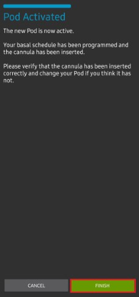
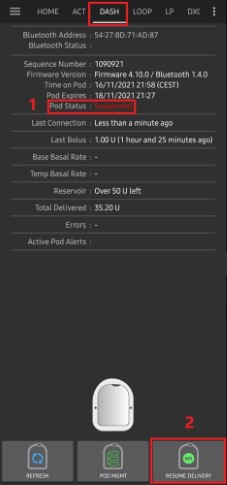
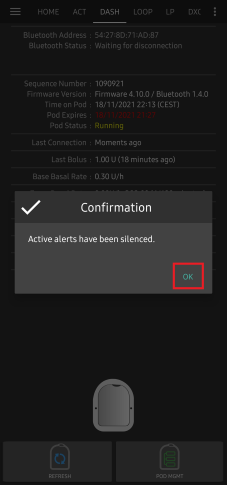

- - -
orphan: true
- - -

# Omnipod DASH

本说明适用于配置**Omnipod DASH**代泵**(非Omnipod Eros)**，该功能作为**AAPS** 3.0版本的一部分提供。

## Omnipod DASH 规格说明

以下是**Omnipod DASH**（简称"DASH"）的规格说明及其与**Omnipod EROS**（简称"EROS"）的主要区别：

* DASH 储药器采用蓝色针头帽标识（EROS 使用透明针头帽）。 除标识外，两种储药器的物理尺寸完全一致。
*  DASH 无需蓝牙连接/桥接设备（不需要 RileyLink、OrangeLink 或 EmaLink）。
* DASH 的蓝牙连接仅在需要时启用，完成指令传输后立即断开！
* DASH 彻底消除了"无法连接桥接设备/储药器"的报错。
* **AAPS** 将等待储药器可连接状态时发送指令。
* 在储药器激活时，**AAPS** 将自动搜寻并连接新的 DASH 储药器。
* 预期连接范围：5-10米（实际效果可能因环境而异）。

警告：目前收到关于以下组合的蓝牙连接问题报告：**AAPS** / DASH / Android 15。 除非用户已查阅以下[**列表**](https://docs.google.com/spreadsheets/u/1/d/e/2PACX-1vScCNaIguEZVTVFAgpv1kXHdsHl3fs6xT6RB2Z1CeVJ561AvvqGwxMhlmSHk4J056gMCAQE02sAWJvT/pubhtml?gid=683363241&single=true)并确认其手机不在已知问题报告范围内，否则不应将**AAPS**与Android 15和DASH组合使用。 **AAPS**目前正在努力解决该问题。

## 硬件/软件要求

* DASH 以蓝色针头帽为标识。

* **兼容的安卓手机**需具备BLE蓝牙连接功能  
  请注意，**AAPS**的Omnipod Dash驱动每次发送指令时都会通过蓝牙与DASH连接，并在完成后立即断开。 蓝牙连接可能会受到与运行**AAPS**的手机相连的其他蓝牙设备（如耳机等）的干扰（在极少数情况下，某些手机型号可能会出现连接问题或储药器激活时/激活后的错误/丢失），也可能干扰其他设备。
   -  **使用[**构建APK**](../SettingUpAaps/BuildingAaps.md)说明构建并安装AAPS 3.0或更高版本**。
* [**持续血糖监测仪（CGM）**](../Getting-Started/CompatiblesCgms.md)

以下说明将指导您如何激活新的储药器会话。 请等待当前储药器会话接近到期时，再尝试将**AAPS**与新储药器连接。 储药器一旦被取消便无法重复使用，断开连接后将永久失效。

## 开始前的准备工作

**安全第一** - 首次尝试将**AAPS**连接至储药器时，必须确保备有额外的储药器、胰岛素及通讯设备。

**当AAPS的Dash驱动激活您的储药器后，Omnipod Dash PDM将不再需要。**此前用户可能需要通过PDM向DASH发送指令。 DASH 仅允许单一设备与其通信并发送指令。 成功激活储药器的设备将成为此后唯一获准与其通信的设备。 这意味着当您通过**AAPS**用安卓手机激活DASH后，**该储药器将无法再与您的PDM配合使用**。 您安卓手机中的**AAPS** Dash驱动现已作为您的PDM使用。

*这并不意味着您应该丢弃PDM，建议将其保留作为备用设备以应对紧急情况，例如手机丢失或AAPS运行异常时使用。*

**储药器在未连接AAPS时不会停止胰岛素输注**。 储药器激活时会根据当前生效的**配置文件**预设基础率参数。 只要**AAPS**正常运行，它就会发送最长持续120分钟的基础率指令。 当储药器因某些原因（如因储药器与手机距离过远导致通信中断）未能接收到新指令时，将自动切换至预设基础率模式运行。

**AAPS配置文件不支持30分钟基础率时间框架。** 如果您是**AAPS**的新用户并首次设置基础率**配置文件**，请注意不支持以半小时为单位的基础率设置，仅支持整点设置。 例如，若您设有从09:30开始、持续2小时至11:30结束的1.1单位基础率，则无法在**AAPS**中完全复制该设置。 您需要将这个1.1单位的基础率时间段调整为9:00-11:00或10:00-12:00。 虽然DASH硬件本身支持30分钟基础率**配置文件**增量设置，但**AAPS**目前并不支持此功能。

**AAPS不支持0U/h的基础率配置.** 虽然DASH硬件支持零基础率设置，但由于**AAPS**依赖用户**配置文件**基础率的倍数进行自动治疗决策，系统无法在零基础率状态下运行。 可通过"断开泵连接"功能，或结合停用循环/临时基础率与暂停循环/临时基础率功能，实现临时零基础率设置。 **AAPS**允许的最低基础率为0.05单位/小时。

## 在AAPS中选择Dash

有两种方式：

### 方式一：全新安装

首次安装**AAPS**时，**设置向导**将引导新用户了解**AAPS**的关键功能和安装要求。 当进入泵选择环节时，请选择“DASH”。

若不确定，您也可先选择"虚拟泵"，待**AAPS**设置完成后再切换至"DASH"（参见选项2）。

### 选项2：配置构建器

在现有安装中，您可以通过配置构建器选择**DASH**泵：

点击左上角**汉堡菜单**，依次选择**配置构建器(1)** ➜ **胰岛素泵** ➜ **Dash** ➜ 通过选中**Dash(2)**单选按钮进入**设置齿轮图标(3)**。

勾选**设置齿轮图标(3)**旁的**复选框(4)**后，DASH菜单将作为标签页显示在**AAPS**界面中，标题为**DASH**。 勾选此选项后，您在使用**AAPS**时将能更便捷地调用DASH指令功能。

**注意：** 您可在本文档的DASH设置章节找到更快捷访问[**Dash设置**](#dash-settings)的方法。

### Omnipod驱动选择验证

要确认您已在**AAPS**中选择了DASH，若您已勾选复选框(4)，从**总览**标签页**向左滑动**，即可在**AAPS**界面中看到新增的**DASH**标签页。 若未勾选此选项，您仍可在左上角汉堡菜单中找到DASH标签页。

## Dash配置

请**向左滑动**至**DASH**标签页，您将在此管理所有储药器功能（部分功能需在储药器激活会话中才会启用或显示）：

 "刷新"（刷新储药器连接状态，并可在储药器发出警报时进行消音操作）

 "储药器管理"（激活、停用、测试蜂鸣音、查看使用记录）

### 激活Pod

1. 请进入**DASH**标签页，点击**储药器管理(1)**按钮，然后选择**激活储药器(2)**。

​    

2. 此时将显示**填充储药器**界面。 请在新储药器中装入至少80单位胰岛素，听到两声提示音后表明储药器已准备好进行初始化。 在计算3天所需胰岛素总量时，请注意储药器初始化过程将消耗约3-10单位胰岛素。

    

确保新储药器与运行**AAPS**的手机保持近距离，然后点击**下一步**按钮。

**注意**：若弹出错误提示_"未找到可用的待激活储药器"_（这种情况可能发生），请勿惊慌。 点击**重试**按钮。 在大多数情况下，激活程序将能继续顺利完成。

3. 在**初始化储药器**界面，储药器将开始自检（您会听到"咔嗒"一声，随后是一连串滴答声，表明储药器正在进行自检程序）。  自检成功后会出现绿色勾选标记，此时**下一步**按钮将变为可点击状态。 点击**下一步**按钮完成储药器初始化，随后将显示**佩戴储药器**界面。

    

4. 接下来，请准备好输注部位以佩戴新储药器。 洗手消毒以避免感染风险。 使用肥皂水或酒精棉片清洁输注部位进行消毒，待皮肤完全晾干后再继续操作。 移除储药器的蓝色塑料针头保护帽。 如发现储药器有异常突出物或异样，请中止流程并更换新储药器。 确认无误后，撕下白色背胶纸，将储药器贴敷至选定的身体部位。 操作完成后，点击**下一步**按钮。

5. 此时将弹出**佩戴储药器**对话框。 **仅在您准备好部署导管时点击确定按钮**。

6. 点击**确定**后，DASH可能需要一些时间才能响应并插入导管（最长等待1-2分钟）。 请耐心等待。

 *注意：在插入导管前，建议捏起导管插入点附近的皮肤。 这能确保针头顺利插入，并降低导管堵塞的发生概率。*

    

7. 导管成功插入后会出现绿色勾选标记，**下一步**按钮将变为可点击状态。 点击**下一步**按钮。

9. 此时将显示**储药器已激活**界面。 点击绿色**完成**按钮。 恭喜！ 您已成功开启新储药器使用周期。

10. 此时**储药器管理**菜单界面应显示：**激活储药器(1)**按钮*不可用*，而**停用储药器(2)**按钮*可用*。 这是因为当前已有储药器处于激活状态，必须首先停用当前储药器才能激活新储药器。

    点击手机返回键回到**DASH**标签页，该界面现在将显示当前使用中储药器的信息，包括基础率设定值、储药器剩余量、已输注胰岛素量、储药器报错及警报等内容。

    有关显示信息的更多详情，请参阅本文档[**DASH标签页**](#dash-tab)部分。

​    

建议在激活储药器后导出设置。 应在每次更换储药器时导出设置，并每月将导出文件备份至云存储。 参见[**导出设置文档**](../Maintenance/ExportImportSettings.md)。

(OmnipodDASH-deactivate-pod)=

### 停用Pod

正常情况下，储药器标准使用周期为3天（72小时），在触发过期警告后仍可继续使用8小时，总使用时长可达80小时。

要停用储药器（无论是因到期还是故障）：

1. 进入**DASH**标签页，点击**储药器管理(1)**按钮，在**储药器管理**界面点击**停用储药器(2)**按钮。

​    

2. 在**停用储药器**界面，点击**下一步**按钮开始停用流程。 储药器将发出确认提示音，表示停用成功。

 

3. 成功停用后将显示绿色勾选标记。 点击**下一步**按钮显示储药器已停用界面。 当前使用周期已终止，您现在可以移除储药器。

4. 点击绿色按钮返回**储药器管理**界面。

5. 您现在处于**储药器管理**菜单界面，按手机返回键可回到**DASH**标签页。 请确认**储药器状态：**字段显示**无使用中储药器**的提示信息。

 

### 恢复胰岛素输注

**注意**：在执行**配置文件切换**时，DASH必须先暂停输注才能设置新的基础**配置文件**，因为输注功能可能被暂停。 详情请参阅故障排除章节中的[**输注暂停**](#delivery-suspended)部分。

此指令用于命令当前暂停中的储药器恢复胰岛素输注。 指令成功执行后，系统将根据当前激活的基础**配置文件**，按当前时间对应的基础率恢复胰岛素正常输注。 储药器将重新接受大剂量注射、**临时基础率**和**超微大剂量**指令。

1. 请进入**DASH**标签页，确认**储药器状态(1)**字段显示为**已暂停**，然后点击**恢复输注(2)**按钮启动流程，指示当前储药器恢复正常胰岛素输注。 **恢复输注**信息将显示在**储药器状态(3)**字段中。

   

2. 当恢复输注指令执行成功时，确认对话框将显示**胰岛素输注已恢复**的信息。 点击**确定**进行确认并继续操作。

3. **DASH**标签页将更新**储药器状态(1)**字段，显示为**运行中**，且**恢复输注**按钮不再显示。

### 静音储药器警报

*注意 - 仅当触发储药器过期或低药量警报时，**DASH**标签页才会显示静音警报按钮。 若未显示静音警报按钮但储药器发出提示音，请尝试"刷新储药器状态"。*

以下流程将说明当储药器使用时间接近72小时（3天）有效期前的警告时限时，如何确认并消除储药器提示音。 该警告时限由**关机前小时数**的Dash警报设置定义。 储药器最长使用时限为80小时（3天8小时），但Insulet建议不要超过72小时（3天）的标准周期。

1. 当达到设定的**关机前小时数**警告时限时，储药器将发出提示音，提醒您其即将到期，需要尽快更换储药器。 您可在**DASH**标签页进行确认：**储药器到期时间：(1)**字段会显示储药器失效的具体时间（激活后72小时），超过此时限后该文本将变为**红色**。 在**使用中储药器警报(2)**字段下会显示状态信息**储药器即将到期**。 同时会触发显示**静音警报(3)**按钮。

2. 请进入**DASH**标签页并点击**静音警报(2)**按钮。 **AAPS**向储药器发送指令以停用到期警告提示音，并将**储药器状态(1)**字段更新为**已确认警报**。

3. 当警报**成功停用**后，使用中的储药器会发出**2声提示音**，同时确认对话框将显示**警报已静音**的信息。 点击**确定**按钮确认并关闭对话框。

4. 请进入**DASH**标签页。 在**使用中储药器警报**字段下，警告信息不再显示，且使用中的储药器将不再发出到期警告提示音。

(OmnipodDASH-view-pod-history)=

### 查看 Pod 历史

本节说明如何查看使用中储药器的历史记录，并按不同操作类别进行筛选。 储药器历史工具可让您查看当前使用中储药器在其3天（72-80小时）使用周期内执行的操作及结果记录。

此功能有助于核验已发送至储药器的大剂量注射、临时基础率和基础率指令。 其余分类有助于故障排除，并确定导致故障发生的事件顺序。

*注意：* **仅最后一条指令可能显示不确定状态**。 新指令*将不会被发送*，直到**最后一条"不确定"指令变为"已确认"或"已拒绝"**。 解决不确定指令的方法是执行**'刷新储药器状态'**操作。

1. 请进入**DASH**标签页，点击**储药器管理(1)**按钮进入**储药器管理**菜单，然后点击**储药器历史(2)**按钮访问历史记录界面。

 

2. 在**储药器历史**界面，默认显示**全部(1)**类别，按时间倒序排列所有储药器**操作(3)**及其**结果(4)**的**日期和时间(2)**。 按手机**返回键2次**可返回主**AAPS**界面的**DASH**标签页。

 

(OmnipodDASH-dash-tab)=

## DASH标签页

以下说明主AAPS界面中**DASH**标签页的布局及图标与状态字段的含义。

*注意：若**DASH**标签页状态字段中任何信息显示为（不确定），则需点击刷新按钮以清除该状态并更新储药器状态。*

### 字段

* **蓝牙地址：**显示当前连接的储药器的蓝牙地址。
* **蓝牙状态：**显示当前连接状态。
* **序列号：**显示当前使用中储药器的序列号。
* **固件版本：**显示当前连接设备的固件版本号。
* **储药器时间：**显示储药器当前时间。
* **储药器到期时间：**显示储药器失效的日期和时间。
* **储药器状态：**显示储药器当前状态。
* **最后连接时间：**显示最近一次与储药器通信的时间。

   - *刚刚* - 指20秒内的时间。
   - *不到一分钟前* - 超过20秒但不足60秒。
   - *1分钟前* - 超过60秒但不足120秒（2分钟）
   - *XX分钟前* - 超过2分钟，具体时间由XX值确定

* **最近一次大剂量：**显示最近发送给使用中储药器的大剂量注射量，括号内为注射发生的时间。
* **基础基础率：**显示当前时间根据基础率配置文件设定的基础输注速率。
* **临时基础率：**以下列格式显示当前运行的临时基础率：

   - {单位/小时} @{临时基础率开始时间} （{已运行分钟数}/{临时基础率总运行分钟数}）
   - *示例：* 0.00U/h @18:25 (90/120分钟)

* **储药量：**当储药器剩余药量超过50单位时，显示"50+单位剩余"。 低于50单位时，将显示精确剩余药量。
* **总输注量：**显示储药器已输送的胰岛素总量（单位）。 该数值包含激活储药器和管路填充所消耗的胰岛素。
* **错误信息：**显示最近发生的错误。 请查阅[储药器历史记录](#view-pod-history)和日志文件以获取过往错误详情及更完整的信息。
*  **活动储药器警报：** 保留用于当前活动储药器上正在运行的警报。

### 按钮

 ：向活动储药器发送刷新指令以更新通信状态。

   * 用于刷新储药器状态并清除显示（不确定）的状态字段。
   * 更多信息请参阅下文"故障排除"章节。

 ：跳转至储药器管理菜单。

 ：按下后将禁用储药器警报提示音和通知（如到期提醒、低药量警报等）。

   * 该按钮仅在储药器时间超过到期警告时间后显示。
   * 成功取消后，该图标将不再显示。

 ：恢复当前活动储药器中暂停的胰岛素输注。

### Pod 管理菜单

以下是**储药器管理**菜单中图标的含义，该菜单可通过在**DASH**标签页按下**储药器管理(1)**按钮进入。

 

* 2 - [**激活储药器**](#activate-pod)：对新储药器进行管路填充和激活操作。
* 3 - [**停用储药器**](#deactivate-pod)：停用当前活动中的储药器。
* 4 - **播放测试提示音**：按下时使储药器发出单次测试提示音。
* 5 - [**储药器历史记录**](#view-pod-history)：显示活动储药器的操作历史记录。

(DanaRS-Insulin-Pump-dash-settings)=

## DASH设置

DASH驱动程序设置可通过左上角**汉堡菜单**中的**配置构建器(1)**→**胰岛素泵**→**DASH**→**设置齿轮图标(3)**进行配置，选择标有**DASH**的**单选按钮(2)**即可。 勾选**设置齿轮图标(3)**旁的**复选框(4)**，即可在**AAPS**界面中将DASH菜单显示为名为**DASH**的标签页。

**注意：** 访问**DASH设置**的快捷方式是通过**DASH**标签页右上角的**三点菜单(1)**，然后从下拉菜单中选择**DASH偏好设置(2)**。

以下是设置分组列表，您可通过切换开关启用或禁用下文所述的大多数选项：

*注：带星号(*)表示默认启用该设置。*

### 确认提示音

提供储药器对大剂量注射、基础率、超微大剂量(SMB)和临时基础率(TBR)输送及变更的确认提示音。

* **启用大剂量提示音：** 控制大剂量输注时是否发出确认提示音。
* **启用基础率提示音：** 控制设置新基础率、取消活动基础率或变更当前基础率时是否发出确认提示音。
* **启用超微大剂量提示音：** 控制超微大剂量(SMB)输注时是否发出确认提示音。
* **启用临时基础率提示音：** 控制设置或取消临时基础率(TBR)时是否发出确认提示音。

### 警报

当储药器达到过期、关机或根据设定阈值单位检测到低药量时，提供**AAPS**警报提示。

*请注意：自警报触发后与储药器首次通信时，AAPS将始终针对任何警报发出通知。 除非启用"自动确认储药器警报"功能，否则仅消除通知并不会消除警报状态。 要手动消除警报，必须访问**DASH**标签页并点击**静音警报按钮**。*

* **启用过期提醒：** 控制是否在储药器达到设定的关机前小时数时触发过期提醒。
* **关机前小时数：** 设定活动储药器关机前触发过期提醒警报的小时数。
* **启用低药量警报：** 控制当储药器剩余药量达到"单位数值"字段中定义的低药量限值时是否触发警报。
* **单位数值：** 触发储药器低药量警报的剩余药量单位数。

### 通知

通知设置部分允许用户选择偏好的通知方式和手机提示音，用于在临时基础率(TBR)、超微大剂量(SMB)、大剂量注射或输注暂停事件是否成功执行存在不确定性时发出提醒。

*注：这些仅为手机通知，不会触发储药器声音提示。*

* **启用临时基础率不确定通知提示音：** 当**AAPS**无法确认临时基础率(TBR)是否成功设置时，控制是否触发声音警报及视觉通知。
* **启用超微大剂量不确定通知提示音：** 当**AAPS**无法确认超微大剂量(SMB)是否成功输注时，控制是否触发声音警报及视觉通知。
* **启用大剂量不确定通知提示音：** 当**AAPS**无法确认大剂量是否成功输注时，控制是否触发声音警报及视觉通知。
* **启用输注暂停通知提示音：** 当成功执行输注暂停时，控制是否触发声音警报及视觉通知。

## 操作 (ACT) 标签页

该标签页在**AAPS**主文档中已有详细说明，但其中部分条目专门体现了DASH与管路泵的区别特性，特别是在更换新储药器后的操作流程方面。

1. 请前往**AAPS**主界面中的**操作(ACT)**标签页。

2. 在**Careportal(1)**部分，**胰岛素**和**输注套管**字段的**使用时长**会在**每次更换储药器后**重置为0天0小时。 这是由于Omnipod胰岛素泵的构造和工作原理决定的。 由于储药器在敷贴时会直接将输注套管插入皮肤，Omnipod泵不使用传统导管。 *因此更换储药器后，这些数值的使用时长会自动归零。* **泵电池使用时长**不显示报告，因为储药器内置电池的寿命始终超过储药器使用期限（最长80小时）。 **泵电池**和**胰岛素储药器**均内置于每个储药器单元内部。

### 余量水平

**胰岛素储药量**

显示的胰岛素储药量为DASH报告的药量。 但储药器仅在剩余药量低于50单位时才会报告实际胰岛素储药量。 在此之前将始终显示"高于50单位"。 报告数值并不精确：当储药器显示"空"时，多数情况下储药器内仍会残留若干单位的胰岛素。 DASH概览标签页将显示如下内容：

  * **高于50单位** - 储药器报告当前药量超过50单位。
  * **低于50单位** - 储药器报告的剩余胰岛素实际药量。

补充说明：
  * **短信查询** - 短信回复将返回实际数值或"50+单位"
  * **Nightscout** - 当药量超过50单位时，会向Nightscout上传50的数值（14.07及更早版本）。  较新版本在药量超过50单位时将报告"50+"的数值。

## 故障排除

### 输注暂停

  * 不再设有暂停按钮。 如需"暂停"储药器，可设置持续时间为X分钟的零值**临时基础率(TBR)**。
  * 在执行**配置文件切换**时，DASH必须在设置新的基础率**配置文件**前暂停胰岛素输注。 若两条指令间通信失败，输注可能保持暂停状态。 当发生此情况时：
     - 胰岛素输注将完全停止，包括基础率、超微大剂量(SMB)、手动大剂量等所有输注功能。
     - 系统可能显示某条指令未确认的通知（具体取决于通信失败发生的时机）。
     - **AAPS**将每15分钟尝试设置新的基础率配置文件。
     - 若输注仍处于暂停状态（恢复输注失败），**AAPS**将每15分钟显示一次输注暂停的提醒通知。
     - 若用户选择手动恢复输注，[**恢复输注**](#resuming-insulin-delivery)按钮将处于激活状态。
     - 若**AAPS**自动恢复输注失败（当储药器无法连接、静音等情况发生时），储药器将每分钟发出4次蜂鸣、持续3分钟；若暂停状态超过20分钟仍未恢复，则每15分钟重复此警报模式。
  * 对于未确认的指令，"刷新储药器状态"操作可予以确认或否决。

**注意：**当听到储药器发出蜂鸣声时，切勿未经查看手机就假定输注会继续——输注可能仍处于暂停状态，**因此必须进行检查！**

### Pod 故障

储药器偶尔会因各种问题发生故障，包括储药器自身的硬件问题。 最佳做法是不要向Insulet公司报修，因为AAPS并非官方认可的使用方案。 故障代码列表可[**在此查阅**](https://github.com/openaps/openomni/wiki/Fault-event-codes)以帮助判断故障原因。

### 预防49号储药器故障

该故障与指令对应的储药器状态错误或胰岛素输注指令执行出错有关。 此时驱动程序和储药器对实际状态的判断出现分歧。 出于内置安全机制，储药器会触发不可恢复的49号错误代码(0x31)，导致俗称"尖叫器"的状态——这种持续恼人的蜂鸣声只能通过在储药器背面指定位置打孔来停止。 "49号储药器故障"的具体成因通常难以追溯。 在怀疑可能发生此类故障的情况下（例如应用程序崩溃、运行开发版本或重新安装时）。

### Pump Unreachable Alerts

When no communication can be established with the pod for a preconfigured time a “Pump unreachable” alert will be raised. Pump unreachable alerts can be configured by going to the top right-hand side three-dot menu, selecting **Preferences**\ ➜\ **Local Alerts**\ ➜\ **Pump unreachable threshold [min]**. Recommended value is alerting after **120** minutes.

### Export  Settings

Exporting **AAPS** settings enables you to restore all your settings, and maybe more importantly, all your Objectives. You may need to restore settings to the “last known working situation” or after uninstalling/reinstalling **AAPS** or in case of phone loss, reinstalling on the new phone.

Note: The active pod information is included in the exported settings. If you import an "old" exported file, your actual pod will "die". There is no other alternative. In some cases (like a _programmed_ phone change), you may need to use the exported file to restore **AAPS'** settings **while keeping the current active Pod**. In this case it is important to only use the recently exported settings file containing the pod currently active.

**It is good practice to do an export immediately after activating a pod**. This way you will always be able to restore the current active pod in case of a problem. For instance when moving to another backup phone.

Regularly copy your exported settings to a safe place (as a cloud drive) that can be accessible by any phone when needed (e.g. in case of a phone loss or factory reset of the actual phone).

### Import Settings

**WARNING** Please note that importing settings will possibly import an outdated Pod status. As a result, there is a risk of losing the active Pod! (see **Exporting Settings**). It is better to only try it when no other options are available.

When importing settings with an active Pod, make sure the export was done with the currently active pod.

**Importing while on an active Pod:** (you risk losing the Pod!)

1. Make sure you are importing settings that were recently exported with the currently active Pod.
2. Import your settings.
3. Check all preferences.

**Importing (no active Pod session)**

1. Importing any recent export should work (see above)
2. Import your settings.
3. Check all preferences.
4. You may need to **Deactivate** the "non existing" pod if the imported settings included any active pod data.

### Importing settings that contain Pod state from an inactive Pod

When importing settings containing data for a Pod that is no longer active, AAPS will try to connect with it, which will obviously fail. You can not activate a new Pod in this situation.

To remove the old pod session “try” to de-activate the Pod. The de-activation will fail. Select “Retry”. After the second or third retry you will get the option to remove the pod. Once the old pod is removed you will be able to activate a new pod.

### Reinstalling AAPS

When uninstalling**AAPS** you will lose all your settings, objectives and the current Pod session. To restore them make sure you have a recent exported settings file available!

When on an active Pod, make sure that you have an export for the current pod session or you will lose the currently active pod when importing older settings.

1. Export your settings and store a copy in a safe place.
2. Uninstall **AAPS** and restart your phone.
3. Install the new version of **AAPS**.
4. Import your settings.
5. Verify all preferences (optionally import settings again).
6. Activate a new pod.
7. When done: Export current settings.

### Updating AAPS to a newer version

In most cases there is no need to uninstall. You can do an “in-place” install by starting the installation for the new version. This is also possible when on an active Pod  session.

1. Export your settings.
2. Install the new **AAPS** version.
3. Verify the installation was successful
4. RESUME the Pod or activate a new pod.
5. When done: Export current settings.

### Omnipod driver alerts

Please note that the Omnipod Dash driver presents a variety of unique alerts on the **Overview tab**, most of them are informational and can be dismissed while some provide the user with an action to take to resolve the cause of the triggered alert. A summary of the main alerts that you may encounter is listed below:

* No active Pod session detected. This alert can temporarily be dismissed by pressing **SNOOZE** but it will keep triggering as long as a new pod has not been activated. Once activated this alert is automatically silenced.
* Pod suspended Informational alert that pod has been suspended.
* Setting basal **Profile** failed : Delivery might be suspended! Please manually refresh the Pod status from the Omnipod tab and resume delivery if needed.. Informational alert that the Pod basal **Profile** setting has failed, and you will need to hit *Refresh* on the Omnipod tab.
* Unable to verify whether **SMB** bolus succeeded. If you are sure that the Bolus didn't succeed, you should manually delete the SMB entry from Treatments. Alert that the **SMB** bolus command success could not be verified, you will need to verify the *Last bolus* field on the DASH tab to see if **SMB** bolus succeeded and if not remove the entry from the Treatments tab.
* Uncertain if "task bolus/TBR/SMB" completed, please manually verify if it was successful.

## Where to get help for DASH

All of the development work for the DASH is done by the community on a **volunteer** basis; please keep this in mind and use the following guidelines before requesting assistance:

-  **Level 0:** Read the relevant section of this documentation to ensure you understand how the functionality with which you are experiencing difficulty is supposed to work.
-  **Level 1:** If you are still encountering problems that you are not able to resolve by using this document, then please go to the *#AAPS* channel on **Discord** by using [this invite link](https://discord.gg/4fQUWHZ4Mw).
-  **Level 2:** Search existing issues to see if your issue has already been reported at [Issues](https://github.com/nightscout/AndroidAPS/issues) if it exists, please confirm/comment/add information on your problem. 如果没有，请创建一个[新问题](https://github.com/nightscout/AndroidAPS/issues)并附上[您的日志文件](../GettingHelp/AccessingLogFiles.md)。
-  **Be patient - most of the members of our community consist of good-natured volunteers, and solving issues often requires time and patience from both users and developers.**
