- - -
orphan: true
- - -

# AAPS Omnipod Insulin Pump Driver Documentation

These instructions are for configuring the Omnipod Eros generation pump (**NOT Omnipod Dash**). The Omnipod driver is available as part of AAPS (AAPS) as of version 2.8.

**This software is part of a DIY artificial pancreas solution and is not a product but requires YOU to read, learn, and understand the system, including how to use it. 使用后果由您自行承担。**

```{contents}
:backlinks: entry
:depth: 2
```

## Hardware and Software Requirements

- **Pod Communication Device**

> Component that bridges communication from your AAPS enabled phone to Eros generation pods.
> 
> > -   [OrangeLink Website](https://getrileylink.org/product/orangelink)
> > -  [433MHz RileyLink](https://getrileylink.org/product/rileylink433)
> > -   [Emalink Website](https://github.com/sks01/EmaLink) - [Contact Info](mailto:getemalink@gmail.com)
> > -   DiaLink - [Contact Info](mailto:Boshetyn@ukr.net)
> > -   [LoopLink Website](https://www.getlooplink.org/) - [Contact Info](https://jameswedding.substack.com/) - Untested

-   **Mobile Phone Device**

> Component that will operate AAPS and send control commands to the Pod communication device.
> 
> > - Supported [Omnipod driver Android phone](#Phones-list-of-tested-phones) with a version of AAPS 2.8 and related components set up.

-   **Insulin Delivery Device**

> Component that will interpret commands received from the Pod communication device originating from your AAPS enable phone.
> 
> > - A new Omnipod pod (Eros generation - **NOT DASH**)

These instructions will assume that you are starting a new pod session; if this is not the case, please be patient and attempt to begin this process on your next pod change.

## 开始前的准备工作

**SAFETY FIRST** - do not attempt this process in an environment where you cannot recover from an error (extra pods, insulin, charged RileyLink, and phone devices are must-haves).

**Your Omnipod PDM will no longer work after the AAPS Omnipod driver activates your pod**. Previously you used your Omnipod PDM to send commands to your Omnipod Eros pod. An Omnipod Eros pod only allows a single device to send communication to it. 成功激活储药器的设备将成为此后唯一获准与其通信的设备。 This means that once you activate an Omnipod Eros pod with your RileyLink through the AAPS Omnipod driver, **you will no longer be able to use your PDM with your pod**. The AAPS Omnipod driver with the RileyLink is now your acting PDM. *This does NOT mean you should throw away your PDM, it is recommended to keep it around as a backup, and for emergencies with AAPS is not working correctly.*

**You can configure multiple RileyLinks, but only one selected RileyLink at a time can communicate with a pod.** The AAPS Omnipod driver supports the ability to add multiple RileyLinks in the RileyLink configuration, however, only one RileyLink at a time can be selected to be used for sending and receiving communication.

**Your pod will not shut off when the RileyLink is out of range.** When your RileyLink is out of range or the signal is blocked from communicating with the active pod, your pod will continue to deliver basal insulin. Upon activating a pod, the basal profile defined in AAPS will be programmed into the new pod. Should you lose contact with the pod, it will revert to this basal profile. You will not be able to issue new commands until the RileyLink comes back in range and re-establishes the connection.

**30 min Basal Rate Profiles are NOT supported in AAPS.** If you are new to AAPS and are setting up your basal rate profile for the first time please be aware that basal rates starting on a half hour are not supported and you will need to adjust your basal rate profile to start on the hour. For example, if you have a basal rate of say 1.1 units which starts at 09:30 and has a duration of 2 hours ending at 11:30, this will not work.  You will need to update this 1.1 unit basal rate to a time range of either 9:00-11:00 or 10:00-12:00.  Even though the 30 min basal rate profile increments are supported by the Omnipod hardware itself, AAPS is not able to take them into account with its algorithms currently.

## Enabling the Omnipod Driver in AAPS

You can enable the Omnipod driver in AAPS in **two ways**:

### Option 1: The Setup Wizard

After installing a new version of AAPS, the **Setup Wizard** will start automatically.  This will also occur during in place upgrades.  If you already have exported your settings from a previous installation you can exit the Setup Wizard and import your old settings.  For new installations proceed below.

Via the **AAPS Setup Wizard (2)** located at the top right-hand corner **three-dot menu (1)** and proceeding through the wizard menus until you arrive at the **Pump** screen. Then select the **Omnipod radio button (3)** .

>   

On the same screen, below the pump selection, the **Omnipod Driver Settings** are displayed, under the **RileyLink Configuration** add your RileyLink device by pressing the **Not Set** text.

On the **RileyLink Selection** screen press the **Scan** button and select your RileyLink by scanning for all available Bluetooth devices and selecting your RileyLink from the list. When properly selected you are returned to the pump driver selection screen displaying the Omnipod driver settings showing your selected RileyLink with the MAC address listed.

Press the **Next** button to proceed with the rest of the **Setup Wizard.**  It can take up to one minute for the selected RileyLink to initialize and the **Next** button to become active.

Detailed steps on how to setup your pod communication device are listed below in the [RileyLink Setup Section](#rileylink-setup).

**OR**

### 选项2：配置构建器

Via the top-left hand corner **hamburger menu** under **Config Builder (1)** ➜**Pump**➜**Omnipod** by selecting the **radio button (2)** titled **Omnipod**. Selecting the **checkbox (4)** next to the **Settings Gear (3)** will display the Omnipod menu as a tab in the AAPS interface titled **POD**. This is referred to in this documentation as the **Omnipod (POD)** tab.

> **NOTE:** A faster way to access the **Omnipod settings** can be found below in the [Omnipod Settings section](#omnipod-settings) of this document.
> 
>  

### Omnipod驱动选择验证

*Note: If you have exited the Setup Wizard early without selecting your RileyLink, the Omnipod Driver is enabled but you will still need to select your RileyLink.  You may see the Omnipod (POD) tab appear as it does below*

To verify that you have enabled the Omnipod driver in AAPS **swipe to the left** from the **Overview** tab, where you will now see an **Omnipod** or **POD** tab.


## Omnipod Configuration

Please **swipe left** to the **Omnipod (POD)** tab where you will be able to manage all pod and RileyLink functions (some of these functions are not enabled or visible without an active pod session):

>  Refresh Pod connectivity and status
> 
>  Pod Management (Activate, Deactivate, Play test beep, RileyLink Stats and Pod history)

(OmnipodEros-rileylink-setup)=

### RileyLink Setup

If you already successfully paired your RileyLink in the Setup Wizard or steps above, then proceed to the [Activating a Pod Section](#activating-a-pod) below.

*Note: A good visual indicator that the RileyLink is not connected is that the Insulin and Calculator buttons on the HOME tab will be missing. This will also occur for about the first 30 seconds after AAPS starts, as it is actively connecting to the RileyLink.*

1. Ensure that your RileyLink is fully charged and powered on.

2. After selecting the Omnipod driver, identify and select your RileyLink from **Config Builder (1)** ➜**Pump**➜**Omnipod**➜**Gear Icon (Settings) (2)** ➜**RileyLink Configuration (3)** by pressing the **Not Set** or **MAC Address (if present)** text.

   > Ensure your RileyLink battery is charged and it is [positioned in close proximity](#optimal-omnipod-and-rileylink-positioning) (~30 cm away or less) to your phone for AAPS to identify it by its MAC address. Once selected, you can proceed to activate your first pod session. Use the back button on your phone to return to the main AAPS interface.
   > 
   >  

3. On the **RileyLink Selection** screen press the **Scan (4)** button to initiate a bluetooth scan. **Select your RileyLink (5)**  from the list of available Bluetooth devices.

   >  

4. After successful selection you are returned to the Omnipod Settings page listing your **currently selected RileyLink's MAC Address (6).**

   > 

5. Verify that in the **Omnipod (POD)** tab that the **RileyLink Status (1)** appears as **Connected.** The **Pod status (2)** field should show **No active Pod**; if not, please attempt the previous step or exit AAPS to see if this refreshes the connection.

   > 

(OmnipodEros-activating-a-pod)=

### Activating a Pod

Before you can activate a pod please ensure you have properly configured and connected your RileyLink connection in the Omnipod settings

*REMINDER: Pod communication occurs at limited ranges for pod activation pairing due to security safety measures. Before pairing the Pod's radio signal is weaker, however after it has been paired it will operate at full signal power. During these procedures, make sure that your pod is* [within close proximity](#optimal-omnipod-and-rileylink-positioning) (~30 cm away or less) but not on top of or right next to the RileyLink.\*

01. Navigate to the **Omnipod (POD)** tab and click on the **POD MGMT (1)** button, and then click on **Activate Pod (2)**.

    > 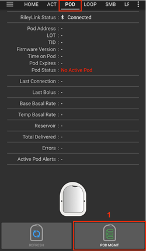 

02. 此时将显示**填充储药器**界面。 请在新储药器中装入至少80单位胰岛素，听到两声提示音后表明储药器已准备好进行初始化。 When calculating the total amount of insulin you need for 3 days, please take into account that priming the pod will use 12 to 15 units.

    > 
    > 
    > Ensure the new pod and RileyLink are within close proximity of each other (~30cm or less) and click the **Next** button.

03. 在**初始化储药器**界面，储药器将开始自检（您会听到"咔嗒"一声，随后是一连串滴答声，表明储药器正在进行自检程序）。 If RileyLink is out of range of the pod being activated, you will receive an error message **No response from Pod**. If this occurs, [move the RileyLink closer](#optimal-omnipod-and-rileylink-positioning) (~30 cm away or less) to but not on top of or right next to the Pod and click the **Retry (1)** button.

    > 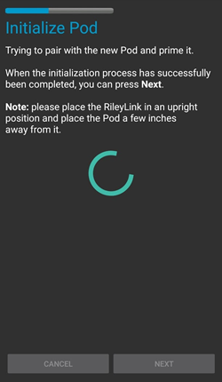 

04. Upon successful priming a green checkmark will be shown and the **Next** button will become enabled. 点击**下一步**按钮完成储药器初始化，随后将显示**佩戴储药器**界面。

    > 

05. Next, prepare the infusion site of the new pod. Remove the pod's plastic needle cap and white paper backing from the adhesive and apply the pod to your usually selected site on your body. 操作完成后，点击**下一步**按钮。

    > 

06. 此时将弹出**佩戴储药器**对话框。 **ONLY click on the OK button if you are ready to deploy the cannula**.

    > 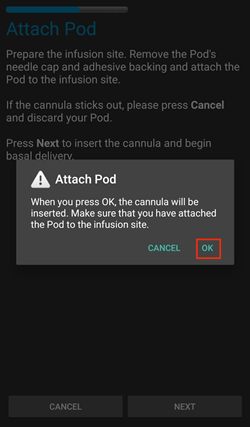

07. After pressing **OK**, it may take some time before the Omnipod responds and inserts the cannula (1-2 minutes maximum), so be patient.

    > If RileyLink is out of range of the pod being activated, you will receive an error message **No response from Pod**. If this occurs, move the RileyLink closer (~30 cm away or less) to but not on top of or right next to the Pod and click the **Retry** button.
    > 
    > If the RileyLink is out of Bluetooth range or does not have an active connection to the phone, you will receive an error message **No response from RileyLink**. If this occurs, move the RileyLink closer to the phone and click the **Retry** button.
    > 
    > *注意：在插入导管前，建议捏起导管插入点附近的皮肤。 这能确保针头顺利插入，并降低导管堵塞的发生概率。*
    > 
    > 
    > 
    >  

08. 导管成功插入后会出现绿色勾选标记，**下一步**按钮将变为可点击状态。 点击**下一步**按钮。

    > 

09. 此时将显示**储药器已激活**界面。 点击绿色**完成**按钮。 恭喜！ You have now started a new active pod session.

    > 

10. The **Pod management** menu screen should now display with the **Activate Pod (1)** button *disabled* and the **Deactivate Pod (2)** button *enabled*. 这是因为当前已有储药器处于激活状态，必须首先停用当前储药器才能激活新储药器。

    Click on the back button on your phone to return to the **Omnipod (POD)** tab screen which will now display Pod information for your active pod session, including current basal rate, pod reservoir level, insulin delivered, pod errors and alerts.

    For more details on the information displayed go to the [Omnipod (POD) Tab](#omnipod-pod-tab) section of this document.

     

### Deactivating a Pod

Under normal circumstances, the life of a pod should run for three days (72 hours) and an additional 8 hours after the pod expiration warning for a total of 80 hours of pod usage.

要停用储药器（无论是因到期还是故障）：

1. Go to the **Omnipod (POD)** tab, click on the **POD MGMT (1)** button, on the **Pod management** screen click on the **Deactivate Pod (2)** button.

   >  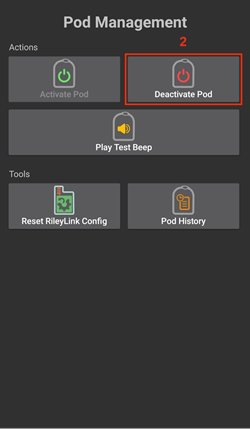

2. On the **Deactivate Pod** screen, first, make sure the RileyLink is in close proximity to the pod but not on top of or right next to the pod, then click on the **Next** button to begin the process of deactivating the pod.

   > 

3. The **Deactivating Pod** screen will appear, and you will receive a confirmation beep from the pod that deactivation was successful.

   > 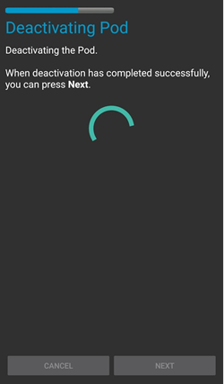
   > 
   > **IF deactivation fails** and you do not receive a confirmation beep, you may receive a **No response from RileyLink** or **No response from Pod message**. Please click on the **Retry (1)** button to attempt deactivation again. If deactivation continues to fail, please click on the **Discard Pod (2)** button to discard the Pod. 当前使用周期已终止，您现在可以移除储药器。 If your Pod has a screaming alarm, you may need to manually silence it (using a pin or a paperclip) as the **Discard Pod (2)** button will not silence it.
   > 
   > >   

4. 成功停用后将显示绿色勾选标记。 点击**下一步**按钮显示储药器已停用界面。 当前使用周期已终止，您现在可以移除储药器。

   > 

5. Click on the green button to return to the **Pod management** screen.

   > 

6. You are now returned to the **Pod management** menu press the back button on your phone to return to the **Omnipod (POD)** tab. Verify that the **RileyLink Status:** field reports **Connected** and the **Pod status:** field displays a **No active Pod** message.

   >   

### Suspending and Resuming Insulin Delivery

The process below will show you how to suspend and resume insulin pump delivery.

*NOTE - if you do not see a SUSPEND button*, then it has not been enabled to display in the Omnipod (POD) tab. Enable the **Show Suspend Delivery button in Omnipod tab** setting in the [Omnipod settings](#omnipod-settings) under **Other**.

#### Suspending Insulin Delivery

Use this command to put the active pod into a suspended state. In this suspended state, the pod will no longer deliver any insulin. This command mimics the suspend function that the original Omnipod PDM issues to an active pod.

1. Go to the **Omnipod (POD)** tab and click on the **SUSPEND (1)** button. The suspend command is sent from the RileyLink to the active pod and the **SUSPEND (3)** button will become greyed out. The **Pod status (2)** will display **SUSPEND DELIVERY**.

   >  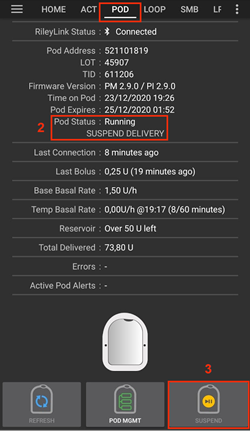

2. When the suspend command is successfully confirmed by the RileyLink a confirmation dialog will display the message **All insulin delivery has been suspended**. 点击**确定**进行确认并继续操作。

   > 

3. Your active pod has now suspended all insulin delivery. The **Omnipod (POD)** tab will update the **Pod status (1)** to **Suspended**. The **SUSPEND** button will change to a new **Resume Delivery (2)** button

   > 

#### 恢复胰岛素输注

此指令用于命令当前暂停中的储药器恢复胰岛素输注。 After the command is successfully processed, insulin will resume normal delivery using the current basal rate based on the current time from the active basal profile. The pod will again accept commands for bolus, TBR, and SMB.

1. Go to the **Omnipod (POD)** tab and ensure the **Pod status (1)** field displays **Suspended**, then press the **Resume Delivery (2)** button to start the process to instruct the current pod to resume normal insulin delivery. A message **RESUME DELIVERY** will display in the **Pod status (3)** field, signifying the RileyLink is actively sending the command to the suspended pod.

   > 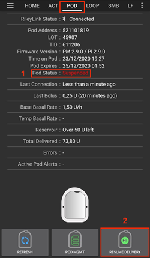 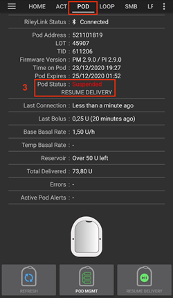

2. When the Resume delivery command is successfully confirmed by the RileyLink a confirmation dialog will display the message **Insulin delivery has been resumed**. 点击**确定**进行确认并继续操作。

   > 

3. The **Omnipod (POD)** tab will update the **Pod status (1)** field to display **RUNNING,** and the **Resume Delivery** button will now display the **SUSPEND (2)** button.

   > 

### Acknowledging Pod Alerts

*NOTE - if you do not see an ACK ALERTS button, it is because it is conditionally displayed on the Omnipod (POD) tab ONLY when the pod expiration or low reservoir alert has been triggered.*

The process below will show you how to acknowledge and dismiss pod beeps that occur when the active pod time reaches the warning time limit before the pod expiration of 72 hours (3 days). This warning time limit is defined in the **Hours before shutdown** Omnipod alerts setting. The maximum life of a pod is 80 hours (3 days 8 hours), however Insulet recommends not exceeding the 72 hour (3 days) limit.

*NOTE - If you have enabled the "Automatically acknowledge Pod alerts" setting in Omnipod Alerts, this alert will be handled automatically after the first occurrence and you will NOT need to manually dismiss the alert.*

1. When the defined **Hours before shutdown** warning time limit is reached, the pod will issue warning beeps to inform you that it is approaching its expiration time and a pod change will soon be required. You can verify this on the **Omnipod (POD)** tab, the **Pod expires: (1)** field will show the exact time the pod will expire (72 hours after activation) and the text will turn **red** after this time has passed, under the **Active Pod alerts (2)** field where the status message **Pod will expire soon** is displayed. This trigger will display the **ACK ALERTS (3)** button. A **system notification (4)** will also inform you of the upcoming pod expiration

   >  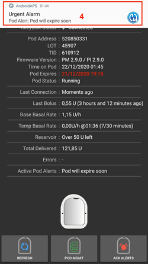

2. Go to the **Omnipod (POD)** tab and press the **ACK ALERTS (2)** button (acknowledge alerts). The RileyLink sends the command to the pod to deactivate the pod expiration warning beeps and updates the **Pod status (1)** field with **ACKNOWLEDGE ALERTS**.

   > 

3. Upon **successful deactivation** of the alerts, **2 beeps** will be issued by the active pod and a confirmation dialog will display the message **Activate alerts have been acknowledged**. 点击**确定**按钮确认并关闭对话框。

   > 
   > 
   > If the RileyLink is out of range of the pod while the acknowledge alerts command is being processed a warning message will display 2 options. **Mute (1)** will silence this current warning. **OK (2)** will confirm this warning and allow the user to try to acknowledge alerts again.
   > 
   > 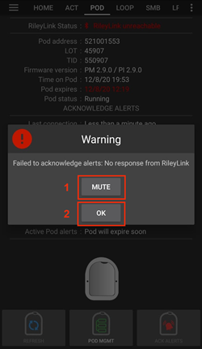

4. Go to the **Omnipod (POD)** tab, under the **Active Pod alerts** field, the warning message is no longer displayed and the active pod will no longer issue pod expiration warning beeps.

(OmnipodEros-view-pod-history)=

### 查看 Pod 历史

This section shows you how to review your active pod history and filter by different action categories. The pod history tool allows you to view the actions and results committed to your currently active pod during its three day (72 - 80 hours) life.

This feature is useful for verifying boluses, TBRs, basal changes that were given but you may be unsure if they completed. The remaining categories are useful in general for troubleshooting issues and determining the order of events that occurred leading up to a failure.

*NOTE:* **Uncertain** commands will appear in the pod history, however due to their nature you cannot ensure their accuracy.

1. Go to the **Omnipod (POD)** tab and press the **POD MGMT (1)** button to access the **Pod management** menu and then press the **Pod history (2)** button to access the pod history screen.

   >  

2. On the **Pod history** screen, the default category of **All (1)** is displayed showing the **Date and Time (2)** of all pod **Actions (3)** and **Results (4)** in reverse chronological order. Use your phone’s **back button 2 times** to return to the **Omnipod (POD)** tab in the main AAPS interface.

   >  

### View RileyLink Settings and History

This section shows you how to review the settings of your active pod and RileyLink along with the communication history of each. This feature, once accessed, is split into two sections: **Settings** and **History**.

The primary use of this feature is when your pod communication device is out of the Bluetooth range of your phone after a period of time and the **RileyLink status** reports **RileyLink unreachable**. The **REFRESH** button on the main **Omnipod (POD)** tab will manually attempt to re-establish Bluetooth communication with the currently configured RileyLink in the Omnipod settings.

In the event the **REFRESH** button on the main **Omnipod (POD)** tab does not restore the connection to the pod communication device, please follow the additional steps below for a manual reconnection.

#### Manually Re-establish Pod Communication Device Bluetooth Communication

1. From the **Omnipod (POD)** tab when the **RileyLink Status: (1)** reports **RileyLink unreachable** press the **POD MGMT (2)** button to navigate to the **Pod Management** menu. On the **Pod Management** menu you will see a notification appear actively searching for a RileyLink connection, press the **RileyLink stats (3)** button to access the **RileyLink settings** screen.

   >  

2. On the **RileyLink Settings (1)** screen under the **RileyLink (2)** section you can confirm both the Bluetooth connection status and error in the **Connection Status and Error: (3)** fields. A *Bluetooth Error* and *RileyLink unreachable* status should be shown. Start the manual Bluetooth reconnection by pressing the **refresh (4)** button in the lower right corner.

   > 
   > 
   > If the pod communication device is unresponsive or out of range of the phone while the Bluetooth refresh command is being processed a warning message will display 2 options.

   - **Mute (1)** will silence this current warning.
   - **OK (2)** will confirm this warning and allow the user to try to re-establish the Bluetooth connection again.

   > 

3. If the **Bluetooth connection** does not re-establish, try manually turning **off** and then back **on** the Bluetooth function on your phone.

4. After a successful RileyLink Bluetooth reconnection the **Connection Status: (1)** field should report **RileyLink ready**. Congratulations, you have now reconnected your configured pod communication device to AAPS!

   > 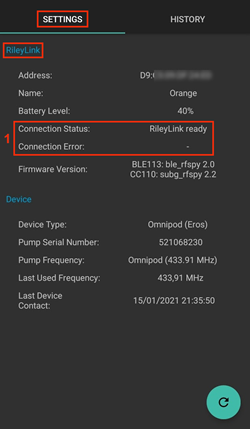

#### Pod Communication Device and Active Pod Settings

This screen will provide information, status, and settings configuration information for both the currently configured pod communication device and the currently active Omnipod Eros pod.

1. Go to the **Omnipod (POD)** tab and press the **POD MGMT (1)** button to access the **Pod management** menu, then press the **RileyLink stats (2)** button to view your currently configured **RileyLink (3)** and active pod **Device (4)** settings.

   >  
   > 
   > 

##### RileyLink (3) fields

> - **Address:** MAC address of the selected pod communication device defined in the Omnipod Settings.
> - **Name:** Bluetooth identification name of the selected pod communication device defined in your phone's Bluetooth settings.
> - **Battery Level:** Displays the current battery level of the connected pod communication device
> - **Connected Device:** Model of the Omnipod pod currently communicating with the pod communication device
> - **Connection Status**: The current status of the Bluetooth connection between the pod communication device and the phone running AAPS.
> - **Connection Error:** If there is an error with the pod communication device Bluetooth connection details will be displayed here.
> - **Firmware Version:** Current firmware version installed on the actively connected pod communication device.

##### Device (4) fields - With an Active Pod

> - **Device Type:** The type of device communicating with the pod communication device (Omnipod pod pump)
> - **Device Model:** The model of the active device connected to the pod communication device (the current model name of the Omnipod pod, which is Eros)
> - **Pump Serial Number:** Serial number of the currently activated pod
> - **Pump Frequency:** Communication radio frequency the pod communication device has tuned to enable communication between itself and the pod.
> - **Last Used frequency:** Last known radio frequency the pod used to communicate with the pod communication device.
> - **Last Device Contact:** Date and time of the last contact the pod made with the pod communication device.
> - **Refresh button** manually refresh the settings on this page.

(omnipod-eros-rileylink-and-active-pod-history)=
#### RileyLink and Active Pod History

This screen provides information in reverse chronological order of each state or action that either the RileyLink or currently connected pod is in or has taken. The entire history is only available for the currently active pod, after a pod change this history will be erased and only events from the newly activated pod will be recorded and shown.

1. Go to the **Omnipod (POD)** tab and press the **POD MGMT (1)** button to access the **Pod Management** menu, then press the **Pod History (2)** button to view the **Settings** and **History** screen. Click on the **HISTORY (3)** text to display the entire history of the RileyLink and currently active pod session.

   >  
   > 
   > 

##### 字段

> - **Date & Time**: In reverse chronological order the timestamp of each event.
> - **Device:** The device to which the current action or state is referring.
> - **State or Action:** The current state or action performed by the device.

(OmnipodEros-omnipod-pod-tab)=

## Omnipod (POD) Tab

Below is an explanation of the layout and meaning of the icons and status fields on the **Omnipod (POD)** tab in the main AAPS interface.

*NOTE: If any message in the Omnipod (POD) tab status fields report (uncertain) then you will need to press the Refresh button to clear it and refresh the pod status.*

> 

### 字段

- **RileyLink Status:** Displays the current connection status of the RileyLink

- *RileyLink Unreachable* - pod communication device is either not within Bluetooth range of the phone, powered off or has a failure preventing Bluetooth communication.
- *RileyLink Ready* - pod communication device is powered on and actively initializing the Bluetooth connection
- *Connected* - pod communication device is powered on, connected and actively able to communicate via Bluetooth.

- **Pod address:** Displays the current address in which the active pod is referenced

- **LOT:** Displays the LOT number of the active pod

- **TID:** Displays the serial number of the pod.

- **Firmware Version:** Displays the firmware version of the active pod.

- **Time on Pod:** Displays the current time on the active pod.

- **Pod expires:** Displays the date and time when the active pod will expire.

- **Pod status:** Displays the status of the active pod.

- **Last connection:** Displays the last time communication with the active pod was achieved.

- *刚刚* - 指20秒内的时间。
- *不到一分钟前* - 超过20秒但不足60秒。
- *1分钟前* - 超过60秒但不足120秒（2分钟）
- *XX分钟前* - 超过2分钟，具体时间由XX值确定

- **Last bolus:** Displays the dosage of the last bolus sent to the active pod and how long ago it was issued in parenthesis.

- **基础基础率：**显示当前时间根据基础率配置文件设定的基础输注速率。

- **临时基础率：**以下列格式显示当前运行的临时基础率：

- Units / hour @ time TBR was issued (minutes run / total minutes TBR will be run)
- *示例：* 0.00U/h @18:25 (90/120分钟)

- **储药量：**当储药器剩余药量超过50单位时，显示"50+单位剩余"。 Below this value the exact units are displayed in yellow text.

- **总输注量：**显示储药器已输送的胰岛素总量（单位）。 *Note this is an approximation as priming and filling the pod is not an exact process.*

- **错误信息：**显示最近发生的错误。 Review the [Pod history](#view-pod-history), [RileyLink history](#omnipod-eros-rileylink-and-active-pod-history) and log files for past errors and more detailed information.

- **活动储药器警报：** 保留用于当前活动储药器上正在运行的警报。 Normally used when pod expiration is past 72 hours and native pod beep alerts are running.

### Icons

- **REFRESH:**

  > 
  > 
  > Sends a refresh command to the active pod to update communication
  > 
  > 用于刷新储药器状态并清除显示（不确定）的状态字段。
  > 
  > See the [Troubleshooting section](#troubleshooting) below for additional information.

- **POD MGMT:**

  > 
  > 
  > Navigates to the Pod management menu

- **ACK ALERTS:**

  > 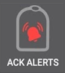
  > 
  > When pressed this will disable the pod expiration beeps and notifications.
  > 
  > Button is displayed only when pod time is past expiration warning time Upon successful dismissal, this icon will no longer appear.

- **SET TIME:**

  > 
  > 
  > When pressed this will update the time on the pod with the current time on your phone.

- **SUSPEND:**

  > 
  > 
  > Suspends the active pod

- **RESUME DELIVERY:**

  > 
  > 
  > > Resumes the currently suspended, active pod

### Pod 管理菜单

Below is an explanation of the layout and meaning of the icons on the **Pod Management** menu accessed from the **Omnipod (POD)** tab.

> 

- **激活Pod**

  > 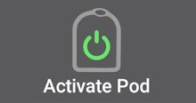
  > 
  > Primes and activates a new pod

- **停用Pod**

  > 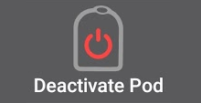
  > 
  > Deactivates the currently active pod.
  > 
  > A partially paired pod ignores this command.
  > 
  > Use this command to deactivate a screaming pod (error 49).
  > 
  > If the button is disabled (greyed out) use the Discard Pod button.

- **Play test beep**

  > 
  > 
  > Plays a single test beep on the pod when pressed.

- **Discard pod**

  > 
  > 
  > Deactivates and discards the pod state of an unresponsive pod when pressed.
  > 
  > Button is only displayed when very specific cases are met as proper deactivation is no longer possible:
  > 
  > > - A **pod is not fully paired** and thus ignores deactivate commands.
  > > - A **pod is stuck** during the pairing process between steps
  > > - A **pod simply does not pair at all.**

- **Pod history**

  > 
  > 
  > Displays the active pod activity history

- **RileyLink stats:**

  > 
  > 
  > Navigates to the RileyLink Statistics screen displaying current settings and RileyLink Connection history
  > 
  > > - **Settings** - displays RileyLink and active pod settings information
  > > - **History** - displays RileyLink and Pod communication history

- **Reset RileyLink Config**

  > 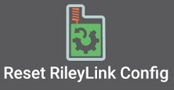
  > 
  > When pressed this button resets the currently connected pod communication device configuration.
  > 
  > > - When communication is started, specific data is sent to and set in the RileyLink > - Memory Registers are set > - Communication Protocols are set > - Tuned Radio Frequency is set 
  > > - See [additional notes](#OmnipodEros-reset-rileylink-config-notes) at the end of this table

- **Read pulse log:**

  > 
  > 
  > > Sends the active pod pulse log to the clipboard

(OmnipodEros-reset-rileylink-config-notes)=

#### *Reset RileyLink Config Notes*

- The primary usage of this feature is when the currently active pod communication device is not responding and communication is in a stuck state.
- If the pod communication device is turned off and then back on, the **Reset RileyLink Config** button needs to be pressed, so that it sets these communication parameters in the pod communication device configuration.
- If this is NOT done then AAPS will need to be restarted after the pod communication device is power cycled.
- This button **DOES NOT** need to be pressed when switching between different pod communication devices

(OmnipodEros-omnipod-settings)=

## Omnipod Settings

The Omnipod driver settings are configurable from the top-left hand corner **hamburger menu** under **Config Builder**➜**Pump**➜**Omnipod**➜**Settings Gear (2)** by selecting the **radio button (1)** titled **Omnipod**. Selecting the **checkbox (3)** next to the **Settings Gear (2)** will allow the Omnipod menu to be displayed as a tab in the AAPS interface titled **OMNIPOD** or **POD**. This is referred to in this documentation as the **Omnipod (POD)** tab.


**NOTE:** A faster way to access the **Omnipod settings** is by accessing the **3 dot menu (1)** in the upper right hand corner of the **Omnipod (POD)** tab and selecting **Omnipod preferences (2)** from the dropdown menu.


以下是设置分组列表，您可通过切换开关启用或禁用下文所述的大多数选项：


*NOTE: An asterisk (\*) denotes the default for a setting is enabled.*

### RileyLink

Allows for scanning of a pod communication device. The Omnipod driver cannot select more than one pod communication device at a time.

- **Show battery level reported by OrangeLink/EmaLink/DiaLink:** Reports the actual battery level of the OrangeLink/EmaLink/Dialink. It is **strongly recommended** that all OrangeLink/EmaLink/DiaLink users enable this setting.

- DOES NOT work with the original RileyLink.
- May not work with RileyLink alternatives.
- Enabled - Reports the current battery level for supported pod communication devices.
- Disabled - Reports a value of n/a.

- **Enable battery change logging in Actions:** In the Actions menu, the battery change button is enabled IF you have enabled this setting AND the battery reporting setting above.  Some pod communication devices now have the ability to use regular batteries which can be changed.  This option allows you to note that and reset battery age timers.

### 确认提示音

提供储药器对大剂量注射、基础率、超微大剂量(SMB)和临时基础率(TBR)输送及变更的确认提示音。

- **\*Bolus beeps enabled:** Enable or disable confirmation beeps when a bolus is delivered.
- **\*Basal beeps enabled:** Enable or disable confirmation beeps when a new basal rate is set, active basal rate is canceled or current basal rate is changed.
- **\*SMB beeps enabled:** Enable or disable confirmation beeps when a SMB is delivered.
- **启用临时基础率提示音：** 控制设置或取消临时基础率(TBR)时是否发出确认提示音。

### 警报

Provides AAPS alerts and Nightscout announcements for pod expiration, shutdown, low reservoir based on the defined threshold units.

*请注意：自警报触发后与储药器首次通信时，AAPS将始终针对任何警报发出通知。 除非启用"自动确认储药器警报"功能，否则仅消除通知并不会消除警报状态。 To MANUALLY dismiss the alert you must visit the Omnipod (POD) tab and press the ACK ALERTS button.*

- **\*Expiration reminder enabled:** Enable or disable the pod expiration reminder set to trigger when the defined number of hours before shutdown is reached.
- **关机前小时数：** 设定活动储药器关机前触发过期提醒警报的小时数。
- **\*Low reservoir alert enabled:** Enable or disable an alert when the pod's remaining units low reservoir limit is reached as defined in the Number of units field.
- **单位数值：** 触发储药器低药量警报的剩余药量单位数。
- **Automatically acknowledge Pod alerts:** When enabled a notification will still be issued however immediately after the first pod communication contact since the alert was issued it will now be automatically acknowledged and the alert will be dismissed.

### 通知

Provides AAPS notifications and audible phone alerts when it is uncertain if TBR, SMB, or bolus events were successful.

*注：这些仅为手机通知，不会触发储药器声音提示。*

- **Sound for uncertain TBR notifications enabled:** Enable or disable this setting to trigger an audible alert and visual notification when AAPs is uncertain if a TBR was successfully set.
- **\*Sound for uncertain SMB notifications enabled:** Enable or disable this setting to trigger an audible alert and visual notification when AAPS is uncertain if an SMB was successfully delivered.
- **\*Sound for uncertain bolus notifications enabled:** Enable or disable this setting to trigger an audible alert and visual notification when AAPS is uncertain if a bolus was successfully delivered.

### 其他

Provides advanced settings to assist debugging.

- **Show Suspend Delivery button in Omnipod tab:** Hide or display the suspend delivery button in the **Omnipod (POD)** tab.
- **Show Pulse log button in Pod Management menu:** Hide or display the pulse log button in the **Pod Management** menu.
- **Show RileyLink Stats button in Pod Management menu:** Hide or display the RileyLink Stats button in the **Pod Management** menu.
- **\*DST/Time zone detect on enabled:** allows for time zone changes to be automatically detected if the phone is used in an area where DST is observed.

### Switching or Removing an Active Pod Communication Device (RileyLink)

With many alternative models to the original RileyLink available (such as OrangeLink or EmaLink) or the need to have multiple/backup versions of the same pod communication device (RileyLink), it becomes necessary to switch or remove the selected pod communication device (RileyLink) from Omnipod Setting configuration.

The following steps will show how to **Remove** and existing pod communication device (RileyLink) as well as **Add** a new pod communication device.  Executing both **Remove** and **Add** steps will switch your device.

1. Access the **RileyLink Selection** menu by selecting the **3 dot menu (1)** in the upper right hand corner of the **Omnipod (POD)** tab and selecting **Omnipod preferences (2)** from the dropdown menu. On the **Omnipod Settings** menu under **RileyLink Configuration (3)** press the **Not Set** (if no device is selected) or **MAC Address** (if a device is present) text to open the **RileyLink Selection** menu.

   >  

### Remove Currently Selected Pod Communication Device (RileyLink)

This process will show how to remove the currently selected pod communication device (RileyLink) from the Omnipod Driver settings.

1. Under **RileyLink Configuration** press the **MAC Address (1)** text to open the **RileyLink Selection** menu.

   > 

2. On the **RileyLink Selection** menu the press **Remove (2)** button to remove **your currently selected RileyLink (3)**

   > 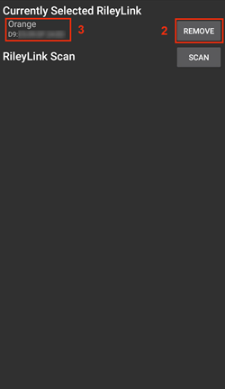

3. At the confirmation prompt press **Yes (4)** to confirm the removal of your device.

   > 

4. You are returned to the **Omnipod Setting** menu where under **RileyLink Configuration** you will now see the device is **Not Set (5)**.  Congratulations, you have now successfully removed your selected pod communication device.

   > 

### Add Currently Selected Pod Communication Device (RileyLink)

This process will show how to add a new pod communication device to the Omnipod Driver settings.

1. Under **RileyLink Configuration** press the **Not Set (1)** text to open the **RileyLink Selection** menu.

   > 

2. Press the **Scan (2)** button to start scanning for all available Bluetooth devices.

   > 

3. Select **your RileyLink (3)** from the list of available devices and you will be returned to the **Omnipod Settings** menu displaying the **MAC Address (4)** of your newly selected device.  Congratulations you have successfully selected your pod communication device.

   >  

## 操作 (ACT) 标签页

This tab is well documented in the main AAPS documentation but there are a few items on this tab that are specific to how the Omnipod pod differs from tube based pumps, especially after the processes of applying a new pod.

1. Go to the **Actions (ACT)** tab in the main AAPS interface.
2. Under the **Careportal (1)** section the following 3 fields will have their **age reset** to 0 days and 0 hours **after each pod change**: **Insulin** and **Cannula**. 这是由于Omnipod胰岛素泵的构造和工作原理决定的。 **泵电池**和**胰岛素储药器**均内置于每个储药器单元内部。 由于储药器在敷贴时会直接将输注套管插入皮肤，Omnipod泵不使用传统导管。 *因此更换储药器后，这些数值的使用时长会自动归零。* **泵电池使用时长**不显示报告，因为储药器内置电池的寿命始终超过储药器使用期限（最长80小时）。

> 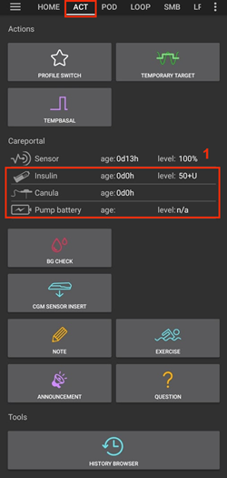

### Levels

**胰岛素储药量**

Reporting of the amount of insulin in the Omnipod Eros Pod is not exact.  This is because it is not known exactly how much insulin was put in the pod, only that when the 2 beeps are triggered while filling the pod that over 85 units have been injected. A Pod can hold a maximum of 200 units. Priming can also introduce variance as it is not and exact process.  With both of these factors, the Omnipod driver has been written to give the best approximation of insulin remaining in the reservoir.

> - **Above 50 Units** - Reports a value of 50+U when more than 50 units are currently in the reservoir.
> - **Below 50 Units** - Reports an approximate calculated value of insulin remaining in the reservoir.
> - **短信查询** - 短信回复将返回实际数值或"50+单位"
> - **Nightscout** - 当药量超过50单位时，会向Nightscout上传50的数值（14.07及更早版本）。  较新版本在药量超过50单位时将报告"50+"的数值。

**Battery Level**

Battery level reporting is a setting that can be enabled to return the current battery level of pod communication devices, such as the OrangeLink, EmaLink or DiaLink.  The RileyLink hardware is not capable of reporting its battery level.  The battery level is reported after each communication with the pod, so when charging a linear increase may not be observed.  A manual refresh will update the current battery level.  When a supported Pod communication device is disconnected a value of 0% will be reported.

> - **RileyLink hardware is NOT capable of reporting battery level**
> - **"Show battery level reported by OrangeLink/EmaLink/DiaLink" Setting MUST be enabled in the Omnipod settings to report battery level values**
> - **Battery level reporting ONLY works for OrangeLink, EmaLink and DiaLink Devices**
> - **Battery Level reporting MAY work for other devices (excluding RileyLink)**
> - **SMS** - Returns current battery level as a response when an actual level exists, a value of n/a will not be returned
> - **Nightscout** - Battery level is reported when an actual level exists, a value of n/a will not be reported

(OmnipodEros-troubleshooting)=

## 故障排除

### Pod 故障

储药器偶尔会因各种问题发生故障，包括储药器自身的硬件问题。 最佳做法是不要向Insulet公司报修，因为AAPS并非官方认可的使用方案。 A list of fault codes can be found [here](https://github.com/openaps/openomni/wiki/Fault-event-codes) to help determine the cause.

### 预防49号储药器故障

该故障与指令对应的储药器状态错误或胰岛素输注指令执行出错有关。 We recommend users to switch to the Nightscout client to *upload only (Disable sync)* under the **Config Builder**➜**General**➜**NSClient**➜**cog wheel**➜**Advanced Settings** to prevent possible failures.

### Pump Unreachable Alerts

It is recommended that pump unreachable alerts be configured to **120 minutes** by going to the top right-hand side three-dot menu, selecting **Preferences**➜**Local Alerts**➜**Pump unreachable threshold \[min\]** and setting this to **120**.

(OmnipodEros-import-settings-from-previous-aaps)=
### Import Settings from previous AAPS

Please note that importing settings has the possibility to import an outdated Pod status. As a result, you may lose an active Pod. It is therefore strongly recommended that you **do not import settings while on an active Pod session**.

1. Deactivate your pod session. Verify that you do not have an active pod session.
2. Export your settings and store a copy in a safe place.
3. Uninstall the previous version of AAPS and restart your phone.
4. Install the new version of AAPS and verify that you do not have an active pod session.
5. Import your settings and activate your new pod.

### Omnipod driver alerts

please note that the Omnipod driver presents a variety of unique alerts on the **Overview tab**, most of them are informational and can be dismissed while some provide the user with an action to take to resolve the cause of the triggered alert. A summary of the main alerts that you may encounter is listed below:

#### No active Pod

No active Pod session detected. This alert can temporarily be dismissed by pressing **SNOOZE** but it will keep triggering as long as a new pod has not been activated. Once activated this alert is automatically silenced.

#### Pod suspended

Informational alert that Pod has been suspended.

#### Setting basal profile failed. Delivery might be suspended! Please manually refresh the Pod status from the Omnipod tab and resume delivery if needed..

Informational alert that the Pod basal profile setting has failed, and you will need to hit *Refresh* on the Omnipod tab.

#### Unable to verify whether SMB bolus succeeded. If you are sure that the Bolus didn't succeed, you should manually delete the SMB entry from Treatments.

Alert that the SMB bolus success could not be verified, you will need to verify the *Last bolus* field on the Omnipod tab to see if SMB bolus succeeded and if not remove the entry from the Treatments tab.

#### Uncertain if "task bolus/TBR/SMB" completed, please manually verify if it was successful.

Due to the way that the RileyLink and Omnipod communicate, situations can occur where it is *uncertain* if a command was successfully processed. The need to inform the user of this uncertainty was necessary.

Below are a few examples of when an uncertain notification can occur.

- **Boluses** - Uncertain boluses cannot be automatically verified. The notification will remain until the next bolus but a manual pod refresh will clear the message. *By default alerts beeps are enabled for this notification type as the user will manually need to verify them.*
- **TBRs, Pod Statuses, Profile Switches, Time Changes** - a manual pod refresh will clear the message. By default alert beeps are disabled for this notification type.
- **Pod Time Deviation -** When the time on the pod and the time your phone deviates too much then it is difficult for AAPS loop to function and make accurate predictions and dosage recommendations. If the time deviation between the pod and the phone is more than 5 minutes then AAPS will report the pod is in a Suspended state under Pod status with a HANDLE TIME CHANGE message. An additional **Set Time** icon will appear at the bottom of the Omnipod (POD) tab. Clicking Set Time will synchronize the time on the pod with the time on the phone and then you can click the RESUME DELIVERY button to continue normal pod operations.

## Best Practices

(OmnipodEros-optimal-omnipod-and-rileylink-positioning)=

### Optimal Omnipod and RileyLink Positioning

The antenna used on the RileyLink to communicate with an Omnipod pod is a 433 MHz helical spiral antenna. Due to its construction properties it radiates an omni directional signal like a three dimensional doughnut with the z-axis representing the vertical standing antenna. This means that there are optimal positions for the RileyLink to be placed, especially during pod activation and deactivation routines.


> *(Fig 1. Graphical plot of helical spiral antenna in an omnidirectional pattern*)

Because of both safety and security concerns, pod *activation* has to be done at a range *closer (~30 cm away or less)* than other operations such as giving a bolus, setting a TBR or simply refreshing the pod status. Due to the nature of the signal transmission from the RileyLink antenna it is NOT recommended to place the pod directly on top of or right next to the RileyLink.

The image below shows the optimal way to position the RileyLink during pod activation and deactivation procedures. The pod may activate in other positions but you will have the most success using the position in the image below.

*Note: If after optimally positioning the pod and RileyLink communication fails, this may be due to a low battery which decreases the transmission range of the RileyLink antenna. To avoid this issue make sure the RileyLink is properly charged or connected directly to a charging cable during this process.*

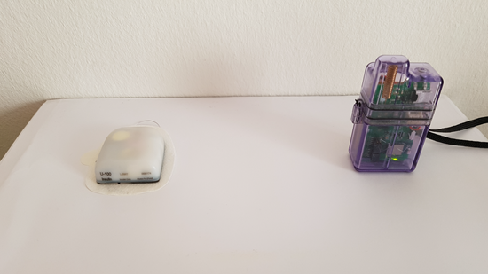

## Where to get help for Omnipod driver

All of the development work for the Omnipod driver is done by the community on a volunteer basis; we ask that you please be considerate and use the following guidelines when requesting assistance:

- **Level 0:** Read the relevant section of this documentation to ensure you understand how the functionality with which you are experiencing difficulty is supposed to work.
- **Level 1:** If you are still encountering problems that you are not able to resolve by using this document, then please go to the *#androidaps* channel on **Discord** by using [this invite link](https://discord.gg/4fQUWHZ4Mw).
- **Level 2:** Search existing issues to see if your issue has already been reported; if not, please create a new [issue](https://github.com/nightscout/AndroidAPS/issues) and attach your [log files](../GettingHelp/AccessingLogFiles.md).
- **Be patient - most of the members of our community consist of good-natured volunteers, and solving issues often requires time and patience from both users and developers.**
