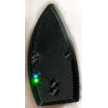
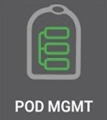
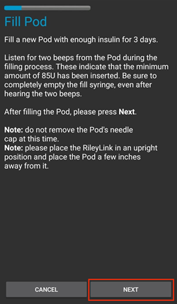
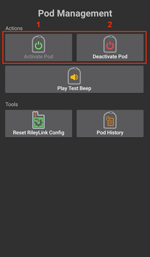
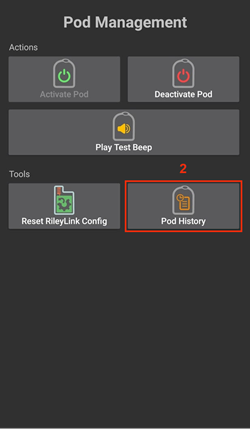

# AAPS Omnipod胰岛素泵驱动文档

本指南适用于配置Omnipod Eros系列胰岛素泵（**不包含Omnipod Dash**）。 自AAPS 2.8版本起已集成Omnipod驱动功能。

**本软件属于人工胰腺系统的DIY解决方案，并非商业产品，需要用户自行研习并全面掌握系统操作原理。 使用后果由您自行承担。**

```{contents}
:backlinks: entry
:depth: 2
```

## 硬件和软件要求

- **Pod 通信设备**

> 该组件实现AAPS手机端与Eros系列储药器间的通信桥接功能。
> 
> > -   [OrangeLink Website](https://getrileylink.org/product/orangelink)
> > -  [433MHz RileyLink](https://getrileylink.org/product/rileylink433)
> > -   [Emalink 网站](https://github.com/sks01/EmaLink) - [联系方式](mailto:getemalink@gmail.com)
> > -   DiaLink - [联系方式](mailto:Boshetyn@ukr.net)
> > -   [LoopLink官网](https://www.getlooplink.org/) - [联系方式](https://jameswedding.substack.com/) - 未经测试

-   **移动电话设备**

> 该组件负责运行AAPS并向储药器通信设备发送控制指令。
> 
> > - 支持运行AAPS 2.8版本及相关组件的[Omnipod驱动安卓手机](#Phones-list-of-tested-phones)。

-   **胰岛素输注设备**

> 该组件负责解析来自AAPS手机端通过储药器通信设备传输的控制指令。
> 
> > - 全新Omnipod储药器（Eros系列 - **非DASH型号**）

本指南默认您正在启动新储药器会话；若非此情况，请保持耐心并在下次更换储药器时执行此流程。

## 开始前的准备工作

**安全第一** - 请勿在无法处理突发故障的环境中操作（必须备有备用储药器、胰岛素、电量充足的RileyLink及手机设备）。

**AAPS Omnipod驱动激活储药器后，您的Omnipod PDM将无法继续使用**。 此前您通过Omnipod PDM向Eros储药器发送指令。 Eros储药器仅允许单一设备与其建立通信连接。 成功激活储药器的设备将成为此后唯一获准与其通信的设备。 这意味着当您通过AAPS Omnipod驱动使用RileyLink激活Eros储药器后，**PDM将无法再控制该储药器**。 配备RileyLink的AAPS Omnipod驱动现已成为您的实际控制设备。 *这并不意味着您应该丢弃PDM，建议将其保留作为备用设备，以防AAPS运行异常时应急使用。*

**可配置多个RileyLink设备，但同一时间仅能选择一个RileyLink与储药器通信。** AAPS Omnipod驱动支持在RileyLink配置中添加多个设备，但每次仅能启用一个RileyLink进行收发通信。

**当RileyLink超出通信范围时，储药器不会停止工作。**若RileyLink超出有效距离或信号受阻无法与当前储药器通信，储药器仍将持续输注基础胰岛素。 激活储药器时，AAPS中设定的基础率配置文件将被写入新储药器。 若与储药器通信中断，设备将自动切换至此预设基础率方案运行。 在RileyLink重新进入通信范围并恢复连接前，您将无法发送新指令。

**AAPS不支持30分钟间隔的基础率配置。** 若您初次使用AAPS并设置基础率，请注意系统不支持半点起始的基础率方案，需调整为整点起始的配置模式。 例如：若您设有1.1单位的基础率方案，起始时间为09:30并持续2小时至11:30结束，此配置将无法生效。  您需将该1.1单位基础率的时间范围调整为9:00-11:00或10:00-12:00。  虽然Omnipod硬件本身支持30分钟间隔的基础率配置，但AAPS算法目前无法兼容此类设置。

## 在AAPS中启用Omnipod驱动

您可通过**两种方式**在AAPS中启用Omnipod驱动：

### 选项一：通过设置向导启用

安装新版AAPS后，**设置向导**将自动启动。  原地升级时也会触发此向导。  若您已从旧版本导出设置，可退出设置向导并导入原有配置。  新安装用户请继续以下步骤。

通过右上角**三点菜单(1)**中的**AAPS设置向导(2)**进入，逐步操作直至进入**泵**设置界面。 然后选择**Omnipod单选按钮(3)**。

>   

在同一界面的泵选择区域下方，**Omnipod驱动设置**中显示**RileyLink配置**，点击**未设置**文字添加您的RileyLink设备。

在**RileyLink选择**界面点击**扫描**按钮，通过搜索所有可用蓝牙设备并从列表中选择您的RileyLink进行配对。 成功选择后，系统将返回泵驱动选择界面，此时Omnipod驱动设置中会显示已选RileyLink及其MAC地址。

点击**下一步**按钮继续完成**设置向导**其余步骤。所选RileyLink初始化可能需要长达一分钟，之后**下一步**按钮才会激活。

Detailed steps on how to setup your pod communication device are listed below in the [RileyLink Setup Section](#OmnipodEros-rileylink-setup).

**或**

### 选项2：配置构建器

通过左上角**汉堡菜单**进入**配置构建器(1)**➜**泵**➜**Omnipod**，选择标有**Omnipod**的**单选按钮(2)**。 勾选**设置齿轮图标(3)**旁的**复选框(4)**后，Omnipod菜单将作为**POD**标签页显示在AAPS界面中。 本文档中将其称为**Omnipod(POD)**标签页。

> **NOTE:** A faster way to access the **Omnipod settings** can be found below in the [Omnipod Settings section](#OmnipodEros-omnipod-settings) of this document.
> 
>  

### Omnipod驱动选择验证

*注：若您未选择RileyLink便提前退出设置向导，虽已启用Omnipod驱动，但仍需完成RileyLink设备选择。  您可能会看到Omnipod（POD）标签页如下所示*

要确认您已在AAPS中启用Omnipod驱动，请从**概览**标签页**向左滑动**，此时您将看到**Omnipod**或**POD**标签页。


## Omnipod配置

请**向左滑动**至**Omnipod(POD)**标签页，您可在此管理所有储药器及RileyLink功能（部分功能需在储药器使用期间才会激活显示）：

>  刷新储药器连接状态
> 
>  储药器管理（激活/停用设备、播放测试提示音、查看RileyLink统计及输注历史）

(OmnipodEros-rileylink-setup)=

### RileyLink 设置

If you already successfully paired your RileyLink in the Setup Wizard or steps above, then proceed to the [Activating a Pod Section](#OmnipodEros-activating-a-pod) below.

*注：RileyLink未连接时，主页标签页的胰岛素和计算器按钮会消失，这是明显的视觉提示。 AAPS启动后约30秒内也会出现此现象，此时系统正在主动连接RileyLink。*

1. 请确保您的RileyLink已充满电并处于开机状态。

2. 选择Omnipod驱动后，通过**配置构建器(1)**➜**泵**➜**Omnipod**➜**齿轮图标(设置)(2)**➜**RileyLink配置(3)**路径，点击**未设置**或**MAC地址(如有显示)**文字来识别并选择您的RileyLink设备。

   > Ensure your RileyLink battery is charged and it is [positioned in close proximity](#OmnipodEros-optimal-omnipod-and-rileylink-positioning) (~30 cm away or less) to your phone for AAPS to identify it by its MAC address. 选择完成后，即可开始激活首个储药器使用会话。 使用手机返回键回到AAPS主界面。
   > 
   >  

3. 在**RileyLink选择**界面，点击**扫描(4)**按钮启动蓝牙搜索。 从可用蓝牙设备列表中**选择您的RileyLink(5)**。

   >  

4. 成功选择后，系统将返回Omnipod设置页面，其中会显示**当前所选RileyLink的MAC地址(6)**。

   > 

5. 请在**Omnipod(POD)**标签页确认**RileyLink状态(1)**显示为**已连接**，且**储药器状态(2)**栏应显示**无活跃储药器**。若未显示，请尝试重复上一步操作或退出AAPS以刷新连接。

   > 

(OmnipodEros-activating-a-pod)=

### 激活储药器

激活储药器前，请确保您已在Omnipod设置中正确配置并连接RileyLink设备。

*重要提示：出于安全防护机制，储药器激活配对时的通信距离存在严格限制。 配对前储药器射频信号较弱，但成功配对后将恢复全功率信号传输。 During these procedures, make sure that your pod is* [within close proximity](#OmnipodEros-optimal-omnipod-and-rileylink-positioning) (~30 cm away or less) but not on top of or right next to the RileyLink.\*

01. 请进入**Omnipod(POD)**标签页，点击**储药器管理(1)**按钮，然后选择**激活储药器(2)**。

    >  

02. 此时将显示**填充储药器**界面。 请在新储药器中装入至少80单位胰岛素，听到两声提示音后表明储药器已准备好进行初始化。 计算3天所需胰岛素总量时，请注意储药器初始化将消耗12至15单位胰岛素。

    > 
    > 
    > 请确保新储药器与RileyLink设备保持近距离（30厘米以内），然后点击**下一步**按钮。

03. 在**初始化储药器**界面，储药器将开始自检（您会听到"咔嗒"一声，随后是一连串滴答声，表明储药器正在进行自检程序）。 若RileyLink超出待激活储药器的有效范围，您将收到**储药器无响应**的错误提示。 If this occurs, [move the RileyLink closer](#OmnipodEros-optimal-omnipod-and-rileylink-positioning) (~30 cm away or less) to but not on top of or right next to the Pod and click the **Retry (1)** button.

    >  

04. 初始化成功后，系统将显示绿色勾选标记，并激活**下一步**按钮。 点击**下一步**按钮完成储药器初始化，随后将显示**佩戴储药器**界面。

    > 

05. 接下来，请准备好新储药器的输注部位。 撕除储药器塑料针帽及粘合衬底的白纸后，将其敷贴至您惯常选择的注射部位。 操作完成后，点击**下一步**按钮。

    > 

06. 此时将弹出**佩戴储药器**对话框。 **仅在准备部署软管时点击确认按钮**。

    > 

07. 点击**确认**后，Omnipod可能需要一些时间响应并插入软管（最长1-2分钟），请耐心等待。

    > 若RileyLink超出待激活储药器的有效范围，您将收到**储药器无响应**的错误提示。 若出现此情况，请将RileyLink移近储药器（保持30厘米以内距离，但勿直接叠放或紧贴），然后点击**重试**按钮。
    > 
    > 若RileyLink超出蓝牙范围或未与手机保持有效连接，您将收到**RileyLink无响应**的错误提示。 遇到此情况时，请将RileyLink移近手机后点击**重试**按钮。
    > 
    > *注意：在插入导管前，建议捏起导管插入点附近的皮肤。 这能确保针头顺利插入，并降低导管堵塞的发生概率。*
    > 
    > 
    > 
    >  

08. 导管成功插入后会出现绿色勾选标记，**下一步**按钮将变为可点击状态。 点击**下一步**按钮。

    > 

09. 此时将显示**储药器已激活**界面。 点击绿色**完成**按钮。 恭喜！ 您已成功开启新的储药器使用会话。

    > 

10. 此时**储药器管理**界面应显示为：**激活储药器(1)**按钮*已禁用*，而**停用储药器(2)**按钮*已启用*。 这是因为当前已有储药器处于激活状态，必须首先停用当前储药器才能激活新储药器。

    点击手机返回键回到**Omnipod(POD)**标签页，此时界面将显示当前储药器会话信息，包括基础率、储药器余量、已输注胰岛素量、设备报错及提醒等数据。

    For more details on the information displayed go to the [Omnipod (POD) Tab](#OmnipodEros-omnipod-pod-tab) section of this document.

     

### 停用储药器

正常情况下，储药器使用寿命为3天（72小时），触发过期警告后仍可延长使用8小时，总使用时长达80小时。

要停用储药器（无论是因到期还是故障）：

1. 请进入**Omnipod(POD)**标签页 → 点击**储药器管理(1)**按钮 → 在**储药器管理**界面选择**停用储药器(2)**功能。

   >  

2. 在**停用储药器**界面，请首先确保RileyLink设备靠近储药器（保持适当间距，避免直接叠放或紧贴），随后点击**下一步**按钮启动停用流程。

   > 

3. **停用舱**界面将显示，并且您会听到舱体发出的确认提示音，表示停用成功。

   > 
   > 
   > **如果停用失败**且未收到确认提示音，您可能会收到**未收到RileyLink响应**或**未收到Pod响应**的提示信息。 请点击**重试(1)**按钮以再次尝试停用。 如果停用持续失败，请点击**废弃Pod(2)**按钮以废弃Pod。 当前使用周期已终止，您现在可以移除储药器。 如果您的Pod发出警报声，您可能需要手动静音（使用别针或回形针），因为**废弃Pod(2)**按钮不会使其静音。
   > 
   > >   

4. 成功停用后将显示绿色勾选标记。 点击**下一步**按钮显示储药器已停用界面。 当前使用周期已终止，您现在可以移除储药器。

   > 

5. 点击绿色按钮返回**Pod管理**界面。

   > 

6. 您现已返回**Pod管理**菜单，请按手机返回键回到**Omnipod(POD)**标签页。 请确认**RileyLink状态：**字段显示为**已连接**，且**Pod状态：**字段显示**无活动Pod**信息。

   >   

### 暂停和恢复胰岛素输注

以下流程将向您展示如何暂停和恢复胰岛素泵的输注。

*注意 - 如果您没有看到"暂停"按钮*，说明该功能尚未在Omnipod(POD)标签页中启用显示。 Enable the **Show Suspend Delivery button in Omnipod tab** setting in the [Omnipod settings](#OmnipodEros-omnipod-settings) under **Other**.

#### 暂停胰岛素输注

使用此命令将活动中的pod置于暂停状态。 在此暂停状态下，pod将停止输送任何胰岛素。 此命令模拟原装Omnipod PDM对活动pod发出的暂停功能。

1. 请前往**Omnipod(POD)**标签页，点击**暂停(1)**按钮。 暂停指令已从RileyLink发送至活动pod，**暂停(3)**按钮将变为灰色不可用状态。 **Pod状态(2)**将显示**暂停输注**。

   >  

2. 当RileyLink成功确认暂停指令后，将显示确认对话框，内容为**所有胰岛素输注已暂停**。 点击**确定**进行确认并继续操作。

   > 

3. 您当前使用的pod现已暂停所有胰岛素输注。 **Omnipod(POD)**标签页将更新**Pod状态(1)**为**已暂停**。 **暂停**按钮将变为新的**恢复输注(2)**按钮

   > 

#### 恢复胰岛素输注

此指令用于命令当前暂停中的储药器恢复胰岛素输注。 命令成功处理后，胰岛素将根据当前时间从活动基础配置文件中恢复使用当前基础率进行正常输注。 Pod将重新接受大剂量、临时基础率和超微大剂量的指令。

1. 请前往**Omnipod(POD)**标签页，确认**Pod状态(1)**字段显示为**已暂停**，然后点击**恢复输注(2)**按钮启动流程，指示当前pod恢复正常胰岛素输注。 **Pod状态(3)**字段将显示**恢复输注**信息，表明RileyLink正在向暂停中的pod发送该指令。

   >  

2. 当RileyLink成功确认恢复输注指令后，将显示确认对话框，内容为**胰岛素输注已恢复**。 点击**确定**进行确认并继续操作。

   > 

3. **Omnipod(POD)**标签页将更新**Pod状态(1)**字段显示为**运行中**，同时**恢复输注**按钮将变回显示**暂停(2)**按钮。

   > 

### 确认Pod警报

*注意 - 若未显示"确认警报"按钮，是因为该按钮仅在触发pod过期或储药器低量警报时，才会在Omnipod(POD)标签页中条件性显示。*

以下流程将指导您如何确认并消除活动pod在72小时(3天)有效期临近时发出的警报提示音。 此警告时限由Omnipod警报设置中的**关机前小时数**定义。 Pod最长使用寿命为80小时(3天8小时)，但Insulet建议不要超过72小时(3天)的限制。

*注意 - 若您已在Omnipod警报设置中启用"自动确认Pod警报"功能，该警报将在首次触发后自动处理，您无需手动消除警报。*

1. 当达到设定的**关机前小时数**警告时限时，pod将发出提示音，告知您其即将到期，需要尽快更换pod。 您可在**Omnipod(POD)**标签页核实：**Pod到期时间：(1)**字段会显示pod失效的具体时间（激活后72小时），超时后文字将变为**红色**；同时在**活动Pod警报(2)**字段下会显示状态信息**Pod即将到期**。 此时将显示**确认警报(3)**按钮。 系统通知(4)也会提醒您pod即将到期

   >  

2. 请前往**Omnipod(POD)**标签页，点击**确认警报(2)**按钮（确认警报）。 RileyLink向pod发送指令以停用pod到期警告提示音，并将**Pod状态(1)**字段更新为**已确认警报**。

   > 

3. 当警报**成功停用**后，活动pod会发出**2声提示音**，并显示确认对话框，内容为**活动警报已确认**。 点击**确定**按钮确认并关闭对话框。

   > 
   > 
   > 当确认警报指令处理期间RileyLink超出pod通信范围时，系统将显示包含2个选项的警告信息。 **静音(1)**将消除当前警告提示音。 **确定(2)**将确认此警告，并允许用户再次尝试确认警报。
   > 
   > 

4. 警报显示无法验证 **SMB** 追加剂量命令是否成功，您需要验证 OMNIPOD 选项卡中的“上次追加剂量”字段，以查看 **SMB** 追加剂量是否成功，如果未成功，请从治疗中删除该条目。请前往<0>Omnipod(POD)</0>标签页，<0>活动Pod警报</0>字段下已不再显示警告信息，且活动pod将不再发出到期警告提示音。

(OmnipodEros-view-pod-history)=

### 查看 Pod 历史

本部分将向您展示如何查看活动pod的历史记录，并按不同操作类别进行筛选。 Pod历史记录工具可让您查看当前活动pod在其3天(72-80小时)生命周期内执行的操作及结果。

此功能可用于验证已执行但您不确定是否完成的大剂量、临时基础率和基础率变更。 其余类别通常有助于故障排查，并确定导致故障的事件发生顺序。

*注意：* **不确定**指令会显示在pod历史记录中，但由于其特性，您无法确保其准确性。

1. 请前往**Omnipod(POD)**标签页，点击**POD管理(1)**按钮进入**Pod管理**菜单，然后点击**Pod历史记录(2)**按钮访问pod历史记录界面。

   >  

2. 在**Pod历史记录**界面中，默认显示**全部(1)**类别，按时间倒序列出所有pod**操作(3)**及其**结果(4)**的**日期和时间(2)**。 按手机**返回键2次**可返回主AAPS界面的**Omnipod(POD)**标签页。

   >  

### 查看RileyLink设置与历史记录

本部分将向您展示如何查看活动pod和RileyLink的设置参数，以及各自的通信历史记录。 此功能包含两个部分：**设置**和**历史记录**。

该功能主要用于当您的pod通信设备超出手机蓝牙范围一段时间后，**RileyLink状态**显示**RileyLink无法连接**的情况。 主界面**Omnipod(POD)**标签页上的**刷新**按钮会手动尝试与Omnipod设置中当前配置的RileyLink重新建立蓝牙连接。

若主界面**Omnipod(POD)**标签页的**刷新**按钮未能恢复与pod通信设备的连接，请按照以下步骤进行手动重连。

#### 手动重建Pod通信设备蓝牙连接

1. 当**Omnipod(POD)**标签页的**RileyLink状态：(1)**显示**RileyLink无法连接**时，请点击**POD管理(2)**按钮进入**Pod管理**菜单。 在**Pod管理**菜单中，您将看到系统正在主动搜索RileyLink连接的通知，此时请点击**RileyLink统计(3)**按钮进入**RileyLink设置**界面。

   >  

2. 在**RileyLink设置(1)**界面的**RileyLink(2)**区域，您可通过**连接状态与错误：(3)**字段确认蓝牙连接状态及错误信息。 此时应显示*蓝牙错误*和*RileyLink无法连接*状态。 请点击右下角的**刷新(4)**按钮，开始手动重新建立蓝牙连接。

   > 
   > 
   > 当蓝牙刷新指令处理期间pod通信设备无响应或超出手机通信范围时，系统将显示包含2个选项的警告信息。

   - **静音(1)**将消除当前警告提示音。
   - **确定(2)**将确认此警告，并允许用户再次尝试重新建立蓝牙连接。

   > 

3. 若**蓝牙连接**未能恢复，请尝试手动关闭手机蓝牙功能后再重新开启。

4. RileyLink蓝牙成功重新连接后，**连接状态：(1)**字段应显示**RileyLink就绪**。 恭喜！您已成功将配置的pod通信设备重新连接至AAPS系统！

   > 

#### Pod通信设备与活动Pod设置

本界面将显示当前配置的pod通信设备及活动中的Omnipod Eros pod相关信息、状态和设置配置。

1. 请前往**Omnipod(POD)**标签页，点击**POD管理(1)**按钮进入**Pod管理**菜单，再点击**RileyLink统计(2)**按钮，即可查看当前配置的**RileyLink(3)**及活动pod**设备(4)**设置。

   >  
   > 
   > 

##### RileyLink(3)字段

> - **地址：** Omnipod设置中定义的所选pod通信设备的MAC地址。
> - **名称：** 手机蓝牙设置中定义的所选pod通信设备的蓝牙标识名称。
> - **电池电量：** 显示已连接的pod通信设备的当前电量水平
> - **已连接设备：** 当前与pod通信设备通信的Omnipod pod型号
> - **连接状态**：pod通信设备与运行AAPS的手机之间的当前蓝牙连接状态。
> - **连接错误：** 若pod通信设备蓝牙连接存在异常，相关错误详情将在此处显示。
> - **固件版本：** 当前连接的pod通信设备上安装的固件版本。

##### 设备(4)字段 - 使用活动Pod时

> - **设备类型：** 与pod通信设备通信的设备类型（Omnipod pod泵）
> - **设备型号：** 连接至pod通信设备的激活设备型号（当前Omnipod pod的型号名称，即Eros）
> - **泵序列号：** 当前激活pod的序列号
> - **泵频率：** pod通信设备为建立与pod间通信所调谐的无线电频率。
> - **上次使用频率：** pod与pod通信设备进行通信时最后使用的无线电频率。
> - **最后设备联系时间：** pod与pod通信设备最后一次建立联系的具体日期和时间。
> - **刷新按钮** 手动刷新本页面的设置信息。

(omnipod-eros-rileylink-and-active-pod-history)=
#### RileyLink与活动Pod历史记录

本界面按时间倒序显示RileyLink或当前连接pod所处的状态或执行的操作信息。 完整历史记录仅适用于当前活动pod，更换pod后该历史将被清空，系统仅记录并显示新激活pod的事件。

1. 请进入**Omnipod(POD)**标签页，点击**POD管理(1)**按钮进入**Pod管理**菜单，再点击**Pod历史(2)**按钮即可查看**设置**与**历史记录**界面。 点击**历史记录(3)**文字可查看RileyLink及当前活动pod会话的完整历史。

   >  
   > 
   > 

##### 字段

> - **日期和时间**：按时间倒序排列的每个事件的时间戳。
> - **设备：** 当前操作或状态所指向的设备。
> - **状态或操作：** 设备当前所处的状态或执行的操作。

(OmnipodEros-omnipod-pod-tab)=

## Omnipod(POD)标签页

以下是对主AAPS界面中**Omnipod(POD)**标签页图标及状态字段布局与含义的说明。

*注意：如果在Omnipod（POD）选项卡状态字段报告中任何消息显示（不确定），则需要按下刷新按钮以清除该状态并刷新pod状态。*

> 

### 字段

- **RileyLink状态：**显示RileyLink的当前连接状态

- *RileyLink无法连接* - pod通信设备可能超出手机蓝牙范围、已关机或存在故障导致无法进行蓝牙通信。
- *RileyLink 准备就绪* - pod 通信设备已开机，正在主动初始化蓝牙连接
- *已连接* - pod通信设备已开机、连接并可通过蓝牙进行主动通信。

- **Pod地址：**显示当前活动pod被引用的地址

- **批号：**显示当前活动pod的批号

- **TID：**显示pod的序列号。

- **固件版本：**显示当前活动pod的固件版本。

- **Pod时间：**显示当前活动pod的时间。

- **Pod有效期：**显示当前活动pod的到期日期和时间。

- **Pod状态：**显示当前活动pod的状态。

- **最后连接时间：**显示最近一次与活动pod成功建立通信的时间。

- *刚刚* - 指20秒内的时间。
- *不到一分钟前* - 超过20秒但不足60秒。
- *1分钟前* - 超过60秒但不足120秒（2分钟）
- *XX分钟前* - 超过2分钟，具体时间由XX值确定

- **最后大剂量：**显示最近发送至活动pod的大剂量数值，括号内显示该剂量发出的时间间隔。

- **基础基础率：**显示当前时间根据基础率配置文件设定的基础输注速率。

- **临时基础率：**以下列格式显示当前运行的临时基础率：

- 单位/小时 @ 临时基础率设定时间（已运行分钟数/临时基础率总运行分钟数）
- *示例：* 0.00U/h @18:25 (90/120分钟)

- **储药量：**当储药器剩余药量超过50单位时，显示"50+单位剩余"。 低于此值时，将以黄色文字显示精确单位值。

- **总输注量：**显示储药器已输送的胰岛素总量（单位）。 *请注意这是近似值，因为pod的灌注和填充并非精确过程。*

- **错误信息：**显示最近发生的错误。 Review the [Pod history](#OmnipodEros-view-pod-history), [RileyLink history](#omnipod-eros-rileylink-and-active-pod-history) and log files for past errors and more detailed information.

- **活动储药器警报：** 保留用于当前活动储药器上正在运行的警报。 通常用于当pod超过72小时有效期且设备原生蜂鸣警报正在运行时。

### 图标

- **刷新：**

  > 
  > 
  > 向当前活动pod发送刷新命令以更新通信
  > 
  > 用于刷新储药器状态并清除显示（不确定）的状态字段。
  > 
  > See the [Troubleshooting section](#OmnipodEros-troubleshooting) below for additional information.

- **POD管理：**

  > 
  > 
  > 跳转至Pod管理菜单

- **确认警报：**

  > 
  > 
  > 按下此按钮将禁用pod过期蜂鸣声和通知。
  > 
  > 该按钮仅在pod时间超过过期警告时间时显示 成功解除后，此图标将不再出现。

- **设置时间：**

  > 
  > 
  > 按下此按钮将使用您手机的当前时间更新pod上的时间。

- **暂停:**

  > 
  > 
  > 暂停当前活动pod

- **恢复输注：**

  > 
  > 
  > > 恢复当前暂停的活动pod

### Pod 管理菜单

以下是关于从**Omnipod (POD)**选项卡进入的**Pod管理**菜单中图标布局和含义的说明。

> 

- **激活Pod**

  > 
  > 
  > 对新pod进行灌注和激活

- **停用Pod**

  > 
  > 
  > 停用当前活动的pod。
  > 
  > 部分配对的pod会忽略此命令。
  > 
  > 使用此命令可停用发出警报声的pod（错误代码49）。
  > 
  > 如果该按钮被禁用（显示为灰色），请使用"废弃Pod"按钮。

- **播放测试蜂鸣音**

  > 
  > 
  > 按下时会在pod上播放一次测试蜂鸣音。

- **废弃pod**

  > 
  > 
  > 按下时将停用并清除无响应pod的状态。
  > 
  > 该按钮仅在满足特定条件时显示（当无法正常停用时）：
  > 
  > > - 一个**pod未完全配对**，因此会忽略停用命令。
  > > - 一个**pod卡在**配对过程中的步骤之间
  > > - 一个**pod完全无法配对。**

- **Pod历史记录**

  > 
  > 
  > 显示活动pod的历史记录

- **RileyLink状态：**

  > 
  > 
  > 跳转至RileyLink统计界面，显示当前设置和RileyLink连接历史记录
  > 
  > > - **设置** - 显示RileyLink和活动pod的设置信息
  > > - **历史记录** - 显示RileyLink与Pod的通信历史

- **重置RileyLink配置**

  > 
  > 
  > 按下此按钮将重置当前连接的pod通信设备配置。
  > 
  > > - 当通信启动时，特定数据将被发送并设置到RileyLink中 > - 设置内存寄存器 > - 设置通信协议 > - 设置调谐射频 
  > > - 请参阅本表格末尾的[补充说明](#OmnipodEros-reset-rileylink-config-notes)

- **读取脉冲日志：**

  > 
  > 
  > > 将活动pod的脉冲日志发送到剪贴板

(OmnipodEros-reset-rileylink-config-notes)=

#### *重置RileyLink配置说明*

- 此功能主要用于当前活动的pod通信设备无响应且通信处于卡死状态时。
- 如果pod通信设备关闭后又重新开启，则需要按下**重置RileyLink配置**按钮，以便在pod通信设备配置中设置这些通信参数。
- 如未执行此操作，则在pod通信设备完成电源循环后必须重新启动AAPS。
- 在不同pod通信设备之间切换时**无需**按下此按钮

(OmnipodEros-omnipod-settings)=

## Omnipod设置

Omnipod驱动设置可通过左上角**汉堡菜单**中的**配置构建器**➜**泵**➜**Omnipod**➜**设置齿轮图标(2)**进行配置，选择标有**Omnipod**的**单选按钮(1)**即可。 勾选**设置齿轮图标(2)**旁边的**复选框(3)**，将使Omnipod菜单以**OMNIPOD**或**POD**标签页形式显示在AAPS界面中。 本文档中将其称为**Omnipod(POD)**标签页。


**注意：** 访问**Omnipod设置**的快捷方式是通过点击**Omnipod(POD)**标签页右上角的**三点菜单(1)**，然后从下拉菜单中选择**Omnipod首选项(2)**。


以下是设置分组列表，您可通过切换开关启用或禁用下文所述的大多数选项：


*注意：星号(*)表示该设置的默认状态为启用。*

### RileyLink

允许扫描pod通信设备。 Omnipod驱动一次只能选择一个pod通信设备。

- **显示OrangeLink/EmaLink/DiaLink报告的电池电量：** 报告OrangeLink/EmaLink/DiaLink的实际电池电量。 **强烈建议**所有OrangeLink/EmaLink/DiaLink用户启用此设置。

- 不适用于原始RileyLink。
- 可能不适用于RileyLink替代设备。
- 启用 - 报告支持的pod通信设备的当前电池电量。
- 禁用 - 报告值为"不适用"。

- **在操作菜单中启用电池更换记录：** 若您已启用此设置及上述电池报告设置，则操作菜单中的电池更换按钮将被激活。  某些pod通信设备现在可以使用可更换的普通电池。  此选项可让您记录更换时间并重置电池使用计时器。

### 确认提示音

提供储药器对大剂量注射、基础率、超微大剂量(SMB)和临时基础率(TBR)输送及变更的确认提示音。

- ***启用大剂量提示音：** 设置是否在大剂量给药时播放确认提示音。
- ***基础率提示音启用：** 设置是否在以下情况播放确认提示音：新基础率设定时、活动基础率取消时或当前基础率变更时。
- ***超微大剂量提示音启用：** 设置是否在超微大剂量给药时播放确认提示音。
- **启用临时基础率提示音：** 控制设置或取消临时基础率(TBR)时是否发出确认提示音。

### 警报

当pod到期、关机或根据设定的阈值单位检测到储药器药量不足时，提供AAPS警报和Nightscout通知。

*请注意：自警报触发后与储药器首次通信时，AAPS将始终针对任何警报发出通知。 除非启用"自动确认储药器警报"功能，否则仅消除通知并不会消除警报状态。 要手动消除警报，必须访问Omnipod(POD)标签页并按下"确认警报"按钮。*

- ***启用到期提醒：** 设置是否在达到关机前设定小时数时触发pod到期提醒。
- **关机前小时数：** 设定活动储药器关机前触发过期提醒警报的小时数。
- ***启用低药量警报：** 设置当pod剩余药量达到"单位数"字段中定义的低药量限制时是否触发警报。
- **单位数值：** 触发储药器低药量警报的剩余药量单位数。
- **自动确认Pod警报：** 启用后仍会发出通知，但在警报触发后首次与Pod建立通信连接时，系统将自动确认并消除该警报。

### 通知

当不确定临时基础率(TBR)、超微大剂量(SMB)或大剂量给药是否成功时，提供AAPS通知和手机声音警报。

*注：这些仅为手机通知，不会触发储药器声音提示。*

- **不确定TBR通知的声音已启用:** 启用或禁用此设置，当AAPs不确定是否成功设置TBR时，触发声音警报和视觉通知。
- ***不确定超微大剂量通知的声音已启用:** 启用或禁用此设置，当AAPS不确定是否成功输注超微大剂量时，触发声音警报和视觉通知。
- ***不确定大剂量通知的声音已启用:** 启用或禁用此设置，当AAPS不确定是否成功输注大剂量时，触发声音警报和视觉通知。

### 其他

提供高级设置以协助调试。

- **在Omnipod标签页显示暂停输注按钮:** 在**Omnipod (POD)**标签页隐藏或显示暂停输注按钮。
- **在Pod管理菜单中显示脉冲日志按钮:** 在**Pod管理**菜单中隐藏或显示脉冲日志按钮。
- **在Pod管理菜单中显示RileyLink统计按钮:** 在**Pod管理**菜单中隐藏或显示RileyLink统计按钮。
- ***启用夏令时/时区检测:** 当手机在实行夏令时的地区使用时，可自动检测时区变化。

### 切换或移除正在使用的Pod通讯设备(RileyLink)

随着原始RileyLink的多种替代型号(如OrangeLink或EmaLink)的出现，或需要拥有相同Pod通讯设备(RileyLink)的多个/备用版本，从Omnipod设置配置中切换或移除选定的Pod通讯设备(RileyLink)变得必要。

以下步骤将展示如何**移除**现有Pod通讯设备(RileyLink)以及**添加**新的Pod通讯设备。  执行**移除**和**添加**两个步骤将切换您的设备。

1. 进入**RileyLink选择**菜单：点击**Omnipod(POD)**标签页右上角的**三点菜单(1)**，然后从下拉菜单中选择**Omnipod偏好设置(2)**。 在**Omnipod设置**菜单的**RileyLink配置(3)**下，点击**未设置**(若未选择设备)或**MAC地址**(若已选择设备)文字，打开**RileyLink选择**菜单。

   >  

### 移除当前选定的Pod通讯设备(RileyLink)

此流程将展示如何从Omnipod驱动设置中移除当前选定的Pod通讯设备(RileyLink)。

1. 在**RileyLink配置**下，点击**MAC地址(1)**文字打开**RileyLink选择**菜单。

   > 

2. 在**RileyLink选择**菜单中，点击**移除(2)**按钮以移除**当前选定的RileyLink(3)**

   > 

3. 在确认提示中点击**是(4)**以确认移除您的设备。

   > 

4. 您已返回**Omnipod设置**菜单，在**RileyLink配置**下现在会看到设备状态为**未设置(5)**。  恭喜，您已成功移除选定的Pod通讯设备。

   > 

### 添加当前选定的Pod通讯设备(RileyLink)

此流程将展示如何向Omnipod驱动设置中添加新的Pod通讯设备。

1. 在**RileyLink配置**下，点击**未设置(1)**文字打开**RileyLink选择**菜单。

   > 

2. 点击**扫描(2)**按钮开始扫描所有可用的蓝牙设备。

   > 

3. 从可用设备列表中选择**您的RileyLink(3)**，您将返回**Omnipod设置**菜单，此时会显示新选择设备的**MAC地址(4)**。  恭喜，您已成功选择Pod通讯设备。

   >  

## 操作 (ACT) 标签页

此标签页在主AAPS文档中有详细说明，但有几个项目专门说明Omnipod pod与管式泵的区别，特别是在完成新pod应用流程后的注意事项。

1. 前往主AAPS界面中的**操作(ACT)**标签页。
2. 在**Careportal(1)**部分，以下3个字段将在**每次更换pod后**将其**使用时长重置**为0天0小时：**胰岛素**和**套管**。 这是由于Omnipod胰岛素泵的构造和工作原理决定的。 **泵电池**和**胰岛素储药器**均内置于每个储药器单元内部。 由于储药器在敷贴时会直接将输注套管插入皮肤，Omnipod泵不使用传统导管。 *因此更换储药器后，这些数值的使用时长会自动归零。* **泵电池使用时长**不显示报告，因为储药器内置电池的寿命始终超过储药器使用期限（最长80小时）。

> 

### 余量水平

**胰岛素储药量**

Omnipod Eros Pod中的胰岛素量报告不精确。  这是因为无法精确知道Pod中注入了多少胰岛素，只能通过填充Pod时触发的2声提示音来判断已注入超过85单位。 单个Pod最多可容纳200单位胰岛素。 初始化过程也可能引入误差，因为这不是一个精确的操作流程。  基于这两个因素，Omnipod驱动程序的编写旨在提供储药器中剩余胰岛素的最佳估算值。

> - **超过50单位** - 当储药器中当前胰岛素量超过50单位时，显示为50+U。
> - **低于50单位** - 显示储药器中剩余胰岛素的估算值。
> - **短信查询** - 短信回复将返回实际数值或"50+单位"
> - **Nightscout** - 当药量超过50单位时，会向Nightscout上传50的数值（14.07及更早版本）。  较新版本在药量超过50单位时将报告"50+"的数值。

**电池电量**

电池电量报告是一项可启用的设置，用于返回Pod通讯设备（如OrangeLink、EmaLink或DiaLink）的当前电池电量。  RileyLink硬件无法报告其电池电量。  电池电量会在每次与Pod通讯后更新，因此充电时可能不会观察到线性增长。  手动刷新将更新当前电池电量。  当支持的Pod通讯设备断开连接时，将报告0%电量值。

> - **RileyLink硬件无法报告电池电量**
> - **必须在Omnipod设置中启用"显示OrangeLink/EmaLink/DiaLink报告的电池电量"选项才能获取电池电量数值**
> - **电池电量报告仅适用于OrangeLink、EmaLink和DiaLink设备**
> - **电池电量报告可能适用于其他设备(RileyLink除外)**
> - **SMS** - 当存在实际电量时返回当前电池电量作为响应，不会返回n/a值
> - **Nightscout** - 当存在实际电量时报告电池电量，不会报告n/a值

(OmnipodEros-troubleshooting)=

## 故障排除

### Pod 故障

储药器偶尔会因各种问题发生故障，包括储药器自身的硬件问题。 最佳做法是不要向Insulet公司报修，因为AAPS并非官方认可的使用方案。 故障代码列表可[在此处](https://github.com/openaps/openomni/wiki/Fault-event-codes)查看，以帮助确定原因。

### 预防49号储药器故障

该故障与指令对应的储药器状态错误或胰岛素输注指令执行出错有关。 我们建议用户在**配置构建器**➜**通用**➜**NS客户端**➜**齿轮图标**➜**高级设置**下切换为仅上传模式(禁用同步)，以防止可能出现的问题。

### 泵体失联警报

建议通过右上角三点菜单进入**偏好设置**➜**本地警报**➜**泵不可达阈值[分钟]**，将该值设为**120**来配置泵不可达警报。

(OmnipodEros-import-settings-from-previous-aaps)=
### 从之前的AAPS导入设置

请注意：导入设置可能会带入过期的Pod状态信息。 这可能导致您丢失正在使用的Pod。 因此强烈建议**在Pod使用期间不要导入设置**。

1. 停用您当前的Pod会话。 确认您没有正在使用的Pod会话。
2. 请导出您的设置文件并妥善保存副本。
3. 卸载旧版AAPS并重启手机。
4. 安装新版AAPS并确认没有正在使用的Pod会话。
5. 导入您的设置并激活新Pod。

### Omnipod驱动警报

请注意：Omnipod驱动程序在**概览标签页**会显示多种独特警报，其中大部分为信息类警报可忽略，但部分警报会提示用户需采取相应操作来解决触发警报的原因。 以下是您可能会遇到的主要警报摘要：

#### 无活动Pod

未检测到活动的Pod会话。 该警报可通过点击**暂缓**临时关闭，但在新储药器激活前将持续触发。 该警报激活后将自动静音。

#### Pod已暂停

提示性警报：Pod已暂停。

#### 基础率配置文件设置失败。 输注可能已暂停！ 请从Omnipod标签页手动刷新储药器状态，必要时恢复输注。

提示性警报：Pod基础率配置文件设置失败，您需要在Omnipod标签页点击*刷新*。

#### 无法确认超微大剂量是否成功输注。 若确认大剂量未成功输注，请手动从治疗记录中删除该条超微大剂量记录。

警报：无法确认超微大剂量是否成功输注，您需要检查Omnipod标签页的*最后大剂量*字段确认输注状态，若失败需在治疗记录页删除该条目。

#### 无法确认"任务大剂量/临时基础率/超微大剂量"是否完成，请人工核验操作结果。

由于RileyLink与Omnipod的通讯特性，可能出现*无法确定*指令是否成功执行的情况。 必须告知用户存在这种不确定性。

以下是可能触发不确定通知的几种情况示例。

- **大剂量** - 无法自动验证不确定的大剂量输注。 该通知将持续到下次大剂量输注，但手动刷新Pod可清除该消息。 *默认情况下，此类通知会启用警报提示音，因为需要用户手动进行确认。*
- **临时基础率、Pod状态、配置文件切换、时间变更** - 手动刷新Pod可清除该消息。 默认情况下，此类通知类型禁用警报提示音。
- **Pod时间偏差 -** 当Pod时间与手机时间偏差过大时，AAPS循环系统将难以正常运行并做出准确的预测和剂量建议。 若Pod与手机时间偏差超过5分钟，AAPS将在Pod状态中报告Pod处于暂停状态，并显示"处理时间变更"提示信息。 Omnipod（POD）标签页底部将额外显示**设置时间**图标。 点击"设置时间"将使Pod时间与手机同步，之后可点击"恢复输注"按钮继续正常Pod操作。

## 最佳实践

(OmnipodEros-optimal-omnipod-and-rileylink-positioning)=

### Omnipod与RileyLink的最佳摆放位置

RileyLink用于与Omnipod Pod通信的天线是433 MHz螺旋天线。 由于其结构特性，它辐射出全向信号，就像一个三维环形，z轴代表垂直立式天线。 这意味着RileyLink存在最佳摆放位置，特别是在Pod激活和停用过程中。


> *（图1. 螺旋天线全向辐射模式图示*）

出于安全和保密考虑，Pod*激活*操作需在*较近距离（约30厘米以内）*完成，该距离要求比其他操作（如输注大剂量、设置临时基础率或单纯刷新Pod状态）更为严格。 由于RileyLink天线的信号传输特性，不建议将Pod直接放置在RileyLink正上方或紧贴其旁边。

下图展示了Pod激活和停用过程中RileyLink的最佳摆放方式。 Pod在其他位置也可能激活，但采用下图所示位置的成功率最高。

*注：若在最佳摆放位置下仍出现Pod与RileyLink通信失败，可能是电池电量不足导致天线传输范围缩小。 为避免此问题，请确保RileyLink在此过程中电量充足或直接连接充电线。*


## Omnipod驱动相关问题求助渠道

Omnipod驱动的所有开发工作均由社区志愿者完成；请您在寻求帮助时遵循以下准则并保持体谅：

- **第0级：**查阅本文档相关章节，确保您已理解遇到问题的功能模块的正确运作方式。
- **第一级：** 若使用本文档仍无法解决问题，请通过[此邀请链接](https://discord.gg/4fQUWHZ4Mw)加入**Discord**平台的*#androidaps*频道寻求帮助。
- **第二级：** 请先搜索现有问题，确认您的问题是否已被报告；若未发现相同问题，请新建[问题报告](https://github.com/nightscout/AndroidAPS/issues)并附上[日志文件](../GettingHelp/AccessingLogFiles.md)。
- **请保持耐心——我们社区成员多为热心志愿者，问题的解决往往需要用户和开发者双方投入时间与耐心。**
