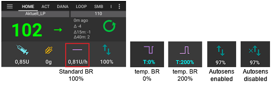
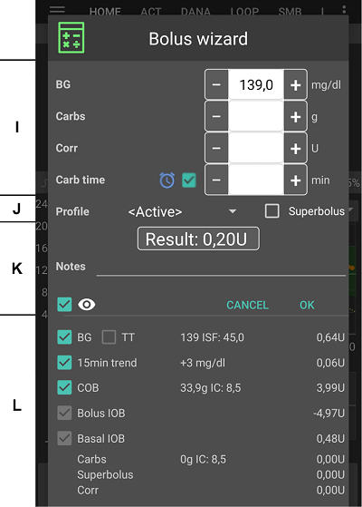
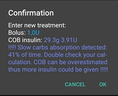
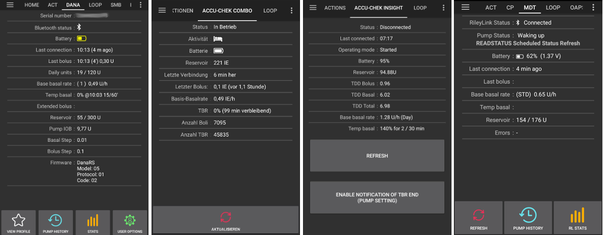
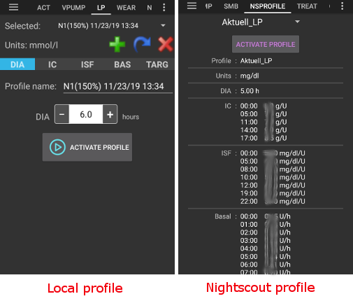

# AAPS界面

```{contents}
:backlinks: entry
:depth: 2
```

(AapsScreens-the-homescreen)=

## 主界面


这是你打开**AAPS**后首先看到的界面，它包含了你日常所需的大部分信息。

### A部分 - 标签

* 在不同的**AAPS**模块之间导航。
* 你也可以通过左右滑动来切换屏幕。
* 在[config builder](#Config-Builder-tab-or-hamburger-menu)中可以选择显示的标签。

(aaps-screens-profile--target)=

### B部分 - 配置文件&目标

#### 当前配置文件

左侧栏显示当前配置文件。

短按配置文件栏以查看配置文件详细信息。 长按配置文件栏以[切换不同的配置文件](../DailyLifeWithAaps/ProfileSwitch-ProfilePercentage.md)。


1. 使用标准配置文件激活时的常规显示。
2. 配置切换，剩余时长为59分钟。
3. 配置切换，特定百分比为120%。
4. 配置切换，特定百分比为80%，剩余时长为59分钟。
5. 配置切换，时间偏移为-1小时。
6. 配置切换，特定百分比为120%，时间偏移为1小时，剩余时长为59分钟。

#### 血糖控制目标值


右侧栏显示当前的血糖目标水平。

短按目标栏以设置**[临时目标](../DailyLifeWithAaps/TempTargets.md)**。

如果设置了临时目标，栏位将变为黄色，括号内显示剩余时间（分钟）。

(AapsScreens-visualization-of-dynamic-target-adjustment)=

#### 动态目标调整的可视化


当使用[SMB算法](#Config-Builder-aps)和[Autosens](#Open-APS-features-autosens)功能时，**AAPS**可以根据敏感性动态调整目标。

在[偏好设置>OpenAPS SMB设置](#Preferences-openaps-smb-settings)中启用以下选项之一或全部：

* “敏感时提高目标”和/或 
* “抵抗时降低目标” 

如果**AAPS**检测到抗药或敏感，目标将从配置中设置的值更改。 当更改目标血糖时，背景将变为绿色。

(AapsScreens-section-c-bg-loop-status)=

### C部分 - 血糖与闭环状态

#### 当前血糖

左侧显示来自CGM的最新血糖读数。

BG值的颜色反映其状态与预定义[范围](#Preferences-range-for-visualization)的关系：

* 绿色 = 在范围内
* 红色 = 低于范围
* 黄色 = 高于范围 


中间的区块显示：

1. 自上次**CGM**读取以来的分钟数
2. 与最近读数的差值：Δ，与过去15分钟和40分钟平均值的差值（Δ15与Δ40）。  
    长期差值为历史差值的平均值计算，反映平均变化情况。

(AapsScreens-loop-status)=

#### 闭环状态


右侧图标显示闭环状态：

1. 绿色圆圈 = 闭环运行
2. 绿色圆圈带虚线 = [低血糖暂停（LGS）](#objectives-objective6)
3. 红色圆圈 = 闭环禁用（永久不工作）
4. 红色圆圈 = 闭环暂停（暂时停止，但会给予基础胰岛素）- 下方显示剩余时间
5. 灰色圆圈 = 泵断开（暂时无胰岛素剂量）- 下方显示剩余时间
6. 橙色圆圈 = 超级大剂量运行- 下方显示剩余时间
7. 带虚线的蓝色圆圈 = 开环

短按或长按图标以打开闭环对话框，切换闭环模式（关闭、低血糖暂停、开环或禁用）、暂停/重新启用闭环或断开/重新连接泵。

* 如果在闭环对话框中短按，选择后需要进行验证。
    
    

(aaps-screens-bg-warning-sign)=

#### 血糖警告标志

如果由于任何原因，**AAPS**接收到的血糖读数有问题，你将在主屏幕上的BG数字下方收到警告信号。

##### 红色警告标志：重复BG数据

红色警告标志表示你需要立即采取行动：你正在接收**重复的BG数据**，这会阻止闭环正常工作。 因此，你的闭环将被禁用，直到问题解决。

    {admonition} 你的闭环未运行
    :class: note
    你的闭环未运行，直到你解决此问题！


你需要找出为什么会收到重复的BG：

* 你的Nightscout站点是否启用了Dexcom桥接？ 通过访问你的Nightscout实例的管理面板，编辑“enable”变量并删除“bridge”部分来禁用桥接。 （对于Heroku，[详细信息可在此处找到](https://nightscout.github.io/troubleshoot/troublehoot/#heroku-settings)。）
* 是否有多个源将你的BG上传到Nightscout？ 如果你使用BYODA应用，请在**AAPS**中启用上传，但不要在xDrip+中启用。
* 是否有关注者可能收到你的BG但又将其再次上传到你的Nightscout站点？
* 最后的手段：在**AAPS**中，转到[偏好设置>NSClient](#Preferences-nsclient)，选择同步设置并禁用“从NS接受CGM数据”选项。

要立即移除警告并让闭环再次运行，你需要手动从Dexcom/xDrip+标签中删除一些条目。

但是，如果有很多重复项，可能更容易：

* [备份你的设置](../Maintenance/ExportImportSettings.md)，
* 在维护菜单中重置你的数据库，
* 再次[导入你的设置](../Maintenance/ExportImportSettings.md)。

##### 黄色警告标志

黄色警告信号表示你的BG以不规则的时间间隔到达，或者缺少一些BG。 按压标志时，消息显示“使用重新计算的数据”。


通常你不需要采取任何行动。 闭环系统将继续工作！

传感器更换会中断血糖数据的持续流动，因此传感器更换后出现黄色警告标志是正常的，无需担心。

对于Libre用户的特别说明：

* 每几个小时，Libre会滑动一两分钟，这意味着你永远不会得到完美的规则BG间隔。
* 此外，跳动的读数也会中断连续流动。
* 因此，Libre用户的黄色警告标志将“始终开启”。

*注意*： **AAPS**计算会考虑最多30小时的数据。 因此，即使你解决了原始问题，黄色三角形也可能在最后一次出现不规则间隔后约30小时才会消失。

#### 简单模式

在本节右上角有一个孩子脸图标，表示您处于[简单模式](#preferences-simple-mode)。


### D部分 - IOB, COB, BR和AS



1. **注射器**：活性胰岛素（IOB）——体内活性胰岛素总量  
    当且仅当运行标准基础率且无先前推注的胰岛素残留时，IOB数值才会为零。
    
    * 如果最近有一段时间基础量减少，IOB可能为负数。
    * 按压图标以查看大剂量和基础胰岛素的分配。

2. **谷物**：[体内活性碳水（COB）](../DailyLifeWithAaps/CobCalculation.md)- 你之前摄入的尚未吸收的碳水。如果需要碳水，图标将脉冲为红色（见[下方](#aaps-screens-carbs-required)）。

3. **紫色线条**：当前基础率。 图标会发生变化，以反映基础率（100%时是直线）的临时变化 
    * 按压图标以查看基础基础率和任何临时基础率（包括剩余时长）的详细信息。
4. **箭头向上&向下**：指示动态敏感功能状态（[Autosens/自动敏感度调整](#Open-APS-features-autosens) 或 [DynamicISF/动态胰岛素敏感系数](#Open-APS-features-DynamicISF)）的启用/禁用状态。 本区域可能显示以下数值： 
    * AS：Autosens数值。 即使禁用Autosens仍会显示（仅作参考）。 激活DynISF时也会显示，但该数值不生效。
    * Alg：DynamicISF数值（基于总日剂量TDD）。 详见[DynamicISF](#Open-APS-features-DynamicISF)页面末行的技术说明。

(aaps-screens-carbs-required)=

#### 需要碳水


当参考设计检测到需要碳水时，会给出碳水建议。

这是当oref算法认为它不能通过零临时基础率来拯救你，你需要碳水来修复时。

碳水通知比大剂量计算器的通知更复杂。 你可能会在看到大剂量计算器没有显示缺少碳水时看到碳水建议。

如果需要，可以将碳水通知推送到Nightscout，在这种情况下，将显示并广播公告。

### E部分 - 状态指示灯


状态指示灯为以下情况提供视觉警告：

* 管路使用时间
* 胰岛素使用时间（储液器使用天数）
* 储液器药量（单位）
* 探头使用时间
* 电池使用时间和电量（%）

如果超过阈值警告，值将以黄色显示。

如果超过临界阈值，值将以红色显示。

设置可以在[偏好设置>概览>状态指示灯](#Preferences-status-lights)中更改。

根据你使用的泵，你可能不会看到所有这些图标。

(aaps-screens-main-graph)=

### F部分 - 主图


该图表显示从动态（CGM）读取的血糖（BG）。

在操作标签中输入的备注，如指尖校准和碳水条目，以及配置文件切换，都显示在这里。

点击图表左上角的菜单或长按图表任意区域，即可调整显示的时间范围。 您可以选择6、12、18或24小时。

绿色区域反映你的目标范围。

蓝色三角形显示[SMB](#Open-APS-features-super-micro-bolus-smb)- 如果在[偏好设置>OpenAPS SMB](#Preferences-openaps-smb-settings)中启用。

(AapsScreens-activate-optional-information)=

#### 激活可选信息

在主图上，你可以打开以下可选信息：

* 预测
* 治疗动作（Treatments）
* 基础率
* 活动-胰岛素活动曲线

要显示此信息，请点击主图表右侧的三角形。 对于主图表，仅提供“图表 1 2 3 4”上方的四个选项。


(aaps-screens-prediction-lines)=

#### 预测线

* **橙色**线：[COB](CobCalculation)（颜色通常用于表示COB和碳水）
    
    此预测线显示基于当前**配置文件**设置，假设由于碳水吸收的偏差保持恒定，你的BG（而不是COB本身！）将走向何处。 此线仅在已知COB时出现。

* **深蓝色**线：IOB（颜色通常用于表示IOB和胰岛素）
    
    这条预测线显示了仅在胰岛素影响下会发生的情况。 例如，如果你注入了一些胰岛素但没有摄入任何碳水化合物。

* **浅蓝色**线：零临时基础率（如果设置临时基础率为0%，则预测的BG）
    
    此预测线显示如果泵停止所有胰岛素输送（0% TBR），BG轨迹线将如何变化。
    
    *当使用[SMB](#Config-Builder-aps)算法时，此线才会出现。*

* **深黄色**线：[未宣布的餐食（UAM，un-announced meals）](#SensitivityDetectionAndCob-sensitivity-oref1)
    
    未宣布的用餐意味着检测到由于用餐、肾上腺素或其他影响导致的血糖水平显著升高。 预测线类似于**橙色的COB线**，但它假设偏差将以恒定速率逐渐减小（通过延长当前的降低速率）。
    
    *当使用[SMB](#Config-Builder-aps)算法时，此线才会出现。*

* **深橙色**线：aCOB（加速碳水吸收）
    
    与COB相似，但假设静态的10 mg/dL/5m（-0.555 mmol/l/5m）碳水吸收率。 已弃用且用途有限。
    
    *当使用较旧的[AMA](#Config-Builder-aps)算法时，此线才会出现。*

通常，你的实际血糖曲线会落在这些线的中间，或接近与你的情况最接近的假设线。

#### 基础率

**蓝色实线**表示泵的基础输送，并反映实际输注随时间的变化。

**蓝色虚线**表示如果没有临时基础率调整（TBRs），基础率将是什么。

当给予标准基础率时，曲线下方的区域以深蓝色显示。 当基础率临时调整（增加或减少）时，曲线下方的区域以浅蓝色显示。

#### 活动

**细黄线**显示胰岛素的活动。

它基于如果没有其他因素（如碳水）存在，你体内的胰岛素预期会使BG下降的程度。

(AapsScreens-section-g-additional-graphs)=

### 第G节 - 附加图表。

您可以在主图表下方激活最多四个附加图表。 在[简单模式](#preferences-simple-mode)下，附加图表是预设的，无法更改。 如果希望设置自己的附加图表配置，请关闭**简单模式**。

To open settings for additional graphs click the triangle on the right side of the [main graph](#aaps-screens-main-graph) and scroll down.


要配置附加图表，请勾选每个图表对应数据的复选框。

大多数用户发现以下附加图表配置足够：

* 图表1：活性胰岛素（IOB）、活性碳水（COB）、敏感度动态调整（Autosens/DynamicISF）​
* 图2：偏差和BGI。

#### 胰岛素绝对值

包括大剂量**和基础量**的活性胰岛素。

#### 活性胰岛素

显示您体内已有的胰岛素（= 您体内活跃的胰岛素）。 它包括来自追加量（bolus）和临时基础量（basal）的胰岛素（**但不包括在您的个人档案中设置的基础率**）。

如果在胰岛素作用时间（DIA）内没有[SMBs](#Open-APS-features-super-micro-bolus-smb)、没有追加量（boluses）也没有临时基础率（TBR），那么这个值就会是零。

如果长时间没有大剂量且零/低临时基础量，IOB可能为负数。

衰减取决于你的[DIA和胰岛素配置文件设置](../SettingUpAaps/YourAapsProfile.md)。

#### 活性碳水化合物

显示你体内的碳水（= 体内尚未衰减的碳水）。

衰减取决于[算法检测到的偏差](../DailyLifeWithAaps/CobCalculation.md)。

如果它检测到比预期更高的碳水吸收率，将给予胰岛素，这将增加IOB（或多或少，取决于你的安全设置）。

#### 敏感度调整

显示[Autosens](#Open-APS-features-autosens)检测到的灵敏度。

灵敏度计算的是运动、激素等导致的胰岛素敏感性。

请注意，您需要在[目标8](#objectives-objective8)中才能允许灵敏度检测/[Autosens](#Open-APS-features-autosens)自动调整胰岛素的输送量。 在达到该目标之前，图表中的线条仅用于显示信息。

### 动态敏感度

显示由[DynamicISF](../DailyLifeWithAaps/DynamicISF.md)算法计算的敏感度参数。 仅在使用此功能时显示数据。

(screen-heart-rate-steps)=

#### 心率&步数

使用[Wear智能手表](../WearOS/WearOsSmartwatch.md)时可能获取此类数据。 需在**AAPS** Wear应用中启用这些功能并授予健康数据权限。

#### 偏差

* **灰色**条显示由于碳水引起的偏差。 
* **绿色**条显示BG高于算法预期。 绿色条用于在[Autosens](#Open-APS-features-autosens)中增加抗药性。
* **红色**条显示BG低于算法预期。 红色条用于在[Autosens](#Open-APS-features-autosens)中增加敏感性。
* **黄色**条显示由于UAM引起的偏差。
* **黑色**条显示未考虑用于敏感性的小偏差。

#### 血糖影响

此线显示仅基于胰岛素活动，BG“应该”上升或下降的程度。


将BGI线和偏差条一起显示是一个好主意。 它们共享相同的比例尺，但与其他可选数据不同，因此最好将它们显示在不同的图表上，如上图所示。 比较BGI线和偏差条是了解**BG**如何波动的另一种方法。 在这里，在标记为**1**的时间点，偏差条大于BGI线，表明BG正在上升。 稍后，在标记为**2**的小时内，BGI和DEV几乎一致，表明BG稳定。

### H部分 - 按钮


胰岛素与碳水按钮几乎始终保持可见。 若与胰岛素泵的连接中断，​计算器按钮将隐藏不可见。

其他按钮可以在[偏好设置>概览>按钮](#Preferences-buttons)中设置。

关于使用胰岛素、碳水和计算器按钮：如果在[偏好设置>概览](#Preferences-show-notes-field-in-treatments-dialogs)中启用，**备注**字段允许你输入将显示在主图上的文本，并可能根据NS客户端的设置上传到Nightscout。

(aaps-screens-buttons-insulin)=

#### 胰岛素


To give a certain amount of insulin without using the [bolus calculator](#aaps-screens-bolus-wizard).

通过选中**即将进食临时目标**框，你可以自动启动你的[即将进食临时目标](#TempTargets-eating-soon-temp-target)。

如果你不想通过泵给予大剂量但想记录胰岛素量（即使用笔给予的胰岛素），请选中相应的框。 选中此框后，你将获得一个附加字段“时间偏移”，你可以使用它来记录过去给予的胰岛素注射。

您可以使用按钮快速增加胰岛素的量。 增量值可以在[首选项 > 概述 > 按钮](#Preferences-buttons)中更改。

胰岛素按钮可在泵暂停时使用，例如记录使用注射笔注射的胰岛素。 在这种情况下，标题将显示为黄色，且“仅记录，不注射”复选框无法取消勾选。


#### 碳水化合物


要记录碳水而不给予大剂量。

可以直接通过选中框来设置某些[预设临时目标](#TempTargets-hypo-temp-target)。

**时间偏移**：你曾在/你将在何时吃碳水（以分钟为单位）。

**持续时间**：用于[“扩展碳水”](ExtendedCarbs)的时间。

你可以使用按钮快速增加碳水量。 增量值可以在[首选项 > 概述 > 按钮](#Preferences-buttons)中更改。

#### 计算器

See Bolus Wizard [section below](#aaps-screens-bolus-wizard).

#### 校准

向xDrip+发送校准或打开Dexcom校准对话框。

必须在[偏好设置>概览>按钮](#Preferences-buttons)中激活。

#### CGM

打开xDrip+。

返回按钮返回**AAPS**。

必须在[偏好设置>概览>按钮](#Preferences-buttons)中激活。

#### 快速向导

轻松输入碳水量并设置计算基础。

详细信息在[偏好设置>概览>快速向导设置](#Preferences-quick-wizard)中设置。

(aaps-screens-bolus-wizard)=

## 大剂量向导



当你想要给一个餐时大剂量（bolus）时，通常会在这里进行。

### I部分

显示计算后的大剂量。

如果活性胰岛素量超过了计算后的大剂量，那么它将仅显示仍需的碳水化合物量。

(AapsScreens-section-j)=

### J部分

BG字段通常已经填充了来自您的动态（CGM）的最新读数。 如果您没有正在工作的动态（CGM），则该字段将为空。

在**碳水化合物**字段中，您添加您想要为之注射大剂量的碳水化合物（或等效物）的估计量。

**校正**字段用于因某种原因需要修改最终剂量时使用。

**碳水时间**字段用于预先注射大剂量，这样您可以告诉系统，在预期摄入碳水化合物之前会有一段时间的延迟。 如果您是为了之前摄入的碳水化合物而注射大剂量，您可以在此字段中输入负数。

**饮食提醒**：对于未来的碳水化合物摄入，可以选择闹钟复选框（默认情况下，当输入未来时间时会自动选中），以便在指定时间提醒您何时摄入已输入到**AAPS**中的碳水化合物。


### K部分

**配置文件**允许您选择不同于当前配置文件的另一个配置文件，以便计算所需的胰岛素量。 此配置文件选择仅适用于当前的大剂量注射，并不是更改配置文件。

**超级大剂量**是指将接下来两小时的基础胰岛素添加到即时大剂量中，并在接下来的两小时内发出零临时基础率（TBR），以收回额外的胰岛素。 该选项仅在[首选项 > 概述 > 高级设置](#Preferences-advanced-settings-overview)中设置了“在向导中启用超级大剂量”时才会显示。 这种做法的目的是更早地输送胰岛素，从而有望减少血糖峰值。

有关详细信息，请访问[diabetesnet.com](https://www.diabetesnet.com/diabetes-technology/blue-skying/super-bolus/)。

### L部分

向导中大剂量计算的详细信息。

您可以取消选择任何您不想包含的项目，但通常您不会这样做。

出于安全原因，如果您希望大剂量向导基于现有的临时目标进行计算，则**必须手动勾选TT框**。

#### COB和IOB的组合及其含义

* 出于安全原因，当选中COB框时，IOB框无法取消选中，因为如果您这样做，可能会因为**AAPS**未考虑已给予的胰岛素而面临胰岛素过量的风险。
* 如果你同时勾选了COB和IOB，那么未吸收且尚未用胰岛素覆盖的碳水化合物+所有作为TBR或SMB输注的胰岛素都将被考虑在内。
* 如果你只勾选了IOB而没有勾选COB，**AAPS**会考虑已经输注的胰岛素，但不会将其与任何仍待吸收的碳水化合物相抵消。 这会导致出现“缺少碳水化合物”的通知。
* 如果您在餐后大剂量（例如，额外的甜点）之后不久为**额外食物**注射大剂量，那么**取消选中所有框**可能会有所帮助。 这样，只有新的碳水化合物会被添加，因为主餐不一定会被完全吸收，所以在餐后大剂量之后不久，IOB（体内剩余胰岛素量）不会与COB（体内剩余碳水化合物量）准确匹配。


眼睛附近的框允许您在详细视图（显示每项计算的数字）和带有图标的简单视图之间进行选择。 点击图标可以启用/禁用此条目在计算中的参与。

(AapsScreens-wrong-cob-detection)=

#### 错误的COB检测



如果您在使用大剂量向导后看到上述警告，那么**AAPS**已检测到计算出的COB（体内剩余碳水化合物量）值可能不正确。 因此，如果您想在之前包含COB（体内剩余碳水化合物量）的餐后再次注射大剂量，您应该注意避免过量用药！

有关详细信息，请参阅[COB计算页面](#CobCalculation-detection-of-wrong-cob-values)上的提示。

(screens-action-tab)=

## 操作（Action）选项卡


### 操作Action - M部分

Button **[Profile switch](../DailyLifeWithAaps/ProfileSwitch-ProfilePercentage.md)** as an alternative to pressing the [current profile](#aaps-screens-profile--target) on homescreen.

Button **[Temporary target](../DailyLifeWithAaps/TempTargets.md)** as an alternative to pressing the [current target](#aaps-screens-profile--target) on homescreen.

启动或取消临时基础率的按钮。 请注意，当设置了临时基础率时，按钮会从“TEMPBASAL”更改为“取消x%”。

Even though [extended boluses](#extended-bolus-and-why-they-wont-work-in-closed-loop-environment) do not really work in a closed loop environment some people were asking for an option to use extended bolus anyway.

* 此选项仅适用于Dana RS和Insight泵。 
    * 闭环将自动停止并切换到开环模式，以运行扩展大剂量。
    * 在使用此选项之前，请务必阅读[详细信息](../DailyLifeWithAaps/ExtendedCarbs.md)。

(aaps-screens-careportal)=

### Careportal - N部分

显示信息：

* 传感器使用时间&电量（百分比）
* 胰岛素使用时间&药量（单位u）
* 管路使用时间
* 泵电池使用时间&电量（百分比）

如果使用**低分辨率皮肤**（[首选项 > 常规 > 皮肤](#Preferences-skin)），则显示的信息将减少。

(screens-sensor-level-battery)=

#### 传感器电量

适用于带有额外发射器（如MiaoMiao 2）的CGM。 （技术上，传感器必须向xDrip+发送cat级别信息。）

可以在[偏好设置 > 概述 > 状态灯](#Preferences-status-lights)中设置阈值。

### 护理门户（Careportal） - O部分

BG check, prime/fill, sensor insert and pump battery change are the base for the data displayed in [section N](#aaps-screens-careportal).

输注装置准备/填充功能允许您记录泵底板和胰岛素储药器的更换情况。

第O节反映了Nightscout的护理门户（careportal）。 因此，运动、公告和问题都是特殊形式的备注。

### 工具 - P部分

#### 历史浏览器

允许你在**AAPS**中[回顾历史](../Maintenance/Reviewing.md)。

#### 日胰岛素总量（Total daily dose，TDD）

每日总剂量（Total daily dose，TDD） = 每日大剂量 + 每日基础剂量

一些医生（尤其是针对新使用泵的患者）会使用50:50的基础-大剂量比例。

因此，比例计算为TDD（每日总剂量）/ 2 * TBB（总基础剂量 = 24小时内基础率的总和）。

其他人则更倾向于将TBB（总基础剂量）设定为TDD（每日总剂量）的32%至37%之间。

像大多数这些经验法则一样，它的实际有效性是有限的。 注意：您的糖尿病情况可能有所不同！

(AapsScreens-insulin-profile)=

## 胰岛素配置文件


这显示了您在[配置生成器 > 胰岛素](#Config-Builder-insulin)中选择的胰岛素活动曲线。 曲线将根据[DIA](#your-aaps-profile-duration-of-insulin-action)和达峰时间而有所不同。

**紫色**线显示了注射后胰岛素的剩余量，它随时间衰减，而**蓝色**线显示了其活性。

要了解有关其是什么以及如何设置的更多信息，请参阅[你的AAPS配置文件 > 胰岛素作用持续时间](#your-aaps-profile-duration-of-insulin-action)。

## 泵状态



* 有关泵状态的不同信息。 显示的信息取决于您的泵型号。
* 有关详细信息，请参阅[泵页面](../Getting-Started/CompatiblePumps.md)。

## 闭环、AMA / SMB

这些选项卡显示了有关算法计算的详细信息，以及**AAPS**为何如此运行的原因。

每次系统从CGM获取新读数时，都会运行计算。

要了解更多详细信息，请参阅[配置构建器页面上的APS部分](#Config-Builder-aps)。

(aaps-screens-profile)=

## 配置文件



配置文件包含有关你的个人糖尿病设置的信息，有关更多信息，请参阅详细的**[配置文件](../SettingUpAaps/YourAapsProfile.md)**页面。

## 自动操作

请参阅[专用页面](../DailyLifeWithAaps/Automations.md)。

## NSClient


此页面显示与您的Nightscout站点的连接状态。

可以在[首选项 > NS客户端](#Preferences-nsclient)中更改设置。

有关故障排除，请参阅此[页面](../GettingHelp/TroubleshootingNsClient.md)。

## BG来源 - xDrip+、BYODA...


根据您的血糖来源设置，此选项卡的名称可能有所不同。

显示CGM读数的历史记录，并提供在出现故障（如电量低）或重复读数时删除读数的选项。

(aaps-screens-treatments)=

## 治疗动作（Treatments）

可以通过点击菜单右侧的三个点，然后选择“治疗”来访问此视图。 无法通过配置构建器在主菜单中显示它。 在此视图中，您可以查看和修改以下治疗的历史记录：

* 大剂量&碳水
* [扩展大剂量(方波)](#Extended-Carbs-extended-bolus-and-switch-to-open-loop-dana-and-insight-pump-only)
* 临时基础率
* [临时目标](../DailyLifeWithAaps/TempTargets.md)
* [配置文件切换](../DailyLifeWithAaps/ProfileSwitch-ProfilePercentage.md)
* Careportal：通过操作选项卡和对话框中输入的备注
* 用户输入：未发送到Nightscout的其他备注

在最后一列中，每行的数据来源以蓝色显示。 它可以是：

* NS代表Nightscout：数据来自Nightscout或已记录到Nightscout中。
* PH代表泵历史记录：数据已被泵处理过。

(screens-bolus-carbs)=

### 大剂量&碳水


在此选项卡上，您可以查看大剂量和碳水化合物的记录。 每个大剂量胰岛素（行**1**和**4**）在胰岛素量旁边显示剩余的活性IOB。 大剂量胰岛素的来源可以是：

* 餐食（通过胰岛素、快速向导或大剂量向导按钮手动输入）
* 使用SMB功能时的SMB

碳水化合物（行**2**）仅存储在Nightscout中。 If you have used the [Bolus Wizard](#aaps-screens-bolus-wizard) to calculate insulin dosage, you can press the “Calc” text (line **3**) to show the details of how the bolus was calculated.

根据所使用的泵，胰岛素和碳水化合物可能显示在一行中，或者会产生多行：一行用于计算细节，一行用于碳水化合物，一行用于大剂量胰岛素本身。

治疗选项卡可用于更正错误的碳水化合物输入（*即*您高估或低估了碳水化合物量）。 请注意，无法编辑现有条目，您需要按照以下步骤操作：

1. 在主页上检查并记住实际的COB和IOB。
2. 根据泵的不同，在治疗选项卡中，碳水化合物可能会与胰岛素一起显示在一行中，或者作为单独的条目显示（例如，使用Dana RS时）。
3. 删除包含错误碳水化合物量的条目。 （最新版本在治疗屏幕上有一个垃圾桶图标。 点击垃圾桶图标，选择要删除的行，然后再次点击垃圾桶图标以完成操作。）
4. 通过再次检查主屏幕上的COB来确保碳水已成功删除。
5. 如果治疗选项卡中只有一行包含碳水化合物和胰岛素，则对IOB也执行相同的操作。
    
    →如果碳水化合物没有按预期删除，并且您按照此处（6.）所述添加了额外的碳水化合物，那么COB将会过高，这可能导致胰岛素输送过多。

6. 通过主屏幕上的碳水按钮输入正确的碳水量，并确保设置了正确的事件时间。

7. 如果治疗选项卡中只有一行包含碳水化合物和胰岛素，则您还需要添加胰岛素的量。 确保设置正确的事件时间，并在确认新条目后检查主页上的IOB。

### 临时基础率


由闭环系统应用的**临时基础率**将在此处显示。 当某个条目仍然对IOB有影响时，相关信息将以绿色显示。 它可以是：

* 如果临时基础率高于在配置文件中设置的基础率（行**2**），则为正IOB。
* 对于零临时基础率或临时基础率低于在配置文件中设置的基础率（行**1**），则为负IOB。

删除条目只会影响您在Nightscout中的报告，并可能会干扰您的实际IOB——因此不建议这样做。

在一行的左侧，红色的S表示“暂停”：当当前未输送基础胰岛素时会出现这种情况。 例如，在更换药盒的过程中，这是一种正常情况。

### 临时目标


这里可以看到临时目标的历史记录。

### 配置文件切换


可以在此处查看配置文件切换的历史记录。 每次切换配置文件时，您可能会看到多个条目：行**1**存储在Nightscout中，但不在泵历史记录中，它对应于用户发出的配置文件切换请求。 行**2**同时存储在NS（Nightscout）和PH（泵历史记录）中，对应于实际的切换。

删除条目只会影响您在Nightscout中的报告，而永远不会实际改变当前配置文件。

您可以使用行**1**上显示的**克隆**按钮来复制一个**配置文件切换**。 有关更多信息，请参阅[您的AAPS配置文件>管理您的配置文件](#your-aaps-profile-clone-profile-switch)。

### Care portal


此选项卡显示了记录在Nightscout中的所有备注和警报。

## 历史浏览器

可以通过点击菜单右侧的3个点，然后选择“历史记录”来访问此视图。 通过Config Builder无法将项目添加到主菜单中。 It can also be accessed through a button at the bottom of the [Action tab](#screens-action-tab).

允许您在**AAPS**历史记录中回溯。 请参阅专门页面[查看您的数据>历史记录浏览器](../Maintenance/Reviewing.md)。

## 统计数据

可以通过点击菜单右侧的3个点，然后选择“统计”来访问此视图。 通过Config Builder无法将项目添加到主菜单中。

为您提供关于您的TIR（入框时间）和TDD（每日总剂量）的统计数据。 请参阅专用页面[查看您的数据>统计信息](#reviewing-statistics)。

(aaps-screens-profile-helper)=

## 配置文件助手

可以通过点击菜单右侧的3个点，然后选择“Profile Helper（配置文件助手）”来访问此视图。 通过Config Builder无法将项目添加到主菜单中。 “配置文件助手”可以帮助您：

* [为孩子从头开始构建配置文件](#your-aaps-profile-profile-from-scratch-for-a-kid)
* [比较两个配置文件](#your-aaps-profile-compare-profiles)