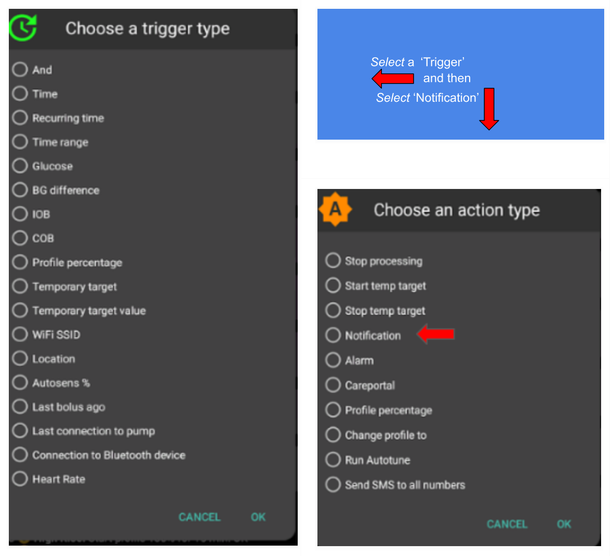
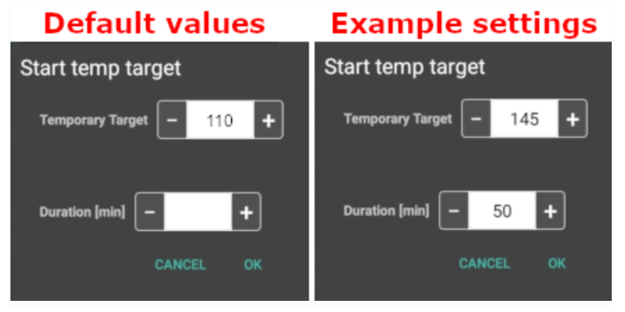
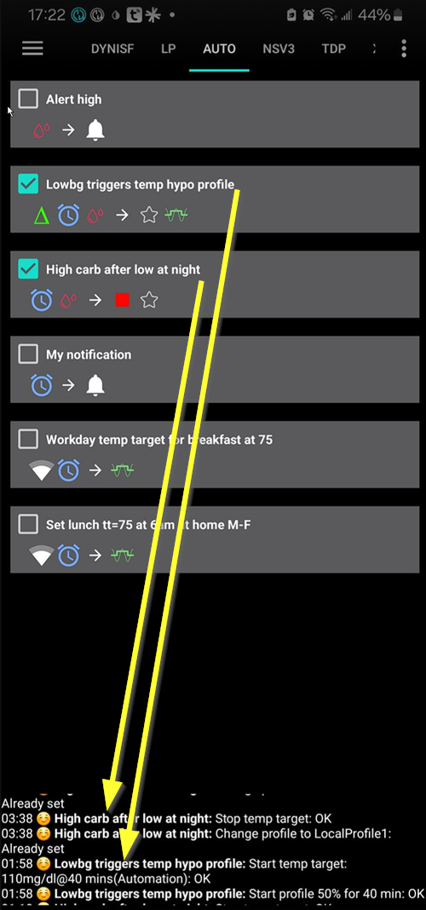

# 自动操作

## 什么是自动化（Automation）？

"**自动化**"是AAPS系统中可自动执行任务的功能模块。

自动化功能通过一个或多个条件/触发机制执行特定操作。 触发条件可包含血糖水平异常（偏高或偏低）、体内存在设定阈值的活性胰岛素（IOB）等非规律性事件； 也可处理每日固定时段用餐/运动、用户进入GPS定位点或WIFI SSID区域等周期性事件。 该功能还支持按计划周期或每次Pod更换时自动执行AAPS设置备份。

用户可通过自动化标签页创建和修改规则， 每条规则由两个核心要素构成：

- 一个或多个启动动作的条件或"触发器"。

    例如：特定时间安排、系统事件或参数数值变化

- 需执行的一个或多个操作。

    例如：触发警报；调整基础率百分比；Pod更换时导出AAPS设置。


有多种自动化选项可供选择，建议用户在AAPS应用的自动化部分中详细研究这些选项。 您可访问  与  搜索AAPS用户群组，参考其他用户的自动化设置案例。

## 自动操作如何帮助我们

1. **自动化周期性任务：**通过自动执行预设操作实现无人值守运行。

1. **减少决策疲劳**：**自动操作**的主要好处是减轻用户需要手动干预**AAPS**的负担。 研究估计，患有1型糖尿病的人平均每天需要做出额外的180个决策。 **自动化**可以减轻心理负担，让用户能够将精力投入到生活的其他方面。

1. **可能改善血糖控制**：例如，**自动操作**可以确保在需要时始终设置**临时目标**，即使在忙碌或健忘的情况下也是如此。 例如，如果一个患有糖尿病的孩子在学校每周二上午10点和周四下午2点有体育活动，并且需要在活动前30分钟设置高血糖临时目标（TT），那么可以通过自动操作来实现。

1. **使AAPS高度可定制**：根据用户的偏好，在特定情况下可以更加或不太激进。 例如，如果在半夜出现负**IOB**，表明当前**配置文件**可能过强，可以触发一段时间内的临时降低**配置文件**百分比。

下面的例子说明了如何通过**自动化**来省略某些步骤。

用户每天早上6点锻炼：他需要在锻炼前，即早上5点，手动在AAPS中设置“TT-活动”。


用户设置了一个**自动操作**，在早上5点触发“TT-活动”，以确保他们的**血糖**和**IOB**在准备6点锻炼时处于最佳状态：


## 开始使用自动操作前的关键考虑

1. 启用特定自动化功能前，建议确保已通过**AAPS**实现稳定的控制**血糖**。 自动化功能不应作为基础率、**ISF**或**CR**参数设置欠佳的补偿手段（详见下文论述）。 避免设置自动化**配置文件切换**来补偿由于食物等原因导致的**血糖**升高，这些情况最好通过其他策略（如SMBs等）来处理。

1. 与所有技术一样，**持续葡萄糖监测系统（CGMs）**、**胰岛素泵**和手机都有可能出现故障：技术问题或传感器错误可能会中断**自动化操作**，这时可能需要进行手动干预。

1. 随着日常活动的变化，**自动操作的需求**也可能发生变化。 在工作/学校/假期之间切换时，请在日历中设置提醒，以审查当前活跃的**自动操作**（它们很容易激活和停用）。 例如，如果你去度假，不再需要为学校体育或日常锻炼设置的自动操作，或者需要调整时间。

1. **自动操作**可能会相互冲突，因此最好在安全环境中仔细审查任何新的**自动操作**设置，并了解为什么**自动操作**可能未按预期触发。

1. 如果使用Autosens功能，请尽量使用**临时目标（Temp Targets）**而不是**配置切换（Profile Switches）**。 **临时目标**不会将Autosens重置为0， 而配置切换会重置Autosens。

1. 大多数**自动操作**应仅设置**有限的时间段**，之后**AAPS**可以重新评估并根据需要重复自动操作（如果条件仍然满足）。 例如，“启动7.0 mmol/l的临时目标持续30分钟”或“启动110%的**配置文件**持续10分钟”_以及_“启动5.0 mmol/l的临时目标持续10分钟”。 使用**自动操作**创建永久更改（例如，更改为更强的配置文件百分比）可能会导致低血糖。

## 我什么时候可以开始使用自动操作？

可以在**目标10**中开始使用**自动操作**。

## 自动操作在AAPS中的位置

根据[配置构建器>常规](../SettingUpAaps/ConfigBuilder.md)设置的不同，**自动化功能**可能位于「汉堡菜单」内，或作为与**AAPS**并存的标签页显示。

## 如何设置自动操作？

要设置一个**自动化**动作，请在**AAPS**中创建一个“规则”如下：


* 为你的“规则”命名；
* 选择至少一个“条件”；


* 选择一个“操作”；


* 勾选**自动化**事件右侧的方框以激活**自动化**：


要停用**自动操作**规则，请取消勾选规则名称左侧的框。 下面的示例显示了一个名为“低血糖TT”的**自动操作**，它可以被激活（勾选）或停用（未勾选）。


在设置**自动化**时，您可以首先通过激活“操作”下的“通知”选项来测试它。 这会触发**AAPS**首先显示通知，而不是实际自动化操作。 当您确认通知已在正确的时间/条件下触发后，可以更新**自动化**规则，将“通知”替换为“操作”。



```{admonition} Important note
:class: note
**自动操作**在闭环禁用时仍然有效！
```


## 安全限制

对**自动操作**设置了安全限制：

* **血糖**值必须在72 mg/dl和270 mg/dl（或4 mmol/l和15 mmol/l）之间。
* “**配置文件百分比**”必须在70%到130%之间。
* **自动操作**执行（及首次执行）之间有5分钟的时间限制。

## 正确使用负值

```{admonition} Warning
:class: warning
在选择**自动操作**中的负值时请小心。
```

在选择“条件”中的负值（如“小于”）时需要谨慎。 例如：


**示例1**：创建条件**“小于”**-0.1 mmol/l（或-2 mg/dl）将：

当任何**严格小于**-0.1（-2）的数字时触发**自动操作**。 这包括-0.2、-0.3、-0.4（-4、-6、-8）等数字。 请记住，-0.1（-2）本身**不**包括在此条件中。 （条件“等于或小于”-0.1 mmol/l或-2 mg/dl_将_包括-0.1 mmol/l或-2 mg/dl）。

**示例2**：创建条件“大于”-0.1 mmol/l（-2 mg/dl）将：

当任何**大于**-0.1 mmol/l（-2 mg/dl）的数字时触发**自动操作**。 这包括0、0.2、0.4 mmol/l（0、4、8 mg/dl）等任何正数。

在选择这些条件和值时，必须仔细考虑**自动操作**的确切意图。

(automations-automation-triggers)=
## 自动化触发器


系统提供多种「触发器」类型供用户自定义选择。 触发器即自动化执行所需满足的必要条件。 以下列表并不详尽：

**触发类型**：链接条件

**选项：**

可以使用多个条件链接
* “和”
* “或”
* “异或”（即如果仅当且仅当一个条件适用时，才会执行操作）

**触发类型：**即时触发与周期性触发

**选项：**

* 时间 = 单次事件时间
* 循环时间 = 循环发生的事件（例如，每周一次，每个工作日等）

**触发类型：** 位置

**选项：**

* 在**配置构建器**（自动化）中，用户可以选择所需的位置服务。

**触发类型：** 定位服务

**选项：**

* 使用被动位置：**AAPS**仅在其他应用请求位置时获取位置。
* 使用网络位置：你的Wi-Fi位置。
* 使用GPS位置（注意！ 这可能会导致电池过度消耗！）

**触发类型：**​​ 泵体与传感器数据

* 管路使用时长触发器​：适用于所有胰岛素泵型号
* 胰岛素使用时长触发器​：仅限兼容泵型可用
* 电池使用时长触发器​：仅限兼容泵型可用
* 传感器使用时长触发器​：全平台支持
* Pod激活触发器​：贴敷式胰岛素泵专用

对所有时长类触发器来说，不要使用等值比较，由于系统原因很可能无法有效激活，需配置两个触发器构建一个阈值范围（如：导管使用≥72小时且≤96小时）。

* 储药器液位触发器​：全泵型兼容，"NOT_AVAILABLE"比较运算符无效（**AAPS**系统持续更新液位数据）
* 泵体电池电量触发器​：仅限兼容泵型可用，"NOT_AVAILABLE"比较运算符无效（**AAPS**系统持续记录电量值）。

## 操作


**操作**：启动**临时目标**

**选项：**

* **血糖**必须在72 mg/dl和270 mg/dl（4 mmol/l和15 mmol/l）之间
* **临时目标（TT）**仅在之前没有临时目标时有效

**操作**：停用**临时目标**

**选项：**

无

**操作**：**配置文件百分比（Profile Percentage）**

**选项：**

* **配置文件**必须在70%和130%之间
* 仅当之前的百分比为100%时才有效

添加“操作”后，必须点击并调整默认值以更改为所需的数字。



(Automations-the-order-of-the-automations-in-the-list-matters)=
## **自动操作**列表中的顺序很重要
 **AAPS**将按照偏好顺序自动执行创建的规则，从**自动操作**列表的顶部开始。 例如，如果“低血糖”**自动操作**是所有规则中最重要的，那么它应该出现在用户**自动操作**列表的顶部，如下所示：


要重新排列**自动化**规则的优先级，请点击并按住屏幕右侧的四个线条按钮。 通过上下移动规则来重新排列**自动化**的顺序。


## 如何删除自动操作规则

要删除一个**自动化**规则，请点击垃圾桶图标。


## 自动化示例

以下是**自动操作**的示例。 关于**自动操作**以及用户如何个性化**自动操作**的进一步讨论，可以在Facebook讨论组或Discord上找到。 下面的示例不应在用户未充分理解**自动操作**将如何工作的情况下复制。

### 低血糖临时目标

这个**自动化**功能在血糖（**BG**）低于某个阈值时会自动触发“临时目标-低血糖”。


### 午餐时间临时目标（带“位置”）


此**自动操作**为在工作日中午左右吃午餐的用户创建，但仅在用户位于设定“位置”时才触发。  因此，如果用户有一天不在工作，此**自动操作**将不会激活。

此**自动操作**将在13:00设置低**临时目标-即将用餐**以将血糖驱动至90 mg/dl（或5 mmol/l）为午餐做准备。

“触发”位置通过设置纬度和经度GPS坐标来设置，如下所示：


由于“和”连接，**自动操作**仅在“选定时间”且用户在选定位置时才发生。

**自动操作**不会在其他时间在此位置或在此时间之外50米设定的GPS坐标内触发。

### WIFI SSID位置自动操作

使用WIFI SSID是触发**自动操作**的好方法，当用户在特定wifi网络范围内时（与GPS相比），它相当精确，使用电池较少，并且在GPS和其他位置服务可能无法使用的封闭空间内也能工作。

下面是另一个示例，设置工作日前早餐前的**临时目标**（1）。


**自动操作**将在周一至周五的05:30am触发（2）  
并且当用户连接到家庭wifi网络时（3）。


然后，它将设置30分钟的75 mg/dl**临时目标**（4）。 包含位置的一个优点是，如果用户在度假旅行，它将不会触发。


以下是详细**自动操作**触发器的截图：

1)在主要的“并且”（两个条件都需要满足才能触发）条件下： 1)重复时间为周一、周二、周三、周四、周五的早上5:30  
1)WIFI名称（SSID）为“My_Home_WiFi_Name”


(automating-preference-settings-export)=

## 自动化参数设置导出

### 无人值守导出模式：定时导出​（每日执行）

自动化触发配置截图说明​：

条件1：周期性时间 = 周一、周二、周三、周四、周五 上午8:00 操作1：设置导出（"治疗记录文本"输入"每日"）


注：所有导出操作均记录于Careportal模块

### 无人值守导出模式：Pod激活触发导出​（仅限贴敷式胰岛素泵）

自动化触发配置截图说明​：

条件1：Pod激活事件 操作1：设置导出（"治疗记录文本"输入"Pod激活：设置导出"）


注：导出操作将被记录在Careportal系统。 重要提示：如果您之前未执行过手动设置导出，自动化功能将**完全**不会触发。 请通过["偏好设置 > 维护"](#preferences-maintenance-settings)菜单正确激活无人值守设置导出功能。


## 自动化的日志

**AAPS**在**自动操作**选项卡底部的屏幕上记录了最近触发的**自动操作**日志。

在下面的示例中，日志显示：

(1) 在01:58 am，“低血糖触发临时低血糖配置文件”被激活
* 血糖值小于75 mg/dl；
* 增量为负（即：血糖正在下降）；
* 时间在01:00 am和06:00 am之间。

**自动化**将会：
* 设置40分钟的110 mg/dl**临时目标**；
* 启动40分钟的50%临时**配置文件**。

(2) 在03:38 am，“夜间低血糖后高碳水”被触发
* 时间在01:05 am和06:00 am之间；
* 血糖值大于110 mg/dl。

**自动化**将会：
* 更改**配置文件**为LocalProfile1（即：取消任何临时配置文件）
* 停止**临时目标**（如果有的话）。



## 故障排除

* 问题：__我的自动化没有由AAPS触发？__

勾选右侧的框以激活自动操作事件：

## 故障排除


* 问题：__我的自动化触发顺序不正确。__

检查如上所述的规则优先级顺序。

## 自动化的替代方案

对于高级用户，还有其他方法可以使用IFTTT或第三方Android应用（如Automate）来自动化任务。 
