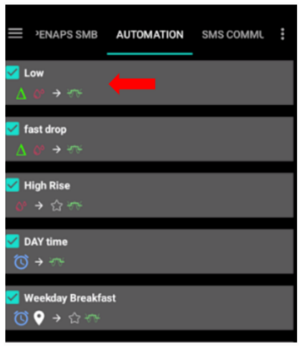
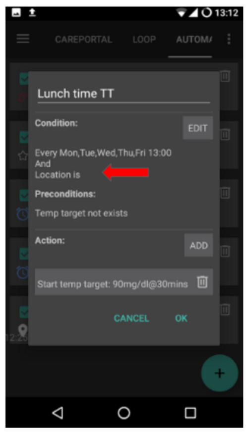

# 自动操作

## 什么是自动操作？

“**自动操作**”是**AAPS**中的一个功能，可以通过自动调整胰岛素输注来简化用户的糖尿病管理，以适应个人的生活方式需求。

一个**自动操作**指示**AAPS**在满足一个或多个条件或触发因素时“自动”执行特定操作。 这可以是针对不规律的事件，如**低血糖或高血糖**、一定量的负**活性胰岛素（IOB）**。 它也可以是针对重复发生的事件，例如每天特定时间的用餐或运动，或者当用户位于某个GPS位置或WIFI SSID区域附近时。

有多种**自动化**选项可供选择，建议用户在**AAPS**应用的**自动化**部分中详细研究这些选项。 您还可以在**Facebook**和**Discord**上的**AAPS**用户群组中搜索其他用户分享的**自动化**示例。

## 自动操作如何帮助我们

1. **减少决策疲劳**：**自动操作**的主要好处是减轻用户需要手动干预**AAPS**的负担。 研究估计，患有1型糖尿病的人平均每天需要做出额外的180个决策。 **自动化**可以减轻心理负担，让用户能够将精力投入到生活的其他方面。

1. **可能改善血糖控制**：例如，**自动操作**可以确保在需要时始终设置**临时目标**，即使在忙碌或健忘的情况下也是如此。 例如，如果一个患有糖尿病的孩子在学校每周二上午10点和周四下午2点有体育活动，并且需要在活动前30分钟设置高血糖临时目标（TT），那么可以通过自动操作来实现。

1. **使AAPS高度可定制**：根据用户的偏好，在特定情况下可以更加或不太激进。 例如，如果在半夜出现负**IOB**，表明当前**配置文件**可能过强，可以触发一段时间内的临时降低**配置文件**百分比。

下面的例子说明了如何通过**自动化**来省略某些步骤。

用户每天早上6点锻炼：他需要在锻炼前，即早上5点，手动在AAPS中设置“TT-活动”。


用户设置了一个**自动操作**，在早上5点触发“TT-活动”，以确保他们的**血糖**和**IOB**在准备6点锻炼时处于最佳状态：


## 开始使用自动操作前的关键考虑

1. 在设置**自动操作**之前，你应该使用**AAPS**合理地控制**血糖**。 **自动操作**不应用于补偿不理想的基础率、**胰岛素敏感因子（ISF）**或**碳水化合物比率（CR）**设置。 避免设置自动化**配置文件切换**来补偿由于食物等原因导致的**血糖**升高，这些情况最好通过其他策略（如SMBs等）来处理。

1. 与所有技术一样，**持续葡萄糖监测系统（CGMs）**、**胰岛素泵**和手机都有可能出现故障：技术问题或传感器错误可能会中断**自动化操作**，这时可能需要进行手动干预。

1. 随着日常活动的变化，**自动操作的需求**也可能发生变化。 在工作/学校/假期之间切换时，请在日历中设置提醒，以审查当前活跃的**自动操作**（它们很容易激活和停用）。 例如，如果你去度假，不再需要为学校体育或日常锻炼设置的自动操作，或者需要调整时间。

1. **Automations** may conflict with each other, and it is good to review any new **Automation(s)** setting carefully in a safe environment, and understand why an **Automation** may or may not have triggered in the way you expect.

1. If using Autosens, try to use **Temp Targets** instead of **Profile Switches**. **Temp Targets** do not reset Autosens back to 0. **Profile Switches** reset Autosens.

1. Most **Automations** should only be set for a **limited time duration**, after which **AAPS** can re-evaluate and repeat the **Automation**, if necessary, and if the condition is still met. For example, "start temp target of 7.0 mmol/l for 30 min" or "start **Profile** 110% for 10 min" _and_ "start temp target of 5.0 mmol/l for 10 min". Using **Automations** to create permanent changes (e.g. to stronger %profile) risks hypoglycemia.

## When can I start using Automation?

**Automations** can be started in **objective 10**.

## Where are Automations located in AAPS?

Depending on your [config builder](../SettingUpAaps/ConfigBuilder.md) settings, **Automation** is located either in the ‘hamburger’ menu or as a tab with **AAPS**.

## How can I set up an Automation?

To set up an **Automation** create a ‘rule’ with **AAPS** as follows:


* give your ‘rule’ a title;
* select at least one ‘Condition’;


* select one ‘Action’;


* check the right box to the **Automation** event is ‘ticked’ to activate the **Automation**:


To deactivate an **Automation** rule, untick the box left of the name of the **Automation**. The example below shows an **Automation** entitled ‘Low Glucose TT’ as either activated (‘ticked') or deactivated (‘unticked’).


When setting up an **Automation**, you can first test it by activating the ‘notification’ option under "Actions". This triggers **AAPS** to first display a notification rather than actually automating an action. When you are comfortable that the notification has been triggered at the correct time/conditions, the **Automation** rule can be updated to replace the ‘Notification’ with an ‘Action’.


```{admonition} Important note
:class: note

**Automations** are still active when the Loop is disabled!
```


## Safety limits

There are safety limits set for **Automations**:

* The **glucose** value has to be between 72 and 270 mg/dl (or 4 and 15 mmol/l).
* The **Profile Percentage** has to be between 70% and 130%.
* There is a 5 minute time limit between executions of  **Automation** (and first execution).

## Correct use of negative values

```{admonition} Warning
:class: warning

Please be careful when selecting a negative value in **Automation**
```

Caution must be taken when selecting a ‘negative value’ within the ‘Condition’ like "less than" in **Automations**. For example:


**Example 1:** Creating a Condition **"is lesser than"** "-0.1mmol/l" (or "-2mg/dl") will:

Trigger an **Automation** for any number which is **strictly less than** -0.1 (-2). This includes numbers like -0.2, -0.3, -0.4 (-4, -6, -8) and so on. Remember that -0.1 (-2) itself **is not** included in this condition. (The condition "is equal or lesser than -0.1mmol/l (-2 mg/dl)" _would_ include -0.1 mmol/l or -2 mg/dl).

**Example 2:** Creating a Condition "is greater than" -0.1mmol/l (-2mg/dl) will:

Trigger an **Automation** for any number which is **greater than** -0.1mmol/l (-2mg/dl). This includes numbers like 0, 0.2, 0.4mmol/l, (0, 4, 8mg/dl) and any other positive number.

It is important to carefully consider the exact intention of your **Automation** when choosing these conditions and values.

## Automation Conditions

There are various ‘Conditions’ that can be selected by the user. The list below is non-exhaustive:

**Condition:** connect conditions

**Options:**

Several conditions can be linked with
* “And”
* “Or”
* “Exclusive or” (which means that if one - and only one of the - conditions applies, the action(s) will happen)

**Condition:** time vs. recurring time

**Options:**

* time = single time event
* recurring time = something that happens regularly (i.e. once a week, every working day etc.)

**Condition:** location

**Options:**

* in the **config builder** (Automation), the user can select their required location service.

**Condition:** location service

**Options:**

* Use passive location: **AAPS** only takes locations when other apps are requesting it.
* Use network location: Location of your Wi-Fi.
* 使用GPS位置（注意！ This can cause excessive battery drain!)

## Action

**Actions:** start **Temp Target**

**Options:**

* **BG** must be between 72 mg/dl and 270 mg/dl (4 mmol/l and 15 mmol/l)
* **TT** works only if there is no previous Temp Target

**Actions:** stop **Temp Target**

**Options:**

none

**Actions:** **Profile Percentage**

**Options:**

* **Profile** must be between 70% and 130%
* works only if the previous Percentage is 100%

Once the ‘Action’ is added,  the default values must be changed to the desired number by clicking and adjusting the default values.


(Automations-the-order-of-the-automations-in-the-list-matters)=
## The order of the **Automations** in the list matters
 **AAPS** will automate the rules created in the order of preference, starting from the top of the **Automation** list. For example, if the ‘Low’  **Automation** is the most important **Automation**, above all other rules, then this  **Automation** should appear at the top of the user’s **Automation** list as demonstrated below:




To reprioritize the **Automation** rules, click and hold the four-lines-button on the right side of the screen. Reorder the  **Automations** by moving the rules up or down.


## How to delete Automation rules

To delete an **Automation** rule click on the trash icon.


## Examples of Automations

Below are examples of **Automations**. Further discussion on **Automations** and how users have individualised their  **Automation** can be found in Facebook discussions groups or on Discord. The examples below should not be replicated without the user having a good understanding of how the **Automation** will work.

### Low Glucose Temp Target

This **Automation**  triggers an automatic ‘Temp Target Hypo’ when low **BG** is at a certain threshold.


### Lunch Time Temp Target (with ‘Location’)



This **Automation** has been created for a user who eats their lunch at work around the same time every weekday but triggered only if the user is situated within a set ‘location’.  So if the user is not at work one day, this **Automation** will be activated.

This **Automation** will set a low **Temp Target** (Eating Soon) at 13:00 to drive ‘BG, to 90mg (or 5 mmol/l) in preparation for lunch.

The ‘Trigger’ location is set by inputting the latitude and longitude GPS coordinates as below:


Because of the ‘And’ connection, the **Automation** only happens during the ‘chosen time’ and if the user is at the selected location.

The **Automation** will not be triggered on any other time at this location or on this time outside of 50 meters set GPS coordinates.

### WIFI SSID Location Automation

Using WIFI SSID is a good option to trigger an **Automation** while within range of a specific wifi network (than compared with GPS), it is fairly precise, uses less battery and works in enclosed spaces where GPS and other location services might not be available.

Here is another example of setting up a **Temp Target** for work days only before breakfast(1).


The **Automation** will trigger at 05:30am only on Monday-Friday(2)  
and while being connected to a home wifi network (3).


It will then set a **Temp Target**  of 75mg/dl for 30 minutes (4). One of the advantages of including the location is that it will not trigger if the user is travelling on vacation for instance.


Here is the screenshot detailing the **Automation** triggers:

1) Under the main “AND” (both conditions need to be met to trigger) 1) Recurring time = M,T,W,T,F At 5:30am  
1) WIFI SSID = My_Home_WiFi_Name


## Automation Logs

**AAPS** has a log of the most recent **Automation** triggered at the bottom of the screen under the **Automation** tab.

In the example below the logs indicate:

(1) at 01:58 am, the “Low BG triggers temp hypo profile” is activated
* glucose value is less than 75mg/dl;
* delta is negative (ie: the BG is going down);
* time is within 01:00 am and 06:00 am.

The **Automation** will:
* set a **Temp Target** to 110mg/dl for 40 minutes;
* start a temporary **Profile** at 50% for 40 minutes.

(2) at 03:38 am,  the “High carb after low at night” is triggered
* time is between 01:05 am and 06:00 am;
* glucose value is greater than 110mg/dl.

The **Automation** will:
* change **Profile** to LocalProfile1 (ie: cancel the temporary profile if any)
* stop **Temp Target** (if any)


## Troubleshooting

* Problem: __My automations are not being triggered by AAPS?__

Check the box to the right of **Automation** event is ‘ticked’ to ensure the rule is activated.

## Troubleshooting


* Problem: __My automations are being triggered in the wrong order.__

Check your rule prioritisation order as discussed above here.

## Alternatives to Automations

For advanced users, there are other possibilities to automate tasks using IFTTT or a third party Android app called Automate. 
