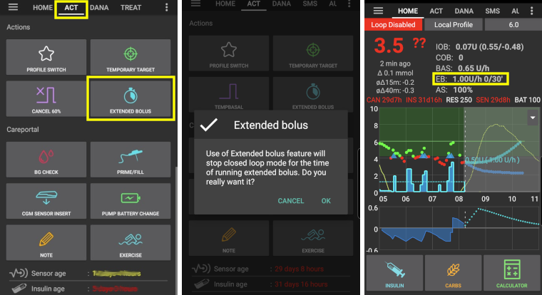

(Extended-Carbs-extended-carbs-ecarbs)=
# 扩展碳水化合物 / "eCarbs"

## 什么是eCarbs以及它们何时有用？

在常规泵治疗中，扩展大剂量是一个很好的方式来处理富含脂肪或其他缓慢吸收的餐食，这些食物会使血糖升高的时间长于胰岛素的作用时间。 然而，在闭环环境中，扩展输注并没有太多意义（并且存在技术难题），因为它们基本上是一个固定的、较高的临时基础率，这与闭环如何工作（即动态调整基础率）相悖。 详情请参阅下文关于[扩展输注](#extended-bolus-and-why-they-wont-work-in-closed-loop-environment)的部分。

尽管如此，处理这类餐食的需求仍然存在。 这就是为什么从版本2.0开始，AAPS支持所谓的扩展碳水化合物或eCarbs。

eCarbs是指分散在几个小时内的碳水化合物。 对于标准餐食，如果碳水化合物多于脂肪/蛋白质，通常只需提前输入碳水化合物（并根据需要减少初始输注量）就足以防止胰岛素过早输注。  但对于吸收较慢的餐食，如果一开始就输入全部碳水化合物会导致SMB产生过多的IOB，此时可以使用eCarbs来更准确地模拟碳水化合物（以及为其他广义上的营养素输入的任何碳水化合物等价物）的吸收过程及其对血糖的影响。 有了这些信息，闭环可以逐渐地给予SMBs来处理这些碳水化合物，这可以看作是一个动态的扩展输注（在没有SMBs的情况下也可以使用，但效果可能较差）。

**注意**：eCarbs不仅限于富含脂肪/蛋白质的餐食：它们还可以用于任何影响血糖升高的情况，例如服用皮质类固醇等其他药物。

## 使用eCarbs的机制

要输入eCarbs，请在概览标签页的*“碳水化合物”*对话框中设置持续时间、总碳水化合物量，并可选择时间偏移（*下面的数字只是示例，您需要根据自己的情况尝试不同的值，以获得满意的血糖响应*）：

概览标签页上的eCarbs，注意COB字段中的括号内碳水化合物，显示的是未来的碳水化合物：

______________________________________________________________________

这里介绍了一种使用该功能处理脂肪和蛋白质的方法：[https://adriansloop.blogspot.com/2018/04/page-margin-0.html](https://adriansloop.blogspot.com/2018/04/page-margin-0.html)

______________________________________________________________________

## 推荐设置、示例场景和重要注意事项

推荐设置是使用OpenAPS SMB APS插件，启用SMBs以及*启用带有COB的SMB*偏好设置。

一个示例场景，比如吃披萨，可能是先通过*“计算器”*给予（部分）输注，然后使用*“碳水化合物”*按钮为接下来的4-6小时输入剩余的碳水化合物，从1或2小时后开始。

**重要注意事项**：当然，您需要尝试并确定哪些具体值对您有效。 您可能还需要仔细调整*“限制SMB的基础分钟数”*设置，以使算法更激进或更保守。 对于低碳水化合物、高脂肪/蛋白质的餐食，可能只使用eCarbs而无需手动输注就足够了（请参阅上面的博客文章）。 当生成eCarbs时，还会创建一个Careportal备注来记录所有输入，以便更容易地迭代和改进输入。

(extended-bolus-and-why-they-wont-work-in-closed-loop-environment)=
## 扩展大剂量及其在闭环环境中为何不起作用？

如上所述，扩展大剂量或多波大剂量在闭环环境中实际上并不起作用。 详见[下文](#why-extended-boluses-wont-work-in-a-closed-loop-environment)。

(Extended-Carbs-extended-bolus-and-switch-to-open-loop-dana-and-insight-pump-only)=
### 扩展大剂量并切换到开环——仅限Dana和Insight泵

有些人仍然希望在AAPS中使用扩展大剂量选项，以便按照他们习惯的方式处理特殊食物。

因此，从2.6版本开始，为Dana和Insight泵的用户提供了扩展大剂量的选项。

- 闭环将自动停止并切换到开环模式，以运行扩展大剂量。
- 注射单位、剩余量和总时间将在主屏幕上显示。
- 如果使用[TBR模拟](#Accu-Chek-Insight-Pump-settings-in-aaps)，Insight泵上则*无法使用*扩展大剂量。

(why-extended-boluses-won-t-work-in-a-closed-loop-environment)=
### 扩展大剂量在闭环环境中不起作用的原因

1. 闭环系统确定现在需要输注1.55U/h。 无论这是以扩展大剂量还是TBR（临时基础率）的形式输注，对算法来说都没有区别。 事实上，一些泵使用的是扩展大剂量。 那么接下来应该发生什么？ 大多数泵驱动程序会停止扩展大剂量—>你甚至都不需要开始它。

2. 如果你将扩展大剂量作为输入，模型中应该发生什么？

   1. 它应该与基础率（BR）一起被视为中性并纳入循环中吗？ 那么，如果例如你的血糖降得太低，所有的“中性”胰岛素都被停止，闭环也应该能够减少注射量吗？
   2. 扩展大剂量应该简单地被加入吗？ 那么闭环就应该被允许继续吗？ 即使在最严重的低血糖情况下也是如此吗？ 我认为这不太好：预见到低血糖但却不能预防？

3. 扩展大剂量产生的活性胰岛素（IOB）在下次运行时会在5分钟后显现。 因此，闭环会减少基础胰岛素的输注。 所以变化不大……只是失去了避免低血糖的可能性。
