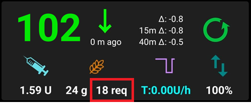

# AAPS核心功能

(Open-APS-features-autosens)=

## Autosens

- Autosens是一种算法，它观察血糖偏差（正/负/中性）。
- 它将尝试根据这些偏差来确定你对胰岛素的敏感或抵抗程度。
- **OpenAPS**中的oref实现基于24小时和8小时的数据组合。 它使用其中更敏感的一个。
- 在AAPS 2.7之前的版本中，用户需要手动选择8小时或24小时。
- 从**AAPS 2.7**开始，Autosens将在**AAPS**中在24小时和8小时窗口之间切换以计算敏感性。 它将选择更敏感的那个。 
- 如果用户来自oref1，他们可能会注意到系统可能对变化不太敏感，因为敏感性可能在24小时或8小时之间变化。
- 更换管路或更改配置文件会将Autosens比率重置为100%（具有持续时间的百分比配置文件切换不会重置autosens）。
- Autosens会调整你的基础率和ISF（即：模拟配置文件切换的作用）。
- 如果在长时间内持续摄入碳水化合物，Autosens在这段时间内将不太有效，因为碳水化合物被排除在BG增量计算之外。

(Open-APS-features-super-micro-bolus-smb)=

## 超级微型大剂量（SMB）

**SMB**是**Super Micro Bolus（超级微型大剂量）**的简称，是自2018年起在Oref1算法中引入的OpenAPS功能。 与**AMA**相比，**SMB**不使用临时基础率来控制血糖水平，而主要使用**微小剂量输注**。 在**AMA**会使用临时基础率增加1.0 IU胰岛素的情况下，**SMB**则以小步骤在**5分钟间隔**内分几次进行超微量输注，例如0.4 IU、0.3 IU、0.2 IU和0.1 IU。 同时（出于安全原因），实际基础率会在一定时间内被设置为0 IU/h，以防止过量注射（**“零临时基础率”**）。 This allows the system to adjust the blood glucose faster than with the temporary basal rate increase in **AMA**.

得益于SMB，对于仅含有“慢速”碳水化合物的餐食，可能只需告知系统计划摄入的碳水化合物量，其余部分交给**AAPS**处理即可。 然而，这可能会导致餐后（用餐后）血糖峰值更高，因为无法进行餐前输注。 或者，如果必要的话，你可以进行餐前输注，给予一个**起始输注量**，这个输注量**仅部分**覆盖碳水化合物（例如，估计量的2/3），并让**SMB**输注剩余的胰岛素。

SMB在主图表上以蓝色三角形显示。 点击三角形可以查看输注了多少胰岛素，或者使用[治疗选项卡](#aaps-screens-treatments)。

**SMB**的功能包含一些安全机制：

1. **最大单次SMB剂量**  
    最大的单次SMB剂量只能是以下值中的最小值：
    
    - 根据“限制SMB的最大基础分钟数”设置中设置的时间（例如，接下来30分钟的基础量），对应于当前基础率（由autosens调整）的值，或
    - 当前所需胰岛素量的一半，或
    - 设置中你的maxIOB值的剩余部分。

2. **低临时基础率**  
    在**SMB**中，低临时基础率（称为“低临时”）或0 U/h的临时基础率（称为“零临时”）被更频繁地激活。 这是出于安全考虑的设计，如果**配置文件**设置正确，则不会产生负面影响。 在主图表上，IOB曲线（黄色细线）比临时基础率的变化更有意义。

3. **未宣布的餐食**  
    通过额外的计算来预测血糖的变化趋势，例如使用**UAM**（未宣布的餐食）功能。 即使用户没有手动输入碳水化合物量，**UAM**也能自动检测到由于进餐、肾上腺素或其他因素导致的血糖显著升高，并尝试通过**SMB**进行调整。 为了安全起见，这也同样适用，如果血糖出现意外快速下降，它可以更早地停止SMB。 因此，在使用SMB时，UAM应该始终保持激活状态。

**您必须已经启动了[目标9](#objectives-objective9)才能使用SMB。**

另请参阅：

- [OpenAPS SMB文档](https://openaps.readthedocs.io/en/latest/docs/Customize-Iterate/oref1.html#understanding-super-micro-bolus-smb)。
- [OpenAPS的oref1 SMB文档](https://openaps.readthedocs.io/en/latest/docs/Customize-Iterate/oref1.html)
- [Tim关于SMB的信息](https://www.diabettech.com/artificial-pancreas/understanding-smb-and-oref1/)

OpenAPS SMB的设置如下所述。

(Open-APS-features-max-u-h-a-temp-basal-can-be-set-to)=

### 临时基础率可以设置的最大U/h

此安全设置确定胰岛素泵可以提供的最大临时基础率。 它也被称为**max-basal**。

该值以单位/小时（U/h）为单位。 建议将其设置为合理的值。 设置此参数的一个好建议是：

    max-basal = 最高基础率 x 4
    

例如，如果你的配置文件中的最高基础率是0.5 U/h，你可以将其乘以4得到2 U/h的值。

**AAPS**根据[首选项 > 治疗安全 > 患者类型](#preferences-patient-type)将此值限制为“硬限制”。 硬限制如下：

- 儿童：2
- 青少年：5
- 成人：10
- 胰岛素抵抗成人：12
- 孕妇：25

*See also [overview of hard-coded limits](#Open-APS-features-overview-of-hard-coded-limits).*

(Open-APS-features-maximum-total-iob-openaps-cant-go-over)=

### OpenAPS不能超过的最大总IOB

这个值决定了在闭环模式下运行时，**AAPS**将保持在其之下的最大**IOB**（包括基础胰岛素和餐时胰岛素IOB）的量。 它也被称为**最大IOB**。

如果当前的IOB（例如，餐后给予餐时胰岛素后的IOB）超过了设定的值，那么闭环系统将停止给予胰岛素，直到IOB的值降低到设定的阈值以下。

设置这个参数的一个良好开端是：

    maxIOB = 平均餐时大剂量 + 日最大基础率*3
    

在调整您的**最大IOB**时，请保持小心和耐心。 它对于每个人来说都是不同的，并且还可能取决于平均每日总剂量（TDD）。

**AAPS**根据[首选项 > 治疗安全 > 患者类型](#preferences-patient-type)将此值限制为“硬限制”。 硬限制如下：

- 儿童：3
- 青少年：7
- 成人：12
- 胰岛素抵抗成人：25
- 孕妇：40

*See also [overview of hard-coded limits](#Open-APS-features-overview-of-hard-coded-limits).*

注意：在使用**SMB**时，**max-IOB**的计算方式与AMA不同。 在**AMA**中，maxIOB是基础**IOB**的安全参数，而在SMB模式下，它还包括大剂量IOB。

另请参见[OpenAPS的SMB文档](https://openaps.readthedocs.io/en/latest/docs/Customize-Iterate/oref1.html#understanding-super-micro-bolus-smb)。

### 启用动态敏感度调整

此为[DynamicISF](../DailyLifeWithAaps/DynamicISF.md)功能。 启用后将激活新配置选项， 具体参数说明请查阅[DynamicISF](#dyn-isf-preferences)功能专页。

#### 高临时目标提高敏感性

如果您启用了此选项，那么在设置临时目标高于100 mg/dl（或5.6 mmol/l）时，胰岛素敏感性将会增加。 这意味着，ISF将会上升，而IC和基础率将会减少。 这将有效地使**AAPS**在您设置高临时目标时变得不那么激进。

#### 低临时目标降低敏感性

如果您启用了此选项，那么在设置临时目标低于100 mg/dl（或5.6 mmol/l）时，胰岛素敏感性将会降低。 这意味着，ISF将会下降，而IC和基础率将会增加。 这将有效地使**AAPS**在您设置低临时目标时变得更加积极。

### 启用Autosens功能

This is the [Autosens](#Open-APS-features-autosens) feature. 启用DynamicISF时无法同时启用，因二者为修改同一参数（胰岛素敏感系数）的不同算法。

Autosens观察血糖偏差（正/负/中性）。 它将尝试根据这些偏差来确定你对胰岛素的敏感或抵抗程度，并根据这些偏差调整基础率和ISF。

启用后将激活新配置选项，

### 敏感时提高目标

如果启用了此选项，当检测到敏感性（低于100%）时，灵敏度检测（autosens）可以提高目标。 在这种情况下，你的目标将根据检测到的敏感性的百分比提高。

如果由于灵敏度检测而修改了目标，它将在你的主屏幕上以绿色背景显示。

该设置需满足以下条件​：当"启用动态敏感度调整"或"启用Autosens功能"其中一项处于激活状态时可见。

### 抗药时降低目标

如果启用了此选项，当检测到抗药性（高于100%）时，灵敏度检测（autosens）可以降低目标。 在这种情况下，你的目标将根据检测到的抗药性的百分比降低。

该设置需满足以下条件​：当"启用动态敏感度调整"或"启用Autosens功能"其中一项处于激活状态时可见。

### 启用超微大剂量（SMB）

启用此功能以使用SMB功能。 如果禁用此功能，将不会给予任何**SMB**。

启用后将激活新配置选项，

(Open-APS-features-enable-smb-with-high-temp-targets)=

#### 启用具有高临时目标的 SMB

如果启用了此设置，即使用户选择了高**临时目标**（定义为高于100mg/dL或5.6mmol/l，无论**配置文件**目标如何），也会给予**SMB**。 此选项旨在通过禁用设置来禁用SMB。 例如，如果禁用了此选项，则通过将**临时目标**设置为高于100mg/dL或5.6mmol/l可以禁用**SMB**。 无论其他什么条件试图启用SMB，此选项都将禁用**SMB**。

如果启用了此设置，则仅当也启用了**启用带有临时目标的SMB**时，SMB才会在高临时目标下启用。

(Open-APS-features-enable-smb-always)=

#### 始终启用 SMB

如果启用了此设置，那么SMB将始终启用（与COB、临时目标或餐时胰岛素无关）。 如果启用了此设置，那么下面其他的启用设置将无效。 然而，如果禁用了**启用高临时目标的SMB**，并且设置了一个高临时目标，那么SMB将被禁用。

本设置仅在**AAPS**检测到使用[可靠血糖数据源](#GettingStarted-TrustedBGSource)（需具备高级数据滤波功能）时激活。 FreeStyle Libre 1因传感器故障时可能无限循环旧血糖数据，不被视为可靠数据源。

噪声数据可能导致**AAPS**误判血糖急剧上升，进而触发不必要的超微大剂量（SMB）。 关于数据噪声与平滑处理的详细机制，参见[这里](../CompatibleCgms/SmoothingBloodGlucoseData.md)。

#### 启用带活性碳水化合物(COB)的SMB

如果启用了此设置，当COB大于0时，SMB将被启用。

当"启用SMB始终模式"处于开启状态时，该设置将隐藏。

#### 启用带有临时目标的SMB

如果启用了此设置，那么当设置了任何临时目标（如即将进食、活动、低血糖、自定义）时，SMB将被启用。 如果启用了此设置但禁用了**启用具有高临时目标的SMB**，则在设置低临时目标（低于100mg/dL或5.6mmol/l）时SMB将启用，但在设置高临时目标时将禁用。

当"启用SMB始终模式"处于开启状态时，该设置将隐藏。

#### 在输入碳水化合物后启用SMB

如果启用了此设置，则在宣布碳水化合物后的6小时内，SMB将启用，即使COB已达到0。

出于安全考虑，本设置仅在**AAPS**检测到使用可靠血糖数据源时激活。 当"启用SMB始终模式"处于开启状态时，此设置将隐藏不可见。

本设置仅在**AAPS**检测到使用[可靠血糖数据源](#GettingStarted-TrustedBGSource)时激活（需具备高级数据滤波功能）。 FreeStyle Libre 1因传感器故障时可能无限循环旧血糖数据，不被视为可靠数据源。

噪声数据可能导致**AAPS**误判血糖急剧上升，进而触发不必要的超微大剂量（SMB）。 关于数据噪声与平滑处理的详细机制，参见[这里](../CompatibleCgms/SmoothingBloodGlucoseData.md)  
。 当"启用SMB始终模式"处于开启状态时，该设置将隐藏。

#### 以分钟为单位设置SMB的频率是多少

此功能限制了SMB的频率。 这个值决定了SMB之间的最小时间间隔。 请注意，每当收到血糖值时（通常为每5分钟一次），闭环系统就会运行一次。 减去2分钟，以便为闭环系统完成操作提供额外时间。 例如，如果您希望每次闭环运行时都发送SMB，请将此设置为3分钟。

默认值：3分钟。

(Open-APS-features-max-minutes-of-basal-to-limit-smb-to)=

#### 限制SMB可调整的最大基础率分钟数

这是一个重要的安全设置。 此值决定了在给定时间内，当被COB覆盖时，基于基础胰岛素的量，可以给予多少SMB。

将此值设置得更大可以使SMB更加激进。 您应该从默认值30分钟开始。 在积累了一些经验后，以15分钟为增量增加该值，并观察多餐后的效果。

建议不要将此值设置为高于90分钟，因为这可能导致算法无法在基础胰岛素为0U/h（'零临时'）的情况下适应血糖下降。 您还应该设置警报，尤其是在您仍在测试新设置时，这将能在低血糖发生前很久就提醒您。

默认值：30分钟。

#### 监测到UAM(未通知膳食) 后启用SMB替代基础率的最大分钟数

本设置用于在UAM期间且无剩余碳水化合物时，调节超微大剂量（SMB）的作用强度。

默认值​：与<1>限制SMB可调整的最大基础率分钟数</1>参数值相同。

仅当“启用SMB”与“启用UAM”功能均处于开启状态时，本设置可见。

### 启用 UAM

启用此选项后，SMB算法可以识别未提前通知的进餐。 如果您忘记告诉**AAPS**您的碳水化合物摄入量，或者错误地估计了碳水化合物摄入量，导致输入的碳水化合物量不准确，或者如果一顿含有大量脂肪和蛋白质的餐食持续时间比预期更长，那么此功能将非常有用。 在没有任何碳水化合物输入的情况下，UAM可以识别由碳水化合物、肾上腺素等引起的血糖快速升高，并尝试通过SMBs进行调整。 这同样适用于相反的情况：如果血糖快速下降，它可以更早地停止SMBs。

**因此，在使用SMB时应当始终激活UAM。**

(key-aaps-features-minimal-carbs-required-for-suggestion)=

### 建议所需的最小碳水化合物量

这是显示碳水化合物建议警报所需的最小碳水化合物克数。 当检测到需要额外摄入碳水化合物时，会建议您进食。 在这种情况下，您将收到一个通知，该通知可以被设置为5、15或30分钟后再次提醒。

如果需要，可以将碳水通知推送到Nightscout，在这种情况下，将显示并广播公告。

无论如何，所需的碳水化合物量都将在您主屏幕的COB部分中显示。

### 高级设置

您可以在此处阅读更多内容：[OpenAPS文档](https://openaps.readthedocs.io/en/latest/docs/While%20You%20Wait%20For%20Gear/preferences-and-safety-settings.html)。

**始终使用短期平均变化量而非简单数据**：如果您启用此功能，**AAPS**将使用过去15分钟内的短期平均血糖变化量/血糖值，这通常是最后三个值的平均值。 这有助于**AAPS**在处理如xDrip+和Libre等可能产生噪声的数据源时更加稳定。

**每日最大安全乘数**：这是一个重要的安全限制。 默认设置（通常不需要调整）是3。 此设置意味着**AAPS**将被严格禁止设定超过用户胰岛素泵或配置文件中设定的最高每小时基础率3倍的临时基础率。 例如：如果您的最高基础率是1.0 U/h，且每日最大安全乘数是3，那么**AAPS**可以设置的最高临时基础率就是3.0 U/h（= 3 x 1.0 U/h）。

默认值：3（除非您确实需要并且知道自己在做什么，否则不应更改）

**当前基础率安全乘数**：这是另一个重要的安全限制。 默认设置（同样通常不需要调整）是4。 此设置意味着**AAPS**将被绝对禁止设定超过用户胰岛素泵或配置文件中设定的当前每小时基础率4倍的临时基础率。

默认值：4（除非您确实需要并且知道自己在做什么，否则不应更改）

* * *

(Open-APS-features-advanced-meal-assist-ama)=

## 高级进餐助手（AMA）

AMA，即“advanced meal assist”的缩写，是OpenAPS从2017年（oref0）开始的一项功能。 OpenAPS高级进餐助手（AMA）允许系统在你可靠地输入碳水化合物后更快地增加高临时基础率。

你可以在[OpenAPS文档](https://newer-docs.readthedocs.io/en/latest/docs/walkthrough/phase-4/advanced-features.html#advanced-meal-assist-or-ama)中找到更多信息。

### 临时基础率可以设置的最大U/hr（OpenAPS 最大基础率）

这项安全设置有助于防止**AAPS**给出危险的高基础率，并将临时基础率限制在每小时x单位。 建议将其设置为合理的值。 一个好的建议是将您配置中的最高基础率乘以4，并且至少乘以3。 例如，如果您配置中的最高基础率是1.0 U/h，您可以将其乘以4得到4 U/h，并将4设置为您的安全参数。

您不能随意选择任何值：出于安全考虑，存在一个“硬限制”，它取决于患者的年龄。 在AMA模式中，maxIOB的“硬限制”低于SMB。 对于儿童，这个值是最低的，而对于胰岛素抵抗的成年人，这个值则是最大的。

**AAPS**中通过代码限死的参数包括：

- 儿童：2
- 青少年：5
- 成人：10
- 胰岛素抵抗成人：12
- 孕妇：25

*See also [overview of hard-coded limits](#Open-APS-features-overview-of-hard-coded-limits).*

### OpenAPS可以提供的最大基础IOB [U]（OpenAPS“max-iob”）

这个参数限制了AAPS仍能正常工作的最大活性胰岛素量（IOB）。 如果IOB超过这个值，AAPS将停止给予额外的基础胰岛素，直到基础IOB降到限制值以下。

默认值设置为2，但您应该缓慢增加这个参数，以观察它对您的影响以及哪个值最适合您。 这个值对每个人来说都是不同的，并且还取决于平均每日总剂量（TDD）。 出于安全考虑，存在一个限制，这个限制取决于患者的年龄。 在AMA模式中，maxIOB的“硬限制”低于SMB。

- 儿童：3
- 青少年：5
- 成人：7
- 胰岛素抵抗成人：12
- 孕妇：25

*See also [overview of hard-coded limits](#Open-APS-features-overview-of-hard-coded-limits).*

### 启用AMA Autosens

在这里，你可以选择是否要使用[灵敏度检测](../DailyLifeWithAaps/SensitivityDetectionAndCob.md)autosens。

### Autosens也调整临时目标

如果启用了此选项，autosens也可以调整目标（除了基础和ISF之外）。 这可以使**AAPS**工作得更“激进”或更不那么“激进”。 这样可能更快地达到实际目标。

### 高级设置

- 通常你不需要更改此对话框中的设置！
- 如果你无论如何都要更改它们，请确保阅读[OpenAPS文档](https://openaps.readthedocs.io/en/latest/docs/While%20You%20Wait%20For%20Gear/preferences-and-safety-settings.html#)中的详细信息，并了解你在做什么。

**始终使用短期平均变化量而非简单数据**：如果您启用此功能，**AAPS**将使用过去15分钟内的短期平均血糖变化量/血糖值，这通常是最后三个值的平均值。 这有助于**AAPS**在处理xDrip+和Libre等嘈杂数据源时更稳定。

**每日最大安全乘数**：这是一个重要的安全限制。 默认设置（通常不需要调整）是3。 此设置意味着**AAPS**将被严格禁止设定超过用户胰岛素泵设定的最高每小时基础率3倍的临时基础率。 例如：如果您的最高基础率是1.0 U/h，且每日最大安全乘数是3，那么**AAPS**可以设置的最高临时基础率就是3.0 U/h（= 3 x 1.0 U/h）。

默认值：3（除非您确实需要并且知道自己在做什么，否则不应更改）

**当前基础率安全乘数**：这是另一个重要的安全限制。 默认设置（同样通常不需要调整）是4。 此设置意味着**AAPS**将被绝对禁止设定超过用户胰岛素泵中设定的当前每小时基础率4倍的临时基础率。

默认值：4（除非您确实需要并且知道自己在做什么，否则不应更改）

​​**推注延迟间隔系数（Bolus snooze dia divisor）**​​ "bolus snooze"（推注延迟）功能将在餐后大剂量执行后激活。 **AAPS**在餐后的一段时间内，即“DIA（作用时间）”除以“bolus snooze”参数所得的时间段内，不会设置较低的临时基础率。 默认值为2。 这意味着，如果DIA为5小时，那么“bolus snooze”的持续时间将是5小时除以2，即2.5小时。

默认值：2

* * *

(Open-APS-features-overview-of-hard-coded-limits)=

## 硬编码限制概述

|            | 儿童  | 青少年 | 成人  | 胰岛素抵抗的成人 | 孕妇  |
| ---------- | --- | --- | --- | -------- | --- |
| MAXBOLUS   | 5   | 10  | 17  | 25       | 60  |
| MINDIA     | 5   | 5   | 5   | 5        | 5   |
| MAXDIA     | 9   | 9   | 9   | 9        | 10  |
| MINIC      | 2   | 2   | 2   | 2        | 0.3 |
| MAXIC      | 100 | 100 | 100 | 100      | 100 |
| MAXIOB_AMA | 3   | 5   | 7   | 12       | 25  |
| MAXIOB_SMB | 7   | 13  | 22  | 30       | 70  |
| MAXBASAL   | 2   | 5   | 10  | 12       | 25  |