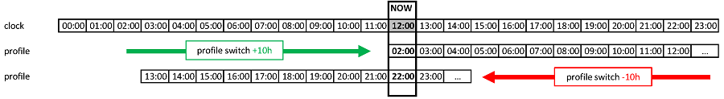

# 配置文件切换与配置文件百分比

本节将解释什么是**配置文件切换（Profile Switch）**和**配置文件百分比（Profile Percentage）**。 您可通过[配置编辑器 > 配置文件](#setup-wizard-profile)路径查阅**配置文件（Profile）**创建指南。

当您初次开始使用**AAPS**时，您需要创建一个**配置文件**，了解如何进行**配置文件切换**，并学习配置文件百分比在AAPS中的影响。 **配置文件切换**或**配置文件百分比**的功能可以带来以下特别好处：

- **月经周期**：可以在**自动化（Automations）**中设置**配置文件**内的百分比调整，以便<0>AAPS</0>能够适应激素周期的不同阶段和预测的胰岛素抵抗。

- **锻炼**：可以在**自动化**中为运动设置<0>配置文件</0>内的百分比调整，以减少基础量摄入。

- 夜班或轮班工作者：通过更改**配置文件**中的小时数，为轮班工作者设置时间偏移，以反映他们睡觉或起床时间的早晚变化。

为什么使用**配置文件百分比**而不是临时基础量调整？ 为了更有效地应用，**配置文件百分比**会在基础量、ISF（胰岛素敏感因子）和I:C（碳水化合物比例）上按比例减少或增加。 这确保了**AAPS**在计算用户的胰岛素摄入量时采用平衡的方法。 如果算法继续为ISF和I:C提供相同的比例，仅通过基础量减少在用户的**AAPS****配置文件**中获益甚微。

## 如何激活配置文件切换？

用户每次选**择配置文件**后，都需要进行“配置文件切换”。 为此，用户应在“Local Profile（本地配置文件）”选项卡中编辑其**配置文件**或设置新的**配置文件**。 应用所需设置后，用户应保存更改并通过选择“Activate Profile（激活配置文件）”来激活**配置文件**，如下所示：

创建并保存新的**配置文件**后，**AAPS**将保存用户生成的**配置文件**库。

## 如何激活配置文件切换？

A. 要使用此功能，用户必须在**AAPS**中保存多于一个**配置文件**。 要激活**配置文件切换**：

- **long-press** on the name of the **Profile** (the example below adopts a ‘Profile’ saved as: “School” on **AAPS’** homescreen and selects the desired **Profile** from the drop down tab:

1. 长按**配置文件**；
2. 选择所需的**配置文件**；
3. 然后按“确定”。

## 如何执行配置文件“百分比”操作：

B. 要激活**配置文件百分比**：

- 按照上述A步骤操作。
- 根据需要调整“持续时间”和“百分比”字段，但请注意以下几点。 如果“持续时间”字段（如下图所示中的图标2）为： 
    - 保留为“零”，则该**配置文件**将无限期地保持活动状态。 直到用户选择并切换到新的“配置文件切换”为止，**配置文件**将保持活动状态。
    - 输入[x]分钟，这将是**配置文件**的所需时间段。 在选定时间段到期后，标准**配置文件**将恢复为**AAPS**中的设置。

**在配置文件切换中激活配置文件百分比**：

2. 输入“持续时间”字段。

3. 输入“百分比”字段。

4. 输入“时间偏移”。

## 如何执行配置文件“百分比”操作：

用户了解**配置文件百分比**的基本功能至关重要。 通过对**配置文件切换**应用百分比增加或减少，这将以相同的百分比提高或降低用户在**配置文件**中设置的参数。

例如：**配置文件切换**至130%（意味着用户胰岛素抵抗增加30%）将指示**AAPS**：

- **增加**基础率30%； 
- **降低****ISF**：通过除以1.3；
- **降低****I:C**：通过除以1.3。

请注意，降低**ISF**或**I:C**意味着比例增强，从而施用更多胰岛素。 这一事实很容易被**AAPS**的新用户忽视。

选择后，**AAPS**会重新调整默认基础率，并且**AAPS**（无论开启还是关闭）将继续在所选百分比**配置文件**的基础上运行。

**配置文件百分比**的影响总结如下表：

| 配置文件切换  
百分比 |   影响   |     I:C（g/UI）      | 示例  
（15g） |        ISF  
mmol/l/UI   
mg/dl/UI         | 降低UI至  
2mmol/l  
40mg/dl |
|:------------:|:------:|:------------------:|:----------:|:------------------------------------------:|:-------------------------:|
|     90%      |   较弱   | 5/0.9  
= **5.55** |   2.7 UI   | 2.2/0.9  
=**2.4**  
  
40/0.9  
=**44.4** |          0.8 UI           |
|   **100%**   | **标准** |       **5**        |  **3 UI**  |                **2.2  
40**                |        **0.9** UI         |
|     130%     |   较强   | 5/1.3  
=**3.85**  |   3.9 UI   | 2.2/1.3  
=**1.7**  
  
40/1.3  
=**30.8** |          1.2 UI           |

(ProfileSwitch-ProfilePercentage-time-shift-of-the-circadian-percentage-profile)=

## 昼夜节律百分比曲线的时间偏移

用户**配置文件**功能中的“时间偏移”可以将用户的**配置文件**设置围绕日常时钟（“昼夜节律”）移动到所需的小时数。 这可以有助于以下情况：

- **夜班或轮班工作者**：通过调整工作小时数来改变用户在**个人设置**中的上床睡觉或起床时间，使其延后或提前多少小时上夜班。 
- **旅行中更改时区的用户**；或
- **1型糖宝**：在其**配置文件**中考虑到其固定的睡觉时间和胰岛素抵抗。 如果出于某种原因，孩子预计睡觉时间较晚，看护者可以对孩子的**配置文件**应用“时间偏移”，以便**AAPS**在用户设定的时间段内对胰岛素抵抗做出反应。

这总是关于哪个小时的**配置文件**设置应替换当前时间的设置。 这个时间必须偏移x小时。 因此，请注意以下示例中描述的方向：

- 当前时间：12:00
- **正数** 时间偏移 
    - 2:00 **+10 h** -> 12:00
    - 由于正时间偏移，将使用2:00的设置，而不是通常用于12:00的设置。
- **负数** 时间偏移 
    - 22:00 **-10 h** -> 12:00
    - 由于负时间偏移，将使用22:00（晚上10点）的设置，而不是通常用于12:00的设置。

此**配置文件**快照机制允许对过去进行更精确的计算，并有可能跟踪**配置文件**的变化。

## 保存配置文件切换以供后续使用

执行带有百分比和/或时间偏移的配置文件切换后，您可以将此临时配置文件复制到一个新配置文件中。

为此，请转到[Treatments > Profile Switch](#your-aaps-profile-clone-profile-switch)选项卡。