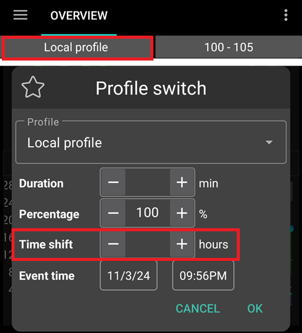

# Timezone Change and Daylight Saving

## 带泵进行跨时区旅行

## Timezone change for Omnipod Dash

* Refresh the Dash tab
* Temporarily select a different **Profile** and then switch back to your original or desired **Profile**

## Timezone change for DanaR, Korean DanaR

手机更改时区没有问题，因为泵不使用历史记录。

## Timezone change for DanaRv2, DanaRS

These pumps require special care because **AAPS** uses history from the pump but the records in pump do not have timezone stamp. **This means that if you change time zone in your phone, records will be read with different time zone and will be doubled.**

为避免这种情况，有两种可能的方法：

### 选项1：保持家乡时间并使用时间偏移配置文件

* Turn off 'Automatic date and time' in your phone's settings (manual time zone change).

* Your phone must keep your standard time as at home for the whole travel period.

* Time-shift your **Profile** according to time difference between home time and destination time.
   
   * Long-press **Profile** name (middle of top section on homescreen)
   * Select '**Profile Switch**'
   * 根据目的地设置“时间偏移”。
   
   
   
   * i.e. Vienna -> New York: **Profile Switch** +6 hours
   * i.e. Vienna -> Sydney: **Profile Switch** -8 hours

### 选项2：删除泵的历史记录

* 在手机设置中关闭“自动日期和时间”（手动更改时区）。

下飞机后：

* 关闭泵。
* 更改手机时区。
* 关闭手机，打开泵。
* 清除泵中的历史记录。
* 更改泵的时间。
* 打开手机。
* 让手机连接到泵并微调时间。

## Timezone Change for Insight

驱动程序会自动将泵的时间调整为手机的时间。

Insight还会记录历史条目，记录时间更改的时刻以及从（旧）时间到（新）时间的更改。 So the correct time can be determined in **AAPS** despite the time change.

It may cause inaccuracies in the **TDDs**. 但这应该不成问题。 

因此，Insight用户无需担心时区变化和时间变化。 但这一规则有一个例外：Insight泵配有一个小型的内部电池， 用于在更换“真实”电池时供电以保持时间等设置。 如果更换电池的时间过长，这个内部电池就会耗尽能量，时钟会重置，并且在插入新电池后会要求您输入时间和日期。 在这种情况下，由于无法正确识别正确的时间，AAPS（先进自动泵送系统）在计算时会跳过电池更换之前的所有记录。

## Timezone Change for Accu-Chek Combo

[新的Combo驱动程序](../CompatiblePumps/Accu-Chek-Combo-Pump-v2.md)会自动将泵的时间调整为手机的时间。 Combo只能存储本地时间，不能存储时区，而这正是新驱动程序精确编程到泵中的内容。 此外，它还在AAPS的本地偏好设置中存储时区，以便能够将泵的本地时间转换为具有时区偏移的完整时间戳。 用户无需执行任何操作；如果Combo的时间与手机的当前时间相差太大，泵的时间会自动调整。

请注意，这需要一些时间，因为它只能在远程终端模式下进行，而该模式通常较慢。 这是Combo（组合设备）的一个限制，无法克服。

旧的基于Ruffy的驱动程序不会自动调整时间。 用户必须手动执行此操作。 如果更改时区/夏令时是更改时间的原因，请按照以下步骤安全地执行此操作。

## Timezone Change for Medtrum

驱动程序会自动将泵的时间调整为手机的时间。

Time zone changes keep the history intact, only TDD may be affected. Manually changing the time on the phone can cause problems with the history and **IOB**. If you change time manually double check the **IOB**.

When the time zone or time changes running **TBR's** are stopped.

## DAYLIGHT SAVING (DST)

Time adjustment daylight savings time

Depending on your pump and CGM setup, jumps in time can lead to problems with **AAPS** to function correctlyy. For instance with the Combo pump, the pump history is read twice leading to duplicate entries. For some pumps it is better to make time zone adjustments while awake and not during the night.

### DST automatic adjustment for most pumps

* This adjustment feature is available for **AAPS** version 2.2 onwards.
* Howeever, the fully closed Loop will be deactivated for 3 hours AFTER the DST switch (usually 1am onwards) has taken place and **AAPS** will default to background basal as selected in your **Profile**. This is done for safety reasons - **IOB** may be too high due to duplicated bolus prior to DST change.
* After DST has taken place, select **Profile Switch** to user's desired **Profile** to enable fully closed Loop.
* You will also receive a notification on **AAPS** main screen prior to DST change that the Fully Closed Loop has been disabled temporarily. This message will appear without beep, vibration or anything.**

If you bolus with **AAPS'** calculator please do not use **COB** and **IOB** data unless you are sure this data is absolutely correct. Take caution and do not use this feature for a couple of hours after DST switch has taken place.

### DST for Accu-Chek Insight

* 夏令时的更改会自动进行。 无需任何操作。

### DST for Medtrum

* 夏令时的更改会自动进行。 无需任何操作。

### DST for Omnipod Dash

* Either allow **AAPS** to temporarily default background basal after DST has taken place as explained above.
* Otherwise, if you do not want **AAPS** to temporarily default to background basal overnight, you can change the time zone the day prior DST is due to take place to avoid overnight disruption. NOTE THIS OPTION MAY CAUSE YOUR POD TO PREMATURELY EXPIRE. PLEASE HAVE SUPPLIES WITH YOU IF OPTING FOR THE FEATURE BELOW.

#### 夏令时更改前的操作

1. Switch OFF any Phone's settings that automatically sets the Phone's time zone, so the user can change to a time zone that does not use DST. How to enable this will depend on your smartphone and Android version.
   
   * Some phones have two settings, one for automatic setting of the time (which ideally should remain on) and one for automatic setting of the time zone (which you must turn OFF).
   * Unfortunately, some Android versions have a single switch to enable automatic setting of both the time and the timezone. 现在你必须将其关闭。

2. Find a timezone that has the same time as your current location but doesn't use DST.
   
   * 可以在[https://greenwichmeantime.com/countries](https://greenwichmeantime.com/countries/)找到这些国家的列表。
   * 对于中欧时间（CET），可以是“布拉柴维尔”（刚果）。 将手机的时区更改为刚果。

3. **AAPS** refresh your pump and switch to your desired **Profile**.

4. Check **AAPS's** **IOB** and **COB** and if this is inaccurate disable the Fully Closed Loop for at least one DIA and Max-Carb-Time - whatever is bigger.

5. Actions to take after the clock change. A good time to make revert to local time zone is with low **IOB**. E.g. an hour before a meal such as breakfast. Ideally your **COB** and **IOB** should both be close to zero.

### DST for Accu-Chek Combo

This section is only valid for the old, Ruffy-based driver. 新版驱动程序会自动调整日期、时间和夏令时。

**AAPS** will issue an alarm if the time between pump and phone differs too much. 在夏令时调整时间的情况下，这会在午夜发生。 为防止这种情况发生并确保你的睡眠，请按照以下步骤操作，以便在方便的时候强制更改时间：

#### 夏令时更改前的操作

1. 关闭任何自动设置时区的设置，以便你可以按需强制更改时间。 具体操作取决于你的智能手机和Android版本。
   
   * 有些手机有两个设置，一个用于自动设置时间（最好保持开启），另一个用于自动设置时区（必须关闭）。
   * 不幸的是，一些Android版本只有一个开关来启用时间和时区的自动设置。 现在你必须将其关闭。
   
   Screenshot_20260329-110315 (1)

2. Find a timezone that has the same time as your current location but doesn't use DST.
   
   * 可以在[https://greenwichmeantime.com/countries](https://greenwichmeantime.com/countries/)找到这些国家的列表。
   * 对于中欧时间（CET），可以是“布拉柴维尔”（刚果）。 将手机的时区更改为刚果。

3. In **AAPS** refresh your pump.

4. 检查“治疗”选项卡…… 如果你看到任何重复的治疗：
   
   * 不要按“删除未来的治疗”，
   * 而是点击所有未来治疗和重复治疗上的“删除”。 这应该会使治疗无效，而不是删除它们，因此它们将不再用于计算IOB。

5. 如果IOB/COB的情况不清楚，为了安全起见，请至少禁用闭环一个胰岛素分布时间（DIA）和最大碳水时间（Max-Carb-Time），以时间较长者为准。

#### 夏令时更改后的操作

A good time to make this switch would be with low **IOB**. 例如，在早餐等餐前一小时（泵历史记录中的任何最近一次大剂量注射都应该是小的SMB校正。 Your **COB** and **IOB** should both be close to zero.)

1. 将Android时区改回当前位置，并重新启用自动时区。
2. **AAPS** will soon start alerting you that the Combo’s clock doesn’t match. 因此，通过泵的屏幕和按钮手动更新泵的时钟。
3. On the **AAPS** “Combo” screen, press Refresh.
4. 然后转到“治疗”屏幕，查找任何未来的事件。 不应该有很多。
   
   * 不要按“删除未来的治疗”，
   * 而是点击所有未来治疗和重复治疗上的“删除”。 这应该会使治疗无效，而不是删除它们，因此它们将不再用于计算IOB。

5. 如果IOB/COB的情况不清楚，为了安全起见，请至少禁用闭环一个胰岛素分布时间（DIA）和最大碳水时间（Max-Carb-Time），以时间较长者为准。

6. 继续正常操作。