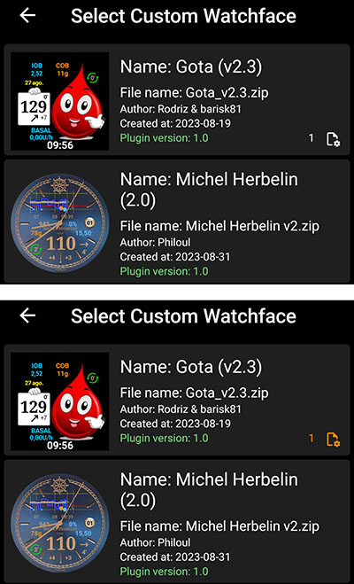

# 自定义表盘参考文档

本页面向新表盘设计师提供参考。 本文将列出创建或制作动态表盘时可用的所有关键词和功能。

- 自定义表盘V2版本（Wear apk 3.3.0及以上）的新功能和按键详见[此处](#cwf-reference-new-v2-features)

## 自定义表盘格式

自定义表盘是为AAPS设计的开放格式，关联至手表端新版"AAPS(自定义)"表盘。

表盘文件为简易zip压缩包，但需包含以下文件才能被识别为表盘文件：

- 一个名为CustomWatchface的图像文件（可为位图`CustomWatchface.jpg`、`CustomWatchface.png`或矢量图`CustomWatchface.svg`）。 该文件是点击"加载表盘"按钮时用于选择表盘的小图标，同时也是AAPS Wear插件中显示的图像。
- 一个名为`CustomWatchface.json`的文件（参见下文[JSON结构](#cwf-reference-json-structure)）。 该核心文件包含设计表盘所需的全部信息。 该json文件必须格式正确（在文本编辑器中手动编辑时最易出错，缺失或多一个逗号都会破坏json格式）。 该JSON文件必须包含带非空`"name"`键的`"metadata"`区块。 这将作为自定义表盘的名称（参见下文[元数据设置](#cwf-reference-metadata-settings)）
- 该zip文件应尽可能小（建议小于500KB）。 文件过大将被拦截，无法传输至手表。

zip文件还可包含额外资源文件：

- 表盘标准视图使用的硬编码图像文件名（如`Background`、`CoverChart`...参见下文[硬编码资源文件列表](#cwf-reference-list-of-hardcoded-resource-files)）。 所有文件均可采用`jpg`、`png`或`svg`格式。 但多数情况下需使用支持透明度的`png`或`svg`格式（jpg体积虽小于png但不支持透明）。 请注意，svg文件（矢量格式）通常能实现最佳画质与最小体积的结合。
- 可自由命名的附加资源文件。 这些附加文件可为图像文件或字体文件（字体支持`ttf`和`otf`格式）。 请注意，这些附加文件的`文件名`（不含扩展名）将作为JSON文件中的keyValue，用于指定其使用位置或时机。
  - 图像文件常用作文本视图背景或动态动画素材（如电量从0%到100%的变化效果）
  - 字体文件支持在表盘中使用定制字体

(cwf-reference-json-structure)=

## JSON 结构

JSON文件可通过记事本（或notepad++）文本编辑器编辑（推荐能识别JSON并支持彩色格式的notepad++）

- 文件包含字符串键`"string_key":`及键值，键值可为`"key value"`类字符串、整数、`true`/`false`布尔值或数据块。
- 各键值间用逗号`,`分隔
- 数据块以`{`开始，以`}`结束
- json文件整体为数据块，以`{`起始、`}`结束，内部所有嵌套块均通过`"key"`关联（键名在块内须唯一）。
- 为提升json文件可读性，通常采用缩进格式（每个新键换行显示，每个新块向右缩进4个空格字符）

(cwf-reference-metadata-settings)=

### 元数据设置

该区块是json文件中首个且必须包含的区块。 该区块包含与此表盘相关的所有信息，如名称、作者、创建或更新日期、作者版本或插件版本。

以下是元数据区块示例：

```json
"metadata": {
    "name": "默认表盘",
    "author": "我的名字", 
    "created_at": "2023年10月7日",
    "author_version": "1.0",
    "cwf_version": "1.0",
    "comment": "默认表盘模板，点击'导出表盘'按钮可生成"
},
```

请注意，日期中的`/`是特殊字符，需在前添加转义符`\`才能被json正确识别。

部分json文件中可能含额外键`"filename"`，该键会在自定义表盘加载至AAPS时自动生成或更新（用于在导出文件夹向用户显示zip文件名），因此可从元数据区块中删除此键。

(cwf-reference-general-parameter-settings)=

### 常规参数设置

在首个元数据区块后，需设置常规参数（参见下文[常规参数列表](#cwf-reference-list-of-general-parameters)），用于配置图表颜色（碳水、大剂量、血糖值等）以及范围内/高/低血糖的默认颜色（血糖值及箭头的预设颜色）。

以下是常规参数示例：

```json
"highColor": "#FFFF00",
"midColor": "#00FF00",
"lowColor": "#FF0000",
"lowBatColor": "#E53935",
"carbColor": "#FB8C00",
"basalBackgroundColor": "#0000FF",
"basalCenterColor": "#64B5F6",
"gridColor": "#FFFFFF",
"pointSize": 2,
"enableSecond": true,
```
(cwf-reference-imageview-settings)=

### ImageView 设置

自定义图像可通过匹配表盘布局中各ImageView的正确文件名进行调整，json区块仅用于定义位置、尺寸、可见性，并可选择性调整颜色：

以下是秒针(second_hand)的图像区块示例（此例zip未包含图像文件，将使用默认秒针图像但应用自定义颜色）：

```json
"second_hand": {
    "width": 400,
    "height": 400,
    "topmargin": 0,
    "leftmargin": 0,
    "visibility": "visible",
    "color": "#BC906A"
}
```
To have second_hand colored with default BG color (lowRange, midRange or highRange), you just have to modify the latest line with the keyValue `bgColor`

```json
    "color": "bgColor"
```

(cwf-reference-textview-settings)=

### TextView 设置

文本视图(TexView)参数比图像视图更丰富：可调整旋转角度（整数值/度）、字号（整数值/像素）、对齐方式（默认居中，可选左/右对齐），并支持设置字体、字型、文字颜色及文本视图背景色。

```json
"basalRate": {
    "width": 91,
    "height": 32,
    "topmargin": 133,
    "leftmargin": 249,
    "rotation": 0,
    "visibility": "visible",
    "textsize": 23,
    "gravity": "center",
    "font": "default",
    "fontStyle": "bold",
    "fontColor": "#BDBDBD"
},
```
注意：若需隐藏表盘中的某个视图，除将`"visibility"`设为`"gone"`外，还需将其尺寸和位置调整至可视区域外，例如：

```json
"second": {
    "width": 0,
    "height": 0,
    "topmargin": 0,
    "leftmargin": 0,
    "rotation": 0,
    "visibility": "gone",
    "textsize": 46,
    "gravity": "center",
    "font": "default",
    "fontStyle": "bold",
    "fontColor": "#BDBDBD"
},
```
若尺寸和位置位于可视区域内，表盘刷新时可能出现隐藏值的闪烁现象。

若需自定义文本视图背景图像，可使用键`"background":`并将zip内图像文件名设为键值，亦可直接通过`"color:"`键更改背景色。

```json
"background": "fileName"
```

另有4个专用文本视图（命名为freetext1至freetext4），含特定参数`"textvalue":`，可用于设置标签等固定文本。

(cwf-reference-chartview-settings)=

### ChartView 设置

图表视图是特殊视图，可共享部分图像视图或文本视图的参数...

该视图的标准设置非常简单：

```json
"chart": {
    "width": 400,
    "height": 170,
    "topmargin": 230,
    "leftmargin": 0,
    "visibility": "visible"
},
```
图表视图可添加的两个额外参数：通过`"color"`键设置背景色（默认透明），或通过`"background"`键设置背景图像。

(cwf-reference-how-to-build-watchface)=

## 如何构建/设计您的首个表盘

### 所需工具

- 文本编辑器：建议使用NotePad++（或同类工具），作为简易文本编辑器，其优势在于可显示带颜色标记的格式化文本，便于错误排查。 任何简易文本编辑器均可胜任。 因需调整json信息。
- 图像编辑器（位图/矢量图）
  - 如果您使用位图
    - 图像编辑器需支持透明通道处理（背景上层图像均需此功能），若使用位图则需兼容png格式。
    - 背景图像可采用jpg格式（体积较png更小）。
    - 图像编辑器需支持以像素为单位测量图形对象（如简单方形）的坐标参数（顶部、左侧、宽度、高度）。
    - 图像编辑器需支持以十六进制RRVVBB代码显示颜色。
    - 图像编辑器需能将图像调整为400px×400px分辨率（此分辨率至关重要）。
  - 如果您使用矢量图
    - 矢量图像应导出为svg格式。

### 获取模板以避免从零开始。

设计首个表盘时，最佳方案是从默认表盘开始（可确保获得含所有正确排序视图的最新版本）。

- 点击Wear插件中的"导出模板"按钮，即可在AAPS/exports文件夹获取zip文件。
- 请注意：需连接手表至AAPS才能显示自定义表盘按钮（调试、测试及调整自定义表盘时亦需保持连接）。

默认表盘极为简洁，zip文件仅包含以下两个文件：

- CustomWatchface.png（用于表盘选择的默认表盘预览图）
- CustomWatchface.json

### 在电脑中整理您的文件

最便捷的操作方式是将手机连接电脑，并专注于两个特定文件夹：

- 在专用文件夹（内含json文件、位图/矢量图、字体等所有素材）中打开资源管理器，并将CustomWatchface.zip文件置于其中。
- 同时打开另一个资源管理器（或调整导航树）以访问Phone/AAPS/exports文件夹。

如此操作极为简便：每次用文本编辑器修改json文件或用图像编辑器（位图/矢量图）调整图像后，仅需：

1. 在各应用程序中保存修改内容。
2. 将所有文件拖放至CustomWatchface.zip文件中。
3. 将CustomWatchface.zip拖放至手机的AAPS/exports文件夹。
4. 将CustomWatchface发送至手表以查看效果。

### 初始化表盘自定义设置

首先需定义表盘名称（便于测试时快速选择），并开始调整json文件开头的元数据键值。

随后需设定要显示的信息，即确定哪些视图应显示或隐藏。

- 是否启用秒针显示？
- 需设计模拟表盘、数字表盘或两者兼具？

现在您可通过修改json文件中的`"visibility"`键值来设定每个视图为`"visible"`（显示）或`"gone"`（隐藏）。

您还可先初步调整顶部、左侧边距及宽高数值来布局表盘（这些数值后续将通过图像编辑器精确校准）。

注：所有设计均在**400px×400px矩形框**内完成。 因此所有元素均需在此尺寸范围内采用绝对坐标定位。

设计首个表盘时需注意：所有元素按从底层到顶层的顺序堆叠排列，因此每个视图（ImageView或TextView）都可能遮挡后方内容...


json文件中所有视图均按从底层到顶层的顺序排列（便于您记忆各视图的遮挡关系...）

若首次设计或调整自定义表盘，建议从简单操作入手：更改部分视图的可见性、添加专属背景图（无需修改json文件）...

### 管理颜色

json文件中包含多个颜色设定键：视图的`"color"`、`"fontColor"`，以及`"highColor"`、`"midColor"`、`"lowColor"`等（详见[通用参数列表](#cwf-reference-list-of-general-parameters)）。

颜色通过以`#`开头的文本字段指定，后接十六进制格式的RRGGBB（红绿蓝）值：

- `"#FFFFFF"`为白色，`"#000000"`为黑色，`"#FF0000"`为红色...

还可添加2位Alpha通道值来设定透明度（AARRGGBB格式）：

- `"#00000000"`表示完全透明，`"#FF000000"`表示完全不透明（因此`"#FF000000"`等同于`"#000000"`）

您还可使用特定键值`"bgColor"`，根据血糖值自动调用通用参数中设定的`"highColor"`、`"midColor"`、`"lowColor"`：

- `"fontColor": "bgColor",` 将根据血糖值自动设置视图的字体颜色
- 注意：`sgv`（血糖值）和`direction`（趋势箭头）视图会自动应用通用参数中的血糖颜色设置（若需为这两个视图设定不同颜色，需使用进阶的[dynData](#cwf-reference-dyndata-feature)功能配合单阶颜色...）

有关ImageView及`"color":`键的详细信息，请参阅下文[调整图像颜色](#cwf-reference-tune-image-color)专章。

### 嵌入硬编码图像

调整表盘最便捷的方式是在zip文件中包含特定命名的图像（参见[硬编码资源文件列表](#cwf-reference-list-of-hardcoded-resource-files)）

- 图像需采用`.jpg`、`.png`或`.svg`格式。 但需注意：jpg格式不支持透明度，因此仅适用于背景图层。 所有中间图层（如cover_chart、cover_plate、表针）请使用`.png`或`.svg`格式图像

- 若您使用矢量图像编辑器（如Illustrator），建议优先选择`.svg`格式，该格式能生成体积小巧的文本文件且画质最佳。
- 务必确保使用精确的文件名（含大小写敏感）。

若需定制背景图，只需在zip文件中添加名为`Background.jpg`的文件（无需修改其他内容）。 将zip文件发送至手表并查看效果！

若需定制模拟表盘的时针、分针或秒针，只需添加`HourHand.png`（或`HourHand.svg`）、`MinuteHand.png`及`SecondHand.png`文件。

- 这些图像将自动绕其中心点旋转，因此图像需设置为00:00:00状态（若设计"全屏"模拟表盘，请使用400×400像素尺寸并定位在top 0 left 0位置）。

您还可在[硬编码资源文件列表](#cwf-reference-list-of-hardcoded-resource-files)中注意到：每个图像视图均对应两个附加的硬编码文件名`High`和`Low`（例如可在zip文件中添加名为`BackgroundHigh.jpg`和`BackgroundLow.jpg`的其他图像）。 图像将根据您的血糖水平（正常范围、高血糖或低血糖）自动切换。 参见AIMICO表盘示例。

(cwf-reference-tune-image-color)=

### 调整图像颜色

`"color"`键可用于调整默认图像颜色：

- 应用于背景视图时将设定背景色（默认为黑色）
- 应用于cover_plate（简易表盘）或表针时，将用指定颜色（含`"bgColor"`）替换默认图像（白色）

当您在位图图像（`.jpg`或`.png`）上应用`"color"`键时，颜色将对色彩饱和度产生独特效果。 因此您仍可识别位图原貌。

最后，在`.svg`图像文件上，`"color"`键将不起作用，矢量文件的颜色被视为硬编码在图像中。 若需更改颜色，需包含多个`svg`文件，并使用高级[dynData](#cwf-reference-dyndata-feature)功能进行切换

### 为TextView使用附加字体

穿戴应用已内置多种默认字体（参见[键值](#cwf-reference-key-values)章节中的字体键）。 但若需使用非默认的附加字体，可在zip文件中添加字体文件：

- 支持的两种字体格式为`.ttf`和`.otf`文件
- 若在zip文件中添加自定义字体（例如名为`myCustomFont.ttf`的文件），则需在json文件中通过文件名指定TextView使用的字体：

```
"font": "myCustomFont",
```

请注意：部分字体文件体积较大（且zip文件存在大小限制）。 因此若仅使用极少量字符（数字、`.`、`,`），可用免费工具剔除未用字符（例如[此处](https://products.aspose.app/font/generator/ttf-to-ttf)），从而缩减字体体积。

(cwf-reference-advanced-features)=

## 高级功能

(cwf-reference-preference-feature)=

### 偏好设置功能

CustomWatchface可自动调整部分手表偏好设置，以确保表盘正确显示（前提是用户已在Wear偏好设置中授予权限）。

但此功能需谨慎使用。 偏好设置与所有其他表盘共用。 使用此功能需遵循以下规则：

- 切勿设置与隐藏视图相关的偏好设置
- 尽量最大化可见视图
- 可随意放大某些视图的宽度：
  - TBR可显示为百分比（宽度较小）或绝对值（宽度较大）
  - 含详细信息的delta或avg delta可设置较宽宽度
  - iob2同理：该视图可显示总iob，若选择详细iob则文本可能极长

若仍需特定设置才能正确显示（如下例中详细iob空间不足时），可在元数据块中添加此类设置约束，例如将参数"强制"设为`false`

```json
"metadata": {
    "name": "Default Watchface",
    "author": "myName",
    "created_at": "07\/10\/2023",
    "author_version": "1.0",
    "cwf_version": "1.0",
    "comment": "Default watchface, you can click on EXPORT WATCHFACE button to generate a template",
    "key_show_detailed_iob": false
},
```

若用户授权自定义表盘修改手表参数（通过Wear插件设置），则"显示详细iob"将被设为"禁用"状态并锁定（除非在Wear插件参数中撤销授权或切换其他表盘，否则无法修改此参数）

- 请注意：用户选择表盘时，可在选择界面查看"必要参数"的数量

下例中Gota表盘需配置1个必要参数。 未获授权时该参数显示为白色；获授权后，参数将被设定并锁定（此时数字显示为橙色）




(cwf-reference-twinview-feature)=

### 双视图功能

双视图功能可根据可见视图轻松调整视图位置。 虽不具备完全由LinearLayout构建的布局功能，但能处理多数常见情况。

下例展示AAPS（驾驶舱）表盘：设置中所有视图均可见，以及关闭"显示设备电量"和"显示平均差值"后的同一表盘效果


可见当双视图之一隐藏时，另一视图会自动居中显示

本例中，`"uploader_battery"`区块通过`"twinView":`键指定`"rig_battery"`视图为配对对象，而`"rig_battery"`区块的`"twinView":`键则反向指定`"uploader_battery"`为配对视图。 此外，`"leftOffsetTwinHidden":`键用于设定配对视图隐藏时本视图的像素左移量。

计算该数值时，可见双视图的leftMargin差值为50像素，故居中偏移量需按单方向差值的一半设定。

若双视图为垂直排列，则需改用`"topOffsetTwinHidden":`键

```json
"uploader_battery": {
    "width": 49,
    "height": 30,
    "topmargin": 354,
    "leftmargin": 150,
    "rotation": 0,
    "visibility": "visible",
    "textsize": 23,
    "gravity": "center",
    "font": "roboto_condensed_bold",
    "fontStyle": "bold",
    "fontColor": "#FFFFFF",
    "twinView": "rig_battery",
    "leftOffsetTwinHidden": 25
},
"rig_battery": {
    "width": 49,
    "height": 30,
    "topmargin": 354,
    "leftmargin": 200,
    "rotation": 0,
    "visibility": "visible",
    "textsize": 23,
    "gravity": "center",
    "font": "roboto_condensed_bold",
    "fontStyle": "bold",
    "fontColor": "#FFFFFF",
    "twinView": "uploader_battery",
    "leftOffsetTwinHidden": -25
},
```
(cwf-reference-dyndata-feature)=

### 动态数据功能

DynData是最强大的功能，可根据内部数值（如血糖值、血糖水平、变化量、电池百分比等，可用数据列表见[此处](#cwf-reference-dyndata-key-values)）为表盘添加动画效果。

为说明此功能，现以AAPS（蒸汽朋克）表盘为例：


该表盘需实现：右侧[血糖值旋转](#cwf-reference-background-management)（30度至330度）、[平均差值动态范围](#cwf-reference-avg-delta-management)（根据数值按5/10/20mgdl缩放）、[指针旋转](#cwf-reference-dynamic-rotation-management)（需与刻度同步），以及各视图层级控制...

为配置此表盘，请参见压缩包内所有图片：

注：为展示透明度，所有图片均采用黄色背景并添加红色边框


- 首行Background.jpg和CoverPlate.png将自动关联至对应视图（默认视图文件名），steampunk_pointer.png则由dynData控制
- 次行显示avg_delta动态范围的3种刻度，同样由dynData调控
- 第三行chartBackground.jpg将手动关联至图表视图，HourHand.png和MinuteHand.png文件则自动匹配对应视图

(cwf-reference-background-management)=

#### **背景管理**

首先，关于血糖值图像，此处别无选择——必须置于背景层（否则会遮挡图表视图导致不可见！） 因此需将血糖值映射至背景层，再根据血糖值旋转背景图像。

在`"background"`区块中，我们将加入2个专用键实现旋转：

```json
"background": {
    "width": 400,
    "height": 400,
    "topmargin": 0,
    "leftmargin": 0,
    "dynData": "rotateSgv",
    "rotationOffset": true,
    "visibility": "visible"
},
```
`"dynData":`键指定定义动画的区块（数值、范围、转换等），本例使用名为"rotateSgv"的区块（使用此功能时请选用明确名称）

`"rotationOffset": true,`声明该数值动画应为旋转效果。 （若需创建滑动效果，还可使用`"leftOffset"`和`"topOffset"`键）

现在我们将跳转至文件末尾，最后一个视图之后：

```json
"second_hand": {
    "width": 120,
    "height": 120,
    "topmargin": 140,
    "leftmargin": 140,
    "visibility": "gone"
},
"dynData": {
    "rotateSgv": {
        "valueKey": "sgv",
        "minData": 30,
        "maxData": 330
    },
```
可见在末视图(`"second_hand"`)之后，我们新增了`"dynData": { ... }`区块以容纳所有动画配置：

`"background"`视图内定义的区块命名为`"rotateSgv"`，这正是`"dynData"`中的首个配置区块！

该区块配置简明：首先通过`"valueKey":`键指定关联的数值来源。 此处`"sgv"`作为"keyValue"表示血糖值（注意多数情况下keyValue与显示该信息的视图同名）。

血糖值的默认最小数据设为39mgdl，最大数据设为400mgdl（所有可用keyValue及对应最小/最大数据值详见下方[动态数据参考键值](#cwf-reference-dyndata-key-values)）。

在`"rotateSgv"`区块中，另两个键(`"minData":`和`"maxData":`)用于将数据范围调整为30至330。 通过这些最小和最大值，我们可以直接使用数据值（无需转换）来旋转背景（以度为单位）。 在此设置下，所有高于330mgdl的血糖值都将被限制在图像上限330度。

#### **图表管理**

图表默认背景为透明，为遮盖背景图像中的血糖刻度，需添加专用背景图（该图含蒸汽朋克表盘的整体阴影效果）。 通过`"background":`键关联charBackground.jpg文件

当然，视图的尺寸和定位必须精确到像素！

```json
"chart": {
    "width": 216,
    "height": 107,
    "topmargin": 280,
    "leftmargin": 80,
    "visibility": "visible",
    "background": "chartBackground"
},
```
(cwf-reference-avg-delta-management)=

#### **平均差值管理**

为实现平均差值的动态范围调控，我们将使用四个自由文本视图。 freetext1用于调控刻度图像，freetext2至freetext4则根据刻度控制指针旋转。

**freetext1**

如前所述，自由文本视图位于图表和背景层之上，因此我们设置了透明区域（图像右侧和底部）以显示这些图像。

注意：这些图像被裁切的底部区域已用作图表背景，实现无缝融合效果。

```json
"freetext1": {
    "width": 400,
    "height": 400,
    "topmargin": 0,
    "leftmargin": 0,
    "rotation": 0,
    "visibility": "visible",
    "dynData": "avgDeltaBackground"
},
```
该视图关联至另一个名为`avgDeltaBackground`的`"dynData"`区块。 此区块将根据avgDelta值调控avgDelta刻度。

```json
"avgDeltaBackground": {
    "valueKey": "avg_delta",
    "minData": -20,
    "maxData": 20,
    "invalidImage": "steampunk_gauge_mgdl_5",
    "image1": "steampunk_gauge_mgdl_20",
    "image2": "steampunk_gauge_mgdl_20",
    "image3": "steampunk_gauge_mgdl_10",
    "image4": "steampunk_gauge_mgdl_5",
    "image5": "steampunk_gauge_mgdl_5",
    "image6": "steampunk_gauge_mgdl_10",
    "image7": "steampunk_gauge_mgdl_20",
    "image8": "steampunk_gauge_mgdl_20"
},
```
- `"valueKey":`将关联`"avg_delta"`数值
- minData和maxData同时会将范围限制在该表盘支持的最大值区间（-20mgdl至20mgdl）。 使用mmol单位的用户请注意：AAPS内部数值始终以mgdl为单位存储。

随后我们将在此说明如何根据数值动态管理背景图像。

`"invalidImage":`键用于管理数据无效（或缺失）时显示的图像。 此处关联压缩包内含有5mgdl刻度的附加资源图像

随后我们将使用从`"image1":`到`"image8":`的系列图像。 提供的图像数量将决定`minData`与`maxData`之间的分段阶数。

- `image1`设定avg_delta等于或接近`minData`时显示的图像，编号最大的图像（此处为`image8`）则设定avg_delta等于或接近`maxData`时的显示图像
- 在-20mgdl至20mgdl范围内，总跨度为40mgdl，除以8（提供的图像数量）即得到8个5mgdl的递进步阶
- 现在根据avg_delta值映射背景图像：从最低值开始，-20至-15及-15至-10区间使用`steampunk_gauge_mgdl_20`刻度图，-10至-5区间用`steampunk_gauge_mgdl_10`，以此类推直至+15至+20区间再次使用`steampunk_gauge_mgdl_20`背景图

(cwf-reference-dynamic-rotation-management)=

**freetext2 到 freetext4**

对于这些视图，我们将结合之前说明的动态图像与旋转功能：

```json
"freetext2": {
    "width": 276,
    "height": 276,
    "topmargin": 64,
    "leftmargin": 64,
    "rotation": 0,
    "visibility": "visible",
    "dynData": "avgDelta5",
    "rotationOffset": true
},
"freetext3": {
    "width": 276,
    "height": 276,
    "topmargin": 64,
    "leftmargin": 64,
    "rotation": 0,
    "visibility": "visible",
    "dynData": "avgDelta10",
    "rotationOffset": true
},
"freetext4": {
    "width": 276,
    "height": 276,
    "topmargin": 64,
    "leftmargin": 64,
    "rotation": 0,
    "visibility": "visible",
    "dynData": "avgDelta20",
    "rotationOffset": true
},
```
此处每个视图对应特定刻度（故关联独立dynData区块），可注意到这3个视图启用了`"rotationOffset":`键。现在查看首个dynData区块：

```json
"avgDelta5": {
    "valueKey": "avg_delta",
    "minData": -20,
    "maxData": 20,
    "rotationOffset": {
        "minValue": -120,
        "maxValue": 120
    },
    "invalidImage": "null",
    "image1": "null",
    "image2": "null",
    "image3": "null",
    "image4": "steampunk_pointer",
    "image5": "steampunk_pointer",
    "image6": "null",
    "image7": "null",
    "image8": "null"
},
```
此处尽管动态范围仅使用-5至+5的avg_delta数据，但必须保持-20至+20mgdl的整体范围，以确保指针在刻度切换时与背景同步。 因此我们保持与`avgDeltaBackground`相同的整体范围和分段数量（8张图像）。

请注意：`"invalidImage"`及部分`"imagexx"`使用了`"null"`键值（该值可为压缩包内不存在的任意字符串文件名）。 当文件名未找到时，视图背景图像将显示为透明。 该设置确保指针仅在阶数4和5（avg delta介于-5mgdl至+5mgdl）时显示，超出此范围则隐藏。

现在可见新增的`"rotationOffset":`区块，内含`"minValue":`和`"maxValue":`两个键。 这些数值用于将内部数据（mgdl单位）转换为所需的指针旋转角度。

- 蒸汽朋克表盘设计为指针提供-30度至30度的最大旋转范围。 因此根据当前刻度（此处为-5mgdl至5mgdl），这些数值将对应30度的旋转角度。 由于`minData`与`maxData`范围扩大4倍，对应的minValue和maxValue也需乘以4倍，即-120度至+120度。 但当旋转角度超出±30度范围时指针将隐藏（无图像显示），仅当数值处于-5至+5mgdl区间时指针可见。 这完全符合此处设计预期。

其他dynData区块以相同方式定义，用于调整`"avgDelt10"`和`"avgDelta20"`。

#### loop视图

蒸汽朋克表盘中，状态指示的绿色/红色循环箭头被禁用，该功能同样通过关联循环视图的独立dynData区块实现。

```json
    "loopArrows": {
        "invalidImage": "greyArrows",
        "image1": "greenArrows",
        "image2": "redArrows"
    }
```
由于该区块仅由循环视图调用，且该视图默认管理循环数据，故`"valueKey":`键可省略。

循环视图默认的`minData`和`maxData`设为0分钟和28分钟，使用两张图像时：低于14分钟的数据显示`image1`背景，高于14分钟则显示`image2`。 14分钟正是绿色箭头切换为红色箭头的临界值。

本例中，`greyArrows`、`greenArrows`和`redArrows`文件未包含在压缩包内，故这些箭头被移除（不可见），但若需用自定义背景图像调整状态箭头，可直接使用该区块配置。

#### rig电池与uploader电池视图

为完成dynData功能的概览，我们将查看电池管理部分。 此处设计理念是根据电池电量（0%至100%）自定义文本颜色。

```json
"uploader_battery": {
    "width": 60,
    "height": 28,
    "topmargin": 100,
    "leftmargin": 170,
    "rotation": 0,
    "visibility": "visible",
    "textsize": 20,
    "gravity": "center",
    "font": "default",
    "fontStyle": "bold",
    "fontColor": "#00000000",
    "dynData": "batteryIcons",
    "twinView": "rig_battery",
    "topOffsetTwinHidden": -13
},
"rig_battery": {
    "width": 60,
    "height": 28,
    "topmargin": 74,
    "leftmargin": 170,
    "rotation": 0,
    "visibility": "visible",
    "textsize": 20,
    "gravity": "center",
    "font": "default",
    "fontStyle": "bold",
    "fontColor": "#00000000",
    "dynData": "batteryIcons",
    "twinView": "uploader_battery",
    "topOffsetTwinHidden": 13
},
```
可见这两个视图共享名为`batteryIcons`的同一`dynData`区块。 实现原理在于：默认关联视图自身数据（当`batteryIcons`区块未指定`"valueKey":`键时，将自动应用`uploader_battery`或`rig_battery`数据，具体取决于当前视图）。

请注意这两个视图还使用了[此处](#cwf-reference-twinview-feature)说明的TwinView功能。

现在让我们查看dynData区块：

```json
"batteryIcons": {
    "invalidFontColor": "#00000000",
    "fontColor1": "#A00000",
    "fontColor2": "#000000",
    "fontColor3": "#000000",
    "fontColor4": "#000000",
    "fontColor5": "#000000"        
},
```
此处采用与动态背景图像完全相同的逻辑，但使用专用键值（`"invalidFontColor"`及`"fontColor1"`至`"fontColor5"`来定义每20%为一个阶数的5个分段）。

- `"fontColor1"`（深红色）将用于20%以下的所有数值，超过此阈值则使用白色。
- 若需将阈值降至"10%以下"，只需新增`"fontColor6"`至`"fontColor10"`五个键值，也可通过逐级调整颜色实现从绿色到黄色、橙色直至红色的渐变效果。

(cwf-reference-dynpref-feature)=

### DynPref功能

在阅读本章前，需先掌握[dynData](#cwf-reference-dyndata-feature)的工作原理，因DynPref是其高级应用：现在您将能根据用户偏好设置来调整每个DynData区块：

为演示DynPref功能，我们将使用两个示例：

- 蒸汽朋克表盘（简易应用：通过同一表盘集成mgdl与mmol版本，根据aaps中选择的单位自动切换）。
- AAPS V2表盘将结合多项偏好设置，实现根据暗色模式及匹配分隔线偏好来管理文本颜色与背景。

#### 蒸汽朋克表盘中dynPref的简易应用

在蒸汽朋克表盘中，我们根据单位设置了两组图像：包含血糖刻度的`background`图像将随血糖值旋转。 以及根据avgDelta值动态调整刻度的`freeText1`。为实现表盘自动显示正确单位，需根据所选单位切换对应图像。

为此，我们将在视图区块中用`dynPref`键替换`dynData`键：

```json
 "background": {
    "width": 400,
    "height": 400,
    "topmargin": 0,
    "leftmargin": 0,
    "dynPref": "rotateSgv",
    "rotationOffset": true,
    "visibility": "visible"
},
```
`dynPref`键的用法与前一章所述`dynData`键高度相似

现在我们将查看json文件末尾，位于`dynData`区块之后的内容：

```json
"dynData": {
    ...
},
"dynPref": {
    "rotateSgv": {
        "prefKey": "key_units",
        "true": {
            "valueKey": "sgv",
            "minData": 30,
            "maxData": 330,
            "invalidImage": "Background_mgdl",
            "image1": "Background_mgdl"
        },
        "false": {
            "valueKey": "sgv",
            "minData": 30,
            "maxData": 330,
            "invalidImage": "Background_mmol",
            "image1": "Background_mmol"
        }
    },
    ...
}
```
可见定义于`background`视图区块的dynpref键（`"dynPref": "rotateSgv"`）已存在于json文件末尾的`dynPref`区块中：

该区块必须包含`"prefKey"`键，用于指定需调用的偏好设置项。 本示例中，键`"key_units"`关联手机端AAPS选择的单位，其值为`"true"`表示选择mgdl单位，`"false"`表示选择mmol单位。

随后您将看到两个采用"dynData"格式的json区块，系统将根据所选偏好设置调用对应区块。

请注意"HardCoded"背景图像文件名现已被动态图像替代（当key_units为"true"时使用`Background_mgdl.png`文件，为false时使用`Background_mmol.png`），同时添加了`"invalidImage"`键确保即使未收到手机数据也始终显示背景图像。

#### 在AAPS V2中整合dynPref的多项偏好设置

多数情况下，设置偏好时并非为了获得"动态行为"，而仅是呈现所选结果——但在dynPref中，这被视为动态功能特性...

- 当`dynData`需要指定包含图像、字体颜色、颜色等参数的完整区块时，`dynPref`则能根据特定偏好设置逐项组合各参数。
- 此处将演示如何将分隔线偏好与暗色偏好关联：当启用时（true），暗色表盘（dark参数为true）显示黑底白字，浅色表盘（dark为false）则显示白底黑字...

首先查看json文件起始部分：

```json
"dynPrefColor": "prefColorDark",
"pointSize": 2,
"enableSecond": false,
"background": {
    "width": 400,
    "height": 400,
    "topmargin": 0,
    "leftmargin": 0,
    "visibility": "visible",
    "dynPref": "dark"
},
```
`"dynPrefColor": "prefColorDark"`将指定视图外所有默认颜色的dynPref区块。 这些颜色将根据`"prefColorDark"`中的dark参数进行调整：

最终在`dynPref`区块内，您会看到针对默认颜色的专属dynPref区块：

```json
"prefColorDark": {
    "prefKey": "key_dark",
    "true": {
        "highColor": "#FFFF00",
        "midColor": "#00FF00",
        "lowColor": "#FF0000",
        "lowBatColor": "#E53935",
        "carbColor": "#FB8C00",
        "basalBackgroundColor": "#0000FF",
        "basalCenterColor": "#64B5F6",
        "gridColor": "#FFFFFF"
    },
    "false": {
        "highColor": "#A0A000",
        "midColor": "#00A000",
        "lowColor": "#A00000",
        "lowBatColor": "#E53935",
        "carbColor": "#D07C00",
        "basalBackgroundColor": "#0000A0",
        "basalCenterColor": "#64B5F6",
        "gridColor": "#303030"
    }
}
```
此dynPref区块与视图用标准区块的区别在于：此处未为`"key_dark"`参数的每个值配置dynData区块，仅列出主色列表（`highColor`、`midColor`等）

现在查看"分隔条"内的项目（如下例中关联`"matchDivider"` dynPref视图的`"basalRate"`视图）：

```json
"basalRate": {
    "width": 90,
    "height": 32,
    "topmargin": 127,
    "leftmargin": 242,
    "rotation": 0,
    ...
    "leftOffsetTwinHidden": 33,
    "dynPref": "matchDivider"
},
```
在dynPref区块中可见分隔线参数（`key_match_divider`键）包含"true"和"false"两个区块，这两个区块仅用于定义视图将采用"dark"动态区块（与横幅外其他视图完全相同的背景和文本颜色），或采用"white"动态区块（为背景和文本设置相反颜色）...

```json
"matchDivider": {
    "prefKey": "key_match_divider",
    "true": {
        "dynPref": "dark"
    },
    "false": {
        "dynPref": "white"
    }
},
"dark": {
    "prefKey": "key_dark",
    "true": {
        "color1": "#000000",
        "fontColor1": "#FFFFFF"
    },
    "false": {
        "color1": "#FFFFFF",
        "fontColor1": "#000000"
    }
},
```
请注意此处位于"dynData"区块内，因此定义颜色或字体颜色时需使用dynData（本文未具体说明），并采用单一步骤（使用`"color1"`和`'fontColor1'`）

- 除`image`外，所有参数的默认"无效值"（若未通过`"invalidColor"`或`"invalidFontColor"`键专门设置）将采用`"color1"`和`"fontColor1"`。


接着我们将看到第三个示例——iob视图（`iob1`和`iob2`），其中详细iob数据使用较小字体，总iob数据使用较大字体：

```json
"iob1": {
    "width": 125,
    "height": 33,
    "topmargin": 168,
    "leftmargin": 275,
    "rotation": 0,
    "visibility": "visible",
    "textsize": 19,
    ...
    "dynPref": "prefIob1"
},
"iob2": {
    "width": 125,
    "height": 33,
    "topmargin": 196,
    "leftmargin": 275,
    "rotation": 0,
    "visibility": "visible",
    "textsize": 24,
    ...
    "leftOffsetTwinHidden": -10,
    "dynPref": "prefIob2"
},
```
在默认视图设置中可见文本大小（`iob1`为19，`iob2`为24），以及两个不同的`dynPref`区块：一个根据详细iob参数调整文本尺寸，另一个根据暗色参数调整颜色。

```json
"prefIob1": {
    "prefKey": "key_show_detailed_iob",
    "true": {
        "dynPref": "dark",
        "textsize1": 24
    },
    "false": {
        "dynPref": "dark"
    }
},
"prefIob2": {
    "prefKey": "key_show_detailed_iob",
    "true": {
        "dynPref": "dark",
        "textsize1": 19
    },
    "false": {
        "dynPref": "dark"
    }
},
```
此处可见：根据详细iob参数（`"key_show_detailed_iob"`键），当其为"true"时，文本尺寸被固定设置为比默认值更大的数值（24替代19）——这是通过仅含单值的文本尺寸"阶梯"功能实现的...（注意：除图像外所有参数，若未设置invalidTextSize，则无效数据将使用textsize1）

随后"dark"动态偏好区块将用于设置颜色与字体颜色

本示例中，当详细IOB启用且暗色模式开启时，将调用以下dynData区块作用于iob1视图：

```
{
    "color1": "#000000",
    "fontColor1": "#FFFFFF",
    "textsize1": 24
},
```

因此文本将显示为黑底白字，且24号字体尺寸将替换视图中预设的19号默认尺寸。

当详细IOB禁用且暗色模式关闭时，作用于同一iob1视图的dynData区块为：

```
{
    "color1": "#FFFFFF",
    "fontColor1": "#000000"
},
```

此时文本将以白底黑字显示，并保持19号字体尺寸。

#### dynPref使用技巧

- 您可以组合任意数量的偏好设置，但需注意描述区块数量会呈指数级增长：若串联3个参数且需定义所有情形（假设每个参数仅有2种取值），则需描述8个区块...
- 注意避免构建"无限循环"（例如当dynpref1区块需由dynpref2区块补充，而dynpref2区块又需由dynpref1区块补充时...）。 此时这些dynpref区块将被视为无效...
- 使用视图中的`"textsize"`键时，必须在dynPref值区块中使用`"textsize1"`（因其采用"dynData"格式，本例中仅关联单一步骤的值），切勿忘记在键名后添加数字索引。
- 每个视图仅应设置一个`"valueKey"`键，因此若最终`dynData`区块由多个`dynPref`区块构建时，切勿包含多个`"valueKey"`（及其关联的`"minData"`、`"maxData"`等参数）。

(cwf-reference-new-v2-features)=

### 自定义表盘V2的新功能（适用于AAPS V3.3.0及以上版本）

请注意，使用这些新功能或视图的表盘需要基于AAPS 3.3.0版本构建的最新wear apk。

若在搭载CustomWatchface V1的手表上使用"v2"压缩包，表盘将出现信息缺失或内容错误。

自定义表盘V2包含以下新功能：

- [全新状态视图](cwf-reference-new-status-feature)
- [全新临时目标视图](cwf-reference-new-temp-target-feature)
- [全新储药器余量视图](cwf-reference-new-reservoir-level-feature)
- [全新格式设置功能](cwf-reference-new-formating-feature)
- [显示跟随者外部数据](cwf-reference-show-external-datas)（单个表盘最多可显示3组数据：AAPS、AAPSCLIENT和AAPSCLIENT2）

(cwf-reference-new-status-feature)=

#### 全新状态视图

该视图的键为`"status"`，其关联区块已自动包含在wear apk"自定义表盘V2"（基于AAPS 3.3.0及以上版本构建）导出的模板中。

该视图已内置在早期AAPS（无图表）、AAPS（大图表）和AAPS（大号）等现有表盘中，并包含由wear apk构建的字符串值。

AAPS 3.3.0版本中已移除这些旧表盘，替换为3款全新自定义表盘。

- 最低显示信息为IOB值（无论手表IOB参数如何设置始终可见）
- 若在偏好设置中启用，则显示详细IOB值（大剂量IOB|基础率IOB）
- 以及BGI值（同样需在偏好设置中启用）

该`"status"`视图通过`"key_show_loop_status"`键（位于dynPref内）关联，用于管理可见性。

该视图在V1版本中可通过`"iob1"`、`"iob2"`和`"bgi"`现有视图实现，但需配置复杂的dynPref设置来根据手表不同选项调节各信息间距。

(cwf-reference-new-temp-target-feature)=

#### 全新临时目标视图

该视图的键为`"tempTarget"`，其关联区块已自动包含在由wear apk"自定义表盘V2"（基于AAPS 3.3.0及以上版本构建）导出的模板中。

表盘将显示以下内容：

- 配置文件目标值（单值或最小-最大目标范围）（默认白色显示）
- 闭环调整后的目标值（默认绿色显示）
- 用户设定的临时目标值（默认黄色显示）

该`"tempTarget"`视图通过`"key_show_temp_target"`键（位于dynPref内）关联，用于管理可见性。

动态数据键（关联颜色信息）为`"tempTarget"`（TempTarget视图默认关联的动态数据键）

动态数据值对应情况：

- 0（配置文件目标）
- 1（闭环目标）或
- 2（用户临时目标）

请注意，该视图也适用于外部数据（参见[下方](cwf-reference-show-external-datas)），使用`"tempTarget_Ext1"`和`"tempTarget_Ext2"`键（视图及动态数据）。

(cwf-reference-new-reservoir-level-feature)=

#### 全新储药器余量视图

该视图的键为`"reservoir"`，其关联区块已自动包含在由wear apk"自定义表盘V2"（基于AAPS 3.3.0及以上版本构建）导出的模板中。

该视图以白色（默认）显示储药器余量（单位`U`），警告级别为黄色，紧急级别为红色。

该`"reservoir"`视图通过`"key_show_reservoir_level"`键（位于dynPref内）关联，用于管理可见性。

储药器余量关联的动态数据键为：

-  `"reservoir"`（储药器余量视图默认动态数据键）关联胰岛素余量`U`
  - 最小值为0.0单位
  - 最大值为500.0单位
-  `"储药器余量"`
  - 0（标准余量，默认白色显示）
  - 1（警告余量，默认黄色显示）
  - 2（紧急余量，默认红色显示）

请注意，该视图也支持外部数据（参见[下方](cwf-reference-show-external-datas)），可通过`"reservoir_Ext1"`、`"reservoir_Ext2"`、`"reservoirLevel_Ext1"`和`"reservoirLevel_Ext2"`键（视图及动态数据）实现。

(cwf-reference-new-formating-feature)=

#### 动态数据或动态偏好的新格式化功能

现在您可对手表接收的原始值进行自定义格式化，这些值已包含在下方的[动态数据键值表](#cwf-reference-dyndata-key-values)中。

为说明该功能运作方式，现以AAPS（大号）表盘为例，根据"时间间隔值"及"status"视图显示状态展示效果：


- 左侧首张截图中status视图可见（含IOB、详细IOB及BGI），故仅1/3行空间显示时间戳（极简格式如`1'`，上传器电量显示为`U:55%`）
- 右侧截图中`status`视图已通过手表参数隐藏，因此有充足空间完整显示时间戳及上传器电量信息（`1分钟前`和`上传器：55%`）
- 最右侧截图中手表设置完全相同，但时间戳数值已超过"1"。 此时自定义表盘可显示经复数处理的更新标签（`2分钟前`）

下文将不赘述zip文件中视图的整体管理逻辑（不同设置下各视图的定位方式），仅重点解析AAPS（大号）表盘中格式化功能与关联动态值的实现方法。


**该功能需配合"动态区块"使用**（可以是`dynData`区块或`dynPref`区块）

- 在AAPS（大号）表盘中，我们需根据参数（如`status`视图显隐状态）切换短/长格式，因此采用了`dynPref`区块实现。

首先从视图结构讲起：

```json
"uploader_battery": {
    "width": 200,
    "height": 50,
    "topmargin": 175,
    "leftmargin": 0,
    "rotation": 0,
    "visibility": "visible",
    "textsize": 25,
    "gravity": "center",
    "font": "roboto_condensed_light",
    "fontStyle": "normal",
    "dynPref": "uploader",
    "dynValue": false,
    "fontColor": "#BDBDBD"
},

"timestamp": {
    "width": 200,
    "height": 50,
    "topmargin": 175,
    "leftmargin": 0,
    "rotation": 0,
    "visibility": "visible",
    "textsize": 25,
    "gravity": "center",
    "font": "roboto_condensed_light",
    "fontStyle": "normal",
    "dynPref": "timestamp",
    "dynValue": false,
    "fontColor": "#FFFFFF"
},
```
此处最关键的是`"dynValue"`键：通过该键信息可实现原始值的动态管理。 后方布尔值（true/false）决定是否对数值进行"转换"

- `false`：直接使用原始值，不做任何限制或转换
- `true`：原始值将根据dynData区块中的`minData`和`maxData`键，以及dynData中定义的`minValue`和`maxValue`进行转换

该表盘直接使用原始值未作转换，故两个视图的`"dynValue"`键均设为`false`。


现在查看`"dynPref"`中定义的`"uploader"`区块：

```json
"uploader": {
    "prefKey": "key_show_loop_status",
    "true": {
        "dynPref": "uploader_true_ago",
        "invalidTextvalue": "U: --",
        "textvalue1": "U: %.0f%%"
    },
    "false": {
        "dynPref": "uploader_false_ago",
        "invalidTextvalue": "Uploader: --",
        "textvalue1": "Uploader: %.0f%%"
    }
},
```
默认情况下`"uploader_battery"`视图已关联`"uploader_battery"`键，无需额外声明关联关系

`"valueKey": "uploader_battery"`（最小值0，最大值100，原始值为手机电量百分比）

格式化字符串包含在`"textvalue1"`键中（`"textvalue1"`、`"textvalue2"`等键与可置于`view`区块的`"textvalue"`键关联）

- `"textvalue"`键可在视图区块中使用格式化信息（此时格式为静态，不受数值或设置影响）
- 若需根据设置或数值调整格式，可应用全部dynData功能，专用键为`"invalidTextValue"`（不含"格式化信息"因数值无效）及`"textvalue1"`、`"textvalue2"`...（可添加任意数量键值以管理minData与maxData间的分段）
- 额外`"dynPref"`键用于定义其他区块，以根据视图显隐、暗色模式及分界器设置调整定位与色彩

关于格式化字符串的语法规则如下：`%[flags][width][.precision]f`

- `%`是格式化的起始符，`f`为结束符（专用于双精度浮点数转换）。
  - 注意：若需在字符串中使用`%`字符，必须写成`%%`以表明此处为百分号而非格式化起始符。
- `[flag]`为可选参数，常用`+`强制显示正负号，或用`(`使负值显示在括号内
- `[width]`为可选参数，定义输出结果的最小字符数
- `[.precision]`用于定义小数点后的位数。
  - 注意：由于数值为双精度浮点型，建议始终设置精度（避免Kotlin精度导致小数点后出现过多字符）

因此上例中`%.0f`会将双精度值显示为整数


现在查看管理复数形式的timestamp动态参数区块：

```json
"timestamp": {
    "prefKey": "key_show_loop_status",
    "true": {
        "dynPref": "timestamp_true_uploader",
        "invalidTextvalue": "U: --",
        "textvalue1": "%.0f'"
    },
    "false": {
        "dynPref": "timestamp_false_uploader",
        "minData": 0,
        "maxData": 3,
        "invalidTextvalue": "-- minute ago",
        "textvalue1": "%.0f minute ago",
        "textvalue2": "%.0f minutes ago"
    }
},
```
- 当`status`视图可见时（即`"key_show_loop_satus"`键为`true`），采用单一格式（`"textvalue1"`），以`'`作为单位符号
- 若`status`视图隐藏，则采用两种格式：0或1时使用单数形式，大于2时使用复数形式
  - `"minData"`和`"maxData"`用于定义数值范围，确保单复数切换在1和2之间生效
  - 注意：`"maxData"`（整数值）设为3而非2，因系统处理的双精度数据并非整数，故略高于或低于1的值经四舍五入后可能仍为1，但需按单复数格式区分显示。

- 对于`timestamp`视图，必须将`"dynValue"`键设为`false`，否则因单复数格式化处理，所有大于3的值都会通过`maxData`转换被限制显示为`3分钟前`...


**关于格式化功能的补充说明**

- 请谨记：唯一可用的动态值仅为[此处](#cwf-reference-dyndata-key-values)列出的参数
- 所有`血糖`值均以mg/dL为单位，若需通过格式化功能显示mmol/L单位，必须自行处理mg/dL与mmol/L的换算。 在`dynData`或`dynPref`区块中，用于定义包含数值转换`"minValue"`和`"maxValue"`的子区块必须命名为`"dynValue": { ... }`。 （参见[动态数据键](#cwf-reference-dyndata-keys)）
- 若需在视图中使用静态格式化字符串（通过`"textvalue"`键定义格式，`"dynValue"`键启用动态值），则必须同时声明`"dynData"`或`"dynPref"`区块（即使留空）以激活格式化功能。
- `"textvalue1"`、`"textvalue2"`至textvalue*n*可不启用格式化功能，用于将数值分段替换为特定文本标签（例如配合`"day_name"`键值，通过七个分段定义星期几的自定义名称等）。

- 完整文档请参阅[Formatter类](https://docs.oracle.com/javase/8/docs/api/java/util/Formatter.html)

(cwf-reference-show-external-datas)=

#### 显示跟随者的外部数据

自定义表盘现在可同时显示最多3组数据：AAPS、AAPSCLIENT和AAPSCLIENT2

要使用此功能，您需要：

- 手机上需安装以下3个应用中的至少2个（AAPS、AAPSCLIENT、AAPSCLIENT2）
- 在AAPSCLIENT和/或AAPSCLIENT2中启用数据广播功能，将数据广播至用于与CustomWatchface同步的主应用（AAPS或AAPSCLIENT）
- 使用支持`_Ext1`或`_Ext2`键视图的CustomWatchface（参见下文[键与键值对照表](cwf-reference-key-and-keyvalue-reference)）

请注意：若手机主应用为AAPSCLIENT且广播数据的次级应用为AAPSCLIENT2，当使用含标准视图及Ext1附加视图（Ext1关联AAPSCLIENT，Ext2关联AAPSCLIENT2）的表盘时，需在CustomWatchface专属参数中启用`切换表盘外部数据`选项。

新增三个视图（`"patient_name"`、`"patient_name_Ext1"`及`"patient_name_Ext2"`*），用于在表盘中自动显示患者姓名（通过AAPS偏好设置配置，参见下方示例）。


(cwf-reference-key-and-keyvalue-reference)=

## 键与键值对照表

(cwf-reference-list-of-metadata-keys)=

### 元数据键列表

(cwf-reference-list-of-standard-metadata-keys)=

#### 标准信息元数据键列表

| 键                  | 备注                                       |
| ------------------ | ---------------------------------------- |
| `"name"`           | 自定义表盘名称                                  |
| `"author"`         | 作者名称或笔名                                  |
| `"created_at"`     | 创建（或更新）日期，注意：`/`是特殊字符，若用于日期显示需在前添加`\`转义 |
| `"cwf_version"`    | 与您表盘设计兼容的表盘插件                            |
| `"author_version"` | 作者可在此指定其表盘的版本号                           |
| `"comment"`        | 自由文本字段，用于说明当前表盘的功能信息或使用限制                |

(cwf-reference-preference-keys)=

#### 偏好设置键

| 键                             | 默认值与注释                                                                                                                          |
| ----------------------------- | ------------------------------------------------------------------------------------------------------------------------------- |
| `"key_show_detailed_iob"`     | true将锁定视图`iob2`上的详细IOB数据，此时`iob1`（若可见且未被图标替换）将显示IOB总量。<br />false则会在`iob2`视图上锁定IOB总量显示。 当`iob2`视图宽度过小无法正确显示详细IOB数据时可启用此选项 |
| `"key_show_detailed_delta"`   | false（仅当设计不兼容`delta`与`avg_delta`视图的详细差值宽度时使用）                                                                                   |
| `"key_show_bgi"`              | 若设计需要显示`bgi`信息则设为true                                                                                                           |
| `"key_show_iob"`              | 若设计需要显示`iob1`或`iob2`视图则设为true                                                                                                   |
| `"key_show_cob"`              | 若设计需要显示`cob1`或`cob2`视图则设为true                                                                                                   |
| `"key_show_delta"`            | 若设计需要显示`delta`信息则设为true                                                                                                         |
| `"key_show_avg_delta"`        | 若设计需要显示`avg_delta`信息则设为true                                                                                                     |
| `"key_show_temp_target"`      | 若设计需要显示`tempTarget`信息则设为true                                                                                                    |
| `"key_show_reservoir_level"`  | 若设计需要显示`reservoir`信息则设为true                                                                                                     |
| `"key_show_uploader_battery"` | 若设计需要显示`uploader_battery`（手机电量）信息则设为true                                                                                        |
| `"key_show_rig_battery"`      | 若设计需要显示`rig_battery`信息则设为true                                                                                                   |
| `"key_show_temp_basal"`       | 若设计需要显示`basalRate`信息则设为true                                                                                                     |
| `"key_show_direction"`        | 若设计需要显示`direction`信息（血糖变化箭头）则设为true                                                                                             |
| `"key_show_ago"`              | 若设计需要显示`timestamp`信息（最近血糖数据接收时间/分钟前）则设为true                                                                                     |
| `"key_show_bg"`               | 若设计需要显示`sgv`信息（血糖值）则设为true                                                                                                      |
| `"key_show_loop_status"`      | 若设计需要显示`loop`信息（闭环状态及时间间隔）则设为true                                                                                               |
| `"key_show_week_number"`      | 若设计需要显示`week_number`信息（周数）则设为true                                                                                               |
| `"key_show_date"`             | 若设计需要显示`Date`、`Month`或`Day of the week`信息则设为true                                                                                |

#### 内部键

| 键                     | 注释                                         |
| --------------------- | ------------------------------------------ |
| `"filename"`          | 此键将在表盘加载时自动创建（或更新），并包含导出文件夹中的本地zip文件名      |
| `"cwf_authorization"` | 此键将在表盘加载时创建，并在Wear设置中每次更改授权偏好时更新，用于同步授权至手表 |

(cwf-reference-list-of-general-parameters)=

### 通用参数列表

| 键                        | 备注                                                                                         |
| ------------------------ | ------------------------------------------------------------------------------------------ |
| `"highColor"`            | `"#FFFF00"`（默认黄色）：当血糖值超过上限（高血糖）时，血糖值、趋势箭头及图表中血糖值的显示颜色                                      |
| `"midColor"`             | `"#00FF00"`（默认绿色）：当血糖值在范围内时，血糖值、趋势箭头及图表中血糖值的显示颜色                                           |
| `"lowColor"`             | `"#FF0000"`（默认红色）：当血糖值低于下限（低血糖）时，血糖值、趋势箭头及图表中血糖值的显示颜色                                      |
| `"lowBatColor"`          | `"#E53935"`（默认深红色）：当`uploader_battery`值过低（低于20%，待确认）时的显示颜色                                 |
| `"carbColor"`            | `"#FB8C00"`（默认橙色）：图表中碳水化合物数据点的显示颜色                                                         |
| `"basalBackgroundColor"` | `"#0000FF"`（默认深蓝色）：图表中TBR曲线的显示颜色                                                           |
| `"basalCenterColor"`     | `"#64B5F6"`（默认浅蓝色）：图表中大剂量或超微大剂量数据点的显示颜色                                                    |
| `"gridColor"`            | `"#FFFFFF"`（默认白色）：图表中线条和文本刻度的显示颜色                                                          |
| `"pointSize"`            | 2（默认值）：图表中数据点的大小（1为小点，2为大点）                                                                |
| `"enableSecond"`         | false（默认值）：指定表盘是否在`time`、`second`或`second_hand`视图中处理秒数。 必须确保视图可见性与该全局设置保持一致，该设置将允许每秒更新时间信息 |
| `"dayNameFormat"`        | "E"（默认值）：从"E"到"EEEE"指定星期名称格式（数字、简称、全称），待确认                                                 |
| `"monthFormat"`          | "MMM"（默认值）：从"M"到"MMMM"指定月份格式（数字、简称、全称）                                                     |

(cwf-reference-list-of-hardcoded-resource-files)=

### 硬编码资源文件列表

对于大多数图像，High和Low后缀允许根据血糖水平（在范围内、高血糖或低血糖）调整图像

| 文件名                                                             | 备注                                                          |
| --------------------------------------------------------------- | ----------------------------------------------------------- |
| CustomWatchface                                                 | 用于表盘选择和在Wear插件中显示的图像                                        |
| Background,<br />BackgroundHigh,<br />BackgroundLow | 无（默认黑色）：背景图像。 若无背景图像，则始终显示默认黑色背景。 可修改颜色以适应表盘设计              |
| CoverChart,<br />CoverChartHigh,<br />CoverChartLow | 无（默认值）：图表前景图像（需保持透明度以确保底层图表可见），可用于限定图表边界                    |
| CoverPlate,<br />CoverPlateHigh,<br />CoverPlateLow | 简易表盘（默认值）：所有文本值前方的图像。 必须保持透明度以确保后方所有数值可见                    |
| 时针、<br />高血糖时针、<br />低血糖时针                          | hour_hand（默认值）：时针图像。 提供默认图像，可调整颜色以匹配模拟表盘设计。 注意：旋转轴心为图像中心点   |
| MinuteHand,<br />MinuteHandHigh,<br />MinuteHandLow | minute_hand（默认值）：分针图像。 提供默认图像，可调整颜色以匹配模拟表盘设计。 注意：旋转轴心为图像中心点 |
| SecondHand,<br />SecondHandHigh,<br />SecondHandLow | second_hand（默认值）：秒针图像。 提供默认图像，可调整颜色以匹配模拟表盘设计。 注意：旋转轴心为图像中心点 |
| ArrowNone                                                       | ?? （默认值）：无有效箭头时显示的图像。                                       |
| ArrowDoubleUp                                                   | ↑↑（默认值）：双上箭头图像                                              |
| ArrowSingleUp                                                   | ↑（默认值）：单上箭头图像                                               |
| Arrow45Up                                                       | ↗（默认值）：45度上箭头图像                                             |
| ArrowFlat                                                       | →（默认值）：水平箭头图像                                               |
| Arrow45Down                                                     | ↘（默认值）：45度下箭头图像                                             |
| ArrowSingleDown                                                 | ↓（默认值）：单下箭头图像                                               |
| ArrowDoubleDown                                                 | ↓↓（默认值）：双下箭头图像                                              |

上述每个文件名可使用`.jpg`、`.png`或`.svg`扩展名。 但需注意，`.jpg`格式不支持透明度（因此多数文件应使用.png或.svg格式，避免遮挡后方视图...）

(cwf-reference-list-of-view-keys)=

### 视图键列表

此列表按从背景到前景的顺序排列，在组织表盘时了解此顺序非常重要，因为某些图像或文本可能被其他图像遮挡。

注意：所有以`_Ext1`或`_Ext2`结尾的键都是新增的，专用于多用户表盘。

| 键                                                                                      | 视图类型                | 关联数据                                                                                                                                  | 动态数据键                                                                                                                                            |
| -------------------------------------------------------------------------------------- | ------------------- | ------------------------------------------------------------------------------------------------------------------------------------- | ------------------------------------------------------------------------------------------------------------------------------------------------ |
| `"background"`                                                                         | Image View          |                                                                                                                                       |                                                                                                                                                  |
| `"chart"`                                                                              | Specific Chart View | Graphical curves                                                                                                                      |                                                                                                                                                  |
| `"cover_chart"`                                                                        | Image View          |                                                                                                                                       |                                                                                                                                                  |
| `"freetext1"`                                                                          | Text View           |                                                                                                                                       |                                                                                                                                                  |
| `"freetext2"`                                                                          | Text View           |                                                                                                                                       |                                                                                                                                                  |
| `"freetext3"`                                                                          | Text View           |                                                                                                                                       |                                                                                                                                                  |
| `"freetext4"`                                                                          | Text View           |                                                                                                                                       |                                                                                                                                                  |
| `"patient_name"` *<br/>`"patient_name_Ext1"` *<br/>`"patient_name_Ext2"` * | Text View           | Patient Name                                                                                                                          |                                                                                                                                                  |
| `"iob1"`<br/>`"iob1_Ext1"` *<br/>`"iob1_Ext2"` *                           | Text View           | IOB label or IOB Total                                                                                                                |                                                                                                                                                  |
| `"iob2"`<br/>`"iob2_Ext1"` *<br/>`"iob2_Ext2"` *                           | Text View           | IOB Total or IOB Detailed                                                                                                             |                                                                                                                                                  |
| `"cob1"`<br/>`"cob1_Ext1"` *<br/>`"cob1_Ext2"` *                           | Text View           | Carb label                                                                                                                            |                                                                                                                                                  |
| `"cob2"`<br/>`"cob2_Ext1"` *<br/>`"cob2_Ext2"` *                           | Text View           | COB Value                                                                                                                             |                                                                                                                                                  |
| `"delta"`<br/>`"delta_Ext1"` *<br/>`"delta_Ext2"` *                        | Text View           | Short delta (5 min)                                                                                                                   | delta  
delta_Ext1<br/>delta_Ext2                                                                                                          |
| `"avg_delta"`<br/>`"avg_delta_Ext1"` *<br/>`"avg_delta_Ext2"` *            | Text View           | Avg Delta (15 min)                                                                                                                    | avg_delta<br/>avg_delta_Ext1<br/>avg_delta_Ext2                                                                                  |
| `"tempTarget"`*<br/>`"tempTarget_Ext1"` *<br/>`"tempTarget_Ext2"` *        | Text View           | BG Target (single value or min - max targets values)                                                                                  | tempTarget<br/>tempTarget_Ext1<br/>tempTarget_Ext2                                                                                   |
| `"reservoir"`*<br/>`"reservoir_Ext1"` *<br/>`"reservoir_Ext2"` *           | Text View           | Reservoir level                                                                                                                       | reservoir<br/>reservoirLevel<br/>reservoir_Ext1<br/>reservoirLevel_Ext1<br/>reservoir_Ext2<br/>reservoirLevel_Ext2 |
| `"uploader_battery"`                                                                   | Text View           | phone battery level (%)                                                                                                               | uploader_battery                                                                                                                                 |
| `"rig_battery"`<br/>`"rig_battery_Ext1"` *<br/>`"rig_battery_Ext2"` *      | Text View           | rig battery level (%)                                                                                                                 | rig_battery<br/>rig_battery_Ext1<br/>rig_battery_Ext2                                                                            |
| `"basalRate"`<br/>`"basalRate_Ext1"` *<br/>`"basalRate_Ext2"` *            | Text View           | % or absolute value                                                                                                                   |                                                                                                                                                  |
| `"bgi"`<br/>`"bgi_Ext1"` *<br/>`"bgi2_Ext2"` *                             | Text View           | mgdl/(5 min) or mmol/(5 min)                                                                                                          |                                                                                                                                                  |
| `"status"` *<br/>`"status_Ext1"` *<br/>`"status_Ext2"` *                   | Text View           | Synthesis of IOB (whatever IOB setting in watch), Detailed IOB (according to setting in watch and BGI (according to setting in watch) |                                                                                                                                                  |
| `"time"`                                                                               | Text View           | HH:MM or HH:MM:SS                                                                                                                     |                                                                                                                                                  |
| `"hour"`                                                                               | Text View           | HH                                                                                                                                    |                                                                                                                                                  |
| `"minute"`                                                                             | Text View           | MM                                                                                                                                    |                                                                                                                                                  |
| `"second"`                                                                             | Text View           | SS                                                                                                                                    |                                                                                                                                                  |
| `"timePeriod"`                                                                         | Text View           | 上午/下午                                                                                                                                 |                                                                                                                                                  |
| `"day_name"`                                                                           | Text View           | name of the day (cf. dayNameFormat)                                                                                                   | day_name                                                                                                                                         |
| `"day"`                                                                                | Text View           | DD date                                                                                                                               | day                                                                                                                                              |
| `"week_number"`                                                                        | Text View           | (WW) week number                                                                                                                      | week_number                                                                                                                                      |
| `"month"`                                                                              | Text View           | month name (cf. monthFormat)                                                                                                          |                                                                                                                                                  |
| `"loop"`<br/>`"loop_Ext1"` *<br/>`"loop_Ext2"` *                           | Text View           | 上次运行至今的分钟数及状态（背景色箭头），可通过DynData调整箭头颜色                                                                                                 | loop                                                                                                                                             |
| `"direction"`<br/>`"direction_Ext1"` *<br/>`"direction_Ext2"` *            | Image View          | 趋势箭头                                                                                                                                  | direction                                                                                                                                        |
| `"timestamp"`<br/>`"timestamp_Ext1"` *<br/>`"timestamp_Ext2"` *            | Text View           | integer (min ago)                                                                                                                     | timestamp                                                                                                                                        |
| `"sgv"`<br/>`"sgv_Ext1"` *<br/>`"sgv_Ext2"` *                              | Text View           | sgv value (mgdl or mmol)                                                                                                              | sgv<br />sgvLevel<br/>sgv_Ext1<br />sgvLevel_Ext1<br/>sgv_Ext2<br />sgvLevel_Ext2                                  |
| `"cover_plate"`                                                                        | Image View          |                                                                                                                                       |                                                                                                                                                  |
| `"hour_hand"`                                                                          | Image View          |                                                                                                                                       |                                                                                                                                                  |
| `"minute_hand"`                                                                        | Image View          |                                                                                                                                       |                                                                                                                                                  |
| `"second_hand"`                                                                        | Image View          |                                                                                                                                       |                                                                                                                                                  |

**自定义表盘V2.0及以上版本新增视图（需AAPS 3.3.0 wear apk或更高版本支持）*

(cwf-reference-list-of-json-keys)=

### Json键列表

(cwf-reference-common-keys)=

#### 公共键

 可用于所有视图类型（文本视图、图像视图、图表视图）

| 键                        | 类型      | 注释/值                                                                                         |
| ------------------------ | ------- | -------------------------------------------------------------------------------------------- |
| `"width"`                | int     | 视图宽度（像素）                                                                                     |
| `"height"`               | int     | 视图高度（像素）                                                                                     |
| `"topmargin"`            | int     | 上边距（像素）                                                                                      |
| `"leftmargin"`           | int     | 左边距（像素）                                                                                      |
| `"rotation"`             | int     | 旋转角度（度）                                                                                      |
| `"visibility"`           | string  | 参见键值表                                                                                        |
| `"dynData"`              | string  | 指定关联动态数据及动画效果（颜色、图像、位移、旋转）的键区块名称<br />`"dynData": "customName",`（见下文）                  |
| `"leftOffset"`           | boolean | 包含此键并设为true可启用基于dynData值的水平位移（正值或负值）                                                         |
| `"topOffset"`            | boolean | 包含此键并设为true可启用基于dynData值的垂直位移（正值或负值）                                                         |
| `"rotationOffset"`       | boolean | 包含此键并设为true可启用基于dynData值的旋转（正值或负值）                                                           |
| `"twinView"`             | string  | 另一视图的键（通常该视图也包含twinView参数，其中引用了本视图的键）                                                        |
| `"topOffsetTwinHidden"`  | int     | 若孪生视图隐藏时垂直位移的像素数（正值或负值）<br />topOffsetTwinHidden = (孪生视图topOffset - 本视图topOffset)/2    |
| `"leftOffsetTwinHidden"` | int     | 若孪生视图隐藏时水平位移的像素数（正值或负值）<br />leftOffsetTwinHidden = (孪生视图leftOffset - 本视图leftOffset)/2 |
| `"dynPref"`              | string  | 指定关联动态偏好设置及动画效果（颜色、图像、位移、旋转）的键区块名称<br />`"dynPref": "customName",`（见下文）                |

(cwf-reference-textview-keys)=

#### 文本视图键

| 键              | 类型      | 备注                                                                                                                                                                                                                                                                                                                              |
| -------------- | ------- | ------------------------------------------------------------------------------------------------------------------------------------------------------------------------------------------------------------------------------------------------------------------------------------------------------------------------------- |
| `"textsize"`   | int     | 字体大小（像素）（请注意字体可能包含上下边距，因此实际文本大小通常小于设定的像素值）。 注意：字体大小应小于视图高度以避免被截断                                                                                                                                                                                                                                                                |
| `"gravity"`    | string  | 参见键值表                                                                                                                                                                                                                                                                                                                           |
| `"font"`       | string  | 可用字体参见键值表。<br />也可使用zip包内字体文件名（不含扩展名）                                                                                                                                                                                                                                                                                     |
| `"fontStyle"`  | string  | 参见键值表                                                                                                                                                                                                                                                                                                                           |
| `"fontColor"`  | string  | 管理字体颜色<br />`"#RRVVBB"`：RVB格式色码（十六进制值，#FF0000为红色）<br />`"#AARRVVBB"`：AA含透明度（00全透明，FF不透明）<br />`"bgColor"`：键值bgColor可根据BG值自动选用highColor/midColor/lowColor                                                                                                                                                      |
| `"allCaps"`    | boolean | 若需文本大写（主要用于星期或月份名称）则设为true                                                                                                                                                                                                                                                                                                      |
| `"background"` | string  | `resource_filename` 可将资源图片设为文本视图背景（资源文件将按比例缩放以适应文本视图尺寸）。 文本将显示在背景图前方。<br />- 注意：该键也可用于`图表`视图，为图表设置自定义背景（显示在背景图前方）                                                                                                                                                                                                         |
| `"color"`      | string  | 管理视图背景色或调整图像色彩（仅限位图）<br />`"#RRVVBB"`：RVB格式色码（十六进制值，#FF0000为红色）<br />`"#AARRVVBB"`：AA含透明度（00全透明，FF不透明）<br />`"bgColor"`：键值bgColor可根据BG值自动选用highColor/midColor/lowColor<br />- 默认嵌入图像（指针/表盘）将直接应用该色彩，位图（jpg/png）会叠加饱和度渐变滤镜<br />- 对svg文件无效（svg色彩不可修改）<br />- 注意：该键也可用于`图表`视图，在背景图前方设置自定义图表背景 |
| `"textvalue"`  | string  | 布局中4个自由文本视图（从freetext1到freetext4）的专用键，用于设置要包含的文本（可以是标签，或仅`:`若需在小时视图和分钟视图间添加分隔符...）  
自Custom Watchface插件v2（AAPS 3.3）起，textvalue可包含其他文本视图的格式字符串（需配合`dynValue`键及`dynData`或`dynPref`使用）。 例如                                                                                                                                        |
| `"dynValue"`*  | boolean | 若需包含原始数值（双精度型）则设为true 若需用特定格式显示数值，与`texvalue`键配合使用                                                                                                                                                                                                                                                                              |

**在自定义表盘V2.0或更高版本中添加了按键（适用于AAPS 3.3.0 wear apk或更高版本）*

(cwf-reference-imageview-keys)=

#### ImageView键

| 键         | 类型     | 备注                                                                                                                                                                                                                                                                                                                              |
| --------- | ------ | ------------------------------------------------------------------------------------------------------------------------------------------------------------------------------------------------------------------------------------------------------------------------------------------------------------------------------- |
| `"color"` | string | 管理视图背景色或调整图像色彩（仅限位图）<br />`"#RRVVBB"`：RVB格式色码（十六进制值，#FF0000为红色）<br />`"#AARRVVBB"`：AA含透明度（00全透明，FF不透明）<br />`"bgColor"`：键值bgColor可根据BG值自动选用highColor/midColor/lowColor<br />- 默认嵌入图像（指针/表盘）将直接应用该色彩，位图（jpg/png）会叠加饱和度渐变滤镜<br />- 对svg文件无效（svg色彩不可修改）<br />- 注意：该键也可用于`图表`视图，在背景图前方设置自定义图表背景 |

(cwf-reference-chartview-keys)=

#### ChartView键

| 键              | 类型     | 备注                                                                                                                                                                                                                                                                                                                              |
| -------------- | ------ | ------------------------------------------------------------------------------------------------------------------------------------------------------------------------------------------------------------------------------------------------------------------------------------------------------------------------------- |
| `"color"`      | string | 管理视图背景色或调整图像色彩（仅限位图）<br />`"#RRVVBB"`：RVB格式色码（十六进制值，#FF0000为红色）<br />`"#AARRVVBB"`：AA含透明度（00全透明，FF不透明）<br />`"bgColor"`：键值bgColor可根据BG值自动选用highColor/midColor/lowColor<br />- 默认嵌入图像（指针/表盘）将直接应用该色彩，位图（jpg/png）会叠加饱和度渐变滤镜<br />- 对svg文件无效（svg色彩不可修改）<br />- 注意：该键也可用于`图表`视图，在背景图前方设置自定义图表背景 |
| `"background"` | string | `resource_filename` 可将资源图片设为文本视图背景（资源文件将按比例缩放以适应文本视图尺寸）。 文本将显示在背景图前方。<br />- 注意：该键也可用于`图表`视图，为图表设置自定义背景（显示在背景图前方）                                                                                                                                                                                                         |

(cwf-reference-key-values)=

### 键值

| 键值                           | 键    | 备注                     |
| ---------------------------- | ---- | ---------------------- |
| `"gone"`                     | 可见性  | 视图隐藏                   |
| `"visible"`                  | 可见性  | 表盘视图可见（但可通过参数启用或禁用可见性） |
| `"center"`                   | 重力   | 文本在视图中垂直水平居中           |
| `"left"`                     | 重力   | 文本垂直居中但左对齐于视图          |
| `"right"`                    | 重力   | 文本垂直居中但右对齐于视图          |
| `"sans_serif"`               | 字体   |                        |
| `"default"`                  | 字体   |                        |
| `"default_bold"`             | 字体   |                        |
| `"monospace"`                | 字体   |                        |
| `"serif"`                    | 字体   |                        |
| `"roboto_condensed_bold"`    | 字体   |                        |
| `"roboto_condensed_light"`   | 字体   |                        |
| `"roboto_condensed_regular"` | 字体   |                        |
| `"roboto_slab_light"`        | 字体   |                        |
| `"normal"`                   | 字体风格 |                        |
| `"bold"`                     | 字体风格 |                        |
| `"bold_italic"`              | 字体风格 |                        |
| `"italic"`                   | 字体风格 |                        |

(cwf-reference-dyndata-keys)=

### 动态数据键

| 键                         | 类型     | 备注                                                                                                                                                                                                       |
| ------------------------- | ------ | -------------------------------------------------------------------------------------------------------------------------------------------------------------------------------------------------------- |
| `"dynData"`               | 区块     | 定义视图将使用的所有动态数据区块 通常在末视图后<br />定义。本区块内所有键将作为视图区块的键值使用：<br />`"dynData": { 动态数据区块 }`<br />每个区块通过自定义名称及内部多个键定义：<br />`"customName": { 单个动态数据区块 }`                                   |
| `"valueKey"`              | string | 使用的动态数据名称（通常与关联视图键同名）<br />若不存在，则默认采用调用本区块的视图数值。 <br />例如可定义区块自定义电池百分比而不指定valueKey，随后复用该区块自定义上传器电池与设备电池                                                                                      |
| `"minData"`               | int    | 设定AAPS数据的最小有效值：例如若数值为sgv（内部单位mgdl），当minData设为50时，所有低于50mgdl的血糖值将强制设为50<br />- 注意minData与maxData将用于计算动态值（像素或角度）                                                                                     |
| `"maxData"`               | int    | 设定AAPS数据的最大有效值：例如若数值为sgv（内部单位mgdl），当maxData设为330时，所有高于330mgdl的血糖值将强制设为330。                                                                                                                               |
| `"leftOffset"`            | 区块     | 根据最小/最大值设定视图水平位移像素值<br />- 包含minValue键、maxValue键及invalidValue键（可选）<br />- 若数据≤minData则视图位移至minValue像素，若数据≥maxData则位移至maxValue像素<br />注意：需在视图中将`leftOffset`设为true方可生效                   |
| `"topOffset"`             | 区块     | 根据最小/最大值设定视图垂直位移像素值<br />- 包含minValue键、maxValue键及invalidValue键（可选）<br />- 若数据≤minData则视图位移至minValue像素，若数据≥maxData则位移至maxValue像素<br />注意：需在视图中将topOffset设为true方可生效                      |
| `"rotationOffset"`        | 区块     | 根据最小/最大值设定视图旋转角度值（单位：度）<br />- 包含`minValue`键、`maxValue`键及`invalidValue`键（可选）<br />- 若数据≤`minData`则视图旋转`minValue`度，若数据≥`maxData`则旋转`maxValue`度<br />注意：需在视图中将`rotationOffset`设为true方可生效 |
| `"dynValue"`*             | 区块     | 设定动态值转换规则：将数据范围映射为像素值范围<br />- 包含`minValue`键、`maxValue`键及`invalidValue`键（可选）<br />- 若数据≤`minData`则输出minValue（转为双精度），若数据≥`maxData`则输出maxValue（转为双精度）<br />注意：需在视图中启用`dynValue`键方可生效     |
| `"minValue"`              | int    | 应用于视图的最终数值（该键仅适用于leftOffset、topOffset或rotationOffset区块内）                                                                                                                                                 |
| `"maxValue"`              | int    | 应用于视图的最终数值（该键仅适用于leftOffset、topOffset或rotationOffset区块内）                                                                                                                                                 |
| `"invalidValue"`          | int    | 数据无效时应用于视图的最终数值（该键仅适用于leftOffset、topOffset或rotationOffset区块内）                                                                                                                                            |
| `"invalidImage"`          | string | 数据无效时ImageView或背景TextView使用的`资源文件名`                                                                                                                                                                      |
| image*1_to_n*           | string | `资源文件名`图像用于从接近minData的`"image1"`到接近maxData的image*n*之间的每个阶梯<br />例如若设置5张图像（从image1到image5），minData与maxData之间的范围将被分为5个阶梯，根据数据值显示对应图像                                                                 |
| `"invalidFontColor"`      | string | 管理数据无效时的字体颜色阶梯<br />`"#RRVVBB"`或`"#AARRVVBB"`：接收无效数据时使用的颜色（若AA=00可为透明色）                                                                                                                            |
| fontColor*1_to_n*       | string | 管理字体颜色阶梯<br />`"#RRVVBB"`或`"#AARRVVBB"`：从接近minData的`"fontColor1"`到接近maxData的fontColor*n*之间每个阶梯使用的颜色                                                                                                |
| `"invalidColor"`          | string | 管理数据无效时的背景色/图像颜色阶梯<br />`"#RRVVBB"`或`"#AARRVVBB"`：接收无效数据时使用的颜色（若AA=00可为透明色）                                                                                                                        |
| color*1_to_n*           | string | 管理背景色/图像颜色阶梯<br />`"#RRVVBB"`或`"#AARRVVBB"`：从接近minData的`"color1"`到接近maxData的color*n*之间每个阶梯使用的颜色                                                                                                    |
| `"invalidTextSize"`       | int    | 管理数据无效时的文本字号阶梯                                                                                                                                                                                           |
| textsize*1_to_n*        | int    | 管理文本字号阶梯：从接近minData的`"textsize1"`到接近maxData的textsize*n*之间每个阶梯使用的字号                                                                                                                                       |
| `"invalidLeftOffset"`     | int    | 管理数据无效时的水平位移阶梯                                                                                                                                                                                           |
| leftOffset*1_to_n*      | int    | 管理水平位移阶梯：从接近minData的`"leftOffset1"`到接近maxData的leftOffset*n*之间每个阶梯使用的位移值<br />注：可与dynPref配合实现视图隐藏时的位移联动                                                                                             |
| `"invalidTopOffset"`      | int    | 管理数据无效时的垂直位移阶梯                                                                                                                                                                                           |
| topOffset*1_to_n*       | int    | 管理垂直位移阶梯：从接近minData的topOffset1到接近maxData的topOffset*n*之间每个阶梯使用的位移值<br />注：可与dynPref配合实现视图隐藏时的位移联动                                                                                                   |
| `"invalidRotationOffset"` | int    | 管理数据无效时的旋转角度阶梯                                                                                                                                                                                           |
| rotationOffset*1_to_n*  | int    | 管理旋转角度阶梯：从接近minData的rotationOffset1到接近maxData的rotationOffset*n*之间每个阶梯使用的旋转角度                                                                                                                             |
| `"invalidTextvalue"`*     | string | 管理数据无效时的文本值                                                                                                                                                                                              |
| textvalue*1_to_n* *     | string | 管理文本值阶梯：从接近minData的textvalue1到接近maxData的textvalue*n*之间每个阶梯使用的文本值<br />注：若在视图中启用`"dynValue"`键可包含格式化字符串                                                                                              |

**在自定义表盘V2.0或更高版本中添加了按键（适用于AAPS 3.3.0 wear apk或更高版本）*

(cwf-reference-dyndata-key-values)=

### 动态数据键值

| 键值                                                                                          | 键  | 备注                                                                                                                             |
| ------------------------------------------------------------------------------------------- | -- | ------------------------------------------------------------------------------------------------------------------------------ |
| `"sgv"`<br/>`"sgv_Ext1"` *<br>`"sgv_Ext2"` *                                    | 键值 | 默认minData = 39 mgdl<br />默认maxData = 400 mgdl<br />- 注意实际maxData取决于传感器，且内部计算值单位始终为mgdl                             |
| `"sgvLevel"`<br/>`"sgvLevel_Ext1"` *<br/>`"sgvLevel_Ext2"` *                    | 键值 | 默认minData = -1（低血糖）<br />默认maxData = 1（高血糖）<br />血糖在范围内 = 0                                                        |
| `"direction"`<br/>`"direction_Ext1"` *<br/>`"direction_Ext2"` *                 | 键值 | 默认minData = 1（双下箭头）<br />默认maxValue = 7（双上箭头）<br />水平箭头数据 = 4<br />错误或缺失数据 = 0（??）                           |
| `"delta"`<br/>`"delta_Ext1"` *<br/>`"delta_Ext2"` *                             | 键值 | 默认minData = -25 mgdl<br />默认maxData = 25 mgdl<br />- 注意实际最小/最大值可能超出此范围，且内部计算值单位始终为mgdl                             |
| `"avg_delta"`<br/>`"avg_delta_Ext1"` *<br/>`"avg_delta_Ext2"` *                 | 键值 | 默认minData = -25 mgdl<br />默认maxData = 25 mgdl<br />- 注意实际最小/最大值可能超出此范围，且内部计算值单位始终为mgdl                             |
| `"tempTarget"`*<br/>`"tempTarget_Ext1"` *<br/>`"tempTarget_Ext2"` *             | 键值 | 默认minData = 0（配置文件目标）<br />默认maxData = 2（临时目标）<br />由闭环调整的目标 = 1<br/>默认或缺失信息 = 0                             |
| `"reservoir"`*<br/>`"reservoir_Ext1"` *<br/>`"reservoir_Ext2"` *                | 键值 | 默认minData = 0单位<br />默认maxData = 500单位                                                                                   |
| `"reservoirLevel"`*<br/>`"reservoirLevel_Ext1"` *<br/>`"reservoirLevel_Ext2"` * | 键值 | 默认minData = 0（标准颜色）<br/>默认maxData = 2（紧急颜色）<br/>警告颜色 = 1                                                           |
| `"uploader_battery"`                                                                        | 键值 | 默认minData = 0%<br />默认maxData = 100%                                                                                     |
| `"rig_battery"`<br/>`"rig_battery_Ext1"` *<br/>`"rig_battery_Ext2"` *           | 键值 | 默认minData = 0%<br />默认maxData = 100%                                                                                     |
| `"timestamp"`<br/>`"timestamp_Ext1"` *<br/>`"timestamp_Ext2"` *                 | 键值 | 默认minData = 0分钟<br />默认maxData = 60分钟                                                                                    |
| `"loop"`<br/>`"loop_Ext1"` *<br/>`"loop_Ext2"` *                                | 键值 | 默认minData = 0分钟<br />默认maxData = 28分钟<br />- 注意：14分钟以下状态箭头显示绿色，14分钟以上显示红色。若设置2张图像，可使用自定义图像替换状态背景（保持默认min和maxData值） |
| `"day"`                                                                                     | 键值 | 默认minData = 1<br />默认maxData = 31                                                                                        |
| `"day_name"`                                                                                | 键值 | 默认minData = 1<br />默认maxData = 7                                                                                         |
| `"month"`                                                                                   | 键值 | 默认minData = 1<br />默认maxData = 12                                                                                        |
| `"week_number"`                                                                             | 键值 | 默认minData = 1<br />默认maxData = 53                                                                                        |

**在自定义表盘V2.0或更高版本中添加了按键（适用于AAPS 3.3.0 wear apk或更高版本）*

(cwf-reference-dynpref-keys)=

### 动态偏好键

| 键                | 类型     | 备注                                                                                                                                                                                                                                                                |
| ---------------- | ------ | ----------------------------------------------------------------------------------------------------------------------------------------------------------------------------------------------------------------------------------------------------------------- |
| `"dynPref"`      | 区块     | 定义视图将使用的所有动态偏好设置块。 通常放置在最后一个视图或dynData块之后。<br />本块内定义的所有键都将作为视图块中的键值使用：<br />`"dynPref": { 动态偏好设置块 }`<br />每个块由自定义名称和若干内部键组成：<br />`"自定义名称": { 单个动态偏好设置块 }`                                                                               |
| `"dynPref"`      | string | *在视图块内*<br />指定使用的动态dynPref块名称（通常与关联视图键或关联偏好设置同名）。                                                                                                                                                                                                          |
| `"dynPref"`      | string | *在包含于dynPref块的部分dynData块内*<br />指定用于补全dynData块的动态dynPref块名称。 这允许您根据多项偏好设置来调整dynData块                                                                                                                                                                        |
| `"dynPrefColor"` | string | 此键专用于包含所有主颜色（高值颜色、中值颜色、低值颜色、图表颜色等）的主配置块。 若需根据偏好设置调整主颜色时使用此键                                                                                                                                                                                                       |
| `"prefKey"`      | string | 指定用于获取用户偏好的键值（参见下方[PrefKey取值](#cwf-reference-prefkey-values)）。 此键应在`dynPref`块中使用。<br />根据偏好键的不同，`dynPref`块应包含与prefKey取值数量相同的键。<br />注意多数情况下偏好为"布尔型"，因此dynPref块中通常包含这两个dynData块：<br />`"true": { dynData块 },`<br />`"false": { dynData块 }` |
| `"true"`         | 区块     | 大多数偏好设置将使用布尔值`"true"`或`"false"`。 指定用户选择偏好为true时使用的dynData块。<br />注意：若该块同时包含`"dynPref":`键，此dynData块将与其他块合并。 这允许您根据一项偏好调整颜色，同时根据另一项偏好调整文本大小                                                                                                                   |
| `"false"`        | 区块     | 大多数偏好设置将使用布尔值`"true"`或`"false"`。 指定用户选择偏好为false时使用的dynData块。<br />注意：若该块同时包含`"dynPref":`键，此dynData块将与其他块合并。 这允许您根据一项偏好调整颜色，同时根据另一项偏好调整文本大小                                                                                                                  |

(cwf-reference-prefkey-values)=

### PrefKey取值

上文[偏好设置键](#cwf-reference-preference-keys)章节中包含的所有键都可用于调整视图参数

您还可以使用以下AAPS(自定义)专属参数中包含的附加键：

| 键                     | 类型      | 备注                                                                                                                                                             |
| --------------------- | ------- | -------------------------------------------------------------------------------------------------------------------------------------------------------------- |
| `"key_units"`         | boolean | *true*: AAPS中选定单位为mgdl时<br />*false*: AAPS中选定单位为mmol时                                                                                                    |
| `"key_dark"`          | boolean | *true*: 使用深色背景<br />false: 使用浅色背景<br />注：该参数常见于早期AAPS表盘（AAPS、AAPS V2等）中                                                                            |
| `"key_match_divider"` | boolean | *true*: AAPS、AAPS v2表盘中的分隔线将不可见 <br />*false*: AAPS、AAPS v2表盘中的分隔线将可见 <br />注：该设置常与深色偏好结合使用（通过在`dynData`块中使用`dynPref`键），以设置与深色参数相同或相反的文本颜色（及背景）... |
