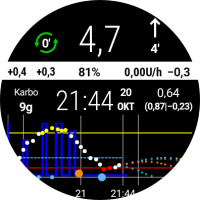
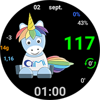
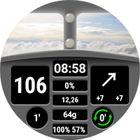
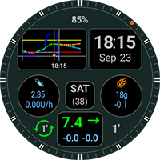
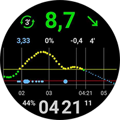
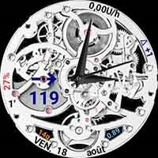
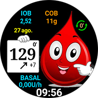
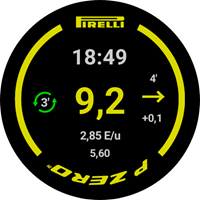
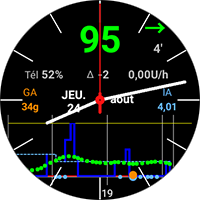

# 自定义表盘交换网站

在这里，您可以下载用户制作并希望与您分享的自定义表盘的Zip文件。

这些Zip文件可以通过拉取请求（Pull Request）像往常一样上传到GitHub上的"**[_static/ExchangeSiteCustomWatchfaces](https://github.com/openaps/AndroidAPSdocs/tree/master/docs/_static/ExchangeSiteCustomWatchfaces)**”文件夹中。

在合并拉取请求时，文档团队将提取CustomWatchface.png文件，并在其文件名前加上Zip文件的文件名，然后将其添加到下面的列表中。

|                                                                                                                                                                                                                                                                     |                                                                                                                                                                                                                                                                 |                                                                                                                                                                                                                                                                    |
|:-------------------------------------------------------------------------------------------------------------------------------------------------------------------------------------------------------------------------------------------------------------------:|:---------------------------------------------------------------------------------------------------------------------------------------------------------------------------------------------------------------------------------------------------------------:|:------------------------------------------------------------------------------------------------------------------------------------------------------------------------------------------------------------------------------------------------------------------:|
|               [  **AAPS V2**](https://github.com/openaps/AndroidAPSdocs/raw/refs/heads/master/docs/_static/ExchangeSiteCustomWatchfaces/AAPS_V2.zip)               |                        [  **AAPS**](https://github.com/openaps/AndroidAPSdocs/raw/refs/heads/master/docs/_static/ExchangeSiteCustomWatchfaces/AAPS.zip)                        |                [  **AIMICO**](https://github.com/openaps/AndroidAPSdocs/raw/refs/heads/master/docs/_static/ExchangeSiteCustomWatchfaces/AIMICO-V1_1.zip)                 |
| [  **AAPS (BigChart)**](https://github.com/openaps/AndroidAPSdocs/raw/refs/heads/master/docs/_static/ExchangeSiteCustomWatchfaces/AAPS_BigChart.zip)* |     [  **AAPS (Large)**](https://github.com/openaps/AndroidAPSdocs/raw/refs/heads/master/docs/_static/ExchangeSiteCustomWatchfaces/AAPS_Large.zip)*     |  [  **AAPS (NoChart)**](https://github.com/openaps/AndroidAPSdocs/raw/refs/heads/master/docs/_static/ExchangeSiteCustomWatchfaces/AAPS_NoChart.zip)*   |
|      [  **Analog G-Watch**](https://github.com/openaps/AndroidAPSdocs/raw/refs/heads/master/docs/_static/ExchangeSiteCustomWatchfaces/Analog_G-Watch.zip)      |              [  **AAPS (Cockpit)**](https://github.com/openaps/AndroidAPSdocs/raw/refs/heads/master/docs/_static/ExchangeSiteCustomWatchfaces/Cockpit.zip)               |   [  **Digital G-Watch**](https://github.com/openaps/AndroidAPSdocs/raw/refs/heads/master/docs/_static/ExchangeSiteCustomWatchfaces/Digital_G-Watch.zip)    |
| [  **DigitalBigGraph**](https://github.com/openaps/AndroidAPSdocs/raw/refs/heads/master/docs/_static/ExchangeSiteCustomWatchfaces/DigitalBigGraph_v1.5.zip) |                      [  **Gears**](https://github.com/openaps/AndroidAPSdocs/raw/refs/heads/master/docs/_static/ExchangeSiteCustomWatchfaces/Gears.zip)                      |                       [  **Gota**](https://github.com/openaps/AndroidAPSdocs/raw/refs/heads/master/docs/_static/ExchangeSiteCustomWatchfaces/Gota_v2.4.zip)                       |
|      [  **LuckyLoopKoeln**](https://github.com/openaps/AndroidAPSdocs/raw/refs/heads/master/docs/_static/ExchangeSiteCustomWatchfaces/LuckyLoopKoeln.zip)      |     [  **P-Zero watchface**](https://github.com/openaps/AndroidAPSdocs/raw/refs/heads/master/docs/_static/ExchangeSiteCustomWatchfaces/pzero_v1.0.zip)      | [  **PinkFloydTheWall**](https://github.com/openaps/AndroidAPSdocs/raw/refs/heads/master/docs/_static/ExchangeSiteCustomWatchfaces/PinkFloydTheWall.zip) |
|    [  **Robby watchface**](https://github.com/openaps/AndroidAPSdocs/raw/refs/heads/master/docs/_static/ExchangeSiteCustomWatchfaces/Robby_watchface.zip)    | [  **SimpleDigital**](https://github.com/openaps/AndroidAPSdocs/raw/refs/heads/master/docs/_static/ExchangeSiteCustomWatchfaces/SimpleDigital_v1.3.zip) |            [  **AAPS (SteamPunk)**](https://github.com/openaps/AndroidAPSdocs/raw/refs/heads/master/docs/_static/ExchangeSiteCustomWatchfaces/SteamPunk.zip)            |
|               [  **Blue Ring**](https://github.com/openaps/AndroidAPSdocs/raw/refs/heads/master/docs/_static/ExchangeSiteCustomWatchfaces/Blue_Ring.zip)                |                                                                                                                                                                                                                                                                 |                                                                                                                                                                                                                                                                    |

*需在穿戴手表上安装自定义表盘V2或更高版本（AAPS V3.3.0或更高版本）。

