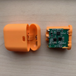
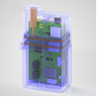
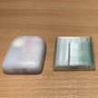
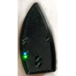

# 胰岛素泵的选择

## 兼容的胰岛素泵

AAPS可与多种胰岛素泵配合使用。  以下列表显示了当前支持的设备，并注明了AAPS是通过您手机的原生蓝牙功能与胰岛素泵通信，还是需要括号中类似Rileylink的兼容设备。

- [Accu-Chek Combo](../CompatiblePumps/Accu-Chek-Combo-Pump.md)（蓝牙；使用旧版驱动程序，还需要Ruffy应用程序 - 另见[Accu-Chek Combo基础使用技巧](../CompatiblePumps/Accu-Chek-Combo-Tips-for-Basic-usage.md)）
- [Accu-Chek Combo](../CompatiblePumps/Accu-Chek-Combo-Pump-v2.md)（蓝牙连接；新驱动程序，自[AndroidAPS v.3.2](#version3200)版本起可用 - 另见[Accu-Chek Combo基础使用指南](../CompatiblePumps/Accu-Chek-Combo-Tips-for-Basic-usage.md)）
- [Accu-Chek Insight](../CompatiblePumps/Accu-Chek-Insight-Pump.md) (蓝牙)
- [DanaR](../CompatiblePumps/DanaR-Insulin-Pump.md) (蓝牙)
- [DanaRS](../CompatiblePumps/DanaRS-Insulin-Pump.md) (蓝牙)
- [Dana-i](../CompatiblePumps/DanaRS-Insulin-Pump.md) (蓝牙)
- [Diaconn G8 ](../CompatiblePumps/DiaconnG8.md)  (蓝牙)
- [EOPatch2](../CompatiblePumps/EOPatch2.md) (蓝牙)
- [Omnipod Eros](../CompatiblePumps/OmnipodEros.md)  (需要[额外的通信设备](#additional-communication-device))
- [Omnipod DASH](../CompatiblePumps/OmnipodDASH.md)  (蓝牙)
- [Medtrum Nano](../CompatiblePumps/MedtrumNano.md)  (蓝牙)
- [Medtrum 300U](../CompatiblePumps/MedtrumNano.md)  (蓝牙)
- 某些较旧的[美敦力](../CompatiblePumps/MedtronicPump.md)设备（需要[额外的通信设备](#additional-communication-device)）

## 我的胰岛素泵未列出。

有关可能与AAPS配合使用的其他胰岛素泵的状态的详细信息，请参见[未来（可能）的泵](../CompatiblePumps/Future-possible-Pump-Drivers.md)页面。

(CompatiblePumps-additional-communication-device)=
## 附加通信设备。

如果没有提及额外的通信设备，则胰岛素泵与**AAPS**之间的通信是基于Android集成的蓝牙堆栈进行的，无需额外的通信设备来转换通信协议。

对于老款的Medtronic胰岛素泵和Omnipod Eros，除您的手机外，还需要额外的通信设备来将胰岛素泵的无线电信号“转换”为蓝牙信号。 请务必根据您的胰岛素泵选择正确的版本。

-   [OrangeLink Website](https://getrileylink.org/product/orangelink)
-  [433MHz RileyLink](https://getrileylink.org/product/rileylink433)
-   [Emalink Website](https://github.com/sks01/EmaLink) - [Contact Info](mailto:getemalink@gmail.com)
-   DiaLink - [Contact Info](mailto:Boshetyn@ukr.net)
-   [LoopLink Website](https://www.getlooplink.org/) - [Contact Info](https://jameswedding.substack.com/) - Untested