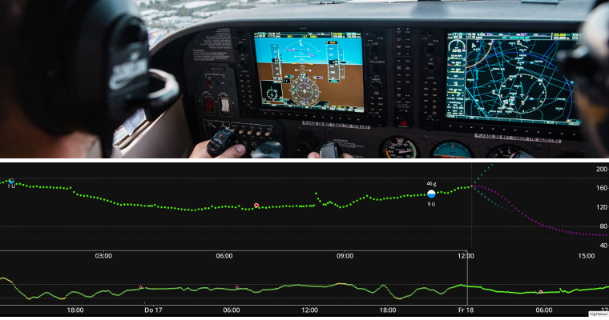

# APS和AAPS简介

## 什么是“人工胰腺系统”（APS）？

人的胰腺不仅能调节血糖，还有很多其他功能。 然而，**“人工胰腺系统”（APS）**通常是指能自动地将血糖水平保持在健康范围内的系统。

要实现这样的功能一般来说需要持续检测 **血糖水平**，用检测到的血糖值来 **测算（预测）** 并输注合适计量的**胰岛素**。 每隔几分钟就重复一次这样的过程，7×24小时全天候运行。 当需要人工干预或关注时，系统通过**警报**提示用户。 这样的系统通常由 **血糖仪**、 **胰岛素泵** 和安手机 **APP** 组成。

您可通过这篇2022年综述文章了解当前应用及开发中的人工胰腺系统类型：

 [闭环技术的未来发展方向](https://www.frontiersin.org/articles/10.3389/fendo.2022.919942/full#:~:text=Fully%20closed%2Dloop%20systems%2C%20unlike,user%20input%20for%20mealtime%20boluses)

在不远的将来，既能输注胰岛素也能输注胰高糖素的“双激素”系统，将能够预防严重低血糖，进而实现更加严格的血糖控制。

人工胰腺可被视为[“糖尿病的自动驾驶系统”](https://www.artificialpancreasbook.com/)。 这意味着什么？

在航空领域，自动驾驶系统不可能完全取代飞行员，要不然飞行员就可以全程睡觉了。 自动驾驶系统的作用在于辅助飞行员操作。 让飞行员得以从持续监控飞行状态的负荷中解脱，转而专注于更高层次的全局监控与策略制定。 自动驾驶系统通过持续处理各类传感器信号，结合飞行员预设的参数进行综合运算，进而自动执行必要的飞行姿态调整。当系统识别到潜在风险时，会立即向飞行员发出警报提示。 这样飞行员就不用事必躬亲了。

(Introduction-what-does-hybrid-closed-loop-mean)=
## 什么是混合闭环（hybrid closed loop）？

针对1型糖尿病的最佳解决方案是"功能性治愈"（比如通过移植受免疫保护的胰岛细胞实现）。 但这种疗法我们还不知道什么时候能实现，那么“全闭环”人工胰腺应该是次优选择。 这种技术系统无需任何用户输入（如针对饮食的大剂量注射或运动前告知），即可实现良好的血糖调控。 目前应用比较广泛的闭环系统都不是真正的“全闭环”，还是需要用户输入一些数据。 因此被称为"混合"闭环系统，即自动化技术与人工干预相结合。

## 闭环的由来？

1型糖尿病（T1D）领域商业化技术的发展进程极为缓慢。 2013年，T1D患者群体发起了#WeAreNotWaiting（#我们不再等待）运动。 他们利用胰岛素泵、血糖仪等目前可用的技术自己开发了各种系统来改进血糖控制方式、增强安全性、提高生活质量。 这些系统被称为DIY（do-it-yourself，自己动手制作）系统，因其未获得医疗监管机构（如FDA、NHS等）正式认证。 目前主要有四种 DIY 系统： [OpenAPS](https://openaps.org/what-is-openaps/)、**AAPS**、[Loop](https://loopkit.github.io/loopdocs/#what-is-loop)和[ iAPS](https://github.com/Artificial-Pancreas/iAPS?fbclid=IwAR2fA9Y9YqYzpKSrtEsotfXl5b67UclDkKgyrv52tQLzYbOoBeNGRmjlJJI)。

要想理解 DIY 闭环的基础原理，最好是阅读Dana Lewis的著作《自动胰岛素输注》（Automated Insulin Delivery）。（中文书籍推荐马学毅的《胰岛素泵治疗糖尿病》）。 您可通过[此链接](https://www.artificialpancreasbook.com/)免费获取电子版(或购买实体书)。 如果您想更多地了解**AAPS**的开发基础——[OpenAPS](https://openaps.org/what-is-openaps/)的详细信息，[OpenAPS 官网](https://openaps.org/what-is-openaps/)提供了丰富的学习资源。

目前已有若干商用混合闭环系统面市，其中最新的是[CamAPS FX](https://camdiab.com/)（英国和欧盟）和 [Omnipod 5](https://www.omnipod.com/en-gb/what-is-omnipod/omnipod-5)（美国和欧盟）。 这些商业化的系统与 DIY 系统有很大差异，主要因为他们都带有“自学习算法”，可以根据用户近几天胰岛素需求量来调整给药量。 在DIY社区，许多人已经尝试过这些商业系统，并将其与DIY系统进行了比较。 欲了解不同系统的详细比较，您可以在相关系统的专属 Facebook 群组、[AAPS Facebook](https://www.facebook.com/groups/AndroidAPSUsers/) 群组或 [Discord](https://discord.com/invite/4fQUWHZ4Mw) 上询问。

## 什么是 Android APS (AAPS)？

**图1** Android APS (Artificial Pancreas System，人工胰腺系统)，AAPS的基本构成。

安卓 APS（**AAPS**）是一款混合闭环系统，或称人工胰腺系统（APS）。 它使用 #WeAreNotWaiting 1 型糖尿病社区开发的 [OpenAPS 算法](https://openaps.org/)（规则集）进行胰岛素剂量计算。

由于 OpenAPS 只与某些较老的胰岛素泵兼容，Milos Kozak于2016年为其罹患1型糖尿病的家庭成员开发了**AAPS**（适配更广泛的胰岛素泵型号）。 自那时起， 很多与1型糖尿病有关的志愿者计算机开发团队和技术爱好者加入了进来，不断优化升级**AAPS** 。 目前， **AAPS** 已经被近万人使用。 AAPS是一个高度可定制且多功能的系统，由于它是开源的，因此与众多开源糖尿病软件及平台实现良好兼容。 目前 **AAPS** 系统的基本组件架构如上**图 1** 所示。

## AAPS的基本组件有哪些？

AAPS的“中枢”是您自己构建的 **应用程序**。 构建过程有详细的逐步操作指南。 然后你需要在一部[兼容的](../Getting-Started/Phones.md)**安卓智能手机**上安装**AAPS  应用程序**（**1**）。 有的用户倾向于用一部专门的手机来安装闭环，而非平时用的手机。 这样（尤其是苹果手机用户）就无需将生活中的其他事务迁移至安卓平台，仅需通过该安卓设备运行AAPS闭环即可。

除了 **AAPS** 之外，**安卓智能手机**还需要安装另一个 App。 这个[附加应用程序](../Getting-Started/CompatiblesCgms.md)通过蓝牙从探头（**2**）接收血糖数据，然后在手机内部将数据传输至**AAPS应用**。

**AAPS** 采用的是 OpenAPS 的决策过程(也就是**算法**)。 初学者最开始用基础的 **oref0** 算法，对AAPS比较熟悉之后可以切换到新的 **oref1** 算法。 使用哪个算法 (oref0或 oref1) 取决于哪个算法最适合你的具体情况。  两种算法均通过整合多维度参数，在每次接收探头新数据时进行实时运算， 随后通过蓝牙向胰岛素泵（**3**）发送输注指令，告诉它需要输注多少胰岛素。 所有运行数据可通过移动网络或Wi-Fi传输至互联网（**4**）， 如果需要的话，这些数据也可以分享给别人或者收集起来以供分析。

## AAPS系统有哪些优势？

**AAPS**采用的OpenAPS算法根据用户定义的参数（关键参数包括基础率、胰岛素敏感系数（ISF）、碳水系数（IC）、胰岛素作用时长（DIA）等），在无需人工干预的情况下，每5分钟响应探头新数据以调控血糖水平。 使用AAPS的已报告优势包括：丰富的可调参数选项、自动化规则（automations）以及系统对患者/护理者操作过程的可视化。 这些特性可助您（或受监护者）实现更优的糖尿病管理，从而提升生活质量与心理安全感。

### **具体优势包括：**

#### 1) 算法安全特性
要了解oref0与oref1算法的内置安全机制，[请点击此处](https://openaps.org/reference-design/)。 用户可自主设定安全限制参数。

#### 2) **硬件灵活性**

**AAPS** 兼容多种胰岛素泵与传感器。 例如，如果你用德康（Dexcom）的动态，但对它底板上的胶过敏，那你还可以换成雅培的Libre动态。 这种设计赋予系统高度适应性，可随生活环境变化灵活调整。 您无需重新构建或重新安装 **AAPS** 应用程序，仅需在应用程序中勾选不同的选项即可完成硬件切换。 AAPS不依赖特定泵驱动模块，并内置"虚拟泵（virtual pump）"功能，便于用户在实际应用前进行安全测试。

#### 3) **高度可定制，有丰富的参数可以调节**

用户可便捷地添加或删除功能模块，而且 **AAPS** 对开环和闭环模式都支持。 以下是**AAPS**系统的潜在功能示例：

 a) 可在进食前 30 分钟设定较低的临时目标（TT）；目标值可低至 72 mg/dL（4.0 mmol/L）。

 b) 若存在胰岛素抵抗导致血糖升高，**AAPS** 允许您设置一条**自动化规则（automations）**，当血糖超过 8 mmol/L （144 mg/dL）时自动切换至120%的配置文件（profile）（与正常**配置文件**设置相比，基础率增加 20%并强化其他调控参数）。 该自动化规则将根据您预设的持续时间内生效， 并可限定仅在一周内的特定日期、每日具体时段，甚至特定地理位置触发。

 c）如果您的孩子没打招呼就跳上了蹦床疯玩起来，**AAPS**可以让你通过手机直接在一定时间内暂停胰岛素输注。

 d) 当管路泵因游泳断开后重新连接时，**AAPS** 将自动计算断连期间缺失的基础胰岛素量，并根据当前血糖水平进行谨慎输注。 若系统计算的补充剂量超出实际需求，用户可通过"取消"功能直接中止缺失基础胰岛素的补注。

 e) **AAPS** 支持为不同场景创建多个配置文件（profile），并支持便捷切换。 例如，如果您担心夜间低血糖，可将加速降低高血糖的功能（如超微大剂量（SMB）、未声明膳食（UAM）等）设置为仅在白天生效。

以上均为示例，全套功能为日常生活提供了极大的灵活性，包括运动、疾病、激素周期_等_。 最终，还是需要用户来决定如何灵活运用这些功能，而且没有放之四海而皆准的通用自动化规则（automations）。

#### 4) **远程监控**
存在多种可选的监控渠道（Sugarmate、Dexcom Follow、xDrip+、Android Auto_等_），可为父母/照护者及处于特定场景（如睡眠/驾驶）的成人用户提供可自定义的警报。 在某些应用（如xDrip+）中，您还可以完全关闭警报，这对于刚启动预热还不准备联进闭环的新探头非常有用。

#### 5) **远程控制**
与商业系统相比，**AAPS** 的核心优势在于，监护人尤其是糖宝家长可以使用经过验证的短信（SMS）命令或通过 App（[Nightscout](https://nightscout.github.io/) 或 AAPSClient）向 **AAPS** 系统发送各种命令。 这个功能1型糖宝的父母用的比较多。 例如，孩子在操场上忙着玩，一会要吃点小零食，这时你就可以用手机给个提前大剂量。 可以通过智能设备（_例如_Fitbit）来监控系统、发送基本指令（_例如_三星Galaxy Watch 4），甚至在高性能智能手表（**5**）（_例如_LEMFO）上运行完整的AAPS系统。 最后这种情况下，你就可以抛开手机运行AAPS。 随着手表电池续航时间的延长和技术的日益稳定，最后一种选择可能会变得越来越有吸引力。

#### 6) **得益于应用程序的开源，不受商业限制**
除了采用开放源代码的方法，允许随时查看 **AAPS** 的源代码之外，提供标准开放式编程接口也给其他开发人员提供了贡献新想法的机会。 **AAPS** 与 Nightscout 紧密集成。 这加快了开发速度，并让用户能通过附加功能进一步提升糖尿病管理的便利性。 Good examples for such integrations are [Nightscout](https://nightscout.github.io/), [Nightscout Reporter](https://nightscout-reporter.zreptil.de/), xDrip+, [M5 stack](https://github.com/mlukasek/M5_NightscoutMon/wiki) etc. 开源开发者和商业系统开发者之间一直在进行对话。 许多 DIY 创新逐渐被商业系统采用，而商业系统的开发速度较慢是可以理解的，部分原因是不同公司的系统（泵、App、传感器_等_）之间的接口需要仔细协商并获得授权。 这也会延缓那些方便患者（或有特殊需求的小部分患者）但不能产生可观利润的创新。

#### 7) **详细的 App 界面**
使用 **AAPS** 可以方便地跟踪以下信息：泵内胰岛素量、管路使用时长、探头使用时长、泵电池使用时长、活性胰岛素_等_。 许多操作都可以通过 **AAPS** 应用程序完成（给泵补药、断开泵连接_等_），无需操作泵体本身，这意味着泵可始终置于您（或受监护者）的口袋或腰带上。

#### 8) **用得上，用得起**
**AAPS** 为目前没有能力自筹资金或没有资金/保险的人提供了世界一流的混合闭环系统，该系统在开发理念上领先商业系统多年。 目前，您需要有一个 Nightscout 帐户才能设置 **AAPS**，但 **AAPS** 闭环的日常运行并不会用到 Nightscout 帐户。 许多人一直在使用 Nightscout 收集数据和进行远程控制。 虽然 **AAPS** 本身是免费的，但通过一些第三方平台来搭建 Nightscout 可能会产生费用（0 - 12 欧元），费用高低取决于您需要何种级别的支持（见对照表），以及设置后是否要继续使用 Nightscout。 **AAPS**兼容多种价格亲民（起价约150欧元）的[安卓手机](https://docs.google.com/spreadsheets/u/1/d/e/2PACX-1vScCNaIguEZVTVFAgpv1kXHdsHl3fs6xT6RB2Z1CeVJ561AvvqGwxMhlmSHk4J056gMCAQE02sAWJvT/pubhtml?gid=683363241&single=true)。 针对特定地点和语言也有不同的版本，并支持[视障人士](#accessibility-for-users-aaps-who-are-partially-or-completely-blind)使用。

#### 9) **支持**
没有完美无缺的胰岛素自动给药系统。 不管是商业化产品还是开源系统都会在通信和临时硬件故障等方面遇到许多同类型的问题。 Facebook、Discord 和 Github 上有很多来自世界各地的AAPS用户，他们很多人参与了AAPS的设计和开发，而且也是**AAPS**的使用者，你可以在这些线上社区里得到所需要的支持。 此外，还有 Facebook 支持小组和诊所/商业公司为商用 APS 系统提供的帮助，毕竟与这些系统的用户或前用户交谈，可以获得有关常见故障、教育计划质量和持续支持水平的反馈。

#### 10) **可预测、透明、安全**
**AAPS** 是完全透明、逻辑清晰且行为可预测的，这有助于及时发现配置错误并进行相应调整。 你可以精准地看到系统正在做什么，为什么这么做，然后给它设定操作限制，这能让你始终掌握系统的控制权（还有相应的责任）。 这样既能增强用户信心，也能睡个安稳觉。

#### 11) **通过开发（dev）模式获得高级功能（包括全闭环）**
本 **AAPS** 文档侧重于 **AAPS** 开发项目的** "主 （master）"**分支。 然而，研发工作一直在进行。 更有经验的用户可能希望探索**开发分支**中的实验功能。 创新研发的核心战略聚焦于​​全闭环系统（full closed looping）的实现​​（不必输注餐前大剂量_等_），致力于最大程度提升1型糖尿病患者的生活便利性。

#### 12) **为改进做出贡献的能力**
1型糖尿病可能非常令人沮丧和孤独。 当掌控了自己的控糖技术以后，你就有了为其他糖友提供帮助的能力，在“把关怀与支持传递下去”的路途上，哪怕只有些许的效果你都会很有成就感。 你可以自学自教，发现问题并去寻找新的研究进展和文献资料，乃至为问题的解决贡献一份力量。 在社区中，还有其他人有着同样的追求，你可以与他们交流想法，一起合作。 这是#WeAreNotWaiting运动的精髓。

## AAPS与MDI（每日多次胰岛素注射）和开环（open loop）的比较

每日多次胰岛素注射疗法（MDI，**图 2** 中的(a)）通常是指每天注射一次长效胰岛素（_如_德谷（Tresiba）），然后在进餐或补针时注射速效胰岛素（_如_诺和锐、Fiasp）。 开环泵 (b) 一般按照预设的基础率持续泵入速效胰岛素，然后饭前或补针时泵入大剂量。 闭环泵一般按照预设的基础率持续泵入速效胰岛素，然后饭前或补针时泵入大剂量，如果您的血糖水平上升并预计会过高，则会给您提供额外的胰岛素 (c)。 虽然与现实生活相比，这张图过于简单，但它旨在展示这两种方法的关键区别。 这三种方法中的任何一种都有可能实现非常好的血糖控制。

**图2** (a) MDI、(b) 开环泵和 (c) 混合闭环泵的概览。

## AAPS与其他闭环系统的比较

截至 2023 年 6 月 25 日，有四大开源闭环系统可供使用：[OpenAPS](https://openaps.readthedocs.io/)、**AAPS**、[Loop](https://loopkit.github.io/loopdocs/#what-is-loop)和[iAPS](https://github.com/Artificial-Pancreas/iAPS?fbclid=IwAR2fA9Y9YqYzpKSrtEsotfXl5b67UclDkKgyrv52tQLzYbOoBeNGRmjlJJI)（前身为 FreeAPS X）。 不同系统的功能差异见下表：

| 设备类型 | 名称                                                             | [AAPS](https://wiki.aaps.app)     | [闭环（Loop）](https://loopkit.github.io/loopdocs/) | [Open APS](https://openaps.readthedocs.io/en/latest/) | [iAPS](https://iaps.readthedocs.io/en/latest/) |
| ---- | -------------------------------------------------------------- | --------------------------------- | ----------------------------------------------- | ----------------------------------------------------- | ---------------------------------------------- |
| 手机   | 安卓                                                             |     |                |                      |               |
| 手机   | iPhone                                                         |  |                   |                      |                  |
| Rig  | 微电脑 (1)                                                        |  |                |                         |               |
| 泵    | [丹纳 I](../CompatiblePumps/DanaRS-Insulin-Pump.md)              |     |                |                      |               |
| 泵    | [丹纳 RS](../CompatiblePumps/DanaRS-Insulin-Pump.md)             |     |                |                      |               |
| 泵    | [Dana R](../CompatiblePumps/DanaR-Insulin-Pump.md)             |     |                |                      |               |
| 泵    | [Omnipod (Dash)](../CompatiblePumps/OmnipodDASH.md) (2)        |     |                   |                      |                  |
| 泵    | [Omnipod (Eros)](../CompatiblePumps/OmnipodEros.md)            |     |                   |                      |                  |
| 泵    | [Diaconn G8](../CompatiblePumps/DiaconnG8.md)                  |     |                |                      |               |
| 泵    | [EOPatch 2](../CompatiblePumps/EOPatch2.md)                    |     |                |                      |               |
| 泵    | [移宇 TouchCare Nano](../CompatiblePumps/MedtrumNano.md)         |     |                |                      |               |
| 泵    | [移宇 TouchCare 300U](../CompatiblePumps/MedtrumNano.md)         |     |                |                      |               |
| 泵    | [罗氏 Combo](../CompatiblePumps/Accu-Chek-Combo-Pump-v2.md)      |     |                |                      |               |
| 泵    | [罗氏 Insight](../CompatiblePumps/Accu-Chek-Insight-Pump.md)     |     |                |                      |               |
| 泵    | [老版美敦力（Older Medtronic）](../CompatiblePumps/MedtronicPump.md)  |     |                   |                         |                  |
| 泵    | [Equil 5.3](../CompatiblePumps/Equil5.3.md)                    |     |                |                      |               |
| CGM  | [德康 G7](../CompatibleCgms/DexcomG7.md)                         |     |                   |                      |                  |
| CGM  | [德康 One](../CompatibleCgms/DexcomG6.md)                        |     |                   |                      |                  |
| CGM  | [Dexcom G6](../CompatibleCgms/DexcomG6.md)                     |     |                   |                         |                  |
| CGM  | [Dexcom G5](../CompatibleCgms/DexcomG5.md)                     |     |                   |                         |                  |
| CGM  | [Libre 3](../CompatibleCgms/Libre3.md)                         |     |                |                      |               |
| CGM  | [Libre 2](../CompatibleCgms/Libre2.md)                         |     |                |                      |                  |
| CGM  | [Libre 1](../CompatibleCgms/Libre1.md)                         |     |                |                      |                  |
| CGM  | [Eversense](../CompatibleCgms/Eversense.md)                    |     |                |                      |                  |
| CGM  | [MM640g/MM630g](../CompatibleCgms/MM640g.md)                   |     |                |                      |                  |
| CGM  | [PocTech](../CompatibleCgms/PocTech.md)                        |     |                |                      |                  |
| CGM  | [Ottai](../CompatibleCgms/OttaiM8.md)                          |     |                |                      |               |
| CGM  | [Syai Tag](../CompatibleCgms/SyaiTagX1.md)                     |     |                |                      |               |
| CGM  | [Nightscout 作为血糖数据源](../CompatibleCgms/CgmNightscoutUpload.md) |     |                   |                         |                  |

_表格说明：_
1. **Rig**是一种随身携带的小型计算机，不带显示器。 一种支持的设备类型是英特尔 Edison + Explorer Board，另一种是 Raspberry Pi + Explorer HAT 或 Adafruit RFM69HCW Bonnet。 由于以前的手机无法运行所需的算法，第一批 APS 就是基于这种配置。 用这些系统的已经越来越少，因为手机上的设置变得更容易，而且手机还带有显示屏。 英特尔公司也停止了英特尔 Edison 的销售。 优秀的 OpenAPS 算法 **oref0** 和 **oref1** 现已纳入 AAPS 和 iAPS。
2. Omnipod Dash 是 Omnipod Eros 的后续产品。 它支持蓝牙通信，无需 rig 网关即可在 Omnipod 和手机之间进行通信。 如果可以选择，我们建议使用 Dash 而不是 Eros。

2022年，多名国际专家共同起草的 《开源自动胰岛素输注系统：国际专家共识与保健专业人员实践指南》（国际专家共识）发表在了[_《柳叶刀：糖尿病与内分泌学》_, 2022; 10: 58–74](https://www.ncbi.nlm.nih.gov/pmc/articles/PMC8720075/)(_1_) 上（糖尿病与内分泌学领域最牛X的期刊），其中就包含了开源闭环系统的指南。 不管是对您还是您的糖尿病医生，都很有必要了解和总结不同开源混合闭环系统之间的主要技术差异。

百闻不如一见，不管什么系统不实际用一回怎么也不会有真正的体验，所以多去论坛、社群里面跟用过的人交流交流。 大多数人会觉着AAPS比其他的混合闭环系统复杂太多，尤其是跟那些商业化产品项目相比，毕竟光前面就已经介绍了这么多AAPS的个性化设置和功能。 有些人一上来可能就会觉着有点蒙，但不用急着一把掌握所有的用法，想快就快、想慢就慢，而且不管哪里遇到问题都能寻到帮助。

## AAPS是否使用人工智能或任何机器学习算法？

目前的 **AAPS** 主版本（3.3.1.3）没有使用任何机器学习算法、多参数胰岛素反应模型或人工智能。 因此，该系统在运作方式上是公开和透明的，不仅专家能看懂，临床医生和病人也能弄明白。 这也意味着，诸如生活状态转换的时候可能需要大幅调整胰岛素计量(比如从紧张的工作日转到轻松的假期)， 您可以立即把 **AAPS**切换到一个更弱/更强的配置文件。 如果是那些能“自动学习”的系统，类似的调整可以自动执行，但相比之下需要等一段时间才能调整胰岛素剂量（那些系统需要等指标的趋势发生变化才能做出调整）。

## 哪种系统适合我或我的家人？

实际上，选哪种系统往往取决于你在用或者能拿到哪种胰岛素泵，以及你要用哪种手机（苹果还是安卓）。 如果还没有泵，那可选择的范围比较大。 技术正在不断发展，不断有旧型号的泵在下架，也不断有新的泵和动态上市。 大多数开源系统都能支持主流的动态（雅培和德康），新的动态发布一年左右一般也能支持（具体实践取决于安全和稳定性的测试进度）。

大多数 **AAPS** 用户表示，拥有一个能在夜间睡眠时自动调整基础率的系统后，他们的入框率更高了，糖化HbA1c 降低了，生活质量也得到了改善，而大多数混合闭环系统都是如此。 有些人喜欢用起来比较简单的系统，不想搞太多的个性化配置(这意味着你可能喜欢那种商业产品化的系统)， 而其他人则认为那样缺乏对系统的控制感，用起来不放心(那可能会喜欢开源系统)。 如果您（或您的家人）是新确诊的患者，通常的做法是先习惯使用 MDI 和动态血糖仪，然后逐步过渡到可闭环的泵，再过渡到 **AAPS**，但有些人（尤其是小孩）可能会直接使用泵。

关键的一点是 **AAPS** 用户必须积极主动地区查找问题、解决问题，遇到问题需要到相应的社群寻求帮助。 这跟使用商业化产品的思维方式和体验截然不同。 **AAPS** 用户拥有更多的控制权，但责任也更重，这得提前做好心理建设。

## 像AAPS这样的开源系统安全吗？

### AAPS 系统的安全性
更准确的问题可能是 "与我目前使用的胰岛素输注系统**相比**，它是否更安全？"因为没有一种胰岛素输注方法是零风险的。 **AAPS** 有许多制衡机制。 有篇[论文](https://www.liebertpub.com/doi/epub/10.1089/dia.2019.0375)研究了 **AAPS** 在计算机模拟装置中的使用情况，这是主观地检验该系统安全性和有效性的有效方法。 更宏观地来看，全世界有过万人正在使用开源自动胰岛素输注系统，而且这一数量还在全球范围内持续增加。

任何使用无线电通信的电子设备都可能被黑客攻击，即便是非闭环的胰岛素泵也不例外。 目前，我们没有发现有人试图通过入侵糖尿病医疗设备来伤天害理的情况。 然而，有多种方法可以预防这种风险：

1.  在胰岛素泵设置里，将大剂量和临时基础率的上限设置为你认为最安全的值。 这是任何黑客都绕不过去的硬性限制。

2.  把您的 CGM设置成无论过高过低都报警。

3.  在线监控您的胰岛素输注情况。 Nightscout用户可以对各种各样的情况设置单独的警报提醒，包括那些比恶意攻击更可能发生的情况。 除了过高过低以外，Nightscout还可以显示很多诊断指标，用来核实胰岛素泵是否按要求运行，包括目前的IOB、临时基础率历史、大剂量输入历史等。 还可以主动提醒用户注意一些特殊情况，比如预计血糖偏高或偏低、储药器存量偏低以及胰岛素泵电量不足等。

如果你的胰岛素泵受到恶意攻击，那么这些策略规则将大大降低风险。 每个将要使用 **AAPS** 的用户都需要结合使用其他系统的情况权衡相关风险。

#### 关于过快改善血糖控制的安全注意事项

快速降低 HbA1c 和改善血糖控制听起来很有吸引力。 但是，不管用哪种闭环系统，_过快_降低平均血糖水平都可能造成永久性损伤，包括对眼睛的损伤，以及永远无法消除的疼痛性神经病变。 这种损害可以通过缓慢降低血糖水平来避免。 如果您目前的 HbA1c 偏高，并准备改用 AAPS（或任何其他闭环系统），请在开始之前与您的临床团队讨论这一潜在风险，并与他们商定一个时间计划。 有关如何安全降低血糖水平的更多一般信息，包括医学文献链接，请参阅[此处](#preparing-safety-first)的安全部分。

#### 关于设备、耗材和其他药物的医疗安全

务必使用经过测试、功能完备的、经 FDA 或 CE 批准的胰岛素泵和 CGM 来构建人工胰腺闭环。 对这些组件进行硬件或软件修改可能会导致胰岛素给药量出现意外，从而给用户带来重大风险。 如果您发现或得到坏的、改装或自制的胰岛素泵或 CGM 接收器，请勿将其用于创建 AAPS 系统。

请使用胰岛素泵和 CGM 制造商认可的原装耗材，如助针器、管路和储药器。 使用未经测试的或修改过的耗材可能导致动态血糖仪失准和胰岛素计量错误。 剂量不当的胰岛素非常危险，破解设备/擅自改造耗材是拿你的生命开玩笑，别这么干。

使用 **AAPS** 时不要服用 SGLT-2 抑制剂（格列净类），因为它们会不可估量地降低血糖水平。 AAPS通过降低基础率来提高血糖，将AAPS与这类药物联用是很危险的，有关这方面的更多详情，请参阅主要[安全章节](#preparing-safety-first)。

(introduction-how-can-i-approach-discussing-aaps-with-my-clinical-team)=
## 如何与我的临床团队讨论AAPS？

建议用户主动与临床医生沟通使用 **AAPS** 的意向。 如果您打算使用 **AAPS**（或任何其他 DIY 闭环），请务必与糖尿病团队坦诚交流。 患者和医生之间的透明度和信任至关重要。

### 建议方法：
与您的临床医生展开对话，确定他们对 CGM、泵、混合闭环和商业闭环等糖尿病治疗技术的熟悉程度，并了解他们对此类技术的态度。 您的临床医生/内分泌科医生应具备基础技术认知，并愿意与您讨论他们所在地区的商业闭环产品的最新进展。

#### 了解当地先例

咨询临床医生/内分泌专家对 DIY 闭环_与_商业闭环的看法，评估其在该领域的专业知识。 询问团队是否接触过 **AAPS**，能否分享与使用 DIY 闭环的患者合作的相关经验？

确认团队是否已有接诊的 DIY 闭环的患者。 因患者保密原则，医生未经许可不得透露他人信息。 然而，如果你愿意的话，你**可以**要求他们将**你的**联系方式转交给一位现有的DIY闭环的患者（若医生认为双方可能志同道合），表明您乐于接受对方主动联系讨论经验。 临床医生没有义务这样做，但部分理解1型糖尿病同伴支持重要性的医生愿意配合。 您还可以结识当地的 DIY 圈友。 此举非必需，请根据自身需求决定。

#### 国内和国际项目

若临床团队对使用 **AAPS** 闭环持保留态度，以下论点可能会有所帮助：

a) **AAPS** 系统是由患者及其护理人员设计的。 核心设计遵循最高安全标准并深度整合患者真实体验。 目前全球约有 **10,000** 名 AAPS 用户。 因此，在您诊所的患者群体中，很可能还有其他患者在使用 DIY 闭环（无论是否公开）。

b) 国际权威医学杂志《柳叶刀》（[The Lancet](https://www.ncbi.nlm.nih.gov/pmc/articles/PMC8720075/pdf/nihms-1765784.pdf)_(1)_）最近发表的专家共识指南证实，DIY 闭环可以**安全****有效**提升糖尿病控制水平（包括入框率）。 在[《自然》](https://doi.org/10.1038/d41586-023-02648-9)_(3)_等权威期刊持续刊载DIY社区技术进展的专题报道。

c) **AAPS** 采用渐进式迁移策略，从 "开环 "泵（open loop），到低血糖暂停（LGS），再到混合闭环（hybrid closed loop），用户需分阶段完成不用的学习目标。 因此存在一个结构化流程，要求用户必须分阶段通过能力认证，并在启用闭环之前对其基本设置（基础率、ISF 和 ICR）进行调优。

d) DIY社区通过GitHub、Discord和Facebook私密群组向您提供技术支持。

e) 在诊所会议中，您将能够通过Nightscout/Tidepool平台整合**动态血糖仪（CGM）和胰岛素闭环/泵信息**数据，生成可视化报告（支持纸质/电子版呈递，如果您携带了笔记本电脑/平板电脑）。 对动态血糖仪（CGM）和胰岛素数据的简化，将提升临床复盘效率并有助于优化治疗进展评估流程。

f）如果您的团队仍然强烈反对，请将本文中提到的参考文章的打印版交给您的临床医生，并给他们提供**AAPS**临床医生部分的链接：[“面向临床医生——**AAPS**的一般介绍和指南”](../UsefulLinks/ClinicianGuideToAaps.md)

#### 其他临床医生对 DIY 闭环系统的支持

发表在[《柳叶刀糖尿病内分泌学》](https://www.ncbi.nlm.nih.gov/pmc/articles/PMC8720075/)(_1_) 上的论文[（由国王医院和盖伊圣托马斯国民医疗服务基金会共同领导，由伦敦国王医院的糖尿病顾问和荣誉高级讲师 Sufyan Hussain 博士共同领导）提供了以下内容：

a) 向专业人士**保证**，DIY人工胰腺系统/开源软件是1型糖尿病的一种“安全有效的治疗方法”选项，并为此提供建议、讨论、支持和文件记录方面的指导；

b)**确认**开源自动化胰岛素输注（“AID”）系统可提升各年龄/性别/族裔群体的血糖入框时间（TIR），降低血糖波动性，减少高/低血糖事件发生频率；

c) **建议**医疗卫生工作者应该**支持**选择使用开源自动化胰岛素输注（AID）系统管理病情的1型糖尿病患者或其照护者；

d) 建议医护人员尝试了解所有可能对患者有益的治疗方案，包括可用的开源 AID 系统。  若存在资源或法规限制，**应寻求与其他具备相关经验的医疗专业人士协作**；

e) 强调所有持续葡萄糖监测（CGM）用户应始终能够实时且无障碍地获取**自己的健康数据**

f) 强调这些开源系统并未经过与市售医疗技术相同的监管评估，且没有商业技术支持。 不过，**可以获得广泛的社区支持**；以及

g) 一项建议是，应更新**监管和法律框架**，以确保明确规定允许对这些开源系统进行合乎道德且有效的治疗。

另一篇发表在《[国际医疗法，2021](http://pure-oai.bham.ac.uk/ws/files/120241375/0968533221997510.pdf)》期刊第_4_期上的论文也强调了英国医学总会的“同意指南”非常注重医生和患者共同做出决定。 医生应向患者解释DIY人工胰腺系统（DIY APS）的潜在益处、风险、负担和副作用，并可以在不给患者施加压力的情况下推荐某种特定的选择。

治疗决定权归属患者，由患者综合临床与非临床因素自主选择治疗方案。

如果医生在临床中发现患者正在使用DIY系统进行闭环操作，即使患者使用非处方技术，医生仍有义务持续监测其健康状况。

医生（至少在英国）并没有被禁止开具未获许可的药物处方，并可行使​​临床裁量权。 因此，医生应运用​​临床判断力评估自制人工胰腺系统是否适合特定患者，并与患者就其认知的​​潜在利弊展开客观探讨。

#### 上述引用的文章，以及其他有用的链接和立场声明，列于下方：

1. Open-source automated insulin delivery: international consensus statement and practical guidance for health-care professionals [_Lancet Diabetes Endocrinol_, (2022) _10_, 58–74](https://www.ncbi.nlm.nih.gov/pmc/articles/PMC8720075/)
2. [In Silico Trials of an Open-Source Android-Based Artificial Pancreas: A New Paradigm to Test Safety and Efficacy of Do-It-Yourself Systems, 2020](https://www.liebertpub.com/doi/epub/10.1089/dia.2019.0375)
3. A DIY ‘bionic pancreas’ is changing diabetes care — what's next? [_Nature_ (2023), _620_, 940-941](https://doi.org/10.1038/d41586-023-02648-9)
4. Prescribing unapproved medical devices? The case of DIY artificial pancreas systems [_Medical law international_, (2021), _21_, 42-68](http://pure-oai.bham.ac.uk/ws/files/120241375/0968533221997510.pdf)
5. [Berlin Institute of Health position statement, 2022](https://www.bihealth.org/en/notices/do-it-yourself-solutions-for-people-with-diabetes-are-safe-and-recommended)
6. Do-It-Yourself Automated Insulin Delivery: A Health-care Practitioner User’s Guide (Diabetes Canada position and guide) [_Canadian Journal of Diabetes_, (2023)_47_, E8, 389-397](https://www.canadianjournalofdiabetes.com/article/S1499-2671(23)00138-7/fulltext)
7.  Netherlands (EN/NL) - for clinicians - [how to help people on open source automated insulin delivery systems](https://www.diabetotech.com/blog/how-to-help-people-on-open-source-automated-insulin-delivery-systems)
8. First Use of Open-Source Automated Insulin Delivery AndroidAPS in Full Closed-Loop Scenario: Pancreas4ALLRandomized Pilot Study [_Diabetes Technol. Ther._, 25, _5_, 2023](https://www.liebertpub.com/doi/pdf/10.1089/dia.2022.0562?casa_token=D13eFx5vCwwAAAAA:MYvO8hChbViXVJFgov1T11RXBPx2N_wOMThLHwl3TVUxbCuANegPrIFRC5R5VXx_S71FoQYW-qg)
9. Pre-school and school-aged children benefit from the switch from a sensor-augmented pump to an AndroidAPS hybrid closed loop: A retrospective analysis [_Pediatr. Diabetes_ 2021, _22_, 594-604. 2021](https://onlinelibrary.wiley.com/doi/epdf/10.1111/pedi.13190)
10. Outcomes of the OPEN project, an EU-funded project into the Outcomes of Patient’s Evidence with Novel, Do-it-Yourself Artificial Pancreas Technology (https://www.open-diabetes.eu/publications)

## 为什么我不能直接下载 AAPS 并直接使用？

本应用没有上架到Google Play - 出于法律要求，你必须通过源代码自行构建安装包。 **AAPS**是未获许可的产品，这意味着它没有得到任何国家任何监管机构的批准。 使用 **AAPS** 被视为用户自主进行的​​医疗实验行为，相关风险由​​用户自行承担。

构建该系统需要​​耐心、决心及技术知识的渐进积累​​。 所有必要信息和支持均可从以下渠道获取：本文档库、线上资源平台或已有成功经验的实践者。 全球已有 10,000 多人成功建立并正在使用 **AAPS**。

**AAPS** 的开发人员对安全性有着​​极致要求，并致力于确保**AAPS**用户获得良好体验。 因此每个用户（或未成年用户的监护人）必须遵循以下原则：

- 自己建立 AAPS 系统，并完成各项**目标**能力认证，确保在​​启用 "闭环 "时拥有合理的个性化设置并了解 **AAPS** 的基本工作原理；

- 通过导出和保存重要文件来备份他们的系统 (例如密钥库和settings.json设置文件)到安全的位置，这样您可以在需要时再次快速设置；

- 及时升级至最新正式版；以及

- 维护和监测系统情况，以确保其正常运行。

## AAPS 系统的连接性如何？

**图3（如下）**展示了**AAPS**系统的单用户运行模式案例，该模式下​​无需跟随者（followers）介入系统交互。 图中未显示的其他开源软件和平台也可以集成进来。

**图 4（下图）**显示了 **AAPS** 系统的功能实现全貌，适用于需配备​​跟随者（followers）​​ 进行远程监控及系统调节的用户（如 1 型糖宝）。 图中未显示的其他开源软件和平台也可以集成进来。

## AAPS 如何不断发展和完善？

大多数**AAPS**用户使用的是经过全面测试的**正式版**，该版本在发布前已完成缺陷检测与问题修复。 在幕后，开发者会对新功能进行​​尝试性验证​​，这些测试在**AAPS**的 ​​“开发者版”（**dev**）​​中进行，参与测试的用户社区具备​​短时响应缺陷修复的自发性​​。 若新功能运行稳定，即作为新版​​正式版（master version）​​在**AAPS**中发布。 所有新版正式版（master release）均通过​​Facebook小组​​发布公告，以便**AAPS**​​主流用户群体​​能够及时查看并更新至新版本。

部分​​技术资深的**AAPS**用户​​会开展​​前沿技术实验​​并使用**AAPS**​​开发版（dev versions）​​，普通用户无需亲自操作即可通过阅读他们的实验报告获益！ 人们也会在 Facebook 群组中分享这些实验。

您可以在这里阅读更多关于新兴技术的实验和讨论：

Tim Street [https://www.diabettech.com/](https://www.diabettech.com/)

David Burren [https://bionicwookie.com/](https://bionicwookie.com/)

## 哪些人可以从 AAPS 受益？

| 用户类型               |
| ------------------ |
| ✔️ 1 型糖尿病患者        |
| ✔️ 1 型糖尿病患者的照顾者或父母 |
| ✔️ 1 型糖尿病盲人用户      |
| ✔️ *临床医生和医疗保健专业人员  |

上表假定用户可使用连续血糖监测仪和胰岛素泵。

* **AAPS**的所有数据均可通过数据共享平台（如Nightscout）提供给医护人员，包括动态血糖仪（CGM）数据实时监测​、胰岛素输注（insulin delivery）追踪​、碳水化合物登记（carbohydrate entries）记录、预测算法及参数设置（predictions and settings）可视化等。 Nightscout生成的日报和周报包含血糖控制状态量化分析与个体化行为观察因素的精准数据，可助力医疗团队优化与1型糖尿病患者的临床讨论。

### 为部分或完全失明的 AAPS 用户提供无障碍环境

#### AAPS 的日常使用：
盲人可以使用 AAPS。 在安卓设备上，操作系统有一个名为 TalkBack 的程序。 作为操作系统的一部分，它允许通过语音输出进行屏幕定位。 通过使用TalkBack功能，您可以在无需视力辅助的情况下操作您的智能手机和AAPS。

#### 构建 AAPS App：
作为用户，您将在 Android Studio 中构建 AAPS 应用程序。 许多人为此使用 Microsoft Windows，其中有类似 TalkBack 的屏幕阅读器。 由于 Android Studio 是 Java 应用程序，因此必须在控制面板中启用 "Java Access Bridge "组件。 否则，在Android Studio中，电脑的屏幕阅读器将无法发声。

具体方法取决于操作系统，下面介绍两种方法：

1) 在 Windows 开始菜单的搜索栏中输入 "控制面板"，用回车键打开。 它会打开： "所有控制面板项目"。

打开 "轻松访问中心"。

然后用回车键打开 "使用无显示屏计算机"。

在 "听到文本朗读 "下选择 "打开旁白 "和 "打开音频显示"，然后点击 "应用"。

或：

2) 按 Windows 键，在搜索栏中输入 "控制面板"，用回车键打开。 它会打开： "所有控制面板项目"。

按字母 C 进入 "Center for Ease of Use"，用回车键打开。

然后用回车键打开 "使用无屏幕计算机"。

在底部，你会发现 "启用 Java Access Bridge "复选框，选中它。

完成后，关闭窗口！ 屏幕阅读器现在应该可以工作了。

## 我可以从 AAPS 获得哪些好处？

投入时间，**AAPS**有可能带来以下好处

- 减轻1型糖尿病管理引发的​​心理负担；

- 精简因疾病产生的​​琐碎管理决策；

- 根据实时数据提供个性化的动态胰岛素剂量，从而减少对低血糖治疗的需求，减少高血糖的发生；

- 强化用户对​​胰岛素参数调优的知识储备与实操信心；

- 创建契合生活方式的​​自动化规则（**自动化**）；

- 改善睡眠质量，并总体上减少夜间干预的频率；

- 为1型糖尿病患者的照护者提供远程监控和胰岛素输注管理功能；以及

- 通过使用由**AAPS**控制的安卓手机，实现​​便携糖尿病设备集约化管理（包括动态和胰岛素控制装置）。

**AAPS**最终能够​​赋能患者​​更高效地管理糖尿病，实现​​血糖稳定​​并改善​​远期健康收益​​。

对如何开始设置 AAPS 感兴趣？ 请查看[准备开始使用AAPS](../Getting-Started/PreparingForAaps.md)部分。
